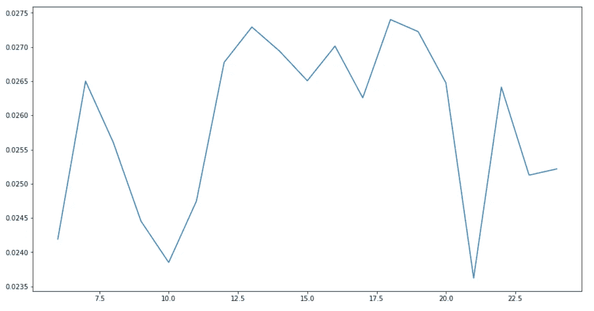
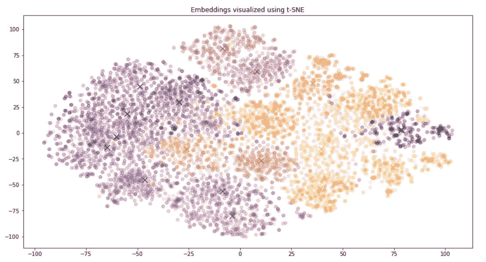
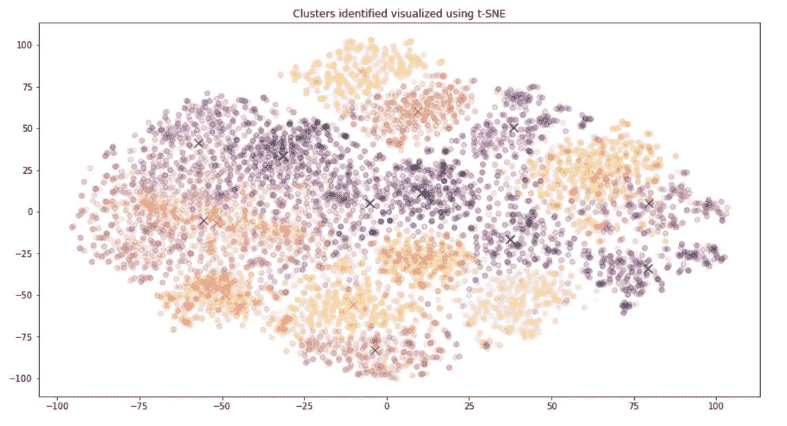

# 使用 GPT3 嵌入对 20 个新闻组数据集进行聚类

> 原文：<https://towardsdatascience.com/clustering-the-20-newsgroups-dataset-with-gpt3-embeddings-10411a9ad150?source=collection_archive---------7----------------------->

## 新 API 端点的实验


图片:www.pexels.com

嵌入是为文本寻找数字表示的一种方式，它捕捉文本与其他文本的相似性。这使得它们成为应用聚类方法进行主题分析的理想基础。在本文中，我想通过将语言模型 [GPT3](https://en.wikipedia.org/wiki/GPT-3) 与文档中的主题进行比较，来测试语言模型[GPT 3](https://en.wikipedia.org/wiki/GPT-3)的嵌入，该语言模型最近通过 [API](https://openai.com/blog/openai-api/) 变得可用。OpenAI 正在向所有 API 用户推出嵌入，作为公共测试版的一部分。我们现在可以使用新的嵌入模型进行更高级的搜索、聚类和分类任务。嵌入也用于可视化。

# 数据集

20 个新闻组数据集(许可证:公共域/来源:【http://qwone.com/~jason/20Newsgroups/】T4)是大约 20，000 个新闻组文档的集合，分为 20 个类别。该数据集是由斯坦福大学自然语言处理小组历时数年收集的。它是一个标准的数据集合，通常在自然语言处理中用于评估过程。

我们使用数据集的训练部分(60%的数据)，并过滤掉过长的文章，以避免 GPT3 模型的上下文长度问题。仅使用少于 2000 个令牌的文档。

使用“Scikt Learn”加载数据，并用 GPT2 Tokenizer 检查数据长度是否合适。然后创建一个 Pandas 数据框，其中包含帖子的文本和一个表示新闻组来源的编号。

# 下载嵌入

要从 OpenAI API 中检索数据，您需要一个 API 键。检索是有成本的，这取决于所用的模型。嵌入模型将免费到 2021 年底。

目前，他们为不同的功能提供了三类嵌入模型:文本搜索、文本相似性和代码搜索。每个系列包括多达四种型号的尺寸:

*   Ada (1024 嵌入维数)，
*   巴贝奇(2048 嵌入尺寸)，
*   居里(4096 嵌入维度)，
*   达芬奇(12288 嵌入维度)。

达芬奇是最有能力的，但比其他型号更慢也更贵。Ada 能力最差，但速度明显更快，成本也更低。

我们使用巴贝奇相似性模型“巴贝奇-相似性”进行测试。

嵌入端点的文档可在以下位置找到:

  

在 OpenAI 的 Python 包和 GPT3 的[文档的辅助函数的帮助下，我们现在可以下载每个文档的数字表示，并将其作为一列添加到数据框中。](https://github.com/openai/openai-python/blob/main/examples/embeddings/Get_embeddings.ipynb)

# 基于嵌入的聚类

对于聚类，我们使用 [KMeans 算法](https://scikit-learn.org/stable/modules/generated/sklearn.cluster.KMeans.html)。这是一种分区算法，它将对象分成 k 个簇，使得簇内所有对象对之间的距离之和最小。为了找到数据集的最佳聚类数，我们计算 k 值范围内的聚类，然后选择具有最高[轮廓分数](https://scikit-learn.org/stable/modules/generated/sklearn.metrics.silhouette_score.html)的聚类。



作者剪影评分/图片

在本例中，18 是该范围内的最大值。这对应于语料库中的 18 个不同主题。集群的大小从 431 到 1052 不等。

# 嵌入和集群的可视化

为了可视化，我们使用 [TSNE 算法](/an-introduction-to-t-sne-with-python-example-5a3a293108d1)。这是一种非线性降维技术，将高维数据投影到二维或三维。这有助于更好地了解数据并识别模式。

首先，我们用颜色代码可视化嵌入及其新闻组关系。



作者从新闻组成员/图像中嵌入颜色

这表明，如果以新闻组成员作为衡量标准，空间位置很好地反映了文档的内容以及它们之间的相似性。我们只使用了 GPT3 的嵌入作为文档的表示，没有来自文本的更多信息，也没有任何进一步的微调。

其次，我们考虑相同的表示，但是用 KMeans 找到的聚类作为颜色代码。



作者使用聚类/图像中的颜色进行嵌入

有很小的区别，特别是使用的颜色，但是结构和聚类中心非常相似。这也强调了主位结构在嵌入中得到了很好的体现。

# 描述集群

为了描述各个集群代表什么内容，我们尝试创建集群的描述。为此，我们从每个集群中随机抽取一些文档，并将其作为 GPT3 本身的输入来生成描述。我们在 OpenAI API 中使用“davinci-instruct-beta-v3”模型是因为它的表达能力。

对于每个集群，我们随机抽取 3 个文档(每个文档的前 1000 个字符，否则 GPT3 的提示会太长。)将此与这些文档有什么共同点的问题结合起来，将此发送到 GPT3，从而获得每个集群的描述。

这给了我们以下结果:

```
Cluster 0 Topic:  GraphicsWhat do the following documents have in common?They are all about graphics.
Cluster 1 Topic:  space station redesignAuthor: Michael F. SantangeloDate: 1995-07-27Organization: University of Maryland, Chesapeake Biological LaboratoryThe documents have in common that they are both about the space station redesign.
Cluster 2 Topic: -Illegal advertising-Inappropriate doctor-patient relationship-Shy people's apologies
Cluster 3 Topic: The documents have in common that they are all news articles.
Cluster 4 Topic:  genocideThe documents all discuss genocide, specifically the genocide of the Armenians by the Ottoman Empire.
Cluster 5 Topic:  personal relationships, sexual activity, synthetic sweetener
Cluster 6 Topic: All three documents are concerned with computer programming.
Cluster 7 Topic: What do the following documents have in common?The documents have in common that they are all examples of writing.
Cluster 8 Topic: All three documents discuss the use of old SIMMs.
Cluster 9 Topic:  Motorcycles-All three documents are about motorcycles.-All three documents mention the CX500 Turbo.-All three documents mention the Ducati Mike Hailwood Replica.
Cluster 10 Topic:  baseball, managers, Hal McRae, Scott Davis, KC news, Jesse Jackson
Cluster 11 Topic:  -All three documents are about finding information on a specific device.
Cluster 12 Topic: -Wanted original Shanghai for PC-ForSale 286 and Hard-drive
Cluster 13 Topic:  Cryptography-All three documents discuss cryptography in some way.
Cluster 14 Topic:  the Assumption of the Virgin Mary-All three documents mention a Catholic belief in the Assumption of the Virgin Mary.-All three documents mention that this belief is unusual.-All three documents mention that some people object to this belief.-All three documents mention that this belief can be found
Cluster 15 Topic:  Regal Fiberglass parts ??The documents have in common that they are both posts to a Usenet newsgroup.
Cluster 16 Topic: What do the following documents have in common?They are all examples of sports news.
Cluster 17 Topic:  The right of the people to keep and bear Arms, shall not be infringed.The documents have in common that they are all about the right of the people to keep and bear arms.
```

有些描述相当不错，例如

"这三份文件都与计算机编程有关。"

或者

“都是体育新闻的例子。”

然而，其他的非常奇怪，例如

"这些文件的共同点是都是新闻文章。"

为了达到更好的效果，有必要对新闻组文本进行预处理，例如过滤电子邮件地址，而且还要压缩内容以包括更多的文档，而不会达到 GPT3 的提示限制。

# 摘要

文章中的研究表明，可以通过 API 从 GPT3 中检索到的嵌入非常适合描述文本语料库的内容结构。使用 20 个新闻组数据集的例子，通过可视化和 KMeans 聚类的方式表明，由嵌入形成的空间结构反映了新闻组的主题。

GPT3 还可用于描述单个集群的内容。