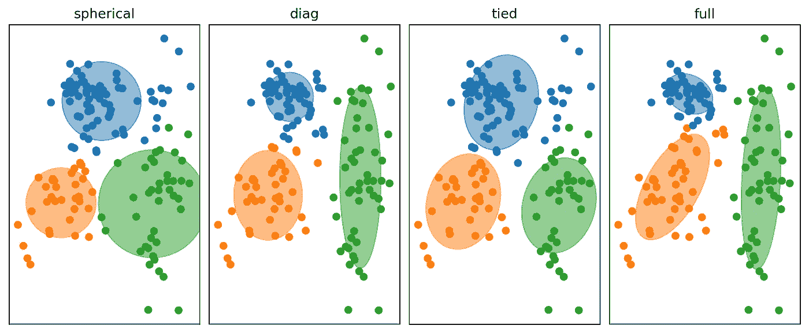
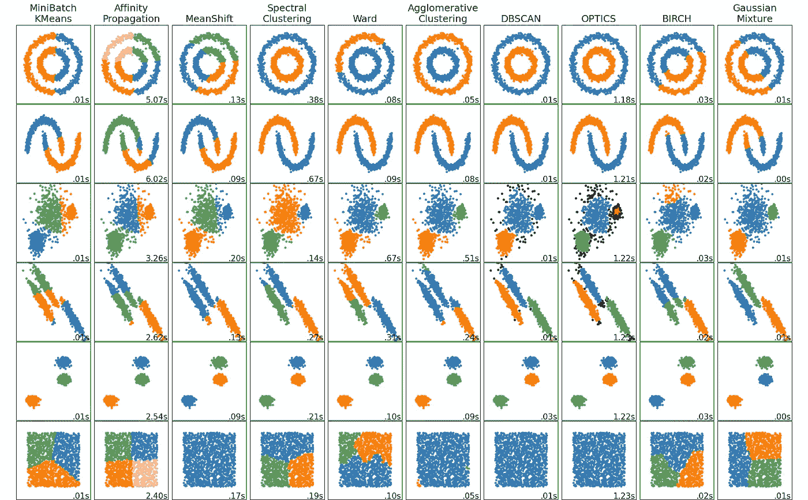

# 具有各种应用的聚类类型

> 原文：<https://towardsdatascience.com/clustering-types-with-various-applications-b6be738fb2e5?source=collection_archive---------23----------------------->

## [实践教程](https://towardsdatascience.com/tagged/hands-on-tutorials)

## 通过 python 实现解释了聚类类型及其使用范围

```
***Table of Contents* 1\. Introduction
2\. Clustering Types
2.1\. K-Means
-----Theory
-----The optimal number of clusters
-----Implementation
2.2\. Mini-Batch K-Means
2.3\. DBSCAN
2.4\. Agglomerative Clustering
2.5\. Mean-Shift
2.6\. BIRCH
3\. Image Segmentation with Clustering
4\. Data Preprocessing with Clustering
5\. Gaussian Mixture Model
-----Implementation
-----How to select the number of clusters?
6\. Summary**
```

# 1.介绍

利用无监督学习技术，可以通过考虑未标记数据集的相似属性来对其进行分组。但是，这些相似特征在每个算法中的观点是不同的。无监督学习提供关于数据集的详细信息，并标记数据。有了这些获得的信息，数据集可以重新排列，变得更容易理解。通过这种方式，无监督学习被用于客户细分、图像细分、遗传学(聚类 DNA 模式)、推荐系统(将具有相似观看模式的用户分组在一起)、异常检测等等。根据数据集的统计特性，使用 PCA 获得新的和简洁的成分，PCA 是最常用的降维技术之一，在前一篇文章中提到过。本文详细介绍了聚类的类型，利用聚类进行图像分割，利用聚类进行数据预处理，以及高斯混合方法。python 实现支持所有解释。


由[瓦伦丁·萨尔加](https://unsplash.com/@valentinsalja?utm_source=medium&utm_medium=referral)在 [Unsplash](https://unsplash.com?utm_source=medium&utm_medium=referral) 上拍摄的照片

# 2.聚类类型

## **2.1。K-Means**

## **理论**

K-means 聚类是常用的聚类算法之一。基本思想是按照用户确定的数目，根据距聚类中心的距离来放置样本。下面的代码块解释了如何从头开始构建 k-means 聚类。

[来源](https://github.com/Suji04/ML_from_Scratch/blob/master/K-means%20Clustering.ipynb)

确定数量的聚类的中心被随机放置在数据集中。所有样本都被分配到最近的中心，这种接近度是用上述代码块中的欧几里德距离计算的，但是也可以使用不同的计算方法，例如曼哈顿距离。样本被分配到的中心根据它们的人口更新它们的位置(平均值)。阶段 2，即重新计算样本距中心的距离，并分配给最近的中心，并重复该过程。阶段 3，每个聚类中心根据数据集使自己重新居中。这个过程持续到一个平衡状态。通过从`mglearn` 库中导入这里口头描述的步骤，上面的代码块在图 1 中被可视化。


图一。mg learn . plots . plot _ k means _ algorithm()，图片作者

上面的代码是由 sklearn 库导入的，并在实践部分中举例说明。众所周知，方法有*如*`.fit``.predict` `.transform`。使用 `.fit`导入*的 K-means 算法通过将样本放入聚类中、更新聚类中心并重复这些操作来执行上述操作。当达到平衡状态时，即没有变化时，算法完成。星团的中心可以用`Kmeans.cluster_centers_` *看到。*使用`.predict`我们可以预测任何外部样本的聚类，我们想知道它将属于哪个聚类。*用* `.transform`，可以得到样本和每个聚类之间的距离作为一个矩阵。该矩阵的每一行代表样本距每个聚类中心的距离。选择最小值(将样本分配到最近的中心)称为*硬聚类*。**在这一点上，值得一提的是，作为每个样本到所选数目的聚类的距离的结果而获得的新数据集(与** `**.transform**` **)实际上是一种非常有效的非线性降维技术。***

## **最佳集群数**

找到每个 k 值的惯性值是选择最佳聚类数的方法之一。*惯性是每个聚类的误差平方和*。根据这个定义，具有最低惯性值的数字 k 将给出最准确的结果。虽然理论上是正确的，但是我们在概化模型的时候，惯性值达到最小值即 0 的地方就是 k =样本数，也就是每个样本接受聚类的点。从这一点来看，最好的方法是检查图形并确定断点，以便选择最准确的集群。


图二。惯性图——聚类数，作者图片

图 2 显示了实际部分中用 k-means 分组的数据集的聚类图的惯性数。查看图表，可以看到衍射(肘形)发生在 n=2 点，这被解释为要选择的最佳簇数。

另一种方法是确定轮廓得分并比较聚类数中的轮廓得分值。剪影得分是一个介于-1 和 1 之间的值，等于(b-a)/max(a，b)，其中 a 是到同一聚类中其他实例的平均距离，b 是平均最近聚类距离。根据定义，最高分用于确定最佳聚类级别。唯一的缺点是计算复杂。在图 3 中，显示了实际零件的轮廓分数图形。


图 3。剪影评分，作者图像

可以看出，最高值是在 2 个集群的级别获得的。

> 不添加值 1，因为至少需要 2 个聚类来确定轮廓分数。

## 履行

导入 Sklearn 库中的数据集，然后将 K-Means 聚类算法应用于这两个数据集，如下所示:

肘图和剪影的结果已经显示在上面，k-means 的效果显示在图 4 中。


图 4。k-means 在数据集上的聚类能力，按作者分类的图像

## 2.2.小批量 K 均值

顾名思义，它以小批量更新聚类中心，而不是整个数据集。正如预期的那样，惯性值更高，尽管与 k-means 相比它缩短了时间。它可用于大型数据集。它在 Python 中实现如下:

如图 5 所示，与 K-Means 相比，结果几乎相同。


图 5。小批量 k-means 在数据集上的聚类能力，按作者分类的图像

## 2.3.基于密度的噪声应用空间聚类

我们可以将带噪声的应用程序的基于密度的空间聚类(DBSCAN)的原理与在一个装满链的盒子中整理出链进行比较。聚类是根据数据集彼此的接近度而不是总体中的样本与中心的接近度来创建的，并且聚类的数量不是由用户设置的。用更正式的术语来说，该算法对距离比用户设置的`€`超参数更近的样本进行分组。另一个超参数`min_samples`是将该集合分配为一个聚类所需的最小样本数。从表达式和名称可以理解，分组是根据数据集的密度来完成的。密集区的样品称为*岩心样品*。上面的菜谱如图 6 所示，使用了`mglearn`库。


图 6。mglearn.plots.plot_dbscan()，图片作者

当`eps=1.5`被检查时，同时创建 3 个不同的组，并在`min_samples=2`的情况下对所有样本进行标记。因为所有数据集都比`eps=1.5`更接近最近的数据。在相同的情况下，当`min_samples=5`被设置时，仅创建 5 个数据簇，而 7 个数据保持未标记。因为数据离所创建的簇的距离远。另外，没有形成新的聚类的原因是在`eps=1.5`距离处没有 5 个彼此接近的样本。可以看出，簇的数量是根据用 DBSCAN 设置的超参数来确定的。**如预期的那样，在具有适当设置的异常检测中使用非常有用。**

它已应用于以下代码块中的数据集:

Moons 数据集在结构上不适合用 k-means 进行分离，但经过数据标准化处理后，用 DBSCAN 进行了相当优雅的聚类。与 K-Means 不同，DBSCAN 的结构中不包含 `.predict`方法，因此无法根据这个数据集确定外部数据属于哪个聚类。但是用`dbscan.component_`提取 DBSCAN 分量，然后称为矩阵 X；使用`dbscan.labels_`方法提取标签，然后调用 y，**在最后一步，使用 KNeighbourClassifier 对标签进行训练，该模型对外部数据也很有用。**


图 7。DBSCAN 对数据集的聚类能力，按作者分类的图像

## 2.4.凝聚聚类

每个样本从一个聚类开始，小聚类(样本聚类)与用户选择的条件相结合，直到达到指定的聚类数。这些条件是:

`linkage= ‘ward’`:最小化被合并聚类的方差(默认)

`linkage= ‘average’`:使用每次观察距离的平均值

`linkage= ‘complete’`:使用两个集合的所有观测值之间的最大距离。

`linkage =‘single’`:使用两个集合的所有观测值之间的最小距离。

此外，聚类之间的距离可以用亲和度超参数来调整。*【欧几里得】**【L1】**【L2】**【曼哈顿】**【余弦】*，或者*【预计算】*。用图 8 所示的`mglearn` 库可视化凝聚聚类。


图 8。mg learn . plots . plot _ aggregate _ algorithm()，图片由作者提供

可以看出，聚类过程从最接近的样本开始，并且合并继续进行，直到用户确定了聚类的数量。由于其结构，凝聚聚类不包括`.predict`方法，就像 DBSCAN 一样。外部数据是用 fit_predict 方法估计的。凝聚聚类通过生成层次聚类来工作。可视化这些层次聚类的最佳方式是创建树状图。它通过以下代码块应用于我们的 moons 数据集:

代码块的输出如图 9 所示。


图 9。聚集聚类在数据集上的聚类能力，按作者分类的图像

如果从低级到高级来解读，每个样本就是一个聚类。所以，我们有一些样本群。由于它们的数量太多，合并过程发生在底部，如图 10 所示。这一过程将继续，直到用户确定集群的数量，并将在指定点中断。


图 10。月球数据集的树状图，图片由作者提供

## 2.5.均值漂移

它从放置在数据集中的一个圆开始，然后移动以显示该圆中数据的平均值。到达新位置后，将计算内部数据的平均值，并再次将其置于中心位置。这个过程一直重复到平衡状态。具有高密度的地方可以被定义为基于密度的算法，因为它们会将平均值拉向它们(即均值偏移)。我们还可以在密集区域内检测不同的集群，假设我们缩小了圆圈的大小。一旦带宽发生变化，就会创建许多集群，如图 12 所示。

`bandwith=0.75`设置在月球数据集中，结果如下:


图 11。Mean-Shift 对数据集的聚类能力，按作者分类的图像


图 12。不同带宽对均值漂移聚类算法的影响，图片由作者提供

## 2.6.桦树

BIRCH(使用层次结构的平衡迭代缩减和聚类)是一种基于树的算法，适用于大型数据集。与 Mini Batch k means 相比，它能以相似的成功率提供更快的结果。由于聚类过程是基于树的，因此它可以快速地将样本分配到聚类中，而无需将它们与创建的模型一起存储。所以才快。但是，由于它是基于树的，所以建议在特征数不超过 20 时使用它。


图 12。Birch 在数据集上的聚类能力，按作者分类的图像

# 3.聚类图像分割

由于在本节之前我们已经处理了足够多的 sklearn 库，所以让我们通过使用 CV2 库将 K-Means 应用于图 13 中看到的图像。以下代码块已应用于不同 k 值的图像。

*   K 均值的结果如下:


图 13。使用 k-means 的图像分割，按作者分类的图像

*   DBSCAN 的结果如下:


图 14。使用 DBSCAN 的图像分割，按作者分类的图像

# 4.聚类数据预处理

如果我们从图像数据集中对其进行解释，则有数百个特征，并且如果这些特征是通过聚类得到的，则可以认为这些特征被分组并且进行了降维。在以下代码块中，使用决策树算法对 Load_digits 数据集进行分类，包括应用聚类和不应用聚类:

可以看出，当聚类数设置为 40 时，得分率从 83 增加到 88。

# 5.高斯混合模型

GMM 是一种概率模型，它假设数据集由具有未知参数的单个高斯分布的组合组成。如上所述，使用 K-means 进行硬聚类，并将样本分配到最近的聚类。考虑到 k 均值数据集中的分布和密度等因素，这是一种基于聚类中心的无监督学习技术，k 均值可能会给出误导性的结果。对于密度，上面可以看出 DBSCAN 更成功。如果按照分布来处理，GMM 的聚类效果会更好。为了更好地理解 GMM，我们来定义构造块高斯。什么是高斯，它是主要成分，它揭示了什么？

当样本绘制在直方图中时，高斯分布代表独特的钟形曲线。当存在与测量值相互作用的随机因素时，会出现正态(高斯)分布。在正态分布中，大多数数据点将具有类似于平均值的度量，并且平均值是钟形曲线的中心。然而，更少的数据点具有比平均值大得多或小得多的值。分布中曲线的宽度对应于标准差。在 1.0 std 区间中，整个数据集的 68.3%发生，而在 2.0 std 区间中，则为 95.4%。图 15 显示了从直方图中绘制的正态(高斯)分布和均值、标准差点。


图 15。高斯(正态)分布，图片由作者提供

高斯混合模型组是高斯组合的结果，它揭示了数据集中的统计分布。从高斯模型中创建的标准偏差值导出的方差(对于 1D)或协方差(对于 2D)值在这一点上起着积极的作用。K-means 不考虑方差值，只根据与聚类中心的接近程度进行分布。虽然高斯分布生成关于数据属于哪个聚类的概率比率(这些比率之和=1)，但这意味着软聚类；K-Means 聚类偏好硬聚类。还应该注意到，GMM 使用期望最大化算法来拟合形成它的高斯分布。高斯混合模型将在后续文章中详细介绍。

## 履行

由于在 sklearn 数据集上实现 GMM 非常容易，因此在下面的代码块中，它被应用于图像分割中使用的花朵图像:


图 16。GMM 的图像分割，作者的图像

有必要在实现部分提到一个基本的超参数，协方差 _type。协方差类型可以是:

`covariance_type=‘full’`:每个组件都有自己的通用协方差矩阵，这意味着聚类可以是任何形状、大小、方向(默认)

`covariance_type=‘tied’`:所有分量共享相同的一般协方差矩阵，这意味着所有聚类具有相同的椭球形状、大小、方向

`covariance_type=‘diag’`:每个分量都有自己的对角协方差矩阵，这意味着聚类可以是任何椭球大小。

`covariance_type=‘spherical’`:每个组件都有自己的单个方差，这意味着所有簇必须是球形的，但它们可以有不同的直径。



图 17。协方差类型的可视化，[来源](https://github.com/scikit-learn/scikit-learn/issues/10863)

## 如何选择集群的数量？

上面提到轮廓分数或惯性可以用在 k 均值头中。然而，因为高斯混合模型的聚类形状可能不是球形的或者可能具有不同的大小，所以根据特定的度量系统进行选择可能会产生误导。在为 GMM 选择最佳聚类数时，使用贝叶斯信息准则或赤池信息准则更为正确。

*AIC 和 BIC 是用于评分和选择最佳模型的概率模型选择技术。*

让我们看看上面月亮数据集的 bic&aic 值，并将其可视化:


图 18。AIC 和 BIC-k 的图表，图片由作者提供

可以看出，在 n=2 的情况下，AIC 和 BIC 都是最大值。在代码块的中间部分，还测试了它们针对不同协方差类型的性能，结果如图 19 所示。


图 19。不同协方差类型的比较，按作者分类的图像

可以看出，对于每个 k 值，获得了最佳 BIC 值`covariance_type=‘spherical’`。

# 6.摘要

上面讨论了大多数聚类技术。解释了它们的理论部分，并用 python 实现了它们，并给出了基本示例。图 20 显示了包括聚类技术摘要的图像。



图 20。[聚类技术总结，来源](https://scikit-learn.org/stable/auto_examples/cluster/plot_cluster_comparison.html#sphx-glr-auto-examples-cluster-plot-cluster-comparison-py)

上一篇文章涉及到最有用的降维技术之一，即主成分分析(PCA)。本文涵盖了集群类型及其在 Python 实现中的一些使用领域。

> 剩余的主题，如离群点检测，期望最大化元算法(EM)，自组织映射(SOM)，模糊 C 均值等。将在后续文章中讨论。

</comprehensive-guide-for-principal-component-analysis-7bf2b4a048ae>  <https://ibrahimkovan.medium.com/machine-learning-guideline-959da5c6f73d> 