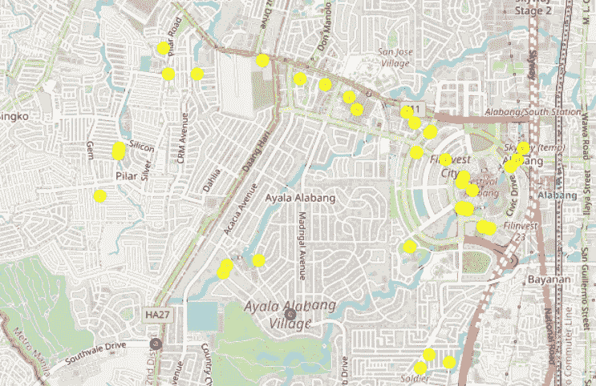
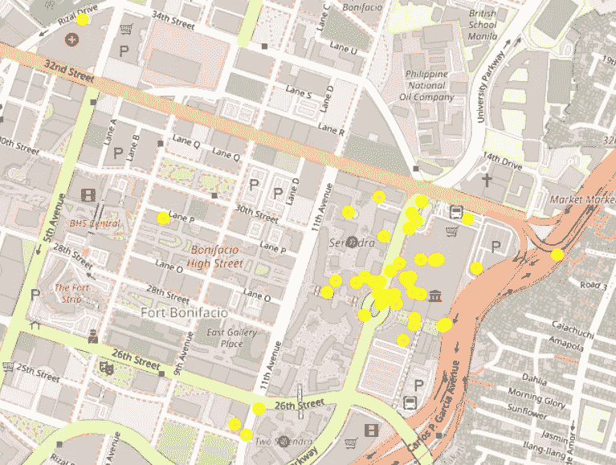
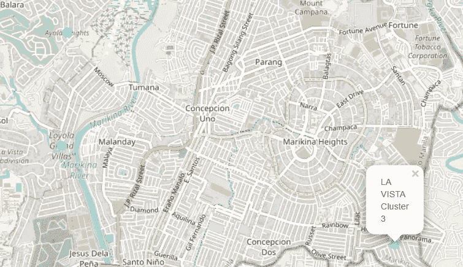

# 使用 K-Means、Foursquare 和 follow 在大马尼拉聚集村庄并寻找新鲜农产品供应商

> 原文：<https://towardsdatascience.com/clustering-villages-and-finding-fresh-produce-suppliers-in-metro-manila-using-k-means-foursquare-2dc27ea417cf?source=collection_archive---------59----------------------->

## 疫情期间可能的商机？向富裕的大马尼拉居民运送新鲜农产品。


[大 Dodzy](https://unsplash.com/@bigdodzy?utm_source=medium&utm_medium=referral) 在 [Unsplash](https://unsplash.com?utm_source=medium&utm_medium=referral) 上的照片

由于新冠肺炎疫情，菲律宾大马尼拉地区自 2020 年 3 月以来一直处于隔离状态。检疫限制使大多数企业难以运营，但这些也大大增加了对送货服务的需求，因为外出到公共场所不安全。

由于高额的送货费对大多数顾客没有吸引力，一些商家提供免费送货到某些地区，通常是独家经营的村庄，如果他们在那个地区有许多顾客的话。这些企业通常在每个村庄都有一个 Viber 聊天群，那里的居民可以发送订单。

这种配送模式非常适合销售蔬菜、海鲜和肉类等基本易腐商品的企业，因为这些商品经常被相同的客户购买。因此，将这些商品运送到大马尼拉的专属村庄是疫情期间可能的商机之一。

## **目标市场**

本报告的目标读者是那些有兴趣在菲律宾大马尼拉地区开办生鲜农产品配送业务的利益相关者。

## **商业问题**

如果一周送货 6 天，你怎么知道每天送货到哪个村庄以优化物流，以及从哪个市场供应商那里获得新鲜农产品？

# 1.数据

## **a.** **所需数据**

根据问题的定义，以下是影响决策的因素:

1.  大马尼拉专属村庄的位置
2.  离每个送货组最近的菜市场的名称和等级(因为顾客通常对他们购买的商品质量很挑剔)

## **b .数据来源**

以下数据源将用于提取或生成所需信息:

1.  **命名 API 地理编码** —用于查找大马尼拉地区每个专属村庄的经度和纬度
2.  **Foursquare API** —用于确定专属村庄周围的集市及其等级
3.  **大马尼拉独家住宅区列表，由向这些村庄**送货的全国顶级面包店之一提供，用于确定目标市场将向其送货的独家村庄

*   这里列出的村庄的居民就是目标市场想要吸引的人。
*   这是公开信息，因为该列表可在面包店的在线订单上获得。

# 2.方法学

## a.收集数据

该国一家顶级面包店每周向大马尼拉最高档的村庄运送面包。他们送货到的住宅区包括在他们的在线订单中，因为客户必须选择他们居住的村庄。

我记下了这 45 个区域，并将每个村庄的经度和纬度合并到一个 CSV 文件中，这是我使用 Nominatim API 地理编码得到的。

这是一个我如何得到每个村庄的经度和纬度的例子:

```
#get latitude and longitude of North Greenhillsaddress = 'North Greenhills, Metro Manila'geolocator = Nominatim(user_agent="gh_agent")
location = geolocator.geocode(address)
latitude = location.latitude
longitude = location.longitude
print(latitude, longitude)
```

然后，我将这个 CSV 文件上传到笔记本中。CSV 文件中包含的唯一数据是每个村庄的名称、经度和纬度。

## **b.** **导入库和数据**

以下是我在这个项目中使用的库:

> 一、*请求*:处理请求
> 
> 二。熊猫:用于数据分析和数据帧制作
> 
> 三。 *Numpy* :以矢量化的方式处理数据
> 
> 四。 *Json* :将 Json 文件解析成 Python 字典或列表
> 
> 动词 （verb 的缩写） *Json_normalize* :将 Json 文件转换成 pandas dataframe 库
> 
> 不及物动词 *Matplotlib* :用于绘制地图上的点
> 
> 七。*叶子*:用于创建地图
> 
> 八。*名称*:用于地理编码不同地区所需的经度和纬度
> 
> 九。 *KMeans* :用于创建 k-means 聚类模型来对村庄进行聚类

```
import requests # library to handle requests
import pandas as pd # library for data analsysis
import numpy as np # library to handle data in a vectorized mannerimport json #library to parse JSON files into a Python dictionary or listimport matplotlib.cm as cm # library for plotting points in the map
import matplotlib.colors as colors #library for plotting points in the mapfrom pandas.io.json import json_normalize # library for tranforming json files into a pandas dataframe library!python3 -m pip install foliumimport folium # library for creating maps
from geopy.geocoders import Nominatim # library for geocoding the longitude and latitude of different areas neededfrom sklearn.cluster import KMeans # library for creating a k-means clustering modelprint('Libraries imported.')
```

导入这些库之后，我还定义了我的 Foursquare API 凭证，因为 Foursquare API 会请求村庄附近不同集市的名称和等级。

```
#Foursquare credentials (hidden cell)# [@hidden_cell](http://twitter.com/hidden_cell)CLIENT_ID = '[insert Foursquare ID here]' 
CLIENT_SECRET = '[insert Foursquare Secret here]' 
ACCESS_TOKEN = '[insert Access Token here]'
VERSION = '20180605' # Foursquare API version
LIMIT = 100 # A default Foursquare API limit value
```

然后，我将村庄位置数据的 CSV 文件作为熊猫数据帧上传到笔记本上，命名为“df_villages”。


村庄数据的数据框架，称为“df_villages”(图片由作者提供)

## **c.** **可视化村庄位置**

我做了一些探索性的数据分析，用 follow 在地图上可视化这些村庄。我在大马尼拉周围制作了一张地图，用蓝点标出了各个村庄。

```
#get latitude and longitude of Metro Manilaaddress = 'Metro Manila'geolocator = Nominatim(user_agent="mm_agent")
location = geolocator.geocode(address)
latitude = location.latitude
longitude = location.longitude# generate map of villages in Metro Manilavillage_map = folium.Map(location=[latitude, longitude], zoom_start=13)# add the villages as blue circle markers
for Latitude, Longitude, label in zip(df_villages.Latitude, df_villages.Longitude, df_villages.Village):
    folium.CircleMarker(
        [Latitude, Longitude],
        radius=5,
        color='blue',
        popup=label,
        fill = True,
        fill_color='blue',
        fill_opacity=0.6
    ).add_to(village_map)# display map
village_map
```


大马尼拉专属村庄地图，蓝色标记(图片由作者提供)

一眼望去，我看到大多数村庄都位于大马尼拉市中心，而北部和南部有少数离群点。

从这里看，似乎有 4 个可能的村庄群，但由于每周有 6 个工作日用于送货，我想将所有这些村庄分成 6 个群。

## **d .****K-均值聚类的村庄**

因为交付的货物容易腐烂，很容易变质，只有邻近村庄的居民才能在一天内被送到。

**k 均值聚类算法**用于根据未标记数据彼此的接近程度对其进行分组；在这种情况下，不同的村庄。

```
*#get k-means clusters of Metro Manila exclusive villages*
*#6 clusters because one cluster for each working day of the week*

kclusters = 6
kmeans = KMeans(n_clusters=kclusters, random_state=0).fit(df_villages[["Latitude", "Longitude"]])
```

“kclusters = 6”部分意味着将根据该公式创建 6 个集群。在数据集被分成 6 组之后，一个新的列被添加到聚类标签的数据帧中。

```
*#add cluster labels to dataframe*

df_villages.insert(0, 'Cluster Labels', kmeans.labels_)*#show first 5 rows of dataframe*df_villages.head()
```


“df_villages ”,添加了另一个分类标签列(作者图片)

为了可视化聚类，创建了一个名为“cluster_map”的新地图，其中每个聚类标签都被分配了一种特定的颜色，并使用 folium 绘制在地图上。

```
*#map the clusters*
cluster_map = folium.Map(location=[latitude, longitude], zoom_start=12)

*# set colors for the clusters*
x = np.arange(kclusters)
ys = [i + x + (i*x)**2 **for** i **in** range(kclusters)]
colors_array = cm.rainbow(np.linspace(0, 1, len(ys)))
rainbow = [colors.rgb2hex(i) **for** i **in** colors_array]
centers = kmeans.cluster_centers_

*# put markers*
cluster_markers = []
**for** lat, lon, village, cluster **in** zip(df_villages['Latitude'], df_villages['Longitude'], df_villages['Village'], df_villages['Cluster Labels']):
    label = folium.Popup(str(village) + ' Cluster ' + str(cluster), parse_html=**True**)
    folium.CircleMarker(
        [lat, lon],
        radius=5,
        popup=label,
        color=rainbow[cluster-1],
        fill=**True**,
        fill_color=rainbow[cluster-1],
        fill_opacity=0.7).add_to(cluster_map)

cluster_map
```


每个村庄群都被赋予了一种新的颜色，以使群体形象化(图片由作者提供)

# 3.结果和分析

既然明确了哪些村庄将在同一天送达，就必须为每个村庄群分配一个特定的市场，以最大限度地减少货物在送达过程中的行程时间。

重要的是，选择的菜市场要尽可能靠近菜市场，尤其是如果有顾客点海鲜或其他容易变质的产品。

奎松市 Cubao 的农贸市场是大马尼拉地区较为高端的菜市场之一，这些专属村庄的居民经常在这里购买新鲜农产品。

由于这个原因，**我不再在集群 0 和集群 4 的区域周围寻找菜市场**，因为农贸市场位于这些集群之间。


聚类 0(红点)和 4(绿点)，农贸市场 Cubao 位于聚类之间(标签为“Cubao”)(图片由作者提供)

我推荐这是这些集群中村庄的市场供应商，因为 1)它已经有了良好的声誉，2)*suki*文化意味着市场供应商通常会给持续购买他们摊位的顾客更低的价格。

因为目标市场将为这两个集群的居民从农贸市场的相同摊位购买商品，价格也将被最小化。

我当时只搜索了为第 1、2、3 和 5 组村庄供货的最佳市场。

## **为集群 1 寻找湿货市场供应商候选人**

因为聚类 1 仅包括 2 个村庄(Ayala Alabang 和 Ayala Southvale)，所以我选择了一个作为参考，用于查找聚类 1 附近的市场，这将是第一个被交付的村庄。

我获得了 Ayala Alabang 的纬度和经度，并搜索了 Ayala Alabang 附近的“wet markets ”,可以通过 Foursquare API 访问这些市场。

```
*#get latitude and longitude of Ayala Alabang Village*
address_1 = 'Ayala Alabang, Metro Manila'
geolocator_1 = Nominatim(user_agent="1_agent")
location_1 = geolocator_1.geocode(address_1)
latitude_1 = location_1.latitude
longitude_1 = location_1.longitude*#search wet markets near each selected address*
search_query = 'wet market'
radius = 2000
print(search_query)*#define the url to find wet markets near Cluster 1*
url_1 = 'https://api.foursquare.com/v2/venues/search?client_id=**{}**&client_secret=**{}**&ll=**{}**,**{}**&oauth_token=**{}**&v=**{}**&query=**{}**&radius=**{}**&limit=**{}**'.format(CLIENT_ID, CLIENT_SECRET, latitude_1, longitude_1,ACCESS_TOKEN, VERSION, search_query, radius, LIMIT)*#get the results of wet markets near Cluster 1*
results_1 = requests.get(url_1).json()*# assign relevant part of JSON to venues*
venues_1 = results_1['response']['venues']

*# tranform venues into a dataframe*
df_results_1 = json_normalize(venues_1)
df_results_1
```


阿亚拉阿拉邦附近集市的结果(图片由作者提供)

既然聚类 1 附近有一个湿市场列表，我清理了数据，以便更容易理解。我将清理后的数据保存为“df_markets_1”

```
*# keep only columns that include venue name, and anything that is associated with location*
filtered_columns_1 = ['name', 'categories'] + [col **for** col **in** df_results_1.columns **if** col.startswith('location.')] + ['id']
df_markets_1 = df_results_1.loc[:, filtered_columns_1]

*# function that extracts the category of the venue*
**def** get_category_type(row):
    **try**:
        categories_list = row['categories']
    **except**:
        categories_list = row['venue.categories']

    **if** len(categories_list) == 0:
        **return** **None**
    **else**:
        **return** categories_list[0]['name']

*# filter the category for each row*
df_markets_1['categories'] = df_markets_1.apply(get_category_type, axis=1)

*# clean column names by keeping only last term*
df_markets_1.columns = [column.split('.')[-1] **for** column **in** df_markets_1.columns]

df_markets_1
```


清理后的数据框架“df_markets_1”(图片由作者提供)

我在这里可以看到，并不是所有的搜索结果实际上都是市场，比如“Filinvest Corporate City”，它被标记为一个社区。但由于这些市场中的大多数都是湿漉漉的，我在地图上显示了这些点，并找出了离 Ayala Alabang 最近的市场。

```
*# add the wet markets to the map as yellow circle markers*
**for** lat, lng, label **in** zip(df_markets_1.lat, df_markets_1.lng, df_markets_1.name):
    folium.CircleMarker(
        [lat, lng],
        radius=5,
        color='yellow',
        popup=label,
        fill = **True**,
        fill_color='yellow',
        fill_opacity=0.6
    ).add_to(cluster_map)

*# display map*
cluster_map
```



聚类 1 的地图，村庄为紫色点，菜市场为黄色点(图片由作者提供)

根据地图，离阿亚拉阿拉邦最近的市场是大学大道上的**周六市场**


阿亚拉阿拉邦附近的集市地图(紫色圆点)和“大学大道周六集市”的标记(图片由作者提供)

我检查了大学大道上的周六市场的评级，看看这个市场是否符合潜在客户的标准，即村里的独家居民。

```
*#check the rating of Saturday Market on University Ave.*

venue_id_SMUA = '4b9c7413f964a520d96936e3' *# Saturday Market on University Ave.*
url_SMUA = 'https://api.foursquare.com/v2/venues/**{}**?client_id=**{}**&client_secret=**{}**&oauth_token=**{}**&v=**{}**'.format(venue_id_SMUA, CLIENT_ID, CLIENT_SECRET,ACCESS_TOKEN, VERSION)

result_SMUA = requests.get(url_SMUA).json()

**try**:
    print(result_SMUA['response']['venue']['rating'])
**except**:
    print('This venue has not been rated yet.')
```


(图片由作者提供)

因为这个场地还没有评级，所以我试着去附近的菜市场看看评级。然而，他们都没有评级，所以我试着看看我是否能得到一张场地的照片，并判断它是否看起来有序，产品质量是否良好。

```
url_SMUA_photo = 'https://api.foursquare.com/v2/photos/**{}**?client_id=**{}**&client_secret=**{}**&oauth_token=**{}**&v=**{}**'.format(venue_id_SMUA, CLIENT_ID, CLIENT_SECRET,ACCESS_TOKEN, VERSION)
result_SMUA_photo = requests.get(url_SMUA_photo).json()

result_SMUA_photo
```


(图片由作者提供)

Foursquare API 上也没有照片，所以**在谷歌**上进行了外部图片搜索。照片显示，市场看起来很干净，似乎迎合了合适的顾客(宣传材料是英文的，防水布标志设计得很好，有充足的步行空间)。

因此，我建议目标市场将**周六市场**供应商作为集群 1 的供应商。

我为集群 2、3 和 5 重复了相同的选择湿市场供应商的过程。

## **为集群 2 寻找湿货市场供应商候选人**

因为聚类 2 只包括 3 个村庄，所以我选择了一个不是中间的村庄作为参考，用于查找聚类 2 附近的市场(Serendra One)，这将是第一个被交付的村庄。

在为 Serendra One 附近的湿货市场创建了一个名为“df_markets_2”的新数据框架后，我在“cluster_map”上绘制了这些数据。



聚类 2 的地图，村庄为蓝点，菜市场为黄点(图片由作者提供)

从地图上可以看出，在集群 2 附近有许多市场，因为它就在一个名为“市场！市场！”这可能是使用 Foursquare API 的限制之一，因为即使是商场中的非食品商店也包含在搜索结果中，因为它们的名称中含有“市场”一词。

然而，在检查附近的点时，发现在购物中心市场内还有一个农贸市场！市场！，所以这可能是集群 2 的潜在供应商。


Serendra One(蓝点)附近的湿货市场地图和“市场！市场！农贸市场”(作者图片)

我查了市场的评级！市场！农贸市场，看到没有。我决定看看它是否有来自 Foursquare 用户的提示，来提示它是怎样的。

```
*## MMFM Tips*
limit_MMFM = 15 *# set limit to be greater than or equal to the total number of tips*
tips_MMFM = 'https://api.foursquare.com/v2/venues/**{}**/tips?client_id=**{}**&client_secret=**{}**&oauth_token=**{}**&v=**{}**&limit=**{}**'.format(venue_id_MMFM, CLIENT_ID, CLIENT_SECRET,ACCESS_TOKEN, VERSION, limit_MMFM)

results_MMFM = requests.get(tips_MMFM).json()
results_MMFM
```


(图片由作者提供)

Foursquare API 上也没有可用的提示。因为这个菜市场和下一个最近的菜市场(已经离聚类有点远)也没有评级，所以我的决定是推荐市场！市场！农贸市场是第二组的供应商，在谷歌图片中可以找到它的照片。

从照片来看，它看起来像一个干净、有信誉的市场，特别是因为它位于一个受欢迎的购物中心。所以，我会推荐**行情！市场！农贸市场**作为集群 2 居民的供应商。

接下来，我为集群 3 寻找最佳的湿货市场供应商。

## **为集群 3 寻找湿货市场供应商候选人**

因为聚类 3 只包括 3 个村庄，所以我选择了一个不是中间的村庄作为参考，用于查找聚类 3 附近的市场，这将是第一个被送达的村庄。



群组 3 的地图，淡蓝色圆点代表村庄(图片由作者提供)

我特别挑选了拉维斯塔村作为参考，因为其他两个村庄彼此有点接近，都在一条河的一边，所以从后勤上来说，先送到拉维斯塔更容易。

同样，邻近的菜市场被放置在数据框架“df_markets_3”中，并绘制在“clusters_map”上


群组 3 的地图，村庄为浅蓝色点，菜市场为黄色点(图片由作者提供)


拉维斯塔附近的集市地图(浅蓝色点)和“维亚加公共市场”的标记(图片由作者提供)

根据地图，离 La Vista 最近的市场是 Viaga 公共市场。由于这个地方在 Foursquare 上没有评级、提示或照片，我查看了下一个最近的菜市场，看看他们是否有评级、提示或照片。

不幸的是，他们都不知道。我试着在谷歌图片中搜索**维亚加公共市场、图马纳公共市场和塔博安公共市场**(离拉维斯塔最近的菜市场)的照片，但同样没有这些市场的图片。

我想**在大马尼拉(甚至在菲律宾)还没有太多的场地在 Foursquare API 上有评论、提示和照片**。要么这样，要么**没有太多的人在这个地区的菜市场上查看和留下提示**。

在这种情况下，我将让本报告的用户自己探索建议的菜市场，并判断这些菜市场是否适合他们的客户。

最后，我对集群 5 重复了这个过程。

## **为集群 5 寻找湿货市场供应商候选人**

因为 Urdaneta 村通常位于聚类 5 的中心，所以我使用它作为搜索离聚类最近的市场列表的参考。这是聚类 5 附近的集市地图:


聚类 5 的地图，村庄为橙色点，菜市场为黄色点(图片由作者提供)

查看聚类 5 的地图，我注意到许多标绘的点实际上不是集市，因为有些是夜市或超市。如果市场供应商靠近集群边界的至少一个村庄，例如位于集群右上角的 Rockwell Makati，这可能是最好的。

这是为了使得湿货市场供应商可以靠近该组的交付路线的“入口点”。罗克韦尔马卡蒂附近最近的点是高端超市“Rustans Market by”和高端美食街“Grid Food Market”。

由于这两个市场都不是真正的新鲜农产品市场，我推荐 Poblacion Public Market 作为该集群的市场供应商，因为它是离 Rockwell Makati 最近的点。


罗克韦尔马卡蒂附近的湿货市场地图(橙色圆点)和“Poblacion 公共市场”标记(图片由作者提供)

同样，由于这个地点没有评级，提示，或可用的照片，我再次基于谷歌图片这个市场的质量。

我在谷歌上只看到了一张市场的图片，它的内部与 Cubao 农贸市场相似，所以我认为这个市场的产品质量应该也差不多。因此，我推荐 **Poblacion Public Market** 作为集群 5 的湿货市场供应商。

# 4.结论


由[M . Ashraful Alam](https://unsplash.com/@ashrafsazid?utm_source=medium&utm_medium=referral)在 [Unsplash](https://unsplash.com?utm_source=medium&utm_medium=referral) 上拍摄的照片

**大马尼拉地区的 45 个专属村庄根据彼此的接近程度被分成 6 个交付组**(第 0-5 组)。

使用 Foursquare API 和一些额外的人类知识(如了解农贸市场 Cubao 在目标客户中的声誉)，**我能够确定一些推荐的市场，目标市场可以在这些市场购买供应品**，这些供应品将出售给这些独家村庄的居民。这些湿货市场是:

*1。* ***集群 0*** *(西格林希尔斯，瓦克瓦克村等。)——****农贸市场***

*2。* ***集群 1*** *(Ayala Alabang，Ayala south vale)——****大学大道上的周六市场***

*3。* ***集群 2*** *(塞伦德拉一、塞伦德拉二、麦金利山)——****市场！市场！农贸市场***

*4。* ***集群 3*** *(La Vista、Loyola Grand Villas 和 Ayala Heights)——****Viaga 公共市场、Tumana 公共市场或 Taboan 公共市场***

*5。* ***集群 4*** *(科林斯园林，Valle Verde 1 等。)—* ***农贸市场存保***

*6。* ***集群 5*** *(达斯马里纳斯村、福布斯公园等。)—* ***公共市场***

通过这个项目，我还得出结论，尽管这种数据和技术可用于帮助商业决策，但大部分分析仍然依赖于人类的经验和直觉。

例如，来自 Foursquare 的数据可以向我们显示，基于其与生成的集群的接近程度，标记为湿市场的某些场所将是最实际的供应商选择，但这并不能说明一个商人通过选择允许他为批量订单讨价还价的供应商可以节省的成本。

归根结底，技术是一种让决策变得更容易的工具，但只有将其与现实世界的人类知识相结合，它才能得到优化。

*这份报告是我的* ***IBM 数据科学专业证书*** *的顶点工程的一部分。你可以在我的* [*笔记本*](https://dataplatform.cloud.ibm.com/analytics/notebooks/v2/86bb2e47-499b-400a-bb5d-3f4a2efcc52a/view?access_token=9f33999c9b47a3049f9759f69f3c1853b8a417a5ac52053302612ce2cc8e6958) *上查看完整代码。*

关于如何改进这一点，有什么建议吗？在下面留下评论或者和我连线[*LinkedIn*](http://www.linkedin.com/in/francescapicache)*！非常感谢反馈。*