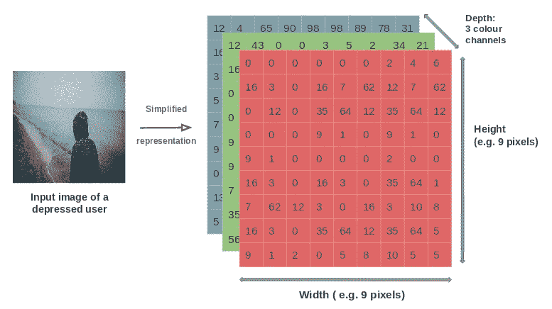
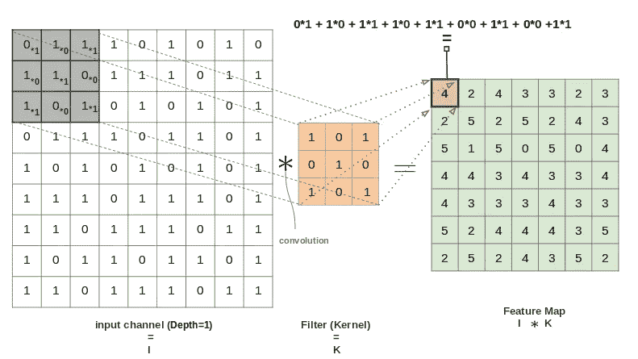
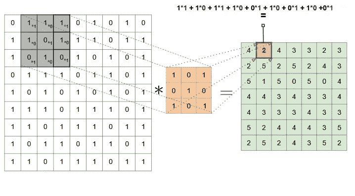
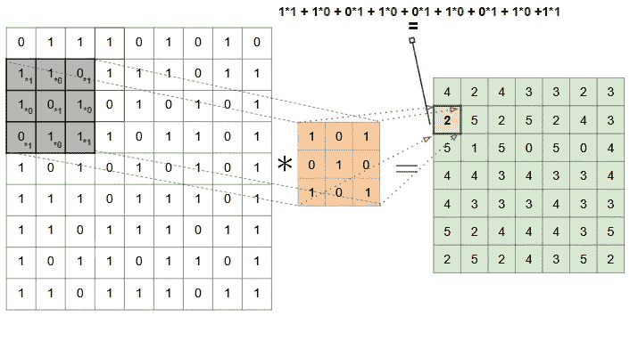
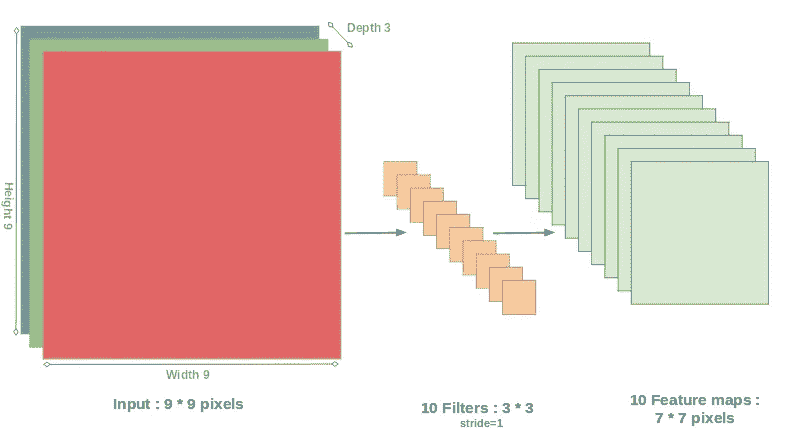
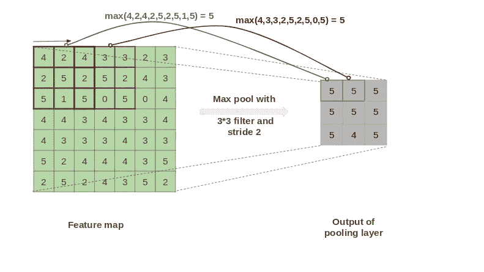
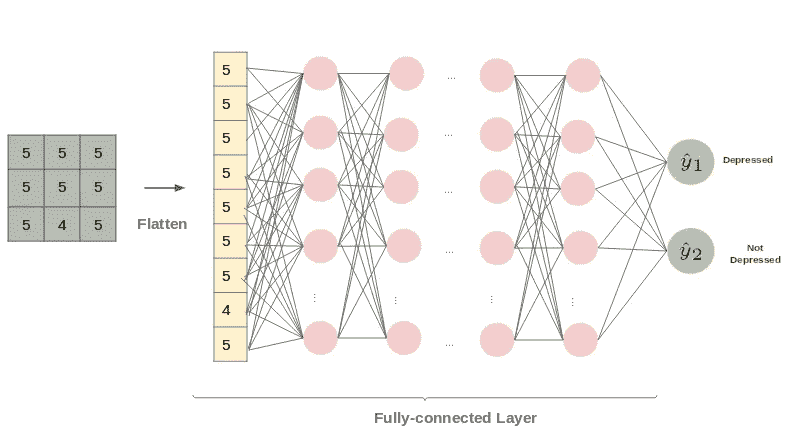
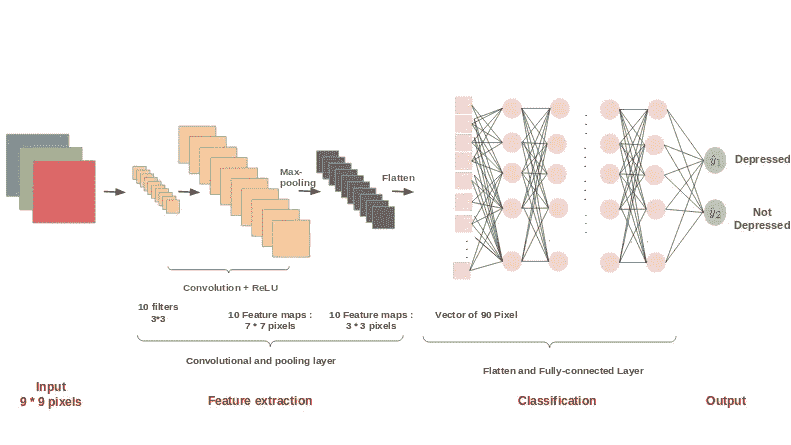

# CNN:计算机真的能看见吗？

> 原文：<https://towardsdatascience.com/cnn-can-a-computer-really-see-96f237dcf171?source=collection_archive---------50----------------------->

## 卷积神经网络讲解！

卷积神经网络(CNN 或 ConvNet)是一类深度学习，受人类视觉系统的启发，专门从图像、文本和音频等复杂输入中提取高级特征。

在 [Unsplash](https://unsplash.com?utm_source=medium&utm_medium=referral) 上 [NeONBRAND](https://unsplash.com/@neonbrand?utm_source=medium&utm_medium=referral) 拍摄的照片

事实上，与手工设计特征的经典神经网络不同，CNN 获取输入的原始数据，自动区分有意义的模式，并基于这些特征而不是原始像素进行学习。这就是为什么 CNN 是图像分析中经常使用的神经网络[1]。

> 但是计算机如何分析图像呢？

## 基本上，卷积神经网络主要包括:

*   **输入图层**
*   **卷积层**
*   **激活功能层**
*   **汇集层**
*   **展平全连通图层**

我们先从 CNN 的**输入层**开始，来了解计算机是如何看到一个图像的。

# **输入层:**

图像通常表示为像素值的三维(3D)矩阵:

*   **高度**和**宽度**取决于输入图像的尺寸。
*   **深度**一般是三通道 RGB(红绿蓝)对于每个像素的颜色值。

*作者的图像:*图像表示的示例

# **卷积层:**

卷积运算是 Y. Bengio 和 Yann Lecun 发明的 CNN 的基本组成部分[2]，它包括对输入图像应用滤波器以检测与每一类相关的特征。

*图片作者:*9 像素的红色通道图片

**滤波器**(固定大小)由随机初始化的权重组成，这些权重将通过每个输入的反向传播来更新。

滤镜以**步长**(卷积中跳过的像素数)垂直和水平滑动图像，将图像的“像素”值乘以滤镜的值。然后，将所有这些乘法相加得到一个数，该数构成特征图的一个像素。

*图片作者:*水平滑动操作

*图片作者:*垂直滑动操作

在卷积过程结束时，所获得的特征图表示包含输入图像的检测模式的较小矩阵。

显然，我们对图像应用的过滤器越多，提取的特征就越多，网络在检测图像模式方面就变得越好。

最后，卷积层由相同大小的多个滤波器组成，这些滤波器从图像的 3D 通道表示的输入输出各种特征图。下图对此进行了总结:

*作者图片:*步长=1、滤波器大小=3*3 的 9*9 像素输入图像的卷积层

# ReLU 的非线性:

考虑到真实世界数据的非线性，我们必须在每个卷积层之后引入一层激活函数，因为卷积是线性运算(乘法和加法)。

事实上，通过增加网络的非线性，我们创建了一个复杂的网络，使我们能够检测和区分输入图像的许多模式。

该任务最常用的激活函数是 ReLU [16](校正线性单元)。数学上，它被定义为:

*作者图片*

由于它的数学特性，它是一种元素式操作(在我们的例子中应用于每个像素),在特征图中用零替换负像素的值。

# 池层:

类似于卷积层，池层用于独立地进一步降低先前矩阵的维度(维度降低),以显著降低数据处理所需的参数数量和计算能力。

此外，该操作从输入中提取主导特征，同时保持有效训练模型的过程，因为网络对于输入图像的小变换和平移变得不变。

*作者图片:*使用最大池化方法，使用步长 2 和大小 3*3 的过滤器，对 7*7 像素的输入图像进行池化图层

可以通过多种**方法**完成汇集:**最大汇集**、**最小汇集**、**平均汇集**和**平均汇集**。最常用的方法是最大池化。

# 展平和完全连接的层:

卷积层和池层的组合从输入图像中提取主要特征到一个**数量的矩阵**，然后 flatten 将其转换为一个**一维数组**，创建一个适合于全连接层的**输入**的单一长特征向量。

全连接层完成**分类**的任务，它代表一个多层感知器，主要具有 **softmax 激活功能**。然后，网络将能够学习高级特征的非线性组合，并区分每个图像规格。

*作者图片:*展平并完全连接的图层示例

总而言之，CNN 架构执行两个主要任务:

*   特征提取:卷积层+池层
*   分类:全连接层

这张图片展示了 CNN 的完整架构:

*图片作者:*CNN 架构概要以 9*9 像素输入为例

一般来说，卷积层数越多，模型能够识别的特征就越多。

# 参考资料:

[1] Maria Valueva，Nikolay Nagornov，Pavel Lyakhov，G.V. Valuev，和 N.I.Chervyakov .应用剩余数系统减少卷积神经网络实现的硬件成本数学和计算机模拟，177，05 2020。

[2] Y .本吉奥和扬·勒昆。图像、语音和时间序列的卷积网络。11 1997.

[3]田畑秀则·伊德。还有栗田泷雄。稀疏正则化对 relu 激活的 cnn 学习的改进。IEEE，2017 年 07 月。