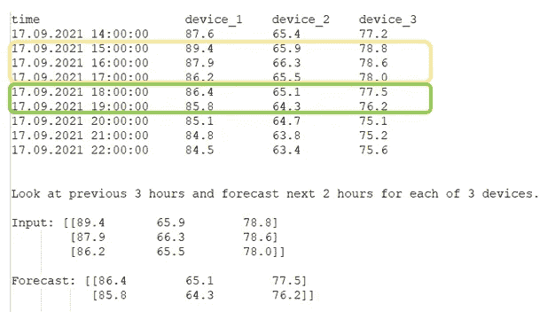
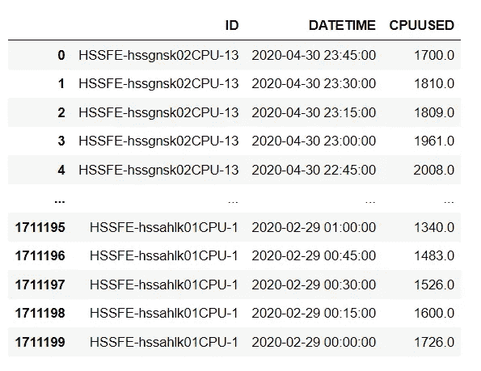
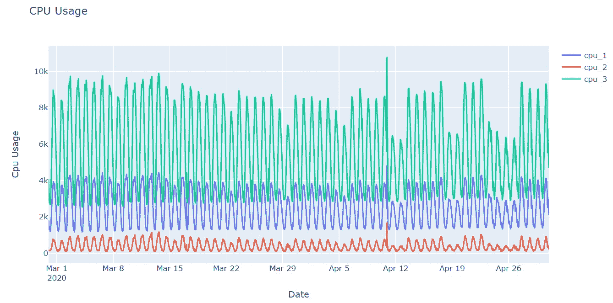
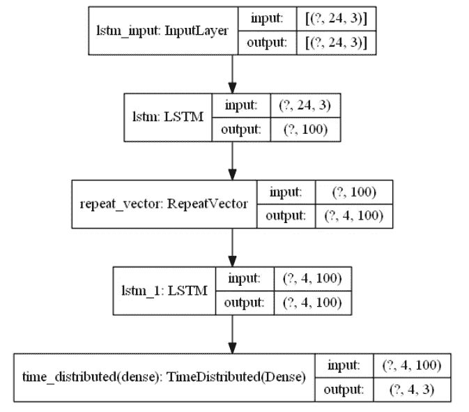
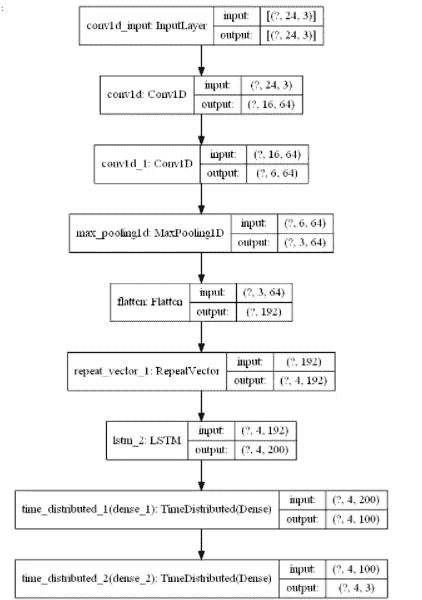
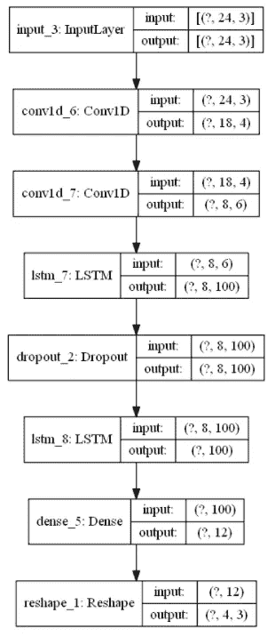
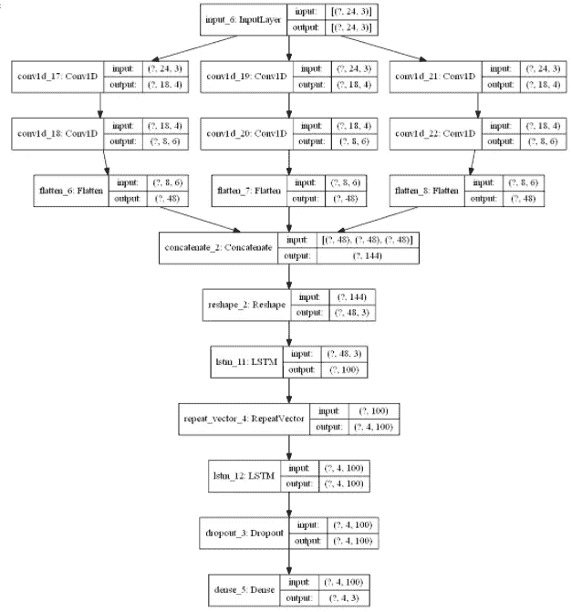
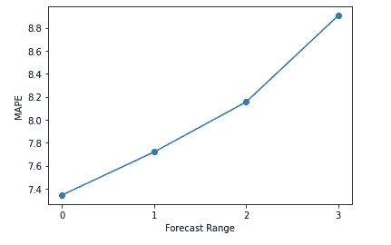

# 基于 CNN-LSTM 的多并行输入多步预报模型

> 原文：<https://towardsdatascience.com/cnn-lstm-based-models-for-multiple-parallel-input-and-multi-step-forecast-6fe2172f7668?source=collection_archive---------1----------------------->

## 针对多个时间序列和多步预测用例的不同神经网络方法，以及多步预测的真实实践

时间序列预测是机器学习的一个非常热门的领域。这背后的原因是时间序列在日常生活中几乎每个领域的广泛使用。深入时间序列预测的细节，我们会遇到许多不同种类的子领域和方法。在本文中，我将关注通过接收多个并行时间序列来执行多步预测的特定子域，并提及在时间序列预测中应考虑的基本要点。请注意，预测模型在不同点上与预测模型不同。


法鲁克·凯马克在 [Unsplash](https://unsplash.com?utm_source=medium&utm_medium=referral) 上拍摄的照片

## -问题定义

让我们想象一下，大量网络设备分布在广阔的地理区域内，流量不断地流经这些设备。另一个例子可能是关于连续测量不同位置的天气温度的许多不同温度设备，或者另一个例子可能是计算系统中许多设备的能量消耗。我们可以很容易地扩展这些例子。目标很简单；预测接下来的多个时间步；在我们的例子中，这对应于分别预测流量值、温度或许多设备的能耗。

首先想到的当然是分别对每个器件建模。我想我们可能会得到最高的预测结果。如果有超过 100 种甚至更多的不同设备呢？这意味着设计 100 种不同的模型。考虑到部署、监控和维护成本，它并不太适用。因此，我们的目标是用一个单一的模型来涵盖整个问题。我认为它仍然是时间序列预测的一个非常受欢迎和搜索的领域，尽管时间序列预测已经摆在桌面上很久了。我在这个领域遇到了很多不同的学术研究。

这个问题也可以定义为 *seq2seq* 预测。特别是在语音识别和翻译中，这是非常常见的情况。 [LSTM](https://colah.github.io/posts/2015-08-Understanding-LSTMs/) 对于这类问题非常方便。 [CNN](https://ujjwalkarn.me/2016/08/11/intuitive-explanation-convnets/) 也可以认为是另一种类型的神经网络，常用于图像处理任务。通常，它也用于特征提取和时间序列预测。我将提到 LSTM 和 CNN 在多个并行输入和多步预测情况下对时间序列预测的应用。对 LSTM 和 CNN 的解释超出了本文的范围。

为了更清楚，我在下面描绘了一个简单的数据示例。这是一个通过查看前 3 个小时的时隙来预测未来 2 个小时 3 个不同设备的流量值的示例。



作者图片—图 1

## -数据集描述

在本文中，我将利用由 15 分钟时间间隔内 288 台不同服务器的 CPU 使用情况组成的数据集。为简单起见，我将把范围缩小到 3 台服务器。



数据集示例，按作者分类的图像—图 2

## -预建模步骤

预建模在神经网络实现中非常关键。你通常不能简单地直接向神经网络提供原始数据，需要一个简单的转换。然而，在转换之前，我们应该对原始数据应用一些额外的步骤。

在我们的例子中，下面是旋转原始数据。

```
df_cpu_pivot = pd.pivot_table(df, values=’CPUUSED’, 
 index=[‘DATETIME’], columns=[‘ID’])
```

以下是对数据集中缺失值的插值。在时间序列中输入空值本身是非常重要的，也是一项具有挑战性的任务。这个数据集中没有很多空值，输入空值超出了本文的范围，因此我执行了一个简单的实现。

```
for i in range(0, len(df_cpu_pivot.columns)):
 df_cpu_pivot.iloc[:,i].interpolate(inplace = True)
```

在进入建模阶段之前的第一件事，在时间序列预测的数据预处理步骤的最开始，在我看来是绘制时间序列。让我们看看数据告诉了我们什么。正如我之前提到的，为了简单起见，我只选择了 3 个不同的服务器。可以看出，它们在不同的尺度上都遵循非常相似的模式。

```
import plotly
import plotly.express as px
import plotly.graph_objects as godf_cpu_pivot.reset_index(inplace=True)
df_cpu_pivot['DATETIME'] = pd.to_datetime(df_cpu_pivot['DATETIME'])trace1 = go.Scatter(
 x = df_cpu_pivot[‘DATETIME’],
 y = df_cpu_pivot[‘HSSFE-hssahlk01CPU-0’],
 mode = ‘lines’,
 name = ‘cpu_1’
)
trace2 = go.Scatter(
 x = df_cpu_pivot[‘DATETIME’],
 y = df_cpu_pivot[‘HSSFE-hssumrk03CPU-29’],
 mode = ‘lines’,
 name = ‘cpu_2’
)
trace3 = go.Scatter(
 x = df_cpu_pivot[‘DATETIME’],
 y = df_cpu_pivot[‘HSSFE-hssumrk03CPU-4’],
 mode = ‘lines’,
 name = ‘cpu_3’
)layout = go.Layout(
 title = “CPU Usage”,
 xaxis = {‘title’ : “Date”},
 yaxis = {‘title’ : “Cpu Usage”}
)
fig = go.Figure(data=[trace1, trace2, trace3], layout=layout)
fig.show()
```



Cpu 使用情况—图 3

下一步是将数据集分成训练集和测试集。它在时间序列上与传统的机器学习实现略有不同。我们可以直观地确定分离数据集的拆分日期。

```
from datetime import datetime
train_test_split = datetime.strptime(‘20.04.2020 00:00:00’, ‘%d.%m.%Y %H:%M:%S’)
df_train = df_cpu_pivot.loc[df_cpu_pivot[‘DATETIME’] < train_test_split]
df_test = df_cpu_pivot.loc[df_cpu_pivot[‘DATETIME’] >= train_test_split]
```

由于其敏感性，我们还在将数据输入任何神经网络模型之前对其进行归一化。

```
from sklearn.preprocessing import MinMaxScaler
cpu_list = [i for i in df_cpu_pivot.columns if i != ‘DATETIME’]
scaler = MinMaxScaler()
scaled_train = scaler.fit_transform(df_train[cpu_list])
scaled_test = scaler.transform(df_test[cpu_list])
```

最后一步是将训练集和测试集转换成神经网络可接受的格式。可以实现以下方法来转换数据。除了序列本身，它只需要两个参数，分别是时滞(回顾的步骤)和预测范围。还可以看看 Keras 中定义的 [TimeSeriesGenerator](https://www.tensorflow.org/api_docs/python/tf/keras/preprocessing/sequence/TimeseriesGenerator) 类来转换数据集。

```
def split_sequence(sequence, look_back, forecast_horizon):
 X, y = list(), list()
 for i in range(len(sequence)): 
   lag_end = i + look_back
   forecast_end = lag_end + forecast_horizon
   if forecast_end > len(sequence):
     break
   seq_x, seq_y = sequence[i:lag_end], sequence[lag_end:forecast_end]
   X.append(seq_x)
   y.append(seq_y)
 return np.array(X), np.array(y)
```

LSTM 模型期望数据具有以下形状:*【样本，时间步长，特征】。*同样，CNN 也期望 3D 数据为 LSTMs。

```
# Take into consideration last 6 hours, and perform forecasting for next 1 hour
LOOK_BACK = 24
FORECAST_RANGE = 4
n_features = len(cpu_list)X_train, y_train = split_sequence(scaled_train, look_back=LOOK_BACK, forecast_horizon=FORECAST_RANGE)
X_test, y_test = split_sequence(scaled_test, look_back=LOOK_BACK, forecast_horizon=FORECAST_RANGE)print(X_train.shape)
print(y_train.shape)
print(X_test.shape)
print(y_test.shape)(4869, 24, 3)
(4869, 4, 3)
(1029, 24, 3)
(1029, 4, 3)
```

**补充说明**

我还想提一下时间序列预测的额外预建模步骤。这些不是本文的直接范围，但值得了解。

[平稳](https://medium.com/quantyca/a-gentle-introduction-to-time-series-7e9f5418dad8)对于时间序列来说是一个非常重要的问题，大多数预测算法如 [*ARIMA*](/arima-simplified-b63315f27cbc) 都期望时间序列是平稳的。平稳时间序列基本上在一段时间内保持非常相似的均值、方差值，不包括季节性和趋势。要使时间序列平稳，最直接的方法是取序列中后续值的差。如果方差与均值相比波动很大，取序列的对数使其平稳也是一个好主意。与大多数其他预测算法不同，LSTMs 能够学习序列中的非线性和长期相关性。因此，静态是 LSTMs 不太关心的问题。尽管如此，让时间序列保持平稳并稍微提高 LSTMs 的性能是一个很好的实践。静态测试有很多，最著名的是 [*增强的 Dicky-Fuller 测试*](https://en.wikipedia.org/wiki/Augmented_Dickey%E2%80%93Fuller_test) ，在 python 中有现成的实现。

这里有一篇很优秀的文章，简单的设计了一个模型来预测一个随机游走过程产生的时间序列，评价准确率非常高。事实上，预测随机行走过程是不可能的。但是，如果您直接使用原始数据而不是静态差异数据，可能会出现这种误导性的推断。

关于时间序列要提到的另一件事是绘制 [*ACF* 和*PACF*图，并研究时间序列相对于不同历史滞后值的相关性。这肯定会让你深入了解你正在处理的时间序列。](/identifying-ar-and-ma-terms-using-acf-and-pacf-plots-in-time-series-forecasting-ccb9fd073db8)

## -基线模型

拥有一个[基线模型](https://machinelearningmastery.com/persistence-time-series-forecasting-with-python/)来衡量你的模型的相对性能总是一个好主意。基线模型应该简单、快速且可重复。建立基线模型最常用的方法是持久性模型。它有一个非常简单的工作原理，只是预测下一个时间步为前一步，换句话说 *t+1* 与 *t* 相同。对于多步预测，可能将预测 *t+1，t+2，t+3* 修改为 *t* ，整个预测范围将是相同的。在我看来，那不太合理。相反，我更喜欢将预测范围内的每个时间步长预测为相同设备之前相同时间的平均值。下面是一个简单的代码片段。

```
df[‘DATETIME’] = pd.to_datetime(df[‘DATETIME’])
df[‘hour’] = df[‘DATETIME’].apply(lambda x: x.hour)
df[‘minute’] = df[‘DATETIME’].apply(lambda x: x.minute)train_test_split = datetime.strptime(‘20.04.2020 00:00:00’, ‘%d.%m.%Y %H:%M:%S’)
df_train_pers = df.loc[df[‘DATETIME’] < train_test_split]
df_test_pers = df.loc[df[‘DATETIME’] >= train_test_split]df_cpu_mean = df_train_pers.groupby([‘ID’, ‘hour’, ‘minute’]).mean(‘CPUUSED’).round(2)df_cpu_mean.reset_index(inplace=True)
df_cpu_mean = df_cpu_mean.rename(columns={“CPUUSED”: “CPUUSED_PRED”})df_test_pers = df_test_pers.merge(df_cpu_mean, on=[‘ID’,’hour’, ‘minute’], how=’inner’)# the method explanation is at the next section
evaluate_forecast(df_test_pers[‘CPUUSED’], df_test_pers[‘CPUUSED_PRED’])mae: 355.13
mse: 370617.18
mape: 16.56
```

可以看出，我们的基线模型预测误差约为 16.56%。我将在模型部分的*评估中详细介绍评估指标。让我们看看我们是否能超过这个结果。*

## -不同的模型示例

我将提到用于*多个并行输入和多步预测的不同的基于神经网络的模型。*在描述模型之前，让我分享一些常见的东西和代码片段，比如 Keras 回调、应用逆变换以及评估结果。

编译模型时使用的回调如下。[*model check point*](https://keras.io/api/callbacks/model_checkpoint/)是以一定的频率保存模型(权重)。 [*提前停止*](https://keras.io/api/callbacks/early_stopping/) 用于在监控的评估指标不再提高时停止进度。[*ReduceLROnPlateau*](https://keras.io/api/callbacks/reduce_lr_on_plateau/)用于在监控指标停止改善时降低学习率。

```
checkpoint_filepath = ‘path_to_checkpoint_filepath’
checkpoint_callback = ModelCheckpoint(
 filepath=checkpoint_filepath,
 save_weights_only=False,
 monitor=’val_loss’,
 mode=’min’,
 save_best_only=True)early_stopping_callback = EarlyStopping(
 monitor=”val_loss”,
 min_delta=0.005,
 patience=10,
 mode=”min”
)rlrop_callback = ReduceLROnPlateau(monitor=’val_loss’, factor=0.2, mode=’min’, patience=3, min_lr=0.001)
```

由于我们在将数据输入模型之前对其进行了规范化，因此我们应该将其转换回原始比例以评估预测。我们可以简单地利用下面的方法。在对数据进行差分以使其稳定的情况下，您应该首先反转缩放，然后依次反转差分。预测的顺序与此相反，即首先应用差异，然后归一化数据。[为了反演差异数据](https://machinelearningmastery.com/time-series-forecasting-long-short-term-memory-network-python/)，简单的方法是将差异预测累加到最后的累积观测值上。

```
def inverse_transform(y_test, yhat):
 y_test_reshaped = y_test.reshape(-1, y_test.shape[-1])
 yhat_reshaped = yhat.reshape(-1, yhat.shape[-1]) yhat_inverse = scaler.inverse_transform(yhat_reshaped)
 y_test_inverse = scaler.inverse_transform(y_test_reshaped)
 return yhat_inverse, y_test_inverse
```

为了评估预测，我简单地分别考虑了*均方误差(mse)、平均绝对误差(mae)、*和*平均绝对百分比误差(mape)* 。您可以扩展评估指标。注意，*均方根误差(rmse)和 mae* 给出的误差与变量本身的单位相同，并被广泛使用。在本文中，我将根据 *mape* 来比较这些模型。

```
def evaluate_forecast(y_test_inverse, yhat_inverse):
 mse_ = tf.keras.losses.MeanSquaredError()
 mae_ = tf.keras.losses.MeanAbsoluteError()
 mape_ = tf.keras.losses.MeanAbsolutePercentageError() mae = mae_(y_test_inverse,yhat_inverse)
 print('mae:', mae)
 mse = mse_(y_test_inverse,yhat_inverse)
 print('mse:', mse)
 mape = mape_(y_test_inverse,yhat_inverse)
 print('mape:', mape)
```

常见的导入包如下。

```
from tensorflow.keras import Sequential
from tensorflow.keras.layers import LSTM, Dense, Dropout, TimeDistributed, Conv1D, MaxPooling1D, Flatten, Bidirectional, Input, Flatten, Activation, Reshape, RepeatVector, Concatenate
from tensorflow.keras.models import Modelfrom tensorflow.keras.utils import plot_modelfrom tensorflow.keras.callbacks import EarlyStopping, ReduceLROnPlateau, ModelCheckpoint
```

在这一步，我认为在 Keras 中提及 [*时间分布*](https://keras.io/api/layers/recurrent_layers/time_distributed/) 和 [*重复向量*](https://keras.io/api/layers/reshaping_layers/repeat_vector/) 层是有益的。这些不是经常使用的层，但是，它们在一些特定的情况下可能非常有用，比如我们的例子。

简而言之， *TimeDistributed* 层是一种包装器，并期望另一层作为参数。它将该层应用于输入的每个时间片，因此允许构建具有*一对多*、*多对多*架构的模型。类似地，它期望输入至少是三维的。我知道这对于初学者来说不是很清楚，你可以在这里找到有用的讨论。

*重复矢量*基本上重复输入 *n 次*。换句话说，它将输出形状的维度增加了 1。*重复向量* [在这里](https://stackoverflow.com/questions/51749404/how-to-connect-lstm-layers-in-keras-repeatvector-or-return-sequence-true)有很好的解释和图解，看看吧。

```
epochs = 50
batch_size = 32
validation = 0.1
```

以上是为编译模型而定义的。

**编解码器型号**

```
model_enc_dec = Sequential()
model_enc_dec.add(LSTM(100, activation=’relu’, input_shape=(LOOK_BACK, n_features)))
model_enc_dec.add(RepeatVector(FORECAST_RANGE))
model_enc_dec.add(LSTM(100, activation=’relu’, return_sequences=True))
model_enc_dec.add(TimeDistributed(Dense(n_features)))
model_enc_dec.compile(optimizer=’adam’, loss=’mse’)plot_model(model=model_enc_dec, show_shapes=True)history = model_enc_dec.fit(X_train, y_train, epochs=epochs, batch_size=batch_size, validation_split=validation,callbacks=[early_stopping_callback, checkpoint_callback, rlrop_callback])yhat = model_enc_dec.predict(X_test, verbose=0)yhat_inverse, y_test_inverse = inverse_transform(y_test, yhat)evaluate_forecast(y_test_inverse, yhat_inverse)mae: 145.95
mse: 49972.53
mape: 7.40
```



编码器-解码器模型—图 4

[编码器-解码器](https://www.analyticsvidhya.com/blog/2020/10/multivariate-multi-step-time-series-forecasting-using-stacked-lstm-sequence-to-sequence-autoencoder-in-tensorflow-2-0-keras/)架构是序列到序列学习的典型解决方案。该架构包含至少两个 RNN/lstm，其中一个用作编码器，而另一个用作解码器。编码器主要负责读取和解释输入。编码器部分将输入压缩成原始输入的小型表示(固定长度的向量),并将该上下文向量作为输入提供给解码器部分进行解释和执行预测。一个 *RepeatVector* 层用于重复我们从编码器部分获得的上下文向量。它会根据您想要预测的未来步骤数进行重复，并输入到解码器部分。就每个时间步长而言，从解码器接收的输出被混合。一个完全连接的*密集*层通过*时间分布*包装器被应用于每个时间步长，从而分离每个时间步长的输出。在每个编码器和解码器中，可以使用不同种类的架构。下一部分给出了一个例子，其中 CNN 被用作编码器中的特征提取器。

**CNN-LSTM 编解码器型号**

以下模型是编码器-解码器架构的扩展，其中编码器部分由 *Conv1D* 层组成，与之前的模型不同。首先在开头放置两个后续的 *Conv1D* 层提取特征，然后在汇集 *Conv1D 的结果后将其展平。*架构的其余部分与之前的模型非常相似。

为了简单起见，我只是不分享绘图，模型的拟合，测试集的预测，以及逆向转换步骤，这些将与模型的其余部分完全相同。

```
model_enc_dec_cnn = Sequential()
model_enc_dec_cnn.add(Conv1D(filters=64, kernel_size=9, activation=’relu’, input_shape=(LOOK_BACK, n_features)))
model_enc_dec_cnn.add(Conv1D(filters=64, kernel_size=11, activation=’relu’))
model_enc_dec_cnn.add(MaxPooling1D(pool_size=2))
model_enc_dec_cnn.add(Flatten())
model_enc_dec_cnn.add(RepeatVector(FORECAST_RANGE))
model_enc_dec_cnn.add(LSTM(200, activation=’relu’, return_sequences=True))
model_enc_dec_cnn.add(TimeDistributed(Dense(100, activation=’relu’)))
model_enc_dec_cnn.add(TimeDistributed(Dense(n_features)))
model_enc_dec_cnn.compile(loss=’mse’, optimizer=’adam’)mae: 131.89
mse: 50962.38
mape: 7.01
```



CNN 编码器-解码器模型—图 5

**矢量输出模式**

与上面提到的模型相比，这种架构可能被认为是更常见的架构，但是，它不太适合我们的情况。不过，我分享一个例子来说明一下。与编码器-解码器架构不同，既不存在*重复向量*也不存在*时间分布*层。重点是用 FORECAST_RANGE*n_features 节点添加一个 *Dense* 图层，然后在下一层做相应的整形。你也可以用 *RepeatVector* 层代替 *Reshape* 层来设计一个类似的架构。

在这种结构中，每个序列的时间步长将被展平，并且在训练和预测期间，必须将每个输出解释为特定序列的特定时间步长。这意味着我们也可以将标注集调整为二维而不是三维，并相应地解释输出图层中的结果，而无需使用*调整*图层。为了简单起见，我没有改变标签集的形状，只是记住这种替代方式。在架构的开始，我还利用了 *Conv1D* 层。

这种结构也可以称为多通道模型。不要高估名字。在处理多个时间序列时，传统上使用多通道的细胞神经网络。在这种结构中，每个通道对应于单个时间序列，并且类似地为每个时间序列分别提取卷积特征。由于所有提取的特征在输入到 LSTM 图层之前会被合并，因此每个时间序列的一些典型特征可能会丢失。

```
input_layer = Input(shape=(LOOK_BACK, n_features)) 
conv = Conv1D(filters=4, kernel_size=7, activation=’relu’)(input_layer)
conv = Conv1D(filters=6, kernel_size=11, activation=’relu’)(conv)lstm = LSTM(100, return_sequences=True, activation=’relu’)(conv)
dropout = Dropout(0.2)(lstm)
lstm = LSTM(100, activation=’relu’)(dropout)
dense = Dense(FORECAST_RANGE*n_features, activation=’relu’)(lstm)
output_layer = Reshape((FORECAST_RANGE,n_features))(dense)model_vector_output = Model([input_layer], [output_layer])
model_vector_output.compile(optimizer=’adam’, loss=’mse’)mae: 185.95
mse: 92596.76
mape: 9.49
```



CNN 的矢量输出模型—图 6

**多头 CNN-LSTM 模型**

这个架构和上面提到的型号有点不一样。在对卡尼佐的研究中已经解释得很清楚了[。多头结构使用多个一维 CNN 层来处理每个时间序列，并从每个时间序列中提取独立的卷积特征。这些独立的 CNN 被称为“头”,在馈入 LSTM 层之前分别被展平、连接和整形。总之，多头结构利用多个 CNN，而不是像多通道结构那样只有一个 CNN。因此，他们可能更成功地保留每个时间序列的重要特征，并在这个意义上做出更好的预测。](https://www.sciencedirect.com/science/article/abs/pii/S0925231219309877)

```
input_layer = Input(shape=(LOOK_BACK, n_features)) 
head_list = []
for i in range(0, n_features):
 conv_layer_head = Conv1D(filters=4, kernel_size=7, activation=’relu’)(input_layer)
 conv_layer_head_2 = Conv1D(filters=6, kernel_size=11, activation=’relu’)(conv_layer_head)
 conv_layer_flatten = Flatten()(conv_layer_head_2)
 head_list.append(conv_layer_flatten)

concat_cnn = Concatenate(axis=1)(head_list)
reshape = Reshape((head_list[0].shape[1], n_features))(concat_cnn)lstm = LSTM(100, activation=’relu’)(reshape)
repeat = RepeatVector(FORECAST_RANGE)(lstm)
lstm_2 = LSTM(100, activation=’relu’, return_sequences=True)(repeat)
dropout = Dropout(0.2)(lstm_2)
dense = Dense(n_features, activation=’linear’)(dropout)multi_head_cnn_lstm_model = Model(inputs=input_layer, outputs=dense)mae: 149.88
mse: 65214.09
mape: 8.03
```



多头 CNN-LSTM —图 7

## -模型评估

评估基本上与任何预测建模方法相同，模型的一般性能可以用我在前面部分分享的 *evaluate_forecast* 方法来计算。然而，在我们的案例中有 2 个不同的点，把它们考虑进去也是有益的。第一，我们正在执行多步预测，因此我们可能希望分别分析每个时间步的预测准确性。这将有助于选择准确的预测范围。第二，我们正在对多个平行的时间序列进行预测。因此，观察每个时间序列预测的结果也是有益的。对于特定的时间序列，该模型的效果可能比其他时间序列差得多。

您可以简单地利用不同种类的评估指标，我更喜欢本文中的*平均绝对百分比误差* ( *mape)* 来处理不同的时间序列尺度。

考虑到模型的随机性，[的良好做法是](https://machinelearningmastery.com/evaluate-skill-deep-learning-models/)多次评估给定的模型，并报告测试数据集的平均性能。为了简单起见，在本文中我只运行它们一次。

关于每个时间步的输出，我只分享一个简单的代码片段和图表，它代表了每个时间步的预测的 *mape* 值。不出所料， *mape* 随着预测范围的增加而增加。该图代表多头 CNN-LSTM 架构，并且可以直接应用于我上面提到的其他架构。如果您观察到 *mape* 急剧增加，您可能会减少您的预测范围，并将其设置为急剧增加之前的点。

```
y_test_inverse_time_step = y_test_inverse.reshape(int(y_test_inverse.shape[0]/FORECAST_RANGE), FORECAST_RANGE, y_test_inverse.shape[-1])yhat_inverse_time_step = yhat_inverse.reshape(int(yhat_inverse.shape[0]/FORECAST_RANGE), FORECAST_RANGE, yhat_inverse.shape[-1])# yhat_inverse_time_step and y_test_inverse_time_step are both same dimension.
time_step_list_yhat = [[] for i in range(FORECAST_RANGE)]
time_step_list_y_test = [[] for i in range(FORECAST_RANGE)]for i in range(0, yhat_inverse_time_step.shape[0]):
 for j in range(0, yhat_inverse_time_step.shape[1]):
 time_step_list_yhat[j].append(list(yhat_inverse_time_step[i][j]))
 time_step_list_y_test[j].append(list(y_test_inverse_time_step[i][j]))yhat_time_step = np.array(time_step_list_yhat)
yhat_time_step = yhat_time_step.reshape(yhat_time_step.shape[0], -1)
y_test_time_step = np.array(time_step_list_y_test)
y_test_time_step = y_test_time_step.reshape(y_test_time_step.shape[0], -1)# plotting
mape_list = []
for i in range(0, FORECAST_RANGE):
 mape = mape_(y_test_time_step[i], yhat_time_step[i])
 mape_list.append(mape)plt.plot(range(0, FORECAST_RANGE), mape_list, marker=’o’)
plt.xticks((range(0, FORECAST_RANGE)))
plt.xlabel(‘Forecast Range’)
plt.ylabel(‘MAPE’)
```



预测范围与 MAPE —图 8

以下代码片段可用于分析不同输入时间序列的模型性能。与基线模型的整体结果相比，该模型对所有 CPU 的预测性能都更好。尽管第二个 CPU 的 *mae* 与其他 CPU 相比明显较低，但其 *mape* 明显高于其他 CPU。事实上，这也是我在本文中使用 *mape* 作为评估标准的原因之一。每个 CPU 使用率值的行为类似，但规模完全不同。老实说，这是我观点的一个很好的例子。为什么第二个 CPU 的错误率这么高？这种情况下我该怎么办？将整个时间序列分成子部分，并为每个子部分开发单独的模型可能是一种选择。还有什么？我真的很感激在评论中读到任何有价值的方法。

尽管对于我们的情况来说，绘制每个时间序列的性能直方图没有太大的意义，但是对于包含更多并行时间序列的数据集来说，绘制直方图还是很有意义的。

```
for i in range(0, n_features):
 print(‘->‘, i)
 mae = mae_(y_test_inverse[:,i],yhat_inverse[:,i])
 print('mae:', mae)
 mse = mse_(y_test_inverse[:,i],yhat_inverse[:,i])
 print('mse:', mse)
 mape = mape_(y_test_inverse[:,i],yhat_inverse[:,i])
 print('mape:', mape)-> 0
mae: 126.53
mse: 32139.92
mape: 5.44
-> 1
mae: 42.03
mse: 3149.85
mape: 13.18
-> 2
mae: 281.08
mse: 160352.55
mape: 5.46
```

## -最后的话

在结束这篇文章之前，我想谈谈现实生活中时间序列预测的几个重要问题。首先，机器学习中用于模型评估的传统方法在时间序列预测中大多不成立。这是因为它们没有考虑时间序列的时间依赖性。

这里提到了 3 种不同的方法。最直接的方法是确定一个分割点，将数据集分成训练集和测试集，而不像本文中所做的那样进行洗牌。然而，在现实生活中，它并不能提供对模型性能的可靠洞察。

另一种是多次重复相同的策略，即多次列车测试拆分。在这种方法中，您可以创建多个训练集和测试集以及多个模型。您应该考虑保持测试集大小不变，以便正确地比较模型的性能。您也可以通过只考虑最新数据的固定长度来保持训练集的大小不变。请注意， *sklearn* 中有一个名为 [*TimeSeriesSplit*](https://scikit-learn.org/stable/modules/generated/sklearn.model_selection.TimeSeriesSplit.html) 的包来执行这种方法。

最后一个最可靠的方法是*向前行走验证*，这是时间序列世界的 k 倍交叉验证。在这种方法中，通过将新的已知值包括到训练集中，在每次预测之后创建新的模型。它通过滑动窗口方法不断重复，并考虑最小数量的观察值来训练模型。这是最稳健的方法，但显然有成本。为特别大量的数据创建许多模型可能很麻烦。

除了传统的 ML 方法，时间序列预测模型应该更频繁地更新，以捕捉变化的趋势行为。然而，在我看来，无论何时你想要生成一个新的预测，模型都不需要重新训练，如这里所说的。如果时间序列不以非常频繁和剧烈的方式变化，这将是非常昂贵和不必要的。我完全同意上面的文章，准确定义预测的置信区间与预测本身一样重要，在考虑异常检测用例的现实场景中甚至更重要。它值得成为另一篇文章的主题。

最后但并非最不重要的是，在生产中运行多步预测模型与传统的机器学习方法截然不同。有[几个选项](https://dzone.com/articles/lessons-learnt-while-solving-time-series-forecasti-1)，最常见的是递归和直接策略。在 [*递归策略*](/ml-time-series-forecasting-the-right-way-cbf3678845ff) 中，在每一个预测步骤中，模型被用来预测前一步，然后从预测中获得的值被馈入同一个模型来预测下一步。每个预测都使用相同的模型。但是，在这种策略下，预测误差会如您所料沿着预测范围传播。这可能是一种负担，尤其是对于长期预测来说。另一方面，在*直接策略*中，为每个预测范围设计了单独的模型。很明显，随着预测范围的不断扩大，它将不堪重负，这意味着模型数量的不断增加。此外，它没有考虑预测之间的统计相关性，因为每个模型都是相互独立的。[作为另一个策略](https://machinelearningmastery.com/multi-step-time-series-forecasting/)，你也可以设计一个模型，像我们在本文中所做的那样，能够一次执行多步预测。

在本文中，我将重点关注时间序列预测的一个非常具体的用例，但同时也是现实生活场景中的一个常见用例。此外，我提到了在实现预测模型时应该考虑的几个一般要点。

当您遇到多个时间序列，并且应该对每个时间序列执行多步预测时，首先尝试创建单独的模型以获得最佳结果。然而，时间序列的数量在现实生活中可能会非常多，在这种情况下，您也应该考虑使用上面提到的单一模型架构。您也可以利用不同种类的层，如遵循架构的*双向*、 *ConvLSTM* ，并通过调整参数获得更好的结果。我提到的用例大多由相同的单位时间序列组成，如流经每个设备的流量值或分布在一个大区域的不同设备的温度值。观察不同时间序列的结果也会很有趣。例如，一次性预测温度、湿度和压力的单一模型方法。我相信这仍然是一个开放的研究领域，因为在这个领域有很多不同的学术研究。从这个意义上说，我很高兴在评论中听到不同的方法。

# 有用的链接

[](https://www.sciencedirect.com/science/article/abs/pii/S0925231219309877) [## 用于多时间序列异常检测的多头 CNN-RNN:工业案例研究

### 我们提出了一种用于多时间序列异常检测的多头 CNN-RNN。*时间序列独立于…

www.sciencedirect.com](https://www.sciencedirect.com/science/article/abs/pii/S0925231219309877) [](https://link.springer.com/chapter/10.1007/978-981-15-3357-0_14) [## 多头机器学习架构的集成，用于医疗保健的时间序列预测…

### shruti Kaushik Abhinav choudh URY Nataraj das Gupta Sayee Natarajan Larry a . Pickett Varun Dutt 部分算法…

link.springer.com](https://link.springer.com/chapter/10.1007/978-981-15-3357-0_14) [](https://ieeexplore.ieee.org/document/8292737) [## 基于深度学习网络的移动流量预测研究

### 随着向第五代(5G)蜂窝技术的演进，对移动互联网的预测和理解…

ieeexplore.ieee.org](https://ieeexplore.ieee.org/document/8292737) [](https://machinelearningmastery.com/how-to-develop-lstm-models-for-multi-step-time-series-forecasting-of-household-power-consumption/) [## 电力使用的多步 LSTM 时间序列预测模型-机器学习掌握

### 鉴于智能电表的兴起和太阳能等发电技术的广泛采用…

machinelearningmastery.com](https://machinelearningmastery.com/how-to-develop-lstm-models-for-multi-step-time-series-forecasting-of-household-power-consumption/) [](https://machinelearningmastery.com/how-to-develop-lstm-models-for-time-series-forecasting/) [## 如何开发用于时间序列预测的 LSTM 模型-机器学习掌握

### 长短期记忆网络，简称 LSTMs，可用于时间序列预测。有很多种…

machinelearningmastery.com](https://machinelearningmastery.com/how-to-develop-lstm-models-for-time-series-forecasting/) [](https://irosyadi.netlify.app/research/time-series-forecasting/) [## 时间数列预测法

### 单变量 LSTM 模型:一个观察时间序列数据，预测序列中下一个值的多变量 LSTM…

irosyadi.netlify.app](https://irosyadi.netlify.app/research/time-series-forecasting/)