# 用于音频分类的 CNN

> 原文：<https://towardsdatascience.com/cnns-for-audio-classification-6244954665ab?source=collection_archive---------3----------------------->

## 使用张量流进行音频分类的深度学习入门

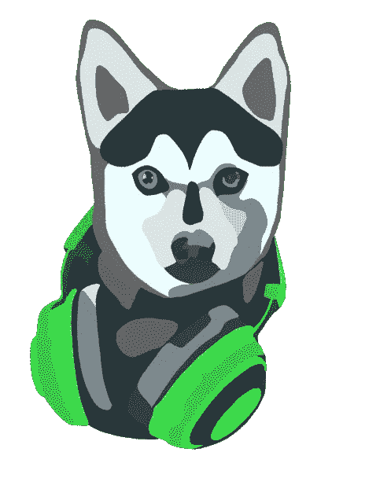

作者图片

# 卷积神经网络

CNN 或卷积神经网络是一种深度学习算法，在学习图像方面做得非常好。

那是因为他们可以学习到 ***平移不变*** 且具有 ***空间层次*** 的模式(F. Chollet，2018)。

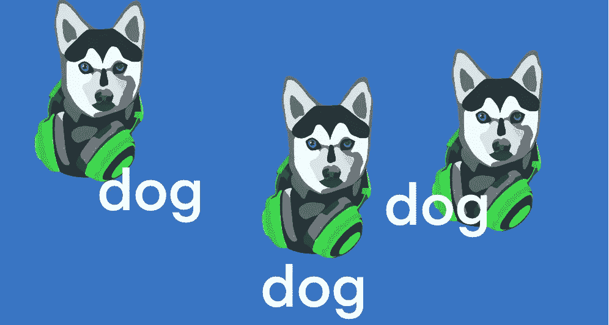

作者图片

也就是说如果如果 CNN 学习了上图左角的狗，那么它就可以识别出另外两张被移动过的图片中的狗( ***平移不变性*** )。

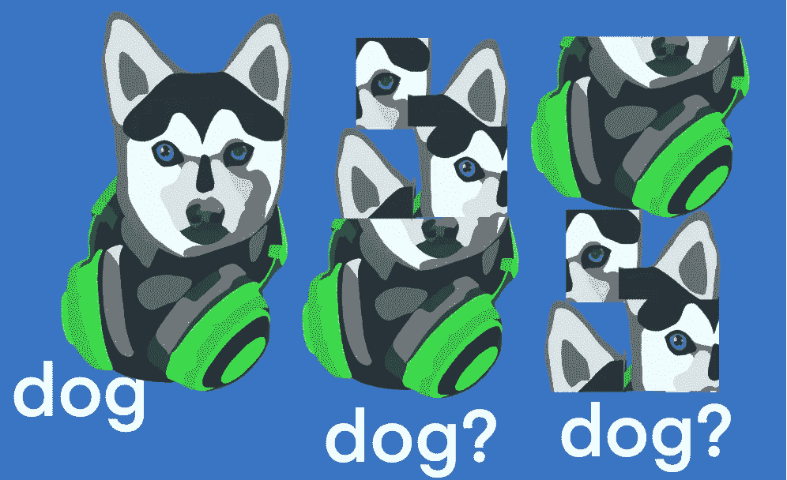

如果 CNN 从上图的左上角学习这只狗，它会在另外两张图片中识别出原始图像的**部分**，因为它已经学习了她患有异色症的眼睛的边缘是什么样子，她狼一样的鼻子和她时尚耳机的形状( ***空间层次*** )。

这些属性使 CNN 成为强大的图像学习者，因为真实世界并不总是看起来完全像训练数据。

# 我能把这个用于音频吗？

**是的。你可以提取看起来像 T21 图像的特征，并以某种方式塑造它们，以便将它们输入 CNN。**

# 本文解释了如何训练 CNN 根据音频信息对物种进行分类。

这个例子的数据是来自 Kaggle 竞赛[雨林连接物种音频检测](https://www.kaggle.com/c/rfcx-species-audio-detection/data)的鸟和青蛙的录音。

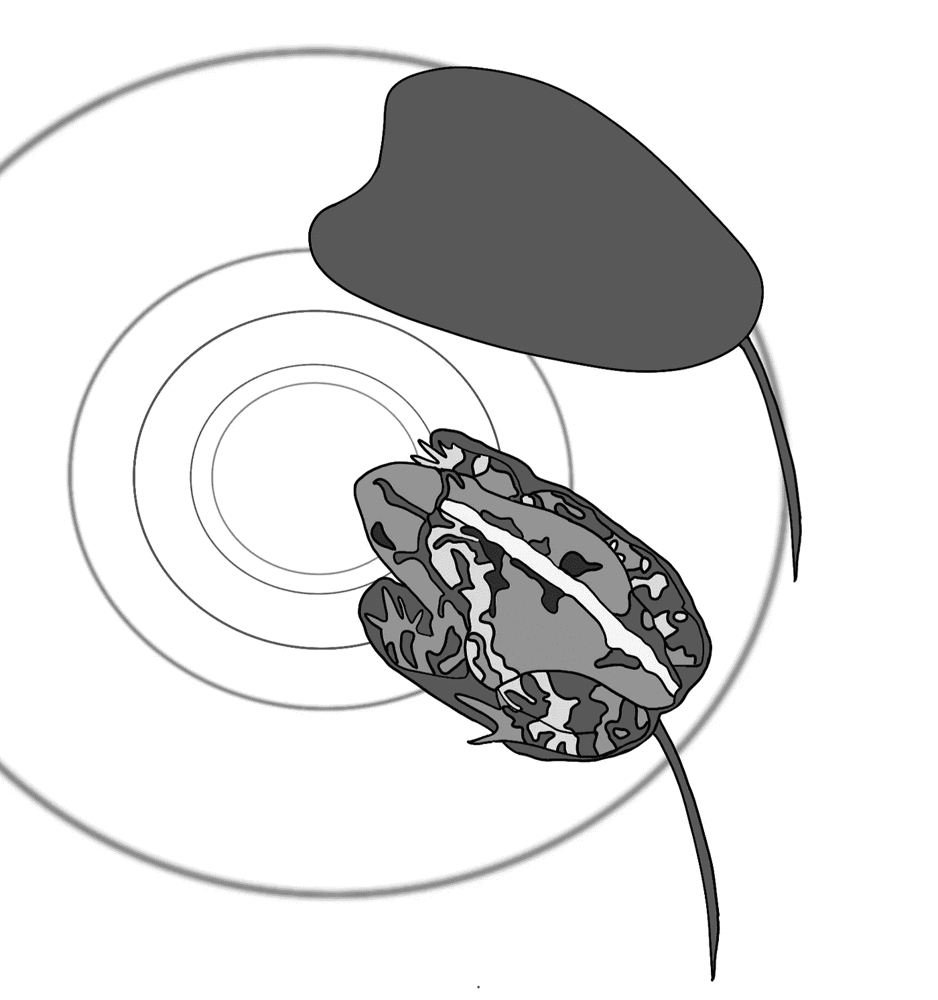

作者图片

首先，加载必要的输入:

```
import pandas as pd
import os
import librosa
import librosa.display
import matplotlib.pyplot as plt
from sklearn.preprocessing import normalize
import warnings
warnings.filterwarnings('ignore')
import numpy as np
import pickle
import joblib
from sklearn.model_selection import train_test_split
from tensorflow.keras import models, layers
import tensorflow as tf
```

然后是数据帧:

```
os.chdir('/kaggle/input/rfcx-species-audio-detection')
df = pd.read_csv('train_tp.csv')
```

该数据集是一个 csv 文件，音频文件的名称列在 recording_id 下，标签列在 species_id 下，音频样本的开始/结束列在 t_min 和 t_max 下:

```
df.head()
```

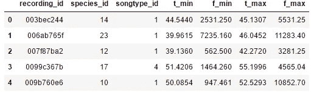

使用 [librosa](https://librosa.org/doc/latest/index.html) 包加载并显示一个音频文件，如下所示:

```
sample_num=3 #pick a file to display
#get the filename 
filename=df.recording_id[sample_num]+str('.flac')
#define the beginning time of the signal
tstart = df.t_min[sample_num] 
tend = df.t_max[sample_num] #define the end time of the signal
y,sr=librosa.load('train/'+str(filename)) #load the file
librosa.display.waveplot(y,sr=sr, x_axis='time', color='cyan')
```

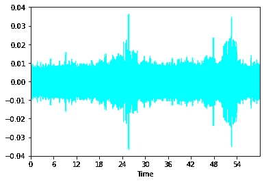

# 棘手的部分

CNN 期待一个图像:

*   灰度图像(1 个通道)
*   具有三个通道的彩色图像:红色、绿色和蓝色(RGB)

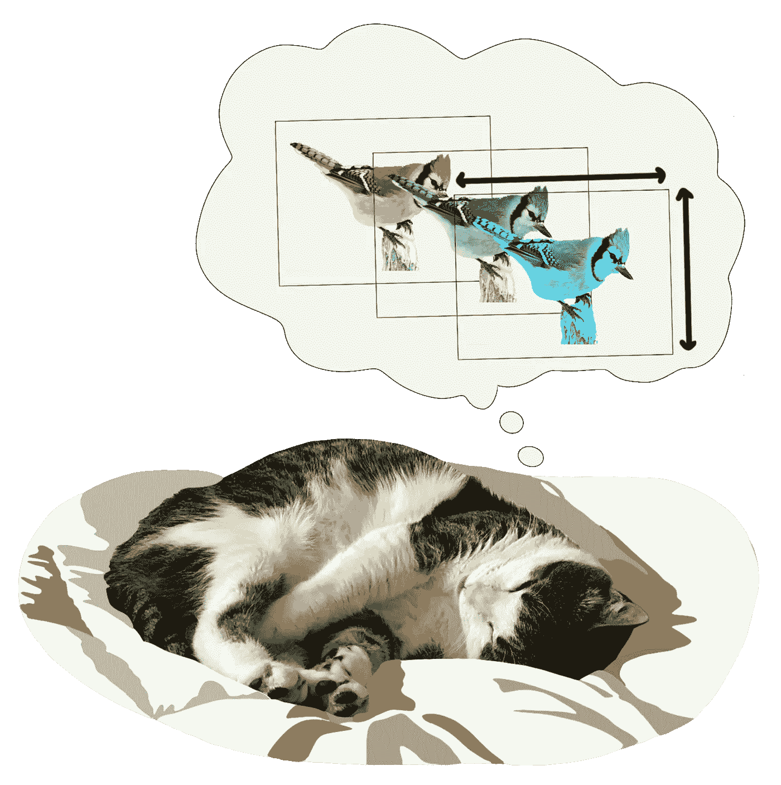

作者图片

所以你必须让你的音频特征看起来像图像。

*   为灰度图像(一个要素)选择 1D，或为彩色图像(表示多个要素)选择 3D。
*   缩放和填充音频功能，使每个“通道”大小相同。

```
#This code was adapted from Nicolas Gervais on [https://stackoverflow.com/questions/59241216/padding-numpy-arrays-to-a-specific-size](https://stackoverflow.com/questions/59241216/padding-numpy-arrays-to-a-specific-size) on 1/10/2021def padding(array, xx, yy):
    """
    :param array: numpy array
    :param xx: desired height
    :param yy: desirex width
    :return: padded array
    """h = array.shape[0]
    w = array.shape[1]a = max((xx - h) // 2,0)
    aa = max(0,xx - a - h)b = max(0,(yy - w) // 2)
    bb = max(yy - b - w,0)return np.pad(array, pad_width=((a, aa), (b, bb)), mode='constant')
```

## 难道我不能把我的音频特征分成三等份，重新塑造成 3D 形状吗？

它们毕竟只是数字。

**号**它必须使视觉**感知**。垃圾进，垃圾出。

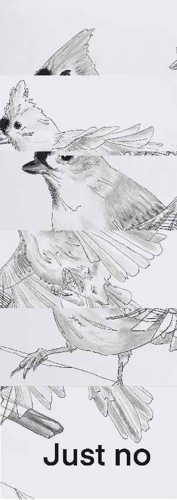

作者图片

## 建模的特征

Librosa 有关于如何提取特征的很棒的教程[在这里](https://librosa.org/doc/latest/tutorial.html)。

对于这个例子，我将计算:

*   梅尔谱图( [MFCCs](https://librosa.org/doc/latest/generated/librosa.feature.melspectrogram.html) )
*   [光谱带宽](https://librosa.org/doc/latest/generated/librosa.feature.spectral_bandwidth.html)
*   [光谱质心](https://librosa.org/doc/latest/generated/librosa.feature.spectral_centroid.html#librosa.feature.spectral_centroid)
*   色度图
*   短时傅立叶变换( [stft](https://librosa.org/doc/latest/generated/librosa.stft.html#librosa.stft) )

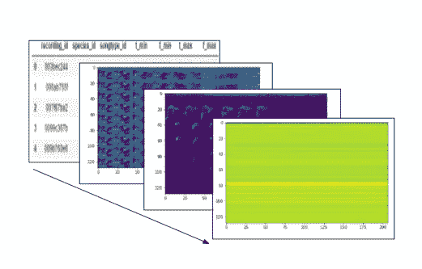

输入到 CNN 的 3D 图像是 4D 张量

第一个轴是音频文件 id，代表 tensorflow-speak 中的批处理。在这个例子中，第二轴是光谱带宽、质心和色谱图，其被重复、填充并适合第三轴(stft)和第四轴(MFCCs)的形状。

```
#The eventual shape of the features
print(X_train.shape,X_test.shape)
```


第一轴 1226 是批量大小，128 是高度，1000 是宽度(由下面代码中的 **max_size** 设置), 3 是训练数据中的通道数。如果我有 1226 个音频文件，那么批量大小是 1226。如果我们只提取 dataframe.head()图中所示的 5 个音频文件的特征，则输入的形状将是 5×128×1000×3。如果您想在训练时[使用更少的内存，您可以减小批量大小。对于这个例子，批量大小被设置为音频文件的数量。](https://stats.stackexchange.com/questions/153531/what-is-batch-size-in-neural-network)

```
def generate_features(y_cut):
    **max_size**=1000 #my max audio file feature width
    stft = padding(np.abs(librosa.stft(y_cut, n_fft=255, hop_length        = 512)), 128, max_size)
    MFCCs = padding(librosa.feature.mfcc(y_cut, n_fft=n_fft, hop_length=hop_length,n_mfcc=128),128,max_size)
    spec_centroid = librosa.feature.spectral_centroid(y=y_cut, sr=sr)
    chroma_stft = librosa.feature.chroma_stft(y=y_cut, sr=sr)
    spec_bw = librosa.feature.spectral_bandwidth(y=y_cut, sr=sr) #Now the padding part
    image = np.array([padding(normalize(spec_bw),1, max_size)]).reshape(1,max_size)
    image = np.append(image,padding(normalize(spec_centroid),1, max_size), axis=0) #repeat the padded spec_bw,spec_centroid and chroma stft until they are stft and MFCC-sized
    for i in range(0,9):
        image = np.append(image,padding(normalize(spec_bw),1, max_size), axis=0)
        image = np.append(image, padding(normalize(spec_centroid),1, max_size), axis=0)
        image = np.append(image, padding(normalize(chroma_stft),12, max_size), axis=0)
    image=np.dstack((image,np.abs(stft)))
    image=np.dstack((image,MFCCs))
    return image
```

以下三个特征被挤压、填充和重复…

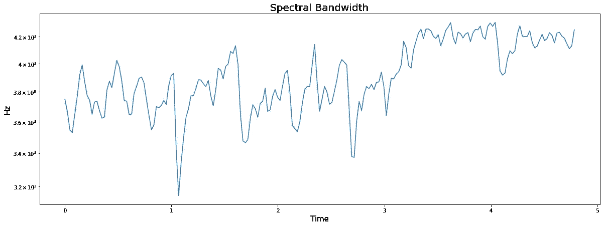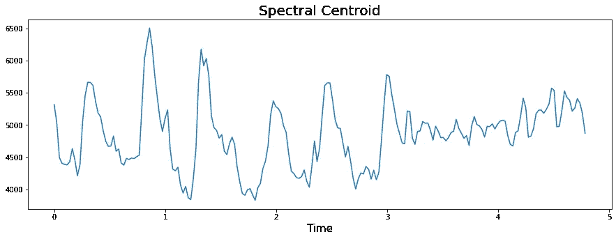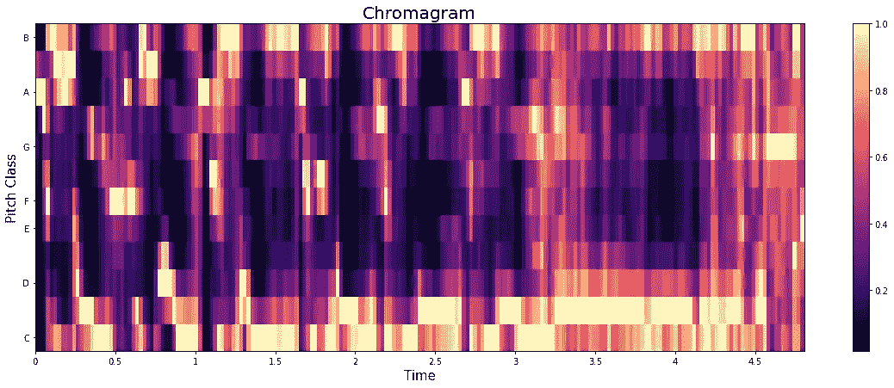

…进入以下轴:

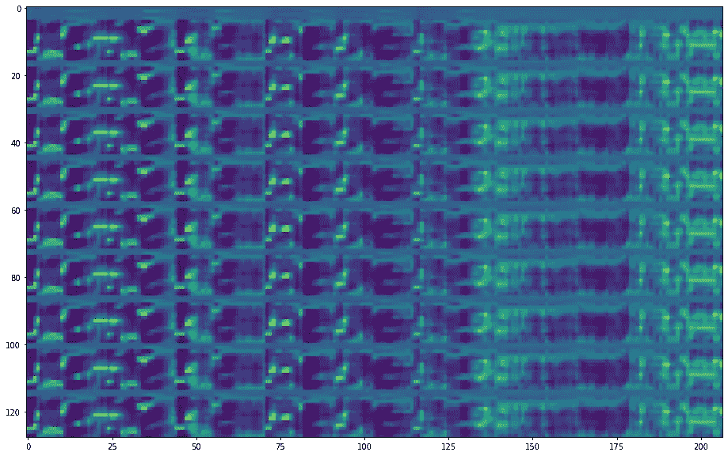

第二轴

最后两个轴被设计成相同的形状:

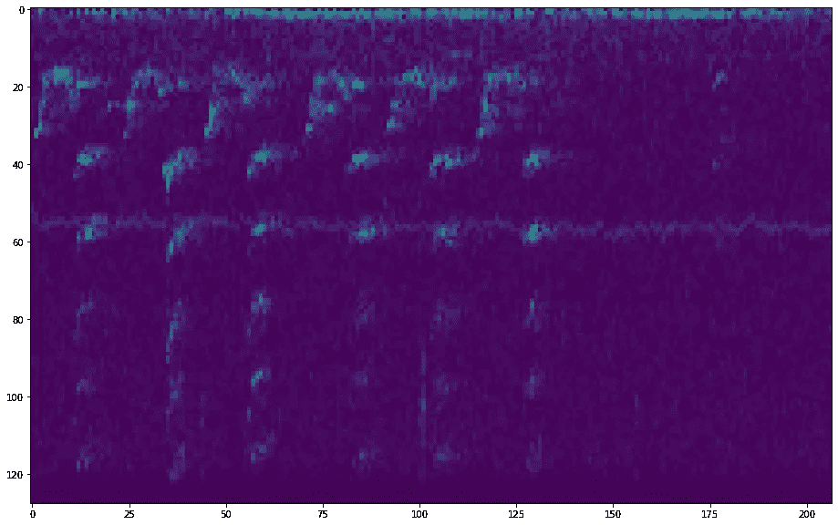

stft

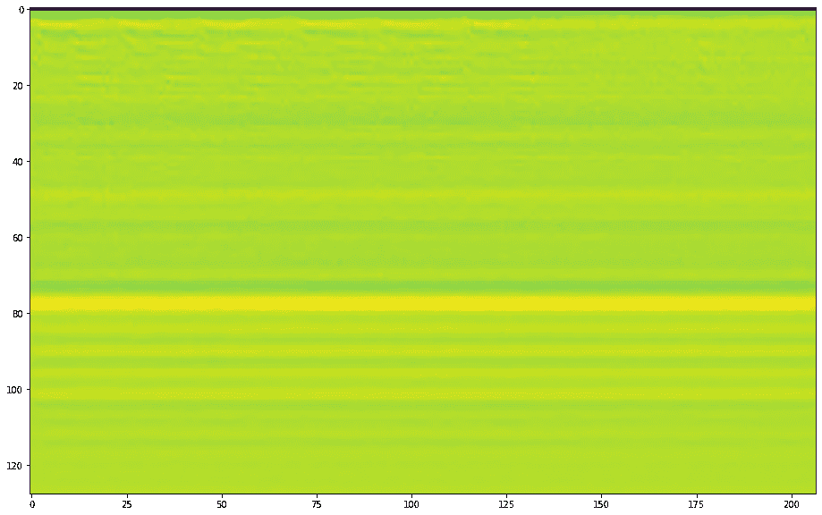

MFCCs

## 我必须计算这些完全相同的特征吗？

**否**。只要你把它们垫成同样的形状，就用建模中效果最好的。

```
X=df.drop('species_id',axis=1)
y=df.species_id
```

## 提取训练集、测试集和验证集

```
#Split once to get the test and training set
X_train, X_test, y_train, y_test = train_test_split(X, y, test_size=0.25, random_state=123, stratify=y)
print(X_train.shape,X_test.shape)
```

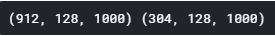

```
#Split twice to get the validation set
X_train, X_val, y_train, y_val = train_test_split(X_train, y_train, test_size=0.25, random_state=123)
print(X_train.shape, X_test.shape, X_val.shape, len(y_train), len(y_test), len(y_val))
```

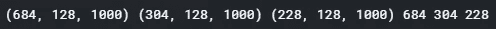

为每个音频文件计算这些特征，并存储为特征和标签:

```
**def** get_features(df_in):   
    features=[]     
    labels = [] *#empty array to store labels*     
    *#For each species, determine how many augmentations are needed
*    df_in=df_in.reset_index()     
    **for** i **in** df_in.species_id.unique():
           print('species_id:',i)    
           *#all the file indices with the same species_id*     
           filelist = df_in.loc[df_in.species_id == i].index         
    **for** j **in** range(0,len(filelist)):             
           filename = df_in.iloc[filelist[j]].recording_id
            +str('.flac') *#get the filename*   
            *#define the beginning time of the signal*          
            tstart = df_in.iloc[filelist[j]].t_min             
            tend = df_in.iloc[filelist[j]].t_max *#end of signal
*            recording_id = df_in.iloc[filelist[j]].recording_id
            species_id = i
            songtype_id = df_in.iloc[filelist[j]].songtype_id   
            *#Load the file
    *        y, sr = librosa.load(filename,sr=28000)  
            *#cut the file to signal start and end*  
            y_cut=y[int(round(tstart*sr)):int(round(tend*sr))]  
            *#generate features & output numpy* *array*          
            data = generate_features(y_cut) 
            features.append(data[np.newaxis,...])    
            labels.append(species_id)     
     output=np.concatenate(features,axis=0)     
     **return**(np.array(output), labels)#use get_features to calculate and store the features
test_features, test_labels = get_features(pd.concat([X_test,y_test],axis=1))
train_features, train_labels = get_features_noOS(pd.concat([X_train,y_train],axis=1))
```

## 将数据规范化并转换为 numpy 数组

```
X_train = np.array((X_train-np.min(X_train))/(np.max(X_train)-np.min(X_train)))
X_test = np.array((X_test-np.min(X_test))/(np.max(X_test)-np.min(X_test)))
X_train = X_train/np.std(X_train)
X_test = X_test/np.std(X_test)
y_train = np.array(y_train)
y_test = np.array(y_test)
```

# 创建一个 CNN

在下面的示例模型中，2D **卷积层** (Conv2D)单元是学习*平移不变空间模式*及其*空间层次的部分。*

**最大池** **图层**通过将特征地图缩减采样至窗口内的最大值，将特征地图的大小减半。为什么要缩减采样？因为否则它会导致一个巨大数量的参数，你的计算机会崩溃，毕竟，模型会大规模地过度拟合数据。这种神奇的层是 CNN 能够处理图像中大量数据的原因。最大池对模型有好处。

**剔除** **层**通过将一部分数据的权重随机设置为零来防止过度拟合，而**密集**单元包含与模型必须尝试拟合数据的自由度相关的隐藏层。数据越复杂，模型需要的自由度就越多。*注意* *不要添加一堆这样的东西，否则会过度拟合数据*。

**展平层**将所有特征地图信息压缩成一列，以便输入到密集层，最后一层输出模型应该将音频记录分类到的 24 个种类。

## CNN 模型架构示例

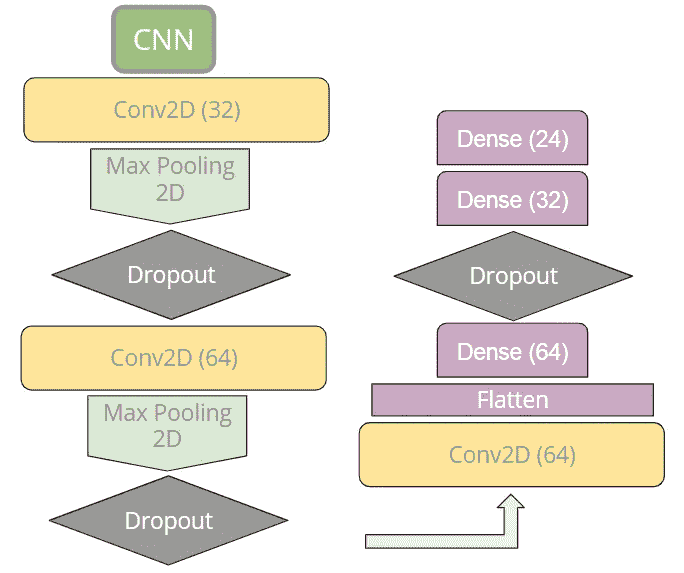

作者图片

## 在 tensorflow 中，您可以像这样创建上面的模型

```
input_shape=(128,1000,3)
CNNmodel = models.Sequential()
CNNmodel.add(layers.Conv2D(32, (3, 3), activation='relu', input_shape=input_shape))
CNNmodel.add(layers.MaxPooling2D((2, 2)))
CNNmodel.add(layers.Dropout(0.2))
CNNmodel.add(layers.Conv2D(64, (3, 3), activation='relu'))
CNNmodel.add(layers.MaxPooling2D((2, 2)))
CNNmodel.add(layers.Dropout(0.2))
CNNmodel.add(layers.Conv2D(64, (3, 3), activation='relu'))
CNNmodel.add(layers.Flatten())
CNNmodel.add(layers.Dense(64, activation='relu'))
CNNmodel.add(layers.Dropout(0.2))
CNNmodel.add(layers.Dense(32, activation='relu'))
CNNmodel.add(layers.Dense(24, activation='softmax'))
```

**激活**功能赋予模型向模型添加非线性的能力。这里使用了 **relu** 函数，它将负权重清零。你可以在这里阅读其他激活功能[，但这是一个很好的开始。最后一个**密集**层的激活函数类型是 **softmax** ，它为每个类输出一个概率。](https://www.tensorflow.org/api_docs/python/tf/keras/activations)

## 编译模型

```
CNNmodel.compile(optimizer='adam',loss=tf.keras.losses.SparseCategoricalCrossentropy(from_logits=False),metrics=['accuracy'])
```

[**Adam**](https://arxiv.org/abs/1412.6980) 优化器为您管理学习率， **loss** 函数用于评估预测数据和实际数据的差异，并对预测不佳的模型进行惩罚。在这个例子中，损失函数是**SparseCategoricalCrossentropy**，当每个样本属于一个标签时使用[，而不是一个以上，**和**它不是二元分类。这是一个合适的选择，因为每个音频样本属于一个物种，而它们有 24 个。](https://datascience.stackexchange.com/questions/41921/sparse-categorical-crossentropy-vs-categorical-crossentropy-keras-accuracy#:~:text=Use%20sparse%20categorical%20crossentropy%20when,0.5%2C%200.3%2C%200.2%5D).)

## 符合模型

```
history = CNNmodel.fit(X_train, y_train, epochs=20, validation_data= (X_val, y_val))
```

## 为了避免过度拟合，从最简单的模型开始，一步步向上

这是因为如果模型过于复杂，它将准确地学习你的训练数据，而无法推广到看不见的数据。

试试这个:

```
input_shape=(128,1000,3)
CNNmodel = models.Sequential()
CNNmodel.add(layers.Conv2D(32, (3, 3), activation='relu', input_shape=input_shape))
CNNmodel.add(layers.MaxPooling2D((2, 2)))
CNNmodel.add(layers.Flatten())
CNNmodel.add(layers.Dense(32, activation='relu'))
CNNmodel.add(layers.Dense(24, activation='softmax'))
CNNmodel.summary()
```

注意:这个模型太简单了，根本无法预测数据*(如个位数精度)。*

## 接下来，添加层，直到你的模型已经开始适应数据。

# 评估您的模型训练和验证集

1.  注意训练集和测试集之间的性能差异。如果训练集表现明显更好，它不会很好地推广到看不见的数据。
2.  如果验证集的性能开始下降，停止迭代。

```
#Adapted from Deep Learning with Python by Francois Chollet, 2018
history_dict=history.history
loss_values=history_dict['loss']
acc_values=history_dict['accuracy']
val_loss_values = history_dict['val_loss']
val_acc_values=history_dict['val_accuracy']
epochs=range(1,21)
fig,(ax1,ax2)=plt.subplots(1,2,figsize=(15,5))
ax1.plot(epochs,loss_values,'bo',label='Training Loss')
ax1.plot(epochs,val_loss_values,'orange', label='Validation Loss')
ax1.set_title('Training and validation loss')
ax1.set_xlabel('Epochs')
ax1.set_ylabel('Loss')
ax1.legend()
ax2.plot(epochs,acc_values,'bo', label='Training accuracy')
ax2.plot(epochs,val_acc_values,'orange',label='Validation accuracy')
ax2.set_title('Training and validation accuracy')
ax2.set_xlabel('Epochs')
ax2.set_ylabel('Accuracy')
ax2.legend()
plt.show()
```

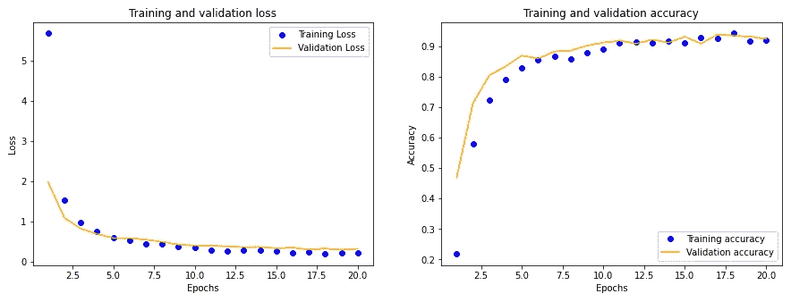

# 结束语

现在，您知道了如何创建用于音频分类的 CNN。从简单的模型开始，然后添加层，直到您开始看到训练数据的表现优于测试数据的迹象。添加 Dropout 和 Max 池层以防止过度拟合。最后，当您注意到与训练数据相比，验证数据的性能下降时，停止迭代。

# 快乐造型！

## 来源

**萨卡尔，迪潘坚** (2021)个人通信。

**Chollet，F.** 用 Python 进行深度学习(2018)，v. 361，纽约州:曼宁。

**Gervias，Nicolas，** (2021) 代码摘自[https://stack overflow . com/questions/59241216/padding-numpy-arrays-to-a-specific-size](https://stackoverflow.com/questions/59241216/padding-numpy-arrays-to-a-specific-size)，2021 年 1 月 10 日检索。

**frenzykryger**(2021)[https://data science . stack exchange . com/questions/41921/sparse-category-cross entropy-vs-category-cross entropy-keras-accuracy #:~:text = Use % 20 sparse % 20 category % 20 cross entropy % 20 when，0.5%2C%200.3%2C%200.2%5D](https://datascience.stackexchange.com/questions/41921/sparse-categorical-crossentropy-vs-categorical-crossentropy-keras-accuracy#:~:text=Use%20sparse%20categorical%20crossentropy%20when,0.5%2C%200.3%2C%200.2%5D) ，2021 年 2 月 21 日检索