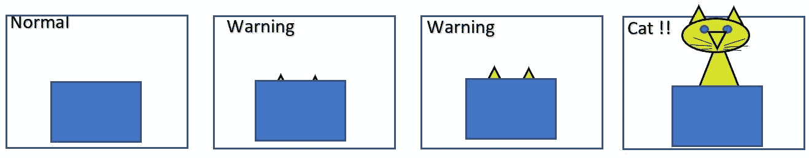
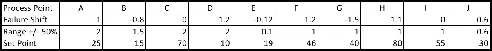
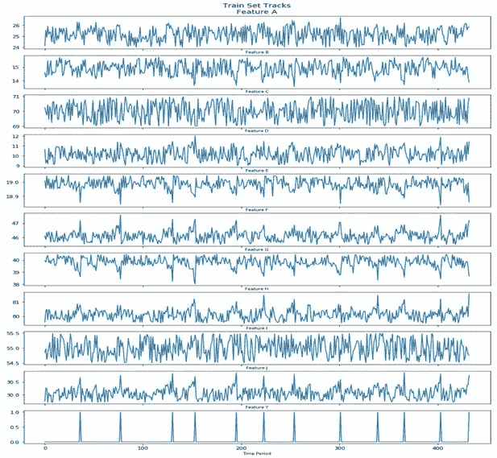
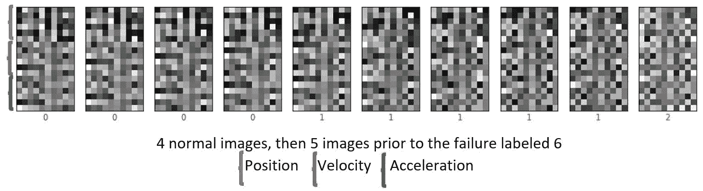
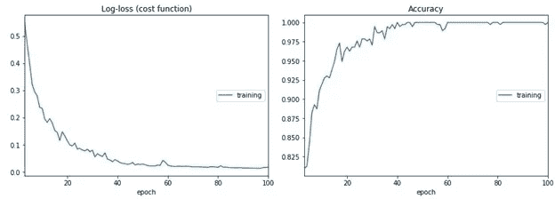
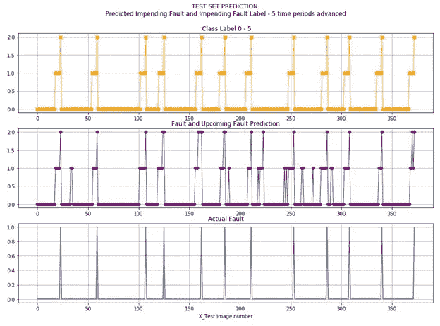
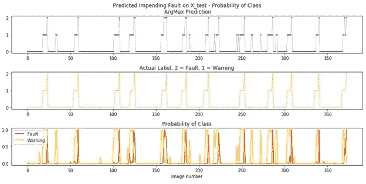

# 美国有线电视新闻网预测过程故障

> 原文：<https://towardsdatascience.com/cnns-to-predict-process-failures-28c17e5fd6c2?source=collection_archive---------9----------------------->

作者的“盒子里的猫”图片

**原型——在单个图像中堆叠多个时间片并分类:正常、警告或故障**

这是一个探索应用 CNN 预测过程中系统故障可能性的原型。目标不是对故障进行分类，而是将一组当前和过去的时间片分类为未来故障的指示。

在我开始之前，请注意，这是作为一个概念/原型提出的，以测试 CNN 模型是否能够合理地预测工业系统中即将发生的故障。我确实将它应用于造纸机故障数据集，我将在下一篇文章中讨论。这不是“成为全部，结束全部”或最先进的人工智能应用程序。我在这里展示它是为了启发他人，给数据科学的新手提供另一个“项目”来修补，并可能从经验丰富的从业者那里激发一些想法。

我第一次想到这一点是在一次使用时间 CNN (TCN)模型的 meetup(深度学习研究金)会议上讨论一篇论文时(白、J 科尔特和弗拉德伦科尔顿，“序列建模的一般卷积和递归网络的实证评估”，arXiv:1803.01271，2018)。那篇论文评估了一个通用的 TCN 来回顾过去并预测未来或下一个状态。

我的申请更简单。目标是将几个时间片的数据整理成图像，即过去和当前状态的快照，并假设故障前几个时间段的过程偏差不同于正常操作，从而发出警告—黄灯。目的不是对故障和正常情况进行分类，而是对“即将发生的故障”进行分类。警告可能有几种类型。(参考下面的“盒子里的猫”,警告可以是在猫跳出盒子之前竖起耳朵、爪子或尾巴。)

为此，每个时间片被转换成图像中的一行像素，多个时间由不同的像素行表示。第一幅图像的时间段为 0 到 n，下一幅图像的时间段为 1 到 n+1，依此类推。如果没有显著的偏差发生，那么每个图像将是相似的，只是有一些变化(噪声)。如果流程连续偏离故障点，图像可能会改变，从而提供即将发生故障的警告。想想“盒子里的杰克”或“盒子里的猫”。在猫跳出来之前，我们能看到它的耳朵从盒子里伸出来吗？

作者图片

为什么要这么做？工业系统依靠过程控制运行。这些使系统在参数范围内运行。然而，系统关闭了。排除其他因素，如手动关闭或设备故障，扰乱仍会发生。识别即将发生的故障可以给操作人员留出时间来防止故障。此外，以这种方式分析一个过程可以提供对为什么或什么样的事件组合会导致不良事件的洞察。

综合数据准备

我从 Excel 开始，做了 10 个流程变量。每个变量都有一个正常的设定点和一个围绕这个设定点的随机方差。大多数变量会在故障点之前和故障点处偏离。这些是根据故障在未来多长时间内发生而定的。请记住，我是在创建它，只是在某个随机的时间将一个失败标志设置为 1，然后从那里返回一个小于 1 的值。正常操作为 0。

这是我用来创建轨迹的参数。每个点随机变化，从-0.5 到+0.5 倍的范围值加上故障位移乘以导致故障的故障规模(如下)。一些轨道不随故障而改变，而其他轨道以不同的百分比改变。在故障之前，范围偏移和故障偏移的组合值并不总是在正常范围之外，因为这些值可能具有相反的符号。如果它们都是正的或都是负的，则过程值可能会在正常范围的边缘或外部。

合成数据参数-作者图片

400+离散时间的随机生成的合成数据如下所示。它可能看起来是大幅度波动的高频，但那是每个轨迹图上的小范围。系统故障点是底部轨道中的尖峰(特征 Y)。

训练集轨迹值和故障点(特性 Y)如下所示。测试集是在不同时间失败的 Excel 模型的另一个随机实现。它是不同的，但在相同的参数定义内。

要素 A 至 J 和故障点(要素 Y)的数据轨迹-按作者分类的图像

准备数据和图像

在之前的试验中，我只是使用了位置数据，然后添加了一个导数(值的变化率，例如速度)，最后合并了一个二阶导数，这样就相当于位置、速度和加速度的轨迹值。速度和加速度表是通过计算单位时间的差值来创建的。在故障为 1 和故障为 2 之前，我将正常状态标记为 0，5 时间片。

图像准备包括将数据缩放到 0 到 1 的范围内，并将前 6 个周期(0–5)的数据移动到一个 3-D Numpy 数组中，从而将它们分配给一幅图像。在每个图像中，位置、速度和加速度时间片值被堆叠在一起。对于 18x10 像素的图像，图像行为:0 至 5-位置、6 至 11-速度和 12 至 17-加速度。时间段 1-6 填充了第二个图像，依此类推。每个图像通过对应于该图像中最后一个时间片的标签进行分类。一旦故障时间片成为图像中的最后一行，就通过从故障时间片之后的下 6 个时间段开始构建下一个图像来重复该过程。

接下来，他们被重塑，并通过一个 CNN 模型进行训练。对我们来说，它看起来不像猫，也不像猫耳朵，但 CNN 模型可以区分这些图像。以下是这些图像序列的摘录。

具有六个时间段的示例图像—按作者分类的图像

培养

训练类似于 MNIST 手写数字或时尚 MNIST。我使用了一个顺序 CNN 模型，其中有 *Conv2D* 、 *MaxPooling* 、 *Flatten layers* 馈入一个*三层*128–64–3 网络和一个*漏层*。详情可以在 Github [这里](http://Process-Fault-Identification-with-CNN/Simulated Process Fault Prediction with Vel and Accel-3Class.ipynb at main · dvbckle/Process-Fault-Identification-with-CNN · GitHub)找到。

CNN 模型训练—作者图片

结果

测试结果如下图所示。实际类标签显示在顶部，预测类显示在中间，以便与其他两个进行比较。

作者图片

下一个图表在顶部显示预测，在中间显示类别标签，在底部显示警告或故障类别的概率，用于将概率与类别标签进行比较。

作者图片

这表明有足够的希望将这种方法应用到造纸机的实际数据集，这将是另一篇文章的主题。要探索的一个变化是只在正常和警告类上训练，因为识别故障或停止为时已晚，不需要。目标是防止停工。

*此处包含的方法的使用或应用由读者自行承担风险。作者对读者的申请不负任何责任。*

欢迎大家的评论。

#数据科学# CNN #机器学习#预测#原型#过程失败