# R 中的粗化精确匹配

> 原文：<https://towardsdatascience.com/coarsened-exact-matching-in-r-a36ae7ef6849?source=collection_archive---------11----------------------->


由 [Geran de Klerk](https://unsplash.com/@gerandeklerk?utm_source=medium&utm_medium=referral) 在 [Unsplash](https://unsplash.com?utm_source=medium&utm_medium=referral) 拍摄的照片

## 数据科学基础

## 匹配的因果推理

我们不是都听过“相关性并不意味着因果关系”这句话，并想知道“那么，什么意味着因果关系”？嗯，因果推断。因果推理使我们能够得出关于因果影响的结论，从而做出重要的决策，并提供有价值的数据驱动的见解。因此，了解因果推断的基础知识对于数据科学家和分析师来说是一项巨大的投资。粗化精确匹配(CEM)是一种从观察数据进行因果推断的简单而直观的方法。这篇文章通过一个在 r 中使用`MatchIt`库的例子展示了 CEM 背后的基本直觉。


[redcharlie](https://unsplash.com/@redcharlie?utm_source=medium&utm_medium=referral) 在 [Unsplash](https://unsplash.com?utm_source=medium&utm_medium=referral) 上的照片

# 🔍 1.关于 CEM 的一点点

想象一下，我们想要了解治疗对感兴趣的结果的因果影响。我们能做的最简单的事情就是比较治疗组和未治疗组的平均结果。然而，这种比较可能不能给我们一个准确的估计，因为即使在没有治疗的情况下，治疗组和未治疗组的数据也不具有可比性。解决这个问题的一个方法是尝试将这两个组进行比较。这就是 CEM 等匹配技术的用武之地。

在我们开始讨论 CEM 之前，让我们从一种叫做*精确匹配(EM)* 的匹配技术开始。对于 EM，我们匹配处理过的和未处理的记录，这些记录在其协变量中具有完全相同的值。换句话说，这些匹配的记录将具有相同的特征，除了它们的治疗状态。一旦我们完成了所有可能的匹配并丢弃了不匹配的记录，那么匹配数据中的治疗组与未治疗组现在将更具可比性，我们可以分析组均值的差异来推断因果影响。


Neil 和 Zulma Scott 在 Unsplash 上的照片

然而，由于在进行 EM 时没有匹配，许多记录可能被排除在分析之外。例如，如果有许多数字协变量，就很难找到精确的匹配。在这方面，CEM 提供了一个很好的选择。做 CEM 时，有三个主要步骤:

1.  粗化数据以降低粒度级别。这意味着宁滨数值和/或分组类别值。
2.  对粗化的数据应用精确匹配，以找到可比较的对照组和治疗组。这意味着找到至少有一个对照和一个处理记录的协变量的所有组合，并保留属于这些组合的记录，丢弃其余的记录。每个组合被称为*地层*。
3.  使用匹配的数据估计因果影响。

了解了 CEM 背后的基本直觉后，我们可以看到它的名字是多么有信息量。让我们看一个简单的例子来更好地理解这项技术。

# 📍 2.R 中带有 MatchIt 的 CEM 示例

让我们导入必要的库并加载数据集。我们将使用 [Lalonde 数据集](http://sekhon.berkeley.edu/matching/lalonde.html)的一个小子集来保持事情的易管理性和易监控性。

```
library("dplyr")
library("MatchIt")
library("lmtest")
library("sandwich")
options(scipen = 100, digits=4)# Prepare sample data --------------------
data("lalonde")
set.seed(42)
(df <- lalonde %>% 
    select(treat, educ, race, re78) %>% 
    sample_n(30))
```

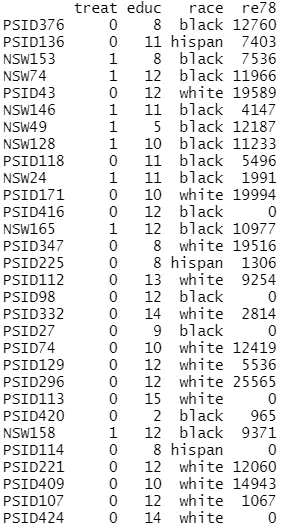

对于 30 个随机选择的记录，我们有以下变量:
◼️ **协变量:** `educ`受教育年限和`race` ◼️ **治疗:** `treat`治疗状态
◼️ **结果:**`re78`1978 年实际收入
让我们假设我们想要理解`treat`对`re78`的因果影响。

我们可以通过指定`method = 'cem’`来用`matchit`执行 CEM:

```
# Perform CEM --------------------
matching1 <- matchit(treat ~ educ + race, data = df, 
                     method = 'cem', estimand = 'ATE')
summary(matching1, un=FALSE)
```

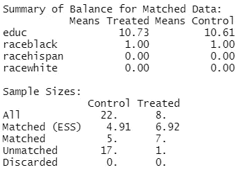

仅部分输出

我们可以看到，有 22 条质控记录可用，但只有 5 条匹配，其余 17 条不匹配，将从分析中删除。对照组匹配记录的有效样本量(`Matched (ESS)`)为 4.91。治疗组也有相同的总结。

现在，让我们看看 12 条匹配记录的匹配数据:

```
# Extract matched data --------------------
(matched_df1 <- match.data(matching1) %>% arrange(subclass, treat))
```

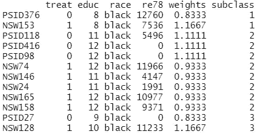

`subclass`显示了 3 个地层。虽然我们在这里看不到粗化的数据，但我们可以从原始值中大致猜出粗化的程度。例如，`subclass` 3 似乎包含有`9–10`年教育和`black`种族的记录。我们可以看到每条记录都增加了权重。我们先来了解一下这些权重是怎么算出来的。

## 📍 2.1.CEM 重量

每个层有两个权重:一个权重用于层中的处理记录，另一个用于控制记录。当计算权重时，我们要确保两件事:
◼️在加权后，治疗组和对照组的比例在总体水平上保持在每个阶层内:

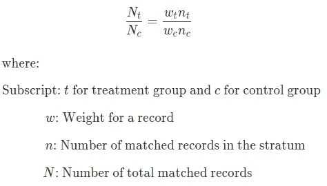

◼️加权数等于阶层内未加权数；

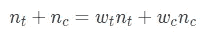

根据我们感兴趣的`estimand`的类型，该公式可以重新排列并简化为以下形式:

🔷**对被治疗者的平均治疗效果(ATT)——**治疗记录不加权(即权重为 1)，对照记录加权:

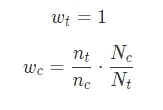

ATT 公式

🔷**对对照的平均处理效果(ATC)——**ATC 也是如此。质控记录不加权，治疗记录加权:

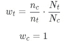

ATC 公式

🔷**平均治疗效果(ATE)——**两组均加权:

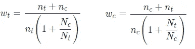

ATE 公式

*如果你想了解 ATT，ATC，ATE，查看本帖* *中* [*的 1.5 节。*](/propensity-score-matching-a0d373863eec)

之前我们明确表示我们有兴趣了解`ATE`。使用公式，让我们以子类 1 的重量为例:

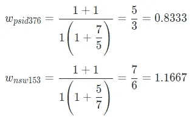

我们自己计算了记录`PSID376`和`NSW153`的权重，以获得与函数返回的权重相同的权重。如果你很热衷，为其他两个类计算权重，巩固你的理解。

我们前面已经看过`Matched (ESS)`。如果你想知道它是如何计算的，这里有一个公式:

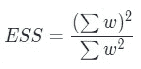

例如，让我们计算匹配对照组的 ESS:

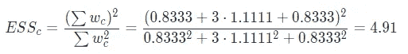

## 📍 2.2.估计因果影响

匹配完记录，就该看看预估的`ATE`:

```
# Estimate causal impact - look at ATE --------------------
model1 <- lm(re78 ~ treat, data = matched_df1, weights = weights)
coeftest(model1, vcov. = vcovCL, cluster = ~subclass)
```

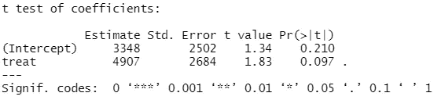

这里可以看到`4907`的估计值及其统计意义。该估计值是各组加权平均值之间的差值:

```
matched_df1 %>% group_by(treat) %>%
  summarise(w_mean = weighted.mean(re78, weights))
```

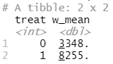

8255–3348 = 4907

我们还可以检查估计值的置信区间:

```
coefci(model1, vcov. = vcovCL, cluster = ~subclass)
```

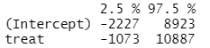

95%置信区间为`-1073`至`10887`。这些输出表明，处理对输出没有统计学上的显著影响。这并不奇怪，因为我们使用的是非常小的玩具数据集。

## 📍 2.3.控制粗化的级别

到目前为止，我们让函数使用其默认的粗化级别:宁滨数值变量使用[斯特奇斯方法](https://rdrr.io/r/grDevices/nclass.html)并保持分类变量不变。然而，在实践中，如果我们能够控制粗化的水平，这将是有用的。我们现在将学习对数字变量使用自定义切割点，对分类变量使用自定义分组。

在应用 CEM 时，为了实现平衡(即，使组具有可比性)，删除一些记录，但是删除太多记录是不可取的。在我们的第一次匹配中，超过一半的记录(即 30 个中的 18 个)被遗漏。让我们尝试减少被排除的记录的数量，同时尝试在每个层中映射相似的记录。

```
# Perform CEM with custom coarsening --------------------
cutpoints <- list(educ = c(8.5, 10.5))
grouping <- list(race = list(c("white", "black"), c("hispan")))
matching2 <- matchit(treat ~ educ + race, data = df, 
                     method = 'cem', estimand = 'ATE',
                     cutpoints=cutpoints, grouping=grouping)
summary(matching2, un=FALSE)
```

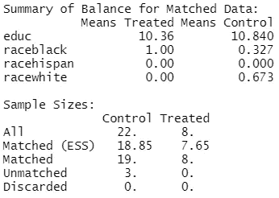

我们使用了两个分界点为`educ`创建了三个箱，并将非西班牙裔种族分组在一起。通过使数据更加粗糙，我们将不匹配记录的数量从 18 个减少到了 3 个。然而，这样做的风险是，在观测值不太可比的同一地层中，包含不太相似的观测值。这意味着我们需要在不排除太多记录和不在层中包含太多不同记录之间找到微妙的平衡。让我们看看匹配的数据，以评估每个地层中的记录有多相似:

```
# Extract matched data
(matched_df2 <- match.data(matching2) %>% arrange(subclass, treat))
```

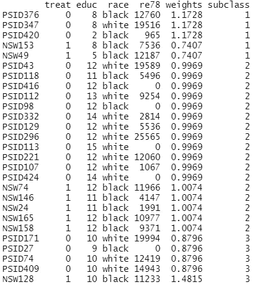

子类中的记录看起来相互之间有可比性吗？这是我们需要评估和必要时重申的，直到我们满意为止。让我们假设我们是快乐的，我们可以继续检查估计:

```
# Estimate causal impact - look at ATE --------------------
model2 <- lm(re78 ~ treat, data = matched_df2, weights = weights)
coeftest(model2, vcov. = vcovCL, cluster = ~subclass)
```

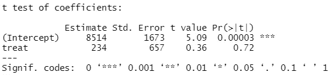

```
coefci(model2, vcov. = vcovCL, cluster = ~subclass)
```

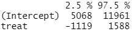

查看该输出后，前面分析的结论保持不变。

在这篇介绍性的文章中，我们学习了 CEM 的基础知识:算法如何工作，如何控制粗化的程度，以及如何分析因果影响。对于热衷于学习的人来说，[这个](https://gking.harvard.edu/files/political_analysis-2011-iacus-pan_mpr013.pdf)和[这个](https://kosukeimai.github.io/MatchIt/reference/method_cem.html)是非常棒的额外资源。我希望您能够使用这种技术为您的利益相关者提供有价值的见解。✨


照片由 [Geran de Klerk](https://unsplash.com/@gerandeklerk?utm_source=medium&utm_medium=referral) 在 [Unsplash](https://unsplash.com?utm_source=medium&utm_medium=referral) 上拍摄

*您想访问更多这样的内容吗？媒体会员可以无限制地访问媒体上的任何文章。如果您使用* [*我的推荐链接*](https://zluvsand.medium.com/membership)*成为会员，您的一部分会费将直接用于支持我。*

感谢您阅读这篇文章。如果你感兴趣，这里有我其他一些帖子的链接:

◼️ [倾向得分匹配](/propensity-score-matching-a0d373863eec) *(因果推断)*
◼️ [解释 Scikit-learn 模型与 SHAP](/explaining-scikit-learn-models-with-shap-61daff21b12a)
◼️️ [K 近邻解释](/k-nearest-neighbours-explained-52c910c035c5)
◼️️ [逻辑回归解释](/logistic-regression-explained-7695f15d1b8b)
◼️️ [比较随机森林与梯度推进](/comparing-random-forest-and-gradient-boosting-d7236b429c15)
◼️️ [决策树是如何建立的？](/how-are-decision-trees-built-a8e5af57ce8?source=your_stories_page-------------------------------------)
◼️️ [管道、柱变压器及特性 Union 说明](/pipeline-columntransformer-and-featureunion-explained-f5491f815f?source=your_stories_page-------------------------------------)

再见🏃 💨