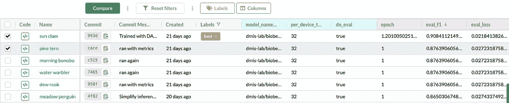
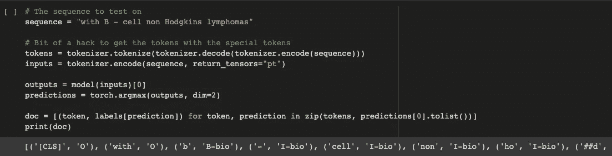
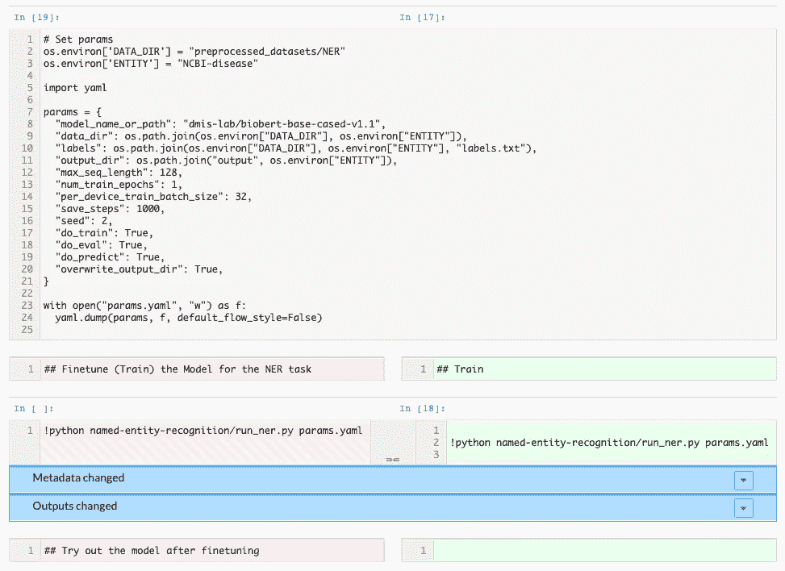

# 从代码到生产就绪的机器学习，4 个步骤

> 原文：<https://towardsdatascience.com/code-to-production-ready-machine-learning-in-4-steps-b8cfc84e8d97?source=collection_archive---------36----------------------->

## 我们如何将数据科学代码库转变为数据和模型版本化、实验跟踪的项目，为生产做好准备


在 [Unsplash](https://unsplash.com?utm_source=medium&utm_medium=referral) 上由 [C Dustin](https://unsplash.com/@dianamia?utm_source=medium&utm_medium=referral) 拍摄的照片

# TL；速度三角形定位法(dead reckoning)

我们将从 GitHub 获取一个纯代码的机器学习项目，并展示如何添加:

*   使用 DVC 和 DAGsHub 的数据和模型版本控制
*   使用 DAGsHub Logger 以人类可读的格式进行实验跟踪
*   允许任何人试验模型的笔记本

如果你想直接看到结果，请查看 [BioBERT DAGsHub repo](https://dagshub.com/Dean/BioBERT-DAGsHub/) 。

使用你在网上找到的机器学习项目很难，尤其是如果你想在生产中使用它们。在很大程度上，这是因为您需要将项目包含的所有信息拼凑在一起。你通常从 GitHub 上的一些代码开始。然后，您必须找到对模型进行训练和评估的数据、使用的参数以及模型实现的结果。这通常是在没有明确方法的情况下完成的，即在您自己的示例中尝试该模型，以确保它按预期工作。

直到最近，解决这些问题还是一项艰巨的任务，需要创建者同步多个平台，以使一切触手可及。现在情况不再是这样了。您可以将项目从纯代码项目转变为生产就绪的 ML 项目，使用:

1.  数据版本控制
2.  模型版本控制
3.  实验跟踪
4.  交互式推理——加载模型并让您进行实验的笔记本

全部使用开源工具。也许与直觉相反，这真的很容易做到。在这篇文章的最后，我将向你展示我是如何改造这样一个项目的，并且在这个过程中实现了数据浏览、区分和共享、实验可视化，甚至笔记本区分。

# 一个你永远无法使用的伟大项目

GitHub 上有许多数据科学项目，但当您在寻找可以在项目中使用的东西或想要修改结果时，通常不会找到您需要的所有东西。毕竟，一个完整的数据科学项目不仅包括代码，还包括数据、模型、实验和管道。通常，你最终会花费大量的时间来修补这些组件，并且让事情正常工作变得非常痛苦。这意味着数据科学项目被忽视，甚至更糟，从零开始重新实施。我们有更重要的事情要做。

将所有这些组件都放在一个地方，可以更容易地在所需的上下文中共享我们的数据科学项目，与其他人合作，并提高工作效率。

> *我们将把我们的项目从目前的状态提升为一个开源的* ***代码*** *项目，* ***到一个*** [***开源数据科学***](https://dagshub.com/blog/a-case-for-open-source-data-science/) ***项目*** *。*

现在，你可能会说:*“这当然是我们想要的。我们看不到这种情况发生的原因是，这非常难以实现。”有了今天的工具，那就不再是问题了。*

# 项目背景

我们开始这个项目是作为合作努力的一部分，在 ML 方面，重点是从医学文本中分析和提取信息。目标是了解临床试验是如何进行的。

因此，我们对医学文本的语言模型感兴趣，特别是 NER。我们搜索了互联网，选择了 BioBERT 作为一个好的起点。该模型具有良好的效果，似乎相对容易使用。

当我们找到 [GitHub BioBERT 项目](https://github.com/dmis-lab/biobert-pytorch)时，我们有所有的代码，我们有一个[脚本来下载数据](https://dagshub.com/Dean/BioBERT-DAGsHub/src/master/download.sh)，这是使用`wget`从一些谷歌文档中完成的，我们有 4 个文件夹，其中 3 个用于模型可以执行的每个任务 done(命名实体识别)、QA(问题回答)和 RE(关系提取)。嵌入本身也有一个文件夹。每个文件夹都包含预处理数据的代码，并为该任务训练模型。每个文件夹中的自述文件包括结果。

不错的开始，但是我们想要更多。

一件更难重现的事情(根据定义)，也是我们在这篇文章中不会关注的，是该项目的实验历史。我们希望看到哪些实验没有成功，就像我们希望看到那些成功的实验一样——想象一下，尝试一种方法，然后发现，有人已经尝试过了，但没有成功，但从未被记录下来。**获得我们的实验历史的最好方法是从一开始就使用数据&模型版本和实验跟踪**，最好添加一个有意义的提交消息来描述你的实验方法。

# 添加数据版本

第一步是添加要版本化的数据作为项目的一部分。最初，为了获得数据，您必须[运行一个脚本](https://dagshub.com/Dean/BioBERT-DAGsHub/src/e06c7c003f5721d4ae3c0c4d99b63da878ccb698/download.sh)来下载数据集。一种方法是将此转换为 DVC 管道步骤，这将使我们能够更改脚本并自动运行。因为我们想以最简单、最直接的方式来做这件事，所以我们只在本地运行脚本。数据下载到我们的系统后，我们添加了 DVC 要跟踪的文件夹。

下载完数据后，我们的`datasets/`文件夹看起来是这样的:

```
$ ./download.sh 
$ tree datasets -d 
datasets 
├── NER 
│ ├── BC2GM 
│ ├── BC4CHEMD 
│ ├── BC5CDR-chem 
│ ├── BC5CDR-disease 
│ ├── JNLPBA 
│ ├── NCBI-disease 
│ ├── linnaeus 
│ └── s800 
├── QA 
│ └── BioASQ 
└── RE 
    ├── GAD 
    │ ├── 1 
    │ ├── 2 
    │ ⋮ 
    │ 
    └── euadr 
        ├── 1
        ├── 2 
        ⋮34 directories
```

对于模型执行的每个任务(NER、QA、RE)，我们都有一个文件夹，其中包含每个任务的各种数据集。每个文件夹包含一些文件(依赖于任务)，主要是训练集、开发集和测试集。

使用 dvc，我们不需要单独跟踪每个文件，而是可以将整个文件夹视为一个数据集对象，只需在终端中键入:

```
$ dvc add datasets
```

接下来，我们有预处理步骤。这三项任务中的每一项所需的预处理步骤都是不同的。因为在这篇文章中，我们关注的是 NER 任务，我们的预处理脚本位于`named-entity-recognition/`文件夹中。这个脚本所做的是将`.tsv`文件转换成`.txt`文件，然后运行`preprocess.py`脚本，该脚本将数据标记化并将数据保存到标签旁边的文本文件中。这些预处理数据被保存到我们的`preprocessed_datasets/`文件夹中，在适当的任务和数据集文件夹中。在我们这里，那就是`NER/`。在预处理步骤完成后，我们可以通过在终端中键入以下命令来添加预处理后的数据，以便由 DVC 进行跟踪:

```
$ dvc add preprocessed_datasets
```

# 当我更改数据时会发生什么

现在，假设您想要为 RE 任务添加预处理数据。我们要做的是运行预处理步骤，然后代替`dvc add ...`，我们要做:

```
$ dvc commit preprocessed_datasets
```

其次是提交和推送至 Git，然后是 DVC:

```
$ git add . 
$ git commit -m "Updated preprocessed data with RE task" 
$ git push origin master 
$ dvc push -r origin
```

# 定型模型并使其可访问

所以预处理是一个相对“轻量级”的步骤。在这个具体的例子中，我们可以在一台不太强大的计算机上，在合理的时间内完成。**当我们开始训练时，情况就不一定了，如果可能的话，我们希望拿出大枪。因为我们希望这个项目可以被社区访问，那些大家伙就是 Google Colab，它给了我们一个免费的 GPU。我们仍然希望从 DAGsHub 中提取代码和数据，并在训练后将它们与模型一起推回。**

在我们的例子中，我们创建了[这个笔记本](https://dagshub.com/Dean/BioBERT-DAGsHub/src/master/BioBERT_DAGsHub.ipynb)，并提交给我们的项目库。它由以下部分组成:

1.  使用`git pull`和`dvc pull`命令加载代码、数据和模型
2.  在相关生物医学数据集上微调模型
3.  加载模型，并查看它在一些用户提供的示例上的表现。
4.  将所有代码、数据和模型更改提交回我们的 DAGsHub Git 和 DVC 远程。

在最后一节中，我们使用与添加数据相同的命令提交模型:

```
# If this is the first time adding the output folder $ dvc add outputs # If we changed our model $ dvc commit outputs
```

# 轻松添加实验跟踪

我们想补充的最后一点是实验跟踪。正如我在开篇提到的，为历史实验添加这一点很有挑战性，因为如果项目没有从第一天开始记录实验，这些就会丢失。因为我们想让将来的协作更容易，所以我们认为晚添加总比不添加好。

为了做到这一点，我们对运行脚本做了一些小的修改，以便它能够根据[自动记录训练期间的所有指标🤗变形金刚库](https://github.com/huggingface/transformers)，用于微调模型。 [**这里可以看到**](https://dagshub.com/Dean/BioBERT-DAGsHub/diff/master/named-entity-recognition/run_ner.py?compare=272ae85023943124e676ec6896c729930fdf71aa&page=0) 的变化。这将生成一些保存所有实验上下文的`metrics.csv`和`params.yaml`文件。然后，我们将这些文件和我们的代码一起推送到 DAGsHub 存储库中。

现在，当我们对一些新数据或不同参数进行实验时，我们将创建一个可以过滤、共享和比较的实验。这也意味着，如果有人想为项目做贡献，他们会更容易理解我们尝试了什么，什么在起作用，什么需要改进。



实验跟踪有助于我们理解测试了哪些方法。来源:作者

# 模型的交互式推理

我在上面已经提到过，但是我们在笔记本中增加了一个“操场”部分，让任何人都可以加载我们的模型，并在他们可以编辑模型的同一个地方进行测试。[在这里自己尝试一下](https://colab.research.google.com/drive/1E5HMfV8tPO1Jlq8s3vIK-IPrLCg79pZl)。



看看吧！我们的模型基于用户提供的示例进行预测！来源:谷歌 Colab 作者截图

我们认为这对于任何数据科学项目都很重要，尤其是对于那些您想要分享和协作的项目。每个严肃的 OSS 项目都有一个演示，每个严肃的 OSDS 项目也应该有一个。在 ML 中，这可能需要更多的资源，所以演示笔记本是最好的选择。笔记本还有一个额外的好处，那就是让用户改变模型的某些方面，或者测试他们自己的例子，看看模型在哪里可能不工作。

**另一个好处:**如果您决定对模型进行更改，并希望看到您的结果与原始模型的比较，您可以将您的笔记本提交给 DAGsHub，以使用笔记本差异作为我们数据科学拉取请求的一部分。



DAGsHub 上的笔记本差异。来源:作者

# 摘要

🥳祝贺你！如果您在这里成功了，那么您已经成功地将一个数据科学代码报告转换为一个生产就绪的数据科学项目——所有这些都有数据和模型版本、实验跟踪，甚至还有一种在 GPU 机器上训练模型并为合作者演示模型的简洁方法。如果你有任何问题，欢迎加入我们的[不和谐频道](https://discord.gg/pk22NradY4)。如果你正在转换一个项目，让我知道，我很乐意帮忙。