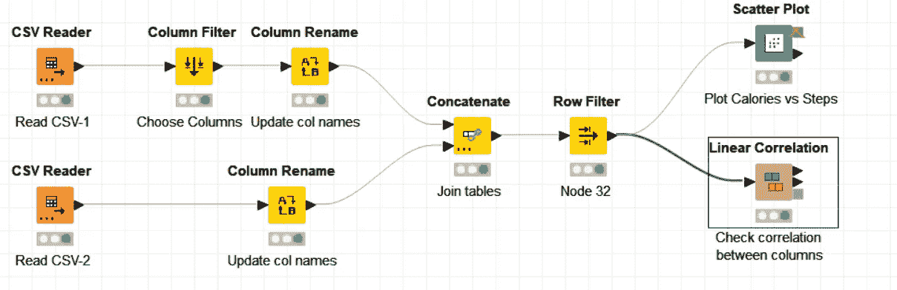
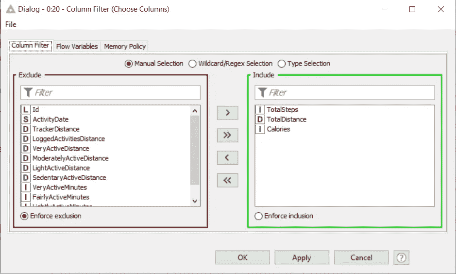
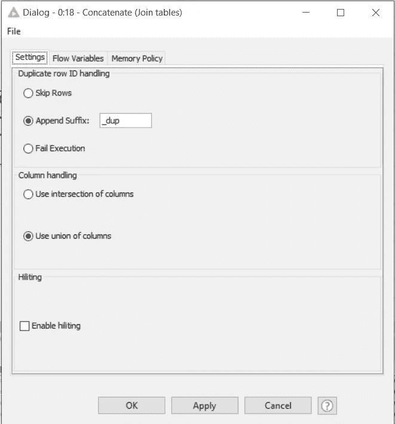
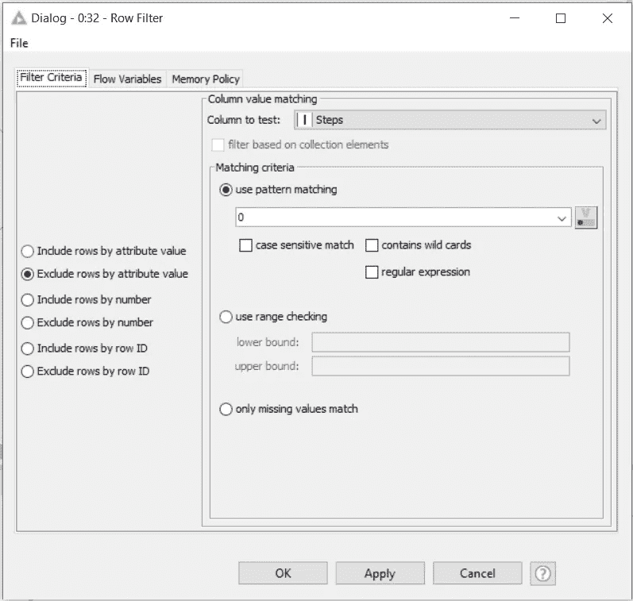
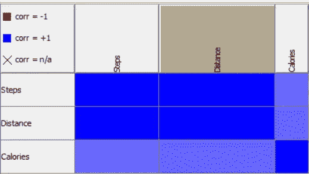
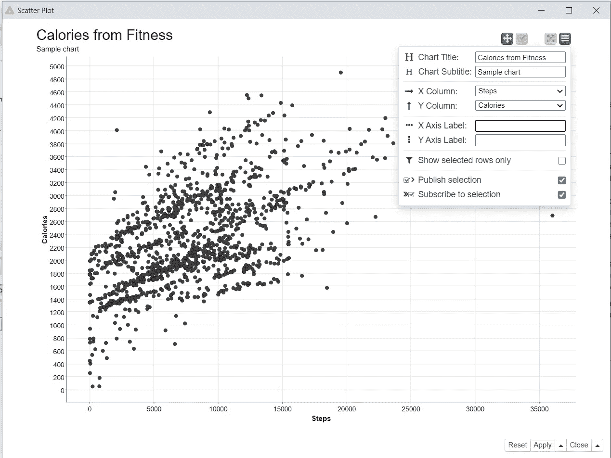

# 用 Knime 进行无代码数据处理

> 原文：<https://towardsdatascience.com/codeless-data-processing-with-knime-33e9032d02ee?source=collection_archive---------39----------------------->

## Knime 数据清理和操作简介

[KOBU 机构](https://unsplash.com/@kobuagency?utm_source=medium&utm_medium=referral)在 [Unsplash](https://unsplash.com?utm_source=medium&utm_medium=referral) 上拍摄的照片

Python、SQL、R 和 Julia 是全球数据科学家和分析师在数据分析中使用的一些流行编程语言。有些软件套件，如 Alteryx 和 Knime，有一个 IDE(集成开发环境)，数据爱好者和几乎没有编程背景的技术专家可以处理他们的数据，从中提取有意义的信息。这些 IDE 的关键特性称为可视化编程，允许用户可视化从原始信息到经过处理的信息、模型以及最终有意义的输出的数据流。在这篇文章中，我将简要介绍使用来自 [Kaggle](https://www.kaggle.com/search?q=Fitbit) 的 Fitbit 健康数据使用 Knime 进行可视化编程。

本练习将使用提取→加载→转换方法。下载的数据已经被“提取”。加载和转换将使用 Knime 来完成。

## 读取和操作数据

简单的数据输入和操作。来源:截图来自 Knime IDE

“CSV reader”节点用于将数据从数据源加载到 Knime 平台。还有 Excel 阅读器、JSON 阅读器、表格阅读器、Web 阅读器等类似的节点。在这篇文章中，我将重点介绍 CSV 阅读器。Knime IDE 中的描述窗口以及 [Knime Hub](https://hub.knime.com/) 中的文档有更多关于 Knime 中使用的每个数据输入节点的信息。

要输入数据，右键单击 CSV reader 并从选项中选择“配置”。在打开的“配置”窗口中，您可以选择要从源位置以 CSV 格式导入的文件。

在数据输入过程中过滤列。来源:截图来自 Knime IDE

如果您熟悉这些数据，您可以单击“配置”窗口中的“转换”选项卡，并选择要输入的列。这样，在构建模型等大型数据处理过程中，您就不必处理不必要的信息。在上面的例子中，我只选择了“总步数”、“总距离”和“卡路里”栏，剩下的就不做了。

列筛选器节点。来源:截图来自 Knime IDE

另一种选择列的方法是使用“列过滤器”节点。此处显示了该节点的配置窗口。两种选择柱子的方法都是好的；然而，CSV reader 窗口中的“Transformation”选项卡可以让您深入了解您的数据类型，并允许您移动列，以便以您喜欢的格式排列它们。可以通过右键单击“列过滤器”并选择“过滤的表”来查看最终的表。

列重命名节点。来源:截图来自 Knime IDE

另一个有用的数据输入节点是“列重命名”节点。顾名思义，它允许您为您的模型将输入数据的列名更改为简单的变量名(就像在编程中一样)。这根本不会改变源文件中的列名。这里，我将“总步数”和“总距离”的列名分别更改为“步数”和“距离”。

连接表格。来源:截图来自 Knime IDE

在我的例子中，我使用了两个 CSV 阅读器节点从两个源读取数据。既然输入已经被修改为具有相同的列，那么这两个表就可以连接起来，形成一个输出表，用于我们的数据处理。连接节点用于此目的。您可以选择是否可以跳过表中的重复值或以值作为后缀，或者是否应该失败。其次，您可以选择想要列的交集还是列的并集。通过选择 intersection，您将只看到数据匹配的列，而在 Union of columns 中，所有的数据都被合并在一起，得到一个连接表。

筛选表中的行。来源:截图来自 Knime IDE

现在数据已经按列过滤并合并了，我们要做的最后一个操作是清理数据，删除步骤为 0 的所有行。“行过滤器”节点可用于此目的。筛选器节点有各种选项，可以根据行类型、行号、行值和行 ID 来包含或排除行。我选择了“Steps”作为列，并排除了值为 0 的行。正如您所看到的，您可以使用这个节点来过滤一列中的行。若要筛选多个列，可以使用“基于规则的行筛选器”节点，而不是使用多个行筛选器节点。这将允许您为多个列的过滤编写简单的指令。

来自线性相关节点的相关矩阵。来源:截图来自 Knime IDE

“线性相关”节点是一个可视化节点，它为您提供了数据中不同列之间的相关性度量。这使您可以看到一列中的更改将如何影响另一列的数据或输出。此处显示的相关矩阵是线性相关节点的输出。深蓝色单元格紧密相关，而浅蓝色单元格相关性较小。如果任何单元格是红色的，那么它们在该单元格中的变量(X 和 Y 列)之间具有反向相关性。叉号(X)表示没有相关性。

散点图节点输出。来源:截图来自 Knime IDE

“散点图”节点允许您在一个柱上绘制另一个柱。它不允许有第二个轴。散点图节点的输出如上所示。您可以使用标签、标题和副标题定制绘图，Knime 还允许您选择在 X 和 Y 轴上显示其他列的视图。这样可以更快地查看不同列之间的关系，而不必为每个图表创建单独的节点。

## 结论

本文旨在简要介绍 Knime 中的数据输入和转换。Knime 是一个强大的可视化编程工具，可以通过它的 IDE 和 Knime hub 提供一个巨大的节点和特性库。几乎不需要编程，Knime 允许用户处理他们的数据，创建模型，并在他们的数据上部署机器学习模型以进行快速处理，而不是必须使用 Python，R 或 SQL 编写所有代码。虽然 Python、R 和 SQL 是数据科学所需的关键技能，但 Knime 为那些不熟悉编程但需要根据模型输出做出决策的人提供了一个极好的选择。

参考资料:

1.  克尼姆中心—[https://hub.knime.com/](https://hub.knime.com/)
2.  Knime 课程—【https://knime.learnupon.com/dashboard 
3.  https://www.kaggle.com/
4.  来自 Unsplash 的封面图像