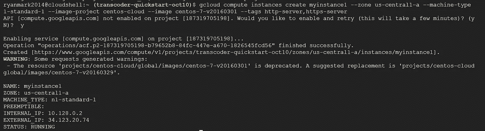
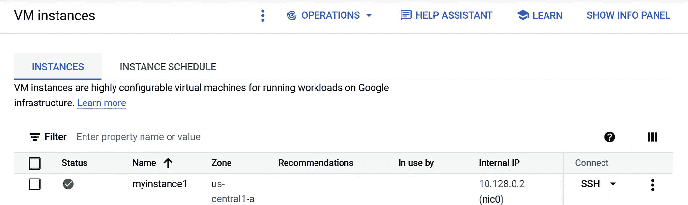
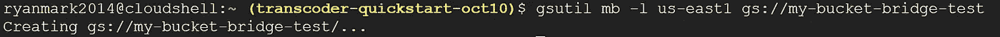
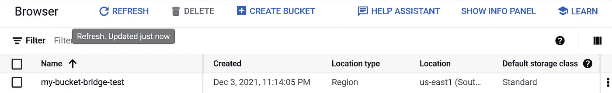
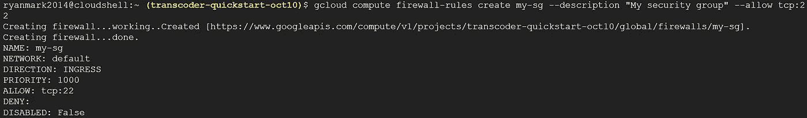
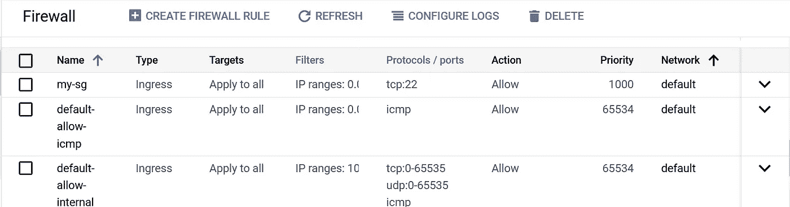

# 法典:云之间的桥梁？

> 原文：<https://towardsdatascience.com/codex-a-bridge-between-clouds-835250399fe9?source=collection_archive---------16----------------------->


图片— shutterstock

## Codex 可以在 AWS 和 Google Cloud 之间翻译命令吗？

许多企业需要应对多种云环境。AWS、Azure 和 Google Cloud 都有自己的命令集来执行云操作，如设置存储桶、定义服务帐户和其他管理任务。如果能有一种自动化的方法将命令从一个云环境翻译成另一个云环境的等效命令，那就太好了。在这篇文章中，我将继续之前关于 OpenAI 的 Codex 的文章([使用 Codex 在 Keras 和 fastai 之间进行翻译](/using-codex-to-translate-keras-to-fastai-8471a4596755)，[使用 Codex 将 COBOL 翻译成 JavaScript](/codex-translates-cobol-into-javascript-266205d606c0) )，探索 Codex 是否可以帮助应对这一挑战。我将尝试让 Codex 将一系列 AWS 命令翻译成 Google Cloud 的等效命令。

## 实验 1:创建虚拟机实例

创建虚拟机(VM)实例是一项常见的云任务。我想看看 Codex 是否能把创建 VM 的 AWS 命令翻译成创建 VM 的有效 Google Cloud 命令。我决定从 Codex 示例提示“**为库或框架**重写代码”开始，如下所示:

```
// Rewrite this as <TARGET><SOURCE CODE>// <TARGET> version:
```

从 AWS 文档中用于创建 VM 的示例命令开始，我试图让 Codex 生成等效的 Google Cloud 命令。下面是我在 Codex 中使用的实际提示，带有 AWS VM 创建命令，后跟 Codex 生成的 Google Cloud 代码:

```
// Rewrite this for Google Cloud
aws opsworks --region us-east-1 create-instance --stack-id 935450cc-61e0-4b03-a3e0-160ac817d2bb --layer-ids 5c8c272a-f2d5-42e3-8245-5bf3927cb65b --hostname myinstance1 --instance-type m1.large --os "Amazon Linux"// Google cloud version:
gcloud compute instances create myinstance1 --zone us-central1-a --machine-type n1-standard-1 --image-project centos-cloud --image centos-7-v20160301 --tags http-server,https-server
```

我从 Codex 获取输出，并尝试在 Google Cloud 项目的 Cloud Shell 中运行它，命令运行成功:



作者图片

我可以在谷歌云控制台中看到新的虚拟机:



作者图片

Codex 产生了一个可行的谷歌云命令，但它并不完美。特别是，它指定了一个不推荐使用的图像，如以下警告消息所示:

```
WARNING: Some requests generated warnings:
 - The resource 'projects/centos-cloud/global/images/centos-7-v20160301' is deprecated. A suggested replacement is 'projects/centos-cloud/global/images/centos-7-v20160329'.
```

## 实验 2:创建一个桶

从 AWS 文档中用于创建 bucket 的示例命令[开始，我试图让 Codex 生成等效的 Google Cloud 命令。下面是我在 Codex 中使用的提示，其中带有 AWS bucket creation 命令，后跟 Codex 生成的 Google Cloud 代码:](https://docs.aws.amazon.com/cli/latest/reference/s3api/create-bucket.html)

```
// Rewrite this for Google Cloud
aws s3api create-bucket --bucket my-bucket-bridge-test --region us-east-1// Google Cloud version:
// gsutil mb -l us-east1 gs://my-bucket-bridge-test
```

这次，Codex 在输出的开头添加了“//”。我从 Codex 获取输出(去掉注释前缀),并在 Google Cloud Shell 中运行它:



作者图片

我可以在谷歌云控制台上看到新的桶:



作者图片

同样，Codex 从 AWS 输入生成了有效的 Google Cloud 命令。

## 实验 3:创建安全组/防火墙规则

从 AWS 文档中用于创建安全组的示例命令开始，我试图让 Codex 生成等效的 Google Cloud 命令。下面是我在 Codex 中使用的实际提示，AWS 命令后跟 Codex 生成的 Google Cloud 代码:

```
// Rewrite this for Google Cloud
aws ec2 create-security-group --group-name my-sg --description "My security group"// Google Cloud version:
gcloud compute firewall-rules create my-sg --description "My security group" --allow tcp:22
```

我能够在 Google Cloud Shell 中成功运行 Codex 的输出:



作者图片

我可以在谷歌云控制台上看到新的防火墙规则:



作者图片

我承认我无法验证 Codex 生成的 Google Cloud 命令在功能上是否等同于 AWS 输入命令，尽管[这个话题](https://stackoverflow.com/questions/64548661/alternative-to-awss-security-groups-in-gcp)表明它至少是在正确的范围内。

## 结论

本文中的实验非常简单，只是触及了创建和管理云环境所需的全部命令的皮毛。这些基础实验并没有证明 Codex 可以对实际问题做出重大贡献，比如从 AWS 到 Google Cloud 的迁移。然而，有趣的是，Codex 为每个输入 AWS 命令生成了有效的工作 Google Cloud 命令。