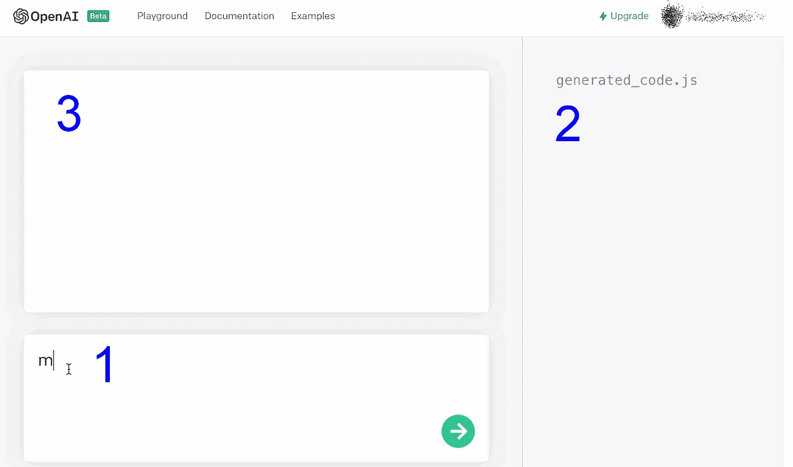
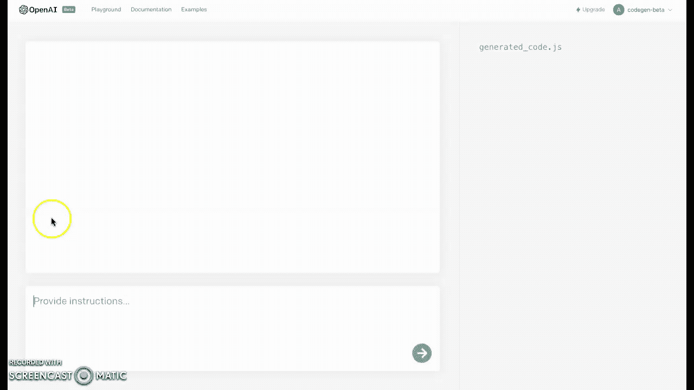
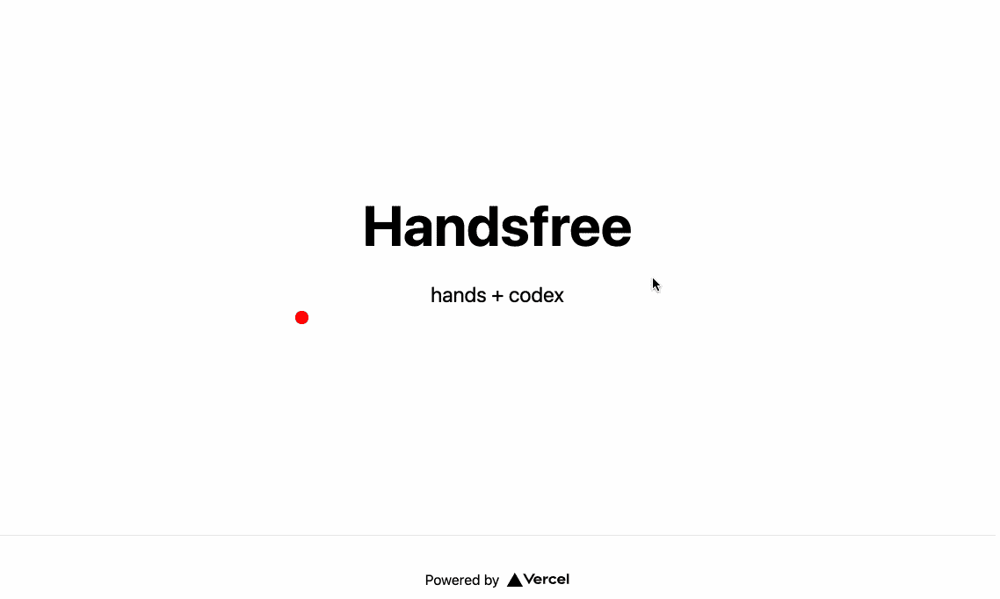
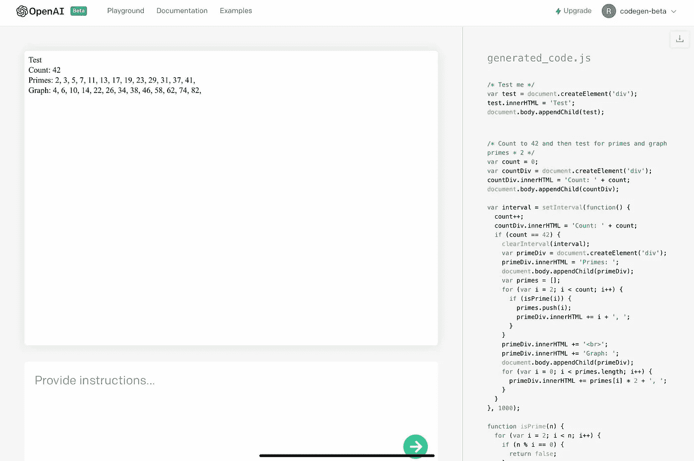
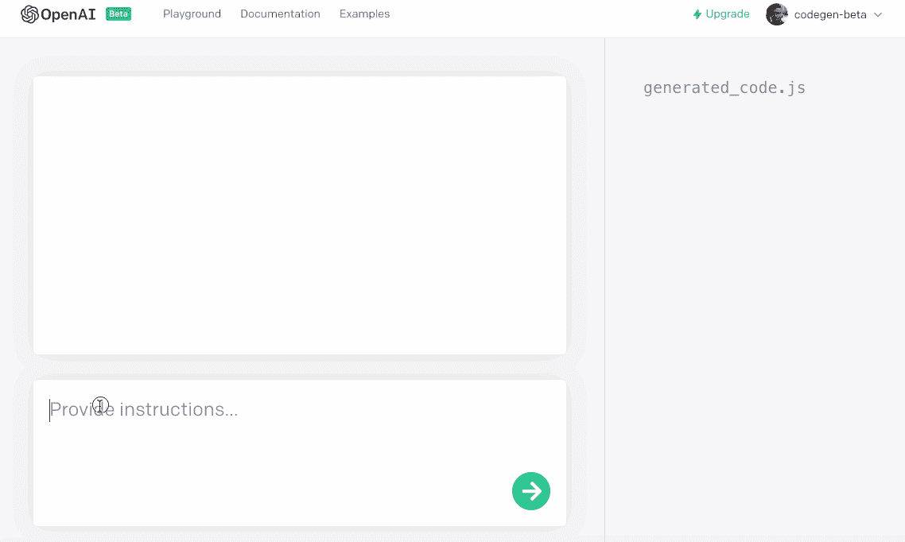
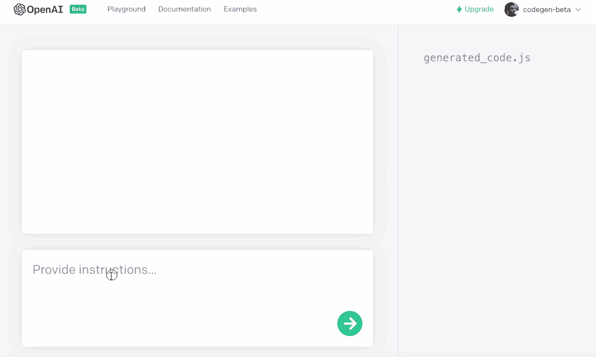

# OpenAI 的法典，在行动中

> 原文：<https://towardsdatascience.com/codex-by-openai-in-action-83529c0076cc?source=collection_archive---------7----------------------->

## 为每个编码的人(甚至是不编码的人)提供强大的人工智能驱动的支持。

作者照片

T **何代号**是我们这个世界的数字层 DNA。通过掌握代码——它的特征和特性——你建立了我们都生活在其中的数字现实。今天，OpenAI 向我们的 AI 春天揭示了一个新的里程碑(*提醒:AI 冬天已经结束*)，这将使更多的人能够创造:

> **法典**

> **官博**:[https://openai.com/blog/openai-codex/](https://openai.com/blog/openai-codex/)
> **论文**:[https://arxiv.org/abs/2107.03374](https://arxiv.org/abs/2107.03374)
> **加入候补名单**:[https://openai.com/join](https://openai.com/join)

## 什么是法典？

> OpenAI Codex 是 GPT-3 的后代；它的训练数据包含自然语言和数十亿行公开来源的源代码，包括公共 GitHub 库中的代码。OpenAI Codex 最擅长 Python，但它也精通十几种语言，包括 JavaScript、Go、Perl、PHP、Ruby、Swift 和 TypeScript，甚至 Shell。它有 14KB 的内存用于存储 Python 代码，相比之下，GPT-3 只有 4KB——因此它在执行任何任务时都可以考虑超过 3 倍的上下文信息。[ [OpenAI 博客](https://openai.com/blog/openai-codex/)

上个月，你能够见证由 Codex 实现的多种可能性之一——GitHub 与 OpenAI 合作展示了运行在 Codex 上的 [CoPilot](https://copilot.github.com/) 。CoPilot 是一个助手，理解你的方法，为你提供例子、提示和适当的代码片段，一个智能自动更正，增强你的编码。

但这仅仅是开始。Codex 是一个强大的变压器驱动系统，可以作为 NLP 模型与 [GPT-3 相比较。](/gpt-3-creative-potential-of-nlp-d5ccae16c1ab?sk=f27e91b137d80f24236e1dc9f2d49f85)

就像 GPT 3 号一样，它的使用案例是无穷无尽的。食品法典委员会理解你的任务，并最有效地完成它。

## 第一步

我们有机会研究法典并尝试它的功能。感觉我们只是在抓表面，我们想分享几个演示，展示与代码交流的新方式。

> **但是等等，谁是“*我们”*？**早在 2020 年，随着 GPT 3 的发布，OpenAI 正在寻找社区大使，他们将帮助和支持不断增长的 GPT 3 社区(后来大约有 6 万名成员)中的开发人员、研究人员、艺术家和作家。他们要求我们中的一些人，论坛中最活跃的用户，来提供帮助——这就是我们， **OpenAI 社区大使**。我们在开放时间为 GPT-3 用户提供建议，我们集思广益如何增强用户体验，我们还代表大社区与 OpenAI 讨论用户观点。
> 
> 有时，我们会深入了解 OpenAI 的最新发展，以便更好地向世界传播这些知识。就像法典的情况一样。下面你会看到一些由 OpenAI 社区大使制作的很酷的 Codex 演示。

## 法典长什么样？

Codex 的当前界面是极简的(并且无疑将会改变，因为 OpenAI 正在继续努力)。

Codex 界面—作者截图

在**字段 1 中，**你可以输入你的任务，用简单的英语(以及几乎所有其他语言，我们将在后面看到)。

**字段 2** 向您显示由 Codex 生成的代码。

**字段 3** 预览结果。

## 做法

你用明文给 Codex 你的指示。生成的代码可用于您的项目——您节省了时间并实现了更高效的工作，您尝试了新的事物，具有创造性，并打破常规进行思考。

当然，编码纯粹主义者可以继续手工编码。法典不会给他们带来挑战或竞争。Codex 使每个人都能够互动地学习和应用代码。法典不会杀死编码员，就像电影不会杀死剧院一样。就像 GPT 3 不会杀作家一样。是的，它改变了我们的工作方式，但它增强了我们的创造力，而不是取代我们。两种方法(人工智能驱动和真正的人类)可以并行存在。Codex 可以让你更有效率、更有效、更有教育意义地编码。

它是如何工作的？就像在 GPT-3 的指令引擎中，你需要输入的所有东西——只要问(礼貌地), Codex 就会完成请求。

你想看看它的实际效果吗？在这个演示中，我们要求 Codex 为一个名为 NTech 的网站创建"*一个登录页面"，"*该页面应该处于黑暗模式，带有一个电子邮件列表，供人们注册*":*

由 [Abran Maldonado](https://medium.com/u/ae4b2b6d8a9d?source=post_page-----83529c0076cc--------------------------------) 演示

当然，你必须设置一个电子邮件，并微调其他元素，但你会看到 Codex 如何将你的需求付诸行动。

## 谈到法典/无障碍方法。

有了一些变通办法，你可以用你的声音控制食品法典委员会:

布拉姆·亚当斯的演示

这不仅是一个易于编码的有价值的功能，它还将使身体残疾的人能够创造和实现他们的想法和梦想。此外，想想孩子们从与机器的对话中可能获得的巨大教育价值(和乐趣)。

另一种非接触式控制 Codex 的方法是使用您的网络摄像头和动作:

由[布拉姆·亚当斯](https://medium.com/u/33d50ce6ed81?source=post_page-----83529c0076cc--------------------------------)演示

# 用例

在我们第一次接触这个系统的时候，让我们看看 Codex 能做什么。

**数学。**

这个系统可以做数学运算:

Russell Foltz-Smith 的演示

## 评估测试

创建评估测试需要功能和知识——Codex 具备这两方面:

由 [Abran Maldonado](https://medium.com/u/ae4b2b6d8a9d?source=post_page-----83529c0076cc--------------------------------) 演示

## 应用程序？是的，可以。

**【倒计时】**

在下面的演示中，使用几个控制按钮实现了倒计时功能。简单—只需要简单的文本:

Natalie Pustinovich 的演示

**图像处理**

使用 Codex，您可以轻松创建一个简单的应用程序来修改图像:

由 [Lucas Negritto](https://medium.com/u/685f3a64ce0f?source=post_page-----83529c0076cc--------------------------------) 演示

## 盒子外面

Codex 可以与您的浏览器和计算机系统进行交互。

例如，*您可以控制您的网络摄像头，并让 Codex 在网络摄像头流的下半部分将语音转换为文本*。

Yash Dani 的演示

该系统甚至允许您控制您的浏览器:

布拉姆·亚当斯演示

## 体验一下！

由 Codex 提供的“**maslo occure**”首次展示了一种全新的网络体验，在这种体验中，交互、编辑和呈现是实时进行的:

***maslo occure***的演示(基于 Codex 的平台)由 [Russell Foltz-Smith](https://medium.com/u/b38bb037365d?source=post_page-----83529c0076cc--------------------------------) 完成。

## 其他语言？

法典是全球性的。再也没有语言障碍了。在我的实验中，我尝试了一个简单的任务:用特定的颜色创建和修改一个形状。但是:我是用**英语、德语、日语、俄语**问的。

如你所见:结果是一样的。法典明白了！不管你对它说什么语言。

由[弗拉德·亚历克斯(默兹曼施)演示](https://medium.com/u/5244b970029b?source=post_page-----83529c0076cc--------------------------------)

## 作为讲故事工具的抄本？

当然，抄本不是一个作家。它不是为了写精彩的小说而设计的——如果你想拥有一个人工智能驱动的叙事，你最好使用 GPT-3。但是它仍然可以帮助你。

比如:创造模因。

布拉姆·亚当斯演示

它还能写简单的(或有趣的)诗，并把它们翻译成另一种语言:

Vlad Alex 演示(Merzmensch)

# 结论

Codex OpenAI 提供了巨大的教育价值:

想象一下在学校使用这个——玩着法典，孩子们会爱上代码。我可以向你保证，他们不会把自己变成那些来自瓦力的懒人，他们会研究和接触。

Codex 使不编码的人能够投入进去，尝试一些东西，并实现他们的想法。艺术家、教师、许多其他职业不涉及编程语言的人将创造他们的方法并实现他们的愿景。

它还将帮助编码人员进行短暂的尝试和打破头脑风暴实验，而不必“仅仅为了尝试”而在编程上投入大量时间。

## 这个系统是人机交互的巨大飞跃。

## 更新 1:

这是几个小时前 OpenAI 录制的 CODEX 官方演示，包含更多信息和实验:

## 更新 2:

2021 年 8 月 12 日星期四有一场**法典挑战**:https://challenge.openai.com[报名**法典候补**:](https://challenge.openai.com/)[https://openai.com/join](https://openai.com/join)

## 更新 3 (2021.08.24):

看看这些和更多的演示，由 Sandra Kublik 编辑在这个信息丰富的视频中:

[https://www.youtube.com/watch?v=66xTYJrOxKk](https://www.youtube.com/watch?v=66xTYJrOxKk)