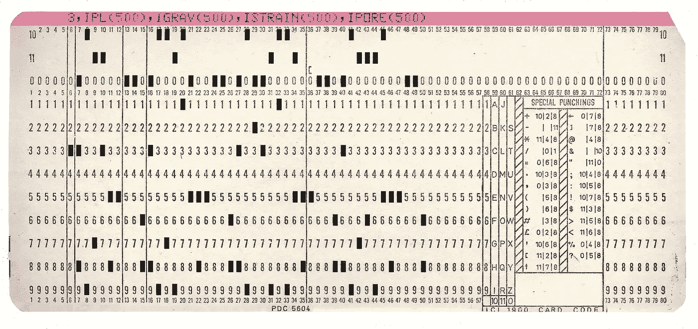
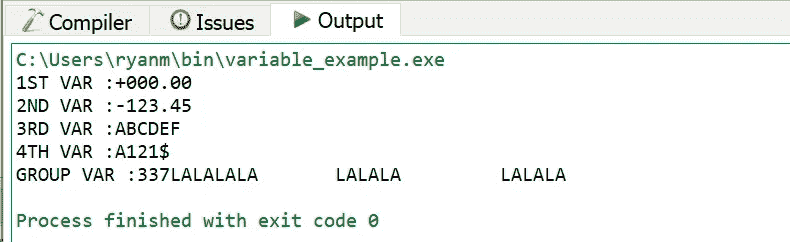
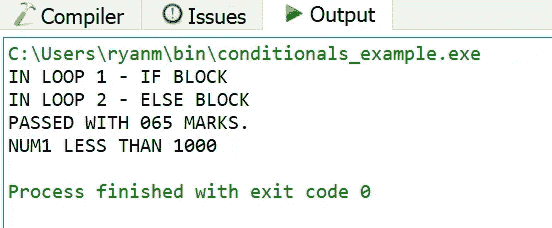
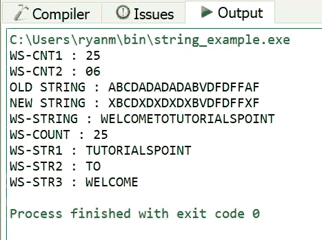
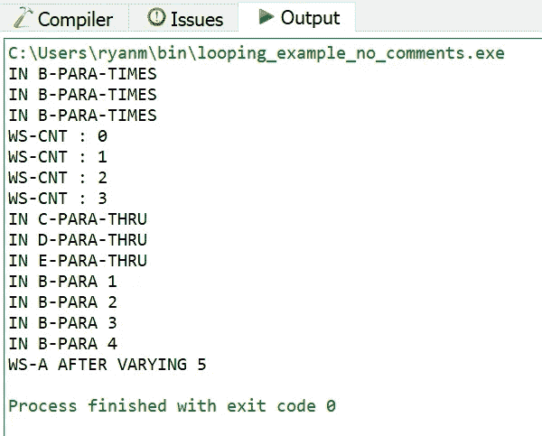

# Codex 将 COBOL 翻译成 JavaScript

> 原文：<https://towardsdatascience.com/codex-translates-cobol-into-javascript-266205d606c0?source=collection_archive---------33----------------------->



图片— shutterstock

## Codex 能把各种 COBOL 翻译成 JavaScript 吗？

今年早些时候，OpenAI 发布了 Codex 作为人工智能驱动的环境，用于处理计算机代码。Codex 可以将英语语言描述转换成代码，从代码创建注释，并从一种编程语言翻译成另一种编程语言。我对与 COBOL 语言相关的 Codex 语言翻译能力特别感兴趣，COBOL 是大型机/穿孔卡时代的通用语言。

我已经发表了几篇文章，描述了 Codex 如何从基本的 COBOL 程序和非平凡的 COBOL 程序中为现代语言生成代码。在本文中，我将从优秀文章 [7 COBOL 示例及解释](https://medium.com/@yvanscher/7-cobol-examples-with-explanations-ae1784b4d576)中为 Codex 提供一些额外的 COBOL 示例。JavaScript 是本文中描述的实验的目标语言——我在让 Codex 从 COBOL 生成 Python 方面取得了有限的成功，但是 JavaScript 作为目标语言更有前途。让我们看看 Codex 能否处理更复杂的 COBOL 程序，并将其翻译成 JavaScript。

# 实验 1:从具有各种变量类型的 COBOL 程序中生成 JavaScript

首先，我想回到第二篇文章中的 COBOL 变量示例，但是这次保留整个 COBOL 程序。下面是开始的 COBOL:

下面是 Codex 从这个 COBOL 输入中生成的 JavaScript 输出，经过清理，删除了无关的 Python 风格的注释:

下面是 node.js 中运行的 JavaScript 的输出:

```
1ST VAR : 000.00
2ND VAR : -123.45
3RD VAR : ABCDEF
4TH VAR : A121$
GROUP VAR : {
  subvar1: 337,
  subvar2: 'LALALALA',
  subvar3: 'LALALA',
  subvar4: 'LALALA'
}
```

下面是原始 COBOL 的输出:



还不错！在没有干预的情况下，Codex 没有被任何 COBOL 阻塞，JavaScript 产生的输出非常接近 COBOL 程序的输出。

# 实验 2:用条件从 COBOL 程序生成 JavaScript

现在让我们看看 Codex 是否可以处理 COBOL 条件语句。下面是一个 COBOL 程序，来自 [7 COBOL 示例和解释](https://medium.com/@yvanscher/7-cobol-examples-with-explanations-ae1784b4d576)，其中包括各种条件语句:

下面是 Codex 从这个 COBOL 输入中生成的 JavaScript:

以下是 JavaScript 的输出:

```
IN LOOP 1 - IF BLOCK
IN LOOP 2 - ELSE BLOCK
PASSED WITH 65 MARKS.
NUM1 LESS THAN 1000
```

下面是原始 COBOL 的输出:



相同的结果！这是 Codex 能够高保真地翻译成 JavaScript 的两个 COBOL 程序。

# 实验 3:从 COBOL 字符串操作程序生成 JavaScript

COBOL 有一些奇特的字符串操作结构。本实验中的示例程序展示了 COBOL 字符串处理。我们来看看 Codex 是怎么处理的。

下面是 Codex 从这个 COBOL 输入中生成的 JavaScript:

以下是 Codex 生成的 JavaScript 的输出:

```
WS-CNT1 : 20
WS-CNT2 : 6
NEW STRING : XBCDXDXDXDXBVDFDFFXF
WS-STRING : TUTORIALSPOINTWELCOMETO ANDTUTORIALSPOINTXBCDXDXDXDXBVDFDFFXF1
WS-COUNT : 1
WS-STR1 : WELCOME
WS-STR2 : TO
WS-STR3 : TUTORIALSPOINT
```

这是原始 COBOL 程序的输出:



让我们看看 COBOL 和 JavaScript 输出之间的一些差异:

*   **WS-CNT1** :在 COBOL 中，这个变量被分配了 25 个字符的大小，尽管它只有 20 个字符长。
*   **WS-CNT2** :这是 Codex 处理 COBOL 最好的例子之一——它正确地解释了 COBOL 结构**检查 WS-STRING 计数 WS-CNT2 的所有‘A’**，并在 JavaScript 中实现了一个 FOR 循环，实现了相同的目标。
*   旧字符串 : JavaScript 完全忽略了这个输出
*   **新字符串**:两个输出相同
*   **WS-STRING** : JavaScript 没有接近这个字符串
*   **WS-COUNT** : JavaScript 初始化了这个变量，但是错过了处理
*   **WS-STR1，WS-STR2，WS-STR3** : JavaScript 得到了正确的字符串分段，但是打乱了子字符串的输出顺序。

这个实验有一些很好的结果，但总体来说，它表明如果没有人工清理，Codex 无法生成功能上等同于 COBOL 字符串操作代码的 JavaScript。

# 实验 4:从 COBOL 循环程序生成 JavaScript

COBOL 有一些循环结构，现代语言的程序员会觉得很奇怪。在这个实验中，我们将采用一个具有各种循环设置的 COBOL 程序，看看 Codex 是如何处理它的。

这个程序的 Codex 输出没有产生有效的 JavaScript——它缺少变量定义。注释是在 JavaScript 上执行的，但是在 node.js 中运行时产生了代码错误。

为了尝试获得有效的 JavaScript 输出，我从 COBOL 程序中删除了注释，并重新运行 Codex 翻译以获得以下 JavaScript 输出:

下面是这个 JavaScript 的输出:

```
In B-PARA-TIMES
In B-PARA-TIMES
In B-PARA-TIMES
WS-CNT : 0
WS-CNT : 1
WS-CNT : 2
In C-PARA-THRU
In C-PARA-THRU
In C-PARA-THRU
In D-PARA-THRU
In D-PARA-THRU
In D-PARA-THRU
In E-PARA-THRU
In E-PARA-THRU
In E-PARA-THRU
In B-PARA 0
In B-PARA 1
In B-PARA 2
In B-PARA 3
In B-PARA 4
```

这是 COBOL 的输出:



一些循环的开始和结束条件没有被准确地翻译成 JavaScript，JavaScript 完全丢失了 **WS-A** 的输出。与实验 3 类似，这个实验表明 Codex 可以处理一些非常复杂的 COBOL 输入，但是如果没有人工清理，它无法生成与 COBOL 循环代码功能相当的 JavaScript

# 实验 5:从编写文件的 COBOL 程序生成 JavaScript

最后，让我们尝试一个写文件的 COBOL 程序。下面是输入 COBOL 程序，它汇编一条记录并将其写入文件:

这是 Codex 从 COBOL 程序中生成的 JavaScript。注意这个例子的 JavaScript 有多紧凑。

下面是 JavaScript 生成的输出文件的内容:

```
12345,TEST TRANSACTION,000124.34,000177.54,53.2,1234567,JOHN SMITH
```

以下是 COBOL 生成的输出文件的内容:

```
12345TEST TRANSACTION         0001243400017754000053200000000
```

Codex 在 JavaScript 输出中估算 ACCOUNT-ID 和 ACCOUNT-HOLDER 的值，但在其他方面，输出与 COBOL 程序的输出一致。

## 结论

以下是我从本文描述的实验中得出的总体结论:

*   Codex 可以将一系列 COBOL 代码翻译成可用的 JavaScript。事实上，除了实验 4 中第一个版本的 COBOL 循环程序，Codex 总是能够生成有效的 JavaScript。
*   对于某些 COBOL 语法，包括循环结构和条件语句，Codex 无法始终如一地生成功能等同的 JavaScript。

你可以在这个报告中找到本文描述的实验的输出:[https://github.com/ryanmark1867/codex_experiment](https://github.com/ryanmark1867/codex_experiment)

这里有一个视频，是这篇文章中的一个实验:【https://youtu.be/2dYSMvlwFjg 