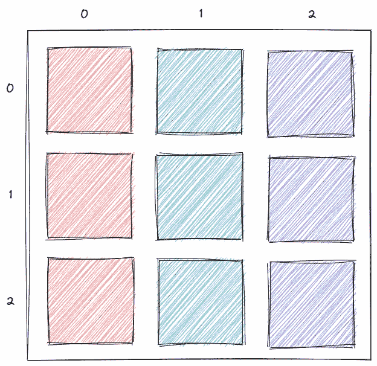
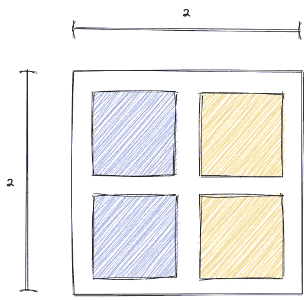
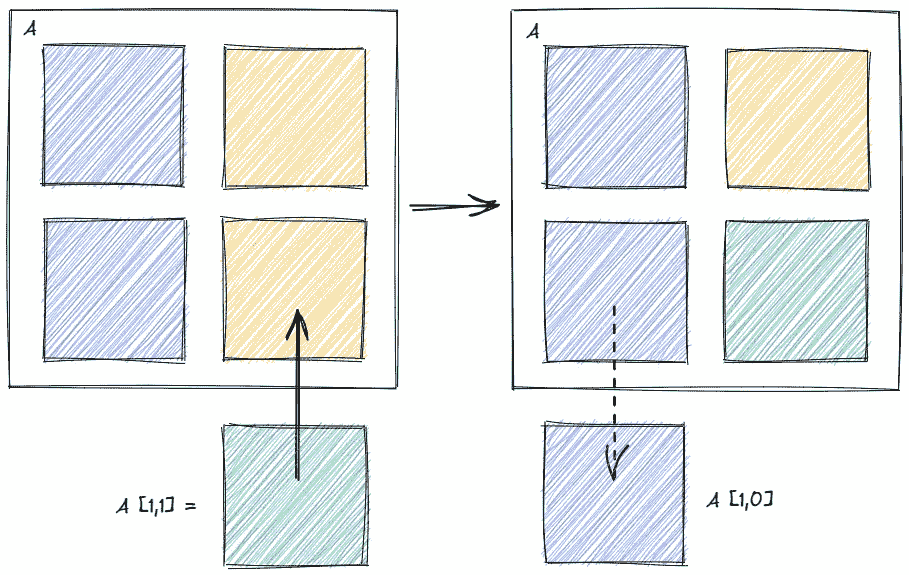
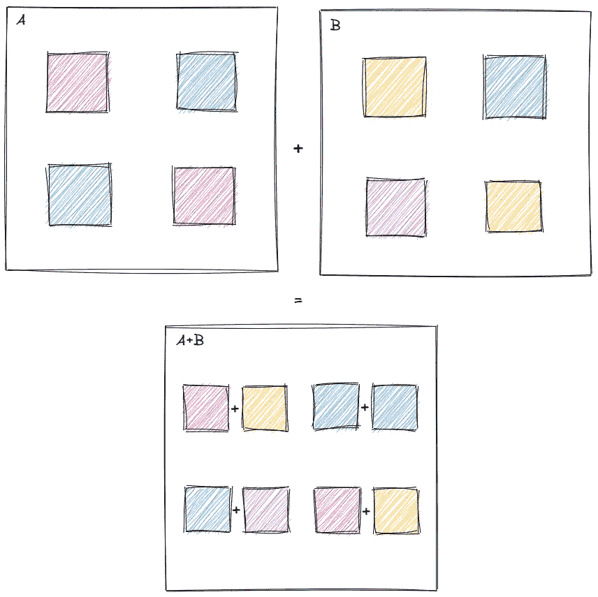
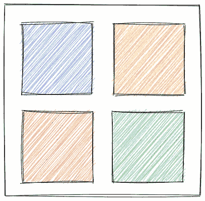
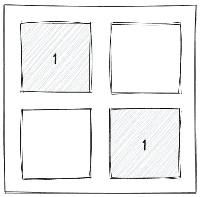
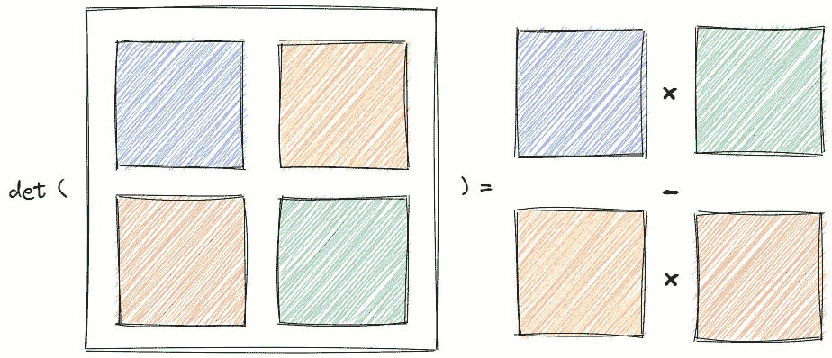
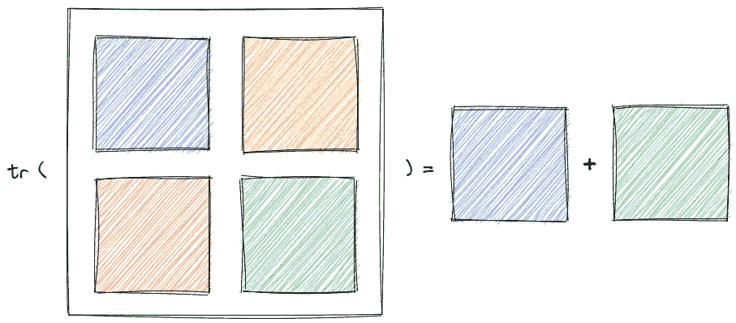
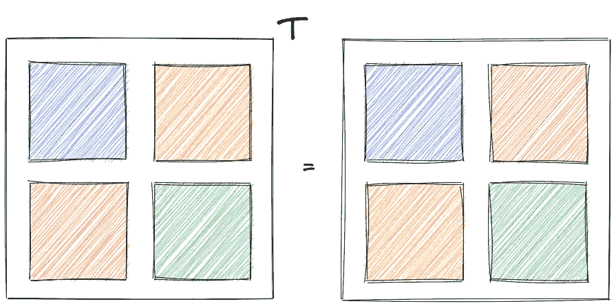
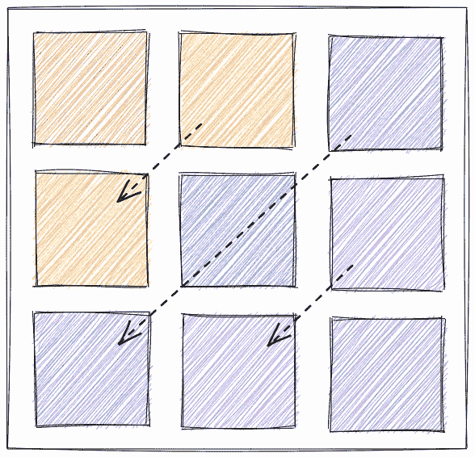

# 编码矩阵

> 原文：<https://towardsdatascience.com/coding-a-matrix-5e1d7eb1e6e5?source=collection_archive---------30----------------------->

## 我们将实现一个矩阵数据结构，支持像乘积和分解这样的线性代数计算

一种 3×3 矩阵数据结构。图片作者。

**通用数组类**

矩阵将从一般的类似数组的类继承。array 类可以支持额外的数据结构，如向量和张量。我们希望 array 类支持以下常规属性和方法:

*   以嵌套列表的形式返回数组数据，并计算数组形状。
*   确保数组对象只能用有效的输入数据初始化。
*   支持索引，以便我们可以检索和更新数组的内容。
*   支持加、减、标量乘、标量除等运算符。

**数组初始化**

数组对象将通过传递包含`complex`或`float`数字的嵌套数据列表进行初始化。我们将通过检查其形状来验证输入数据是否有效。`[1,2,3]`的输入有效，而`[1,[2,3]]`的输入无效。一旦输入数据形状得到验证，我们将计算数组形状。

**阵列形状**

具有 2 行 2 列的矩阵的形状是(2，2)。图片作者。

为了验证数组的形状是否有效，我们可以沿着给定维度的宽度进行迭代，以检查每个元素(将是可迭代的对象)是否具有相同的形状。然后，我们可以使用递归来更深入地遍历数组。停止条件将是当我们到达一个不可迭代的对象(这将是数组元素本身)。

为了计算数组的形状，我们可以假设数据具有有效的数组形状，并递归计算每个维度的长度。

**数组索引**

设置(左)和获取(右)一个矩阵的元素。图片作者。

我们可以使用 Python 的特殊索引方法来实现数组 getter 和 setter 函数。我们需要确保数组对象有多个维度，这样索引才是允许的。对于 setter，我们需要检查新数组是否具有有效的形状。

**数组运算符**

添加数组将添加每个数组的相应元素。图片作者。

我们可以利用 Python 的特殊运算符方法来实现加、减、标量乘、标量除等运算。下面是数组加法的实现。

**矩阵初始化**

要实现一个矩阵类，我们可以从通用数组类继承，并对其形状应用约束。如果输入数据不具有矩阵的形状，则矩阵对象不能被初始化。

**矩阵属性**

现在我们可以初始化一个矩阵对象，我们可以计算矩阵的各种属性，包括:

*   无论是*方阵*
*   是否是一个*单位矩阵*
*   矩阵*行列式*
*   矩阵*轨迹*
*   矩阵*转置*
*   是否是一个*对称矩阵*

**方阵**

行数和列数相同的矩阵是正方形。图片作者。

我们可以通过比较矩阵的行和列来检查矩阵是否是正方形的。

**单位矩阵**

主对角线上为 1 而其他地方为 0 的矩阵是单位矩阵。图片作者。

如果一个矩阵的每个主对角线元素的值都是 1，而其他元素的值都是 0，那么这个矩阵就是单位矩阵。

**矩阵行列式**

2×2 矩阵的行列式是对角线乘积的差。图片作者。

我们可以用一个[拉普拉斯展开](https://en.wikipedia.org/wiki/Laplace_expansion)来计算矩阵行列式。请注意，还有更有效的算法，如矩阵分解。

**矩阵轨迹**

矩阵的迹是主对角线元素的和。图片作者。

轨迹可以通过沿着矩阵的主对角线对每个元素求和来计算。我们还需要检查矩阵是否是正方形的。

**矩阵转置**

矩阵的转置会翻转行和列。图片作者。

要在一行代码中计算矩阵转置，我们可以使用一些 Python 语言的特性；即`zip`方法、使用`*`操作符的参数解包和列表理解。

**对称矩阵**

对称矩阵等于它们的转置矩阵。图片作者。

我们可以通过比较一个矩阵与其转置矩阵来检验它是否对称。

包括单元测试在内的整个 matrix 类实现可以在[这里](https://github.com/ashbellett/linear-algebra)找到。