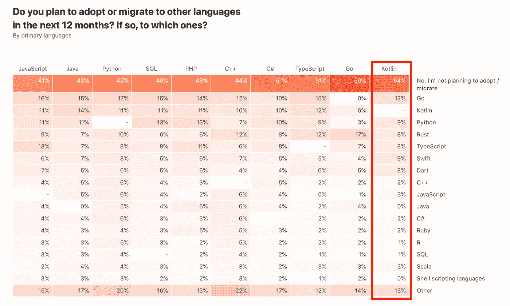

# 金融科技的编码语言:JVM 如何让你成功？

> 原文：<https://towardsdatascience.com/coding-languages-for-fintech-how-will-jvm-make-you-succeed-89f84af22296?source=collection_archive---------8----------------------->

## Java，Kotlin，Groovy，Scala，Clojure


来源:[贝尔软件](https://www.bell-sw.com)

BellSoft 正在用金融科技企业的顶级语言来结束 2020 年。无论你是一个正在启动你的第一个 MVP 的初创公司，一个正在崛起的企业，还是一个正在寻找创新优势的老牌公司，这个列表保证满足你所有的 IT 需求。

在这里，我们将解释为什么应该选择 JVM 语言而不是特定于平台的本地语言，看看它们的关键特性和排名。我们将特别关注语言如何应用于用例场景，涵盖从金融和银行到保险的一切。这个列表将帮助你了解每一个提供的优势和机会。在选择最适合您的项目的编程语言时，您可以遵循我们的建议。

# 介绍

在这项比较研究中，我们从各种来源收集数据，根据不同的参数对语言进行排名:

*   TIOBE 编程社区索引，
*   编程语言流行指数(PYPL)、
*   JetBrains，Stack Overflow 和 GitHub 开发者调查。

我们的研究仅涵盖 2020 年，因此你可以获得最相关的行业概况——因为在金融科技领域，了解最新动态至关重要！

但是首先，我们想解释一下这篇文章的重点。许多人会说 Python 最适合金融科技公司，因为它对开发人员友好，适应性强。尽管这可能是真的，但对高风险企业来说，它缺乏某些好处。从历史上看，金融机构广泛使用的是 Java。考虑到数据安全性、生产率和稳定性是他们的首要任务，他们经常转向基于 Java 的语言。

1995 年，詹姆斯·高斯林引入 Java 作为高级面向对象编程语言。从一开始，它的一个关键特性就是平台独立性，这是由 Java 虚拟机(JVM)带来的。JVM 从底层物理硬件和操作系统中抽象出来。有了这种高效的程序执行方式，Java 开发人员就不需要关注对象生命周期管理或其他底层的复杂问题。相反，他们能够将全部精力投入到业务逻辑中。

多年来，JVM 在垃圾收集、性能和成熟度方面有了显著的改进。编程语言设计者意识到了这种运行时的潜力。因此，许多著名的、主流的、甚至更新的语言都是用 JVM 提供的特性和巨大的类库开发的。每个企业现在都可以找到满足其需求的解决方案。

当甲骨文在 2018 年 7 月为 JDK 推出基于订阅的许可时，IT 社区内部对 JVM 的状态存在轻微的不确定性。幸运的是，由于 OpenJDK 倡议，JDK 规范仍然是免许可和开源的。一些公司现在提供他们自己的开源 Java SE 实现，包括 BellSoft。其 [Liberica JDK](https://www.bell-sw.com/pages/libericajdk/) 是市场上领先的运行时之一，具有可选的企业支持。

既然我们已经介绍了历史，那么是时候进行我们的抵抗了:金融技术行业的最佳 JVM 语言列表: **Java、Kotlin、Groovy、Scala 和 Clojure** 。你会发现猜第一个不会太难…

# 1.Java 语言(一种计算机语言，尤用于创建网站)

Java 是商业应用程序开发的主要选择，也是最主要的语言之一。它是第一个构想并广泛接受“编写一次，在任何地方运行”范式的公司，该范式专注于开发人员的生产力和人体工程学。它为 Python、JS 和 Kotlin 等其他语言的成功铺平了道路。Java 采用了许多实用的概念，如内存模型、中间表示(字节码)、多线程和作为一等公民的处理函数。作为迄今为止最具颠覆性和影响力的编程语言之一，Java 已经永远地改变了软件开发的前景。

让我们看看为什么它现在几乎和 25 年前一样成功:

## 稳定可靠

**N26** ，一家在单一欧元支付区和美国提供服务的德国新银行，使用 Java(确切地说是 RxJava)来构建 Android 应用程序。1 它提供了一个标准工作流来管理应用程序中的所有数据和事件。这就是它在 Android 开发者中日益流行的原因。工程团队实现了关注点的清晰分离，这使得特性更容易在代码中导航，并改进了代码审查。

看一看应用程序功能的一个简短片段，显示用户信用草稿列表:

```
Flowable<Option<List<CreditDraft>>> getAllCreditDrafts() {
        return store.getAll();
    }Completable fetchCreditDrafts() {
        return creditService.getCreditDrafts()
                .subscribeOn(Schedulers.io())
                .observeOn(Schedulers.computation())
                // map from raw to safe                                
                .flatMapObservable(Observable::fromIterable)
                .map(creditDraftMapper)
                .toList()
                // put mapped objects in store
                .doOnSuccess(store::replaceAll)
                .toCompletable();
    }
```

Java 不是为移动开发而构建的？我们不同意。一个银行系统，无论是运行在服务器上还是云中，都必须是健壮的，能够持续工作多年，而不需要做任何调整。在这里，Java 是一种理想的语言，拥有一个大型的、成熟的生态系统和不间断的变化。

## 曾经流行过

Java 是目前为止企业和后端开发中使用最多的技术。大多数流行的编程语言排名网站都倾向于将它放在首位。

专门评估和跟踪软件质量的 TIOBE 将 Java 评为 2020 年第二大最受欢迎的语言，也是过去 20 年中最受欢迎的两种语言之一！在此期间，它只被 C 语言超越过几次。


来源: [TIOBE](https://www.tiobe.com/tiobe-index/)

对于 2020 年， [PYPL](http://pypl.github.io/PYPL.html) (编程语言流行指数)，基于谷歌趋势数据，将 Java 列为仅次于 Python 的第二大流行编程语言。这里我们想指出的是，Java 只是在 2018 年失去了领先地位。


来源: [PYPL](https://pypl.github.io/PYPL.html)

此外， [JetBrains 的第四次年度开发者调查](https://www.jetbrains.com/lp/devecosystem-2020/)将其排在第二位，仅次于 JavaScript。


来源: [JetBrains](https://pypl.github.io/PYPL.html)

## 裁决

Java 正面临来自 Python 和 JavaScript 的激烈竞争。它可能永远不会拥有曾经在该行业拥有的市场份额。然而，开发人员仍然认为学习 Java 是对未来的安全投资，因为职位空缺的数量和以前一样多。考虑到 Java 的采用量和它最近的许多创新，它将仍然是未来商业软件开发的首选。

# 2.科特林

最近，Java 在开发人员体验和人机工程学方面受到了很多批评:它冗长，产生样板代码，容易出现意外特性，并且缺少许多现代特性。其他几种语言试图解决这些缺点，努力成为“更好的 Java”我们坚信科特林是其中的佼佼者。

流行的 IntelliJ IDE 背后的公司 JetBrains 在 2016 年发布了 Kotlin。它试图在不影响编译时间的情况下解决 Java 的问题。Kotlin 引入了许多来自其他先进的、高生产率语言的优秀特性。它被认为是 Java 的更简单、更现代、更简洁的替代品。

Android 和许多企业应用支持旧的 LTS 版本的 Java。在这种用例中，Kotlin 为开发人员提供了更强大的现代语言特性，因为 Kotlin 可以面向各种旧的 JDK 版本(如 Java 6 或 7)。

2019 年，当谷歌宣布 Kotlin 为首选 Android 应用程序开发选项时，kot Lin 获得了显著的推动。但为什么增长如此之快呢？

## 两全其美

**万事达卡**与 **Corda** 达成合作伙伴关系，共同开发并试点一种新的基于区块链的跨境支付解决方案。2 它连接由万事达卡运营的清算和结算网络支持的全球快速支付基础设施、方案和银行。Corda 是一个用 Kotlin 编写的开源区块链项目，用于存储、管理和同步各种金融机构之间的金融义务。

这个例子摘自 Corda 项目:

```
/ Add this import:
import net.corda.core.identity.Party

// Replace TemplateState's definition with:
@BelongsToContract(TemplateContract::class)
class IOUState(val value: Int,
               val lender: Party,
               val borrower: Party) : ContractState {
    override val participants get() = listOf(lender, borrower)

}
```

如果团队希望一方面利用创新，另一方面利用 JVM 提供的可持续性，Kotlin 是理想的选择。与 Java 相比，这种语言以其进步的特性、平坦的学习曲线和更高的开发速度吸引着许多公司。

## 在上涨

Kotlin 于 2016 年首次发布，越来越受欢迎，正在成为顶级趋势语言。截至 2020 年 12 月，它在 [PYPL](http://pypl.github.io/PYPL.html) 上排名第 13，仅次于 TypeScript 和 Go。看到它在 Ruby(第 14)这样的强手之上，已经是一个相当令人印象深刻的结果了。

Kotlin 专为更好的开发人员人体工程学而设计，在全球范围内广受欢迎。根据 [Stack Overflow 2020 开发者调查](https://insights.stackoverflow.com/survey/2020)，对于近 63%的受访者来说，它是第四大最受欢迎的语言，仅次于 Python。

根据 [GitHub Octoverse](https://octoverse.github.com/) 的数据，2019 年至 2020 年间，它的年同比增长率为 182%，是全球增长最快的编程语言之一。

[JetBrains 2020 年开发人员调查](https://www.jetbrains.com/lp/devecosystem-2020/)表明，Kotlin 是开发人员最想移植和采用的三种主要工具语言之一:



来源: [JetBrains](https://pypl.github.io/PYPL.html)

## 裁决

Kotlin 是少数几个在酷功能和简单性之间取得平衡的例子之一。下一个十年，它肯定会更受欢迎。对于那些想学习一门高产语言或尝试 Android 应用程序开发的好奇者来说，Kotlin 是一个绝佳的选择。一些人甚至声称，在不久的将来，押注科特林将是一个明智之举。你可以在 BellSoft 关于 Kotlin 的两部分系列文章[中了解更多关于它的特性以及这种语言对行业的意义。](https://bell-sw.com/announcements/2020/11/16/An-intelligent-bet-for-Kotlin-part-one/)

# 3.绝妙的

在特定的场景中，从开发速度的角度来看，动态类型语言比静态类型语言有显著的优势。受 Python 和 Ruby 的启发，James Strachen 在 2003 年开始为 JVM 开发动态类型编程。四年后，Groovy 作为同类产品中的第一个问世。它引入了类似 Python 的干净编码和类似 Ruby 的动态性。

Groovy 是一种值得尊敬的语言选择，并被广泛使用，原因如下:

它是可选的类型和多范例(面向对象的、函数式的、命令式的、脚本式的)。

Groovy 带来了许多实用功能:类型推断、多行字符串、闭包、原型扩展。这种方法后来严重影响了其他语言，如科特林。

*   它与 Java 无缝兼容，并拥有庞大的库生态系统。很多流行的框架，比如 Spring，都支持 Groovy。
*   它可以用于特定领域语言(DSL)。它还支持在运行时实现特征。
*   通过元对象协议而不是直接调用方法来调度方法使其具有很高的性能。
*   Groovy 现在是 Apache software foundation 的一部分，在业界得到了广泛应用。由于其动态、简洁的特性，它是脚本、工具和开发人员的理想选择。Gradle、Jenkins 和 SoapUI 等流行工具使用 Groovy 作为主要编程语言。处于 DevOps 和架构领域也延长了它的生命周期。

## 速度是关键

总部位于澳大利亚的 Auto & General Insurance 有限公司需要内部工具来管理其 DevOps 系统。它计划为 Gradle 创建一个类似 Maven 原型的插件，从本地模板生成项目。对于这个其他系统依赖的小规模项目来说，快速开发至关重要。由于 Groovy 的动态特性、对 DSL 的支持以及在 DevOps 领域的广泛采用，它是与公司现有工具进行互操作的最佳选择。

## 一点点可以走很长的路

Groovy 是一种成熟的编程语言，在 JVM 中提供了类似 Python 的生产力。这种组合证明了它在各种小型任务中的优势:工具、脚本、概念开发的证明。因此，尽管它不是像 Java 或 Kotlin 那样的通用语言，但它还是相对较受欢迎。

2020 年 12 月，Groovy 从第 12 位升至第 11 位。

然而， [PYPL 指数](http://pypl.github.io/PYPL.html)同月排名第 23 位:0.45%的市场份额似乎并不值得夸耀。

## 裁决

可选类型的 Groovy 不适合大规模开发:它的好处在于快速交付和动态性。方法缓存和其他实用特性是出色性能背后的秘密。企业认为 Groove 是一种成熟的语言，无论如何都会有用户。

# 4.斯卡拉

从事 Java 泛型和当前 Java 编译器 javac 工作的 JVM 老手 Martin Odersky 决定研究 Java 的缺点。2004 年，他发布了 Scala，结合了许多函数式编程特性和面向对象的范例。它成为最早将 JVM 作为运行时平台的语言之一。Scala 成功地加速了技术进步，并直接促进了 Java 的现代化。如果没有这种语言，这个行业就不一样了:在过去的十年中，它在推广函数式编程范例方面发挥了关键作用。

它有什么特点？

## 惊人的表现

2016 年， **PayPal** 将 Scala 作为其系统的一部分，以增加其可以接收的交易量。5 基于 Akka(一个运行时和工具包，用于简化在 JVM 上构建应用程序)和 Akka Streams，由 Scala 和 Kafka 提供支持；他们新的开源 squbs 平台展示了令人难以置信的结果。应用程序每天处理超过 10 亿次点击，“每个应用程序只有 8 个虚拟机和 2 个虚拟 CPU。”之前，有了 Spring/Java 组合，公司的业绩几乎是团队所取得成绩的十分之一。

PayPal 对技术堆栈的要求是:

*   水平和垂直可扩展性，
*   近乎实时的性能，
*   高效的资源利用(最有可能用于云部署)，以及
*   高爆裂下的弹性。

下面你会看到一个永恒的流，它随着系统而开始和停止。它提供了一个便利的特性，可以帮助编写由系统生命周期控制的流，同时最小化甚至消除消息丢失。它提供了定制钩子和 killSwitch(来自 Akka)来嵌入到流中。

```
class MyStream extends PerpetualStream[Future[Int]] {
    def generator = Iterator.iterate(0) { p =>
        if (p == Int.MaxValue) 0 else p + 1
    }
    val source = Source.fromIterator(generator _)
    val ignoreSink = Sink.ignore[Int]

    override def streamGraph = RunnableGraph.fromGraph(
        GraphDSL.create(ignoreSink) { implicit builder =>
          sink =>
            import GraphDSL.implicits._
            source ~> killSwitch.flow[Int] ~> Sink
            ClosedShape
        }
    )
}
```

在这里，Scala 非常适合其函数式编程特性以及与 Apache Spark 和 Apache Flink 等主流流媒体平台的潜在互操作性。

## 总能找到自己的目标

尽管 Scala 发布时被看好，被认为会超越 Java，但它仍然是一种特殊用途的语言。我们看到它的采用在过去五年里趋于平缓。但是在数据密集型应用和流处理领域，Scala 几乎超越了所有其他应用，包括 Java 和 Kotlin。此外，许多广受好评和流行的框架和运行时支持该语言(如 Akka、Play、Finagle、Lagom)，证明了它在行业中的强大立足点。

## 裁决

Scala 在改进 Java 方面有发言权，并影响了许多其他现代语言，包括 Kotlin 但是它还没有得到更广泛的接受。它多年来引入的许多突破性变化在企业中并没有得到很好的接受。它真正擅长的一件事是流处理，上面的 PayPal 用例显示了这一点。最新发布的 Scala 3 最终采用了实用主义特性，成为一种更主流的语言。我们确实希望这个版本有潜力使它成为通用的，并在更大范围内使用。

# 5.Clojure

Lisp 是最早的高级编程语言之一，发布于 1958 年。很久以后，一位著名的软件工程师 Rich Hickey 致力于创建一种针对 JVM 的动态的、功能性的通用 Lisp 方言，后来成为 Clojure。与结合了面向对象和函数式范例的 Scala 不同，Clojure 是一种纯函数式语言。它有一个 Lisp 宏系统，把代码当作数据，把程序当作模型。Clojure 鼓励不变性和不可变的数据结构，并明确管理身份及其状态。

我们可以把它的主要特点总结如下:

## 微观分析

Nubank 是拉丁美洲最大的金融科技公司，于 2018 年成为独角兽创业公司，它与 Clojure 开发了一个复式会计系统。该公司声称这是“一项使用了几个世纪的古老技术”，它与这种函数式编程语言有着奇妙的联系。在它的要求中，Nubank 提到语言应该能够并行处理，提供可维护的代码，并管理变量。

这里有一部分代码展示了运动的声明性规则:

```
(def new-purchase
    [{:entry/debit-account    :book-account.asset/settled-brazil
      :entry/credit-account   :book-account.liability/payable-brazil
      :entry/amount           (comp :amount :purchase)
      :entry/post-date        (comp time->date :time :purchase)}

      {:entry/debit-account    :book-account.liability/payable-brazil
        :entry/credit-account  :book-account.profit-and-loss/interchange-brazil
        :entry/amount          (comp :interchange :purchase)
        :entry/post-date       (comp time->date :time :purchase)}

      {:entry/debit-account    :book-account.liability/current-limit-counterparty
        :entry/credit-account  :book-account.asset/current-limit
        :entry/amount          (comp :interchange :purchase)
        :entry/post-date       (comp time->date :time :purchase)])
```

这种系统允许通过任何标准行为对特定用户或用户组进行分析。例如，该公司可以预测其客户明年将花费多少。

## 非常适合绿地

由于其开发速度和干净的代码，Clojure 越来越受到从零开始从事大规模项目的公司的欢迎。对于特定的用例(例如，并发编程、大数据项目)，它是一种优秀的语言；缓慢但稳定地，它在行业中获得牵引力。尽管如此，Clojure 还不是一种通用的主流编程语言。

## 裁决

尽管 Clojure 在它所做的事情上非常优秀，但它缺乏 Kotlin 或 Groovy 的实用主义。企业通用语言既需要面向对象的范例，也需要函数式范例。我们预测 Clojure 不会超出它的范围，仍然是专用的。

# 摘要

到目前为止，JVM 是使用最广泛的进程虚拟机。它强大，久经沙场，经受住了时间的考验。在本文中，我们解释了金融科技公司如何从 JVM 的多功能性中受益，并总结了 5 种基于 JVM 的顶级语言，每种语言都有其优势和特定的用例。


使用这五个选项中的一个，任何业务任务都是可能的。您可以放心，在任何情况下，您的解决方案都将是高性能的、实施快速的，并且在未来许多年都是适用的。

如果您想进一步了解基于 JVM 的解决方案如何推进您的业务，请联系 BellSoft。该公司的工程师愿意分享他们在 JDK 世界工作十年来收集的最佳实践。他们会很乐意回答您的所有问题，并提供满足您需求的渐进式 Java 运行时。

# 参考

1.  [n26/n26 androidsamples GitHub](https://github.com/n26/N26AndroidSamples)
2.  [万事达卡与 R3 合作开发基于区块链的新型跨境支付解决方案](https://www.mastercard.com/news/newsroom/2019/september/mastercard-and-r3-partner-to-develop-new-blockchain-powered-cross-border-payments-solution/)
3.  [科达 GitHub](https://www.bell-sw.com/announcements/2021/01/05/Coding-Languages-for-Fintech/)
4.  [汽车&通用保险有限公司 GitHub](https://github.com/AutoGeneral?language=groovy)
5.  [PayPal 仅使用 8 台虚拟机，通过 Akka、Scala、Kafka 和 Akka 流，每天就能完成超过 10 亿笔交易](https://www.lightbend.com/case-studies/paypal-blows-past-1-billion-transactions-per-day-using-just-8-vms-and-akka-scala-kafka-and-akka-streams)
6.  [建立强大的复式记账系统——卢卡斯·卡瓦尔康蒂](https://youtu.be/aw6y4r4NAlw)

*我与*[***BellSoft***](https://www.bell-sw.com)*合作撰写了这篇文章，原文发表于*[*【https://www.bell-sw.com】*](https://www.bell-sw.com/announcements/2021/01/05/Coding-Languages-for-Fintech/)*。*

# *类似文章*

*[](/top-10-databases-to-use-in-2021-d7e6a85402ba) [## 2021 年将使用的 10 大数据库

### MySQL，Oracle，PostgreSQL，微软 SQL Server，MongoDB，Redis，Elasticsearch，Cassandra，MariaDB，IBM Db2

towardsdatascience.com](/top-10-databases-to-use-in-2021-d7e6a85402ba) [](/21-predictions-about-the-software-development-trends-in-2021-600bfa048be) [## 关于 2021 年软件发展趋势的 21 个预测

### 云、边缘、容器、量子、区块链、AI、深度学习、批处理、流媒体、数据库、编程、软件……

towardsdatascience.com](/21-predictions-about-the-software-development-trends-in-2021-600bfa048be) [](/microservice-architecture-and-its-10-most-important-design-patterns-824952d7fa41) [## 微服务架构及其 10 个最重要的设计模式

### 微服务架构、每个微服务的数据库、事件源、CQRS、Saga、BFF、API 网关、扼杀者、电路…

towardsdatascience.com](/microservice-architecture-and-its-10-most-important-design-patterns-824952d7fa41)*