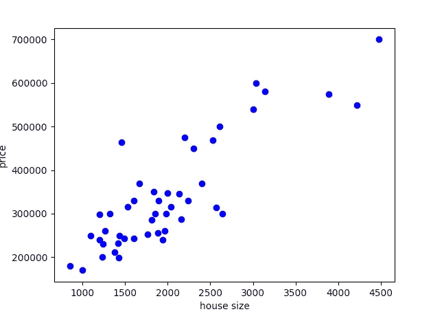
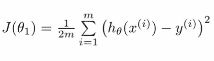
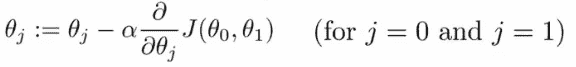
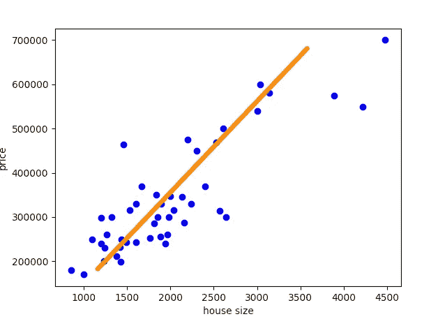
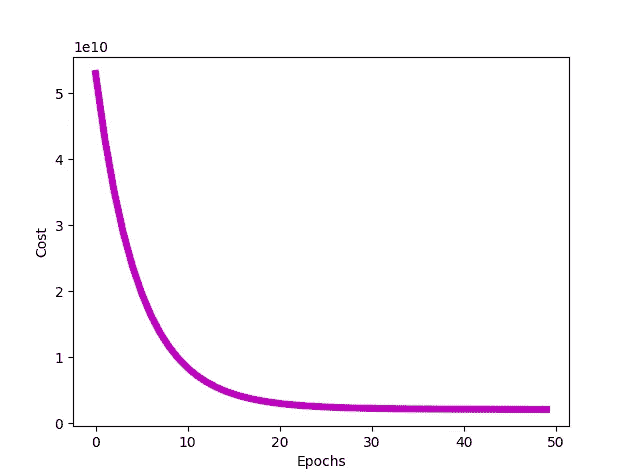

# 从头开始编码线性回归

> 原文：<https://towardsdatascience.com/coding-linear-regression-from-scratch-c42ec079902?source=collection_archive---------0----------------------->

## 使用 python 从零开始实现线性回归

由 [NASA](https://unsplash.com/@nasa?utm_source=medium&utm_medium=referral) 在 [Unsplash](https://unsplash.com?utm_source=medium&utm_medium=referral) 上拍摄的照片

这篇文章是“基础与超越”系列中的线性回归文章的后续，所以如果你刚刚开始机器学习，我建议你先看完那篇文章，然后从这篇教程开始。如果你已经知道什么是线性回归，那么让我们开始吧！

 [## 基础与超越:线性回归

### 这篇文章将带你从最基本的开始进行线性回归。当开始机器学习线性…

medium.com](https://medium.com/analytics-vidhya/basics-and-beyond-linear-regression-c12d99a4df35) 

在本帖中，我们将使用 python 从头开始编写整个线性回归算法，所以今天我们真的要动手了！

我们走吧！

# 数据

任何机器学习问题的第一步都是获取数据。如果没有可以“学习”的东西，就没有机器“学习”。因此，在本教程中，我们将使用一个非常常见的数据集进行线性回归，即房价预测数据集。数据集可以在 这里找到 [**。**](https://github.com/kumudlakara/Medium-codes/blob/main/linear_regression/house_price_data.txt)

这是一个包含俄勒冈州波特兰房价的简单数据集。第一栏是房子的大小(平方英尺)，第二栏是卧室的数量，第三栏是房子的价格。您可能已经注意到，我们的数据集中有多个要素(即 house_size(以平方英尺为单位)和房间数量)，因此我们将查看多元线性回归，标签( *y* )将是房价，因为这是我们将要预测的价格。

让我们定义加载数据集的函数:

稍后我们将调用上面的函数来加载数据集。该函数返回 *x* 和 *y* (注意 *x* 由数据集的前 2 列组成，而 *y* 是数据集的最后一列，因为它是价格列，因此为了返回 *x* 和 *y* ，我们将分别从函数中返回`data[:,:2]`和`data[:,-1]` )。

## 标准化数据

上面的代码不仅加载数据，而且*对其进行归一化*并绘制数据点。我们一会儿会看一下数据图，但首先让我们理解上面的`normalize(data)`行是干什么的。如果您查看 [**原始数据集**](https://github.com/kumudlakara/Medium-codes/blob/main/linear_regression/house_price_data.txt) ，您会注意到第二列中的值(即房间数量)比第一列中的值(即房屋大小)小得多。我们的模型不会将这些数据作为房间数量或房屋大小来评估。对于模型来说，它只是数字。这可能会在您的机器学习模型中产生一种不必要的偏向，即偏向数值比其他列(或特征)高的列。它还会造成方差和数学平均值的不平衡。出于这些原因，也为了使工作更容易，建议您缩放或归一化您的要素，使它们都位于相同的范围内(例如[-1 比 1]或[0 比 1])。这使得训练更加容易。因此，出于我们的目的，我们将使用*特征归一化*，从数学意义上来说，它意味着:

> Z = (x — μ) / σ
> 
> μ:平均值
> 
> σ:标准偏差

在上面的公式中 *z* 是我们的归一化特征， *x* 是非归一化特征。如果你对这些数学概念不是很熟悉，也不用担心。快速回顾会让你开始行动。好了，现在我们有了归一化公式，让我们做一个归一化函数:

这段代码正是我们所讨论的。它遍历每一列，并使用这些元素的平均值和标准偏差对该列的所有数据元素进行标准化。

## 绘制数据

现在，在我们开始编写线性回归模型之前，我们需要问的一件事是**为什么**？

为什么我们要用线性回归来解决这个问题？这是一个非常有效的问题，在实际跳到任何具体的代码之前，你应该非常清楚你想要使用什么算法，以及对于给定的数据集和你试图解决的问题，那个*是否真的是最好的选择。我们可以证明为什么使用线性回归对我们当前的数据集有效的一种方法是绘制它。为此，我们在上面的`load_data`中调用了`plot_data`函数。现在让我们定义`plot_data`函数:*

该函数在被调用时会生成以下图形:

房屋面积与房价的关系图(图片来源:作者提供)

你可以看到，通过上面的图可以大致拟合出一条线。这意味着一个线性近似将实际上允许我们做出相当准确的预测，因此我们选择线性回归。

现在我们已经准备好了数据，让我们进入有趣的部分。编码算法！

# 假设

首先，我们需要定义我们的假设函数是什么样的，因为我们以后会用这个假设来计算成本。我们知道对于线性回归我们的假设是:

*hθ(x) = θ0 + θ1x1 + θ2x2 + θ3x3 +…..+ θnxn*

然而，我们的数据集只有 2 个特征，因此对于我们当前的问题，假设是:

*hθ(x) = θ0 + θ1x1 + θ2x2*

其中 *x1* 和 *x2* 为两个特征(即房屋大小和房间数量)。让我们将它放入一个简单的 python 函数中，该函数返回假设:

矩阵乘法是怎么回事？！不要担心，它仍然给我们相同的假设方程，我们将在这篇文章的后面更深入地研究为什么这在数学上是正确的。

好了，现在我们有了假设函数，下一个重要的是成本函数。

# 价值函数

为了评估我们模型的质量，我们使用了成本函数。同样，这篇文章是以下内容的“代码版本”:

 [## 基础与超越:线性回归

### 这篇文章将带你从最基本的开始进行线性回归。当开始机器学习线性…

medium.com](https://medium.com/analytics-vidhya/basics-and-beyond-linear-regression-c12d99a4df35) 

因此，如果这里有什么不明白的地方，你可以浏览一下，或者跟着这两篇文章走。好了，成本函数的等式是:

来源:[霍尔豪斯](https://www.holehouse.org)

我们成本函数的代码是:

仔细观察，您可能会注意到，到目前为止我们定义的所有 python 函数都与我们之前为线性回归定义的数学方法完全相同。现在我们有了成本，我们必须最小化它，为此我们使用…是的，梯度下降！

# 梯度下降

在我们的上下文中，梯度下降是一种优化算法，旨在调整参数以最小化成本函数。

梯度下降的主要更新步骤是:

来源:[霍尔豪斯](https://www.holehouse.org)

所以我们把代价函数的导数乘以学习率( *α)* ，再从参数的现值( *θ* )中减去，得到新的更新参数( *θ* )。

`gradient_descent`函数返回`theta`和`J_all`。`theta`显然是我们的参数向量，其包含假设的 *θs* 的值，并且`J_all`是包含每个时期之后的成本函数的列表。`J_all`变量并不完全是*必需的*，但是它有助于更好地分析模型，你将在后面的文章中看到。

# 把所有的放在一起

现在剩下要做的就是按照正确的顺序调用我们的函数:

我们首先调用`load_data`函数来加载 *x* 和 *y* 的值。 *x* 包含训练示例，而 *y* 包含标签(在我们的例子中是房价)。

你可能已经注意到，在整个代码中，我们一直在使用矩阵乘法来实现我们想要的表达式。例如，为了获得假设，我们必须将每个参数( *θ* )与每个特征向量( *x* )相乘。我们可以使用*进行*循环，循环每个示例，每次都执行乘法。但是，如果我们有 1000 万个训练示例，这将不是最有效的方法。这里更有效的方法是使用矩阵乘法。如果你对矩阵乘法不是很熟悉，我建议你 [**复习一遍**](https://www.mathsisfun.com/algebra/matrix-multiplying.html) ，它相当简单。对于我们的数据集，我们有两个特征(即房屋大小和房间数量)，因此我们将有(2+1) 3 个参数。额外的参数 *θ0* 可以通过考虑假设在图形意义上只是一条线来说明。所以额外的 *θ0* 说明这条线是符合要求的。

有利假设函数图(来源:图片由作者提供)

好了，我们有 3 个参数和 2 个特征。这意味着我们的 *θ* 或参数向量(一维矩阵)将具有维度(3，1)，但是我们的特征向量将具有维度(46，2){根据我们的数据集}。你可能已经注意到，这两个矩阵相乘在数学上是不可能的。让我们再次看看我们的假设:

*hθ(x) = θ0 + θ1x1 + θ2x2*

如果你仔细观察，它实际上是非常直观的，如果我们在我们的特征向量(x)的开始添加一个额外的 1 的列{使它具有维度(46，3)}并且如果我们对 x 和θ执行矩阵乘法，我们实际上将得到上面的等式 *hθ(x)。如果还是不明显，那就试着在纸上画一个例子。*

请记住，当我们实际运行代码来实现这个函数时，我们不会返回类似于 *hθ(x)* 的表达式，而是返回这个表达式所计算出的数学值。

在上面的代码中,`x = np.hstack((np.ones((x.shape[0],1)), x))` 行在 x 的开头添加了一列额外的 1，以允许所需的矩阵乘法。

在这之后，我们用零初始化θ向量。你也可以用一些小的随机值初始化它。我们还指定学习速率和我们想要训练的时期数(时期是算法将遍历整个数据集的次数)。

一旦我们定义了所有的超参数，我们调用梯度下降函数，它返回所有成本函数的历史和参数的最终向量`theta`。这个`theta`向量本质上定义了我们的最终假设。您可能会注意到梯度下降函数返回的`theta`向量的形状具有维度(3，1)。还记得我们的假设函数吗？

*hθ(x) = θ0 + θ1x1 + θ2x2*

我们需要 3 个 *θs* ，我们的`theta`向量的维数是(3，1)，因此`theta[0]`、`theta[1]`和`theta[2]`实际上分别是 *θ0、θ1* 和 *θ2* 。`J_all`变量只不过是所有成本函数的历史。您可以打印`J_all`数组来查看成本函数如何在每个梯度下降的时期逐渐降低。

成本与时代数量的关系图(来源:作者提供的图片)

可以通过定义和调用 plot_cost 函数来绘制此图，如下所示:

现在，我们可以使用这些参数来查找标签，即给定房屋大小和房间数量的任何房屋(在俄勒冈州波特兰市)的价格。

# 试验

现在，您可以调用一个测试函数来测试您的代码，该函数将房子的大小、房间的数量以及由我们的线性回归模型返回的最终`theta`向量作为输入，并将给出房子的价格。

# 完整的代码

# 就是这样！

信不信由你，这就是线性回归编码的全部内容。恭喜你！现在，您已经完全从头开始成功地编写了一个线性回归模型。能够理解并编码整个算法并不容易，所以你可以为自己的成功感到自豪。线性回归通常是我们开始机器学习的第一个算法，所以如果你理解我们在这里做的事情，我建议你选择另一个数据集(用于线性回归)，并尝试自己应用线性回归。快乐编码:)

# 参考

您可以在此找到完整的代码和数据集，以供参考:

 [## kumudlakara/中等代码

### 线性回归房价预测代码

github.com](https://github.com/kumudlakara/Medium-codes/tree/main/linear_regression) 

1.  [https://medium . com/analytics-vid hya/basics-and-beyond-linear-regression-c 12d 99 a4 df 35](https://medium.com/analytics-vidhya/basics-and-beyond-linear-regression-c12d99a4df35)
2.  [https://www.coursera.org/learn/machine-learning/home/](https://www.coursera.org/learn/machine-learning/home/week/1)
3.  【https://www.holehouse.org 号