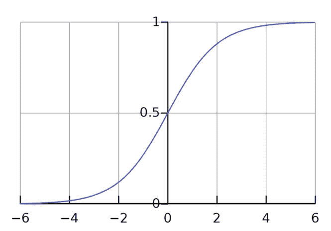
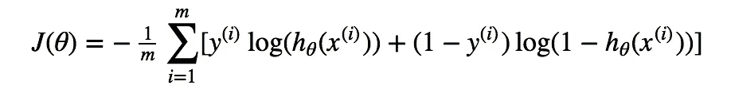
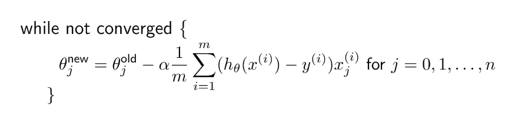
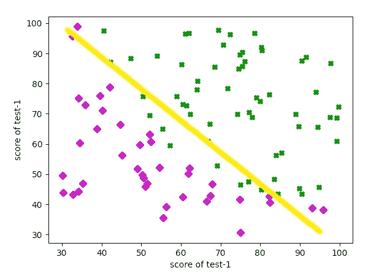
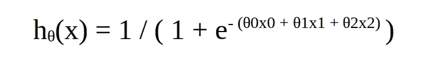
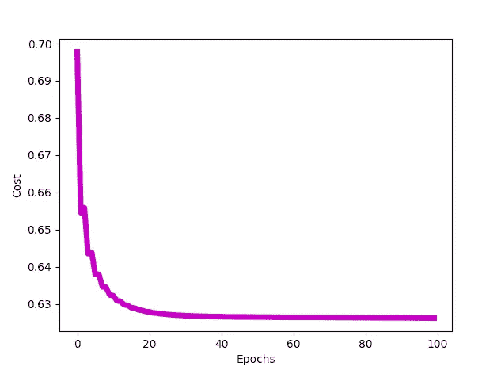

# 从头开始编码逻辑回归

> 原文：<https://towardsdatascience.com/coding-logistic-regression-from-scratch-d18b4fbfca8a?source=collection_archive---------17----------------------->

## 使用 python 从零开始实现逻辑回归。

由 [NASA](https://unsplash.com/@nasa?utm_source=medium&utm_medium=referral) 在 [Unsplash](https://unsplash.com?utm_source=medium&utm_medium=referral) 上拍摄的照片

这篇文章是“基础知识及以后”系列中的逻辑回归文章的后续。因此，如果你是机器学习的新手，那么我建议你先浏览一下这篇文章，但是如果你已经知道什么是逻辑回归，那么让我们开始工作吧！

 [## 基础与超越:逻辑回归

### 一点一点拆开逻辑回归算法

medium.com](https://medium.com/analytics-vidhya/basics-and-beyond-logistic-regression-34549d2ee800) 

在这篇文章中，我们将使用 python 编写一个逻辑回归模型。所以让我们开始吧！

# 数据

任何机器学习算法的核心都是数据。你的机器学习模型总是需要数据来“学习”。因此，为了我们今天的目的，我们将使用一个非常简单的学生录取结果数据集，可以在这里找到**。**

**该数据集包含申请者的历史记录。一个记录包括申请人在两次入学考试中的成绩和最终的录取决定(无论该考生是否被录取)。我们今天的目标是建立一个逻辑回归模型，它将能够决定(或者更好地分类)一个申请人是否应该被录取。在我们的数据集中，前两列是两个测试中的标记，第三列是以二进制编码的决策标签( *y* )(即 *y* = 1，如果允许，而 *y* = 0，如果不允许)。我们的目的是预测这个标签 *y* 。**

**好了，现在我们知道了数据的样子，让我们定义一个函数来加载数据。**

**稍后我们将调用上面的函数来加载数据集。该函数返回 *x* 和 *y* (注意 *x* 由数据集的前 2 列组成，而 *y* 是数据集的最后一列，因为它是结果列，因此为了返回 *x* 和 *y* ，我们将从函数中分别返回`data[:,:2]`和`data[:,-1]` )。**

**您可能已经注意到了`load_data`函数中的另一个函数调用:`plot_data(data[:, :2], data[:, -1])`。如果你已经阅读了“[从头开始编码线性回归](/coding-linear-regression-from-scratch-c42ec079902)”这篇文章，你可能已经知道这个函数在做什么，你可以直接跳到这篇文章有趣的编码部分，但是如果你还没有，那就留下来，因为我们将要更深入地研究我们数据的分布。**

## **绘制数据**

**在我们开始编码我们的模型之前，让我们花一点时间来分析我们的数据。这将允许我们理解为什么(如果有的话)逻辑回归是我们给定数据集和相关问题的出路。**

**为了可视化数据，让我们定义从`load_data`调用的`plot_data`函数。**

**该函数在被调用时会生成以下图形:**

****

**数据图(来源:图片由作者提供)**

**只需快速浏览一下上面的图，就可以清楚地看到，我们的数据确实有一个决策边界，在这种情况下，它似乎是一条直线。这里需要特别注意的是，我们的决策边界很简单，因为我们的数据集恰好分布在决策边界近似为一条直线的地方。需要注意的是，逻辑回归可以用来预测比我们当前问题所显示的更复杂的决策边界。使用逻辑回归甚至可以预测椭圆和非几何决策边界。**

**唷，那是很难接受的。好了，现在我们已经准备好数据，让我们开始编码实际的线性回归模型！**

# **假设**

**定义模型架构的第一步是定义假设。我们知道线性回归的假设实际上是 sigmoid 函数，所以从数学上讲，我们的假设是:**

****

**来源:作者**

**sigmoid 函数看起来像这样:**

****

**sigmoid 函数图(来源:图片由作者提供)**

**现在让我们定义一个简单的 python 函数，它反映了数学等式:**

**我们将该函数命名为 sigmoid，而不是 hypothesis 或 *h* ，当您在程序的后面部分看到该函数在语句中被调用时，例如在`h = sigmoid(x@theta)`中，这将变得更加直观。**

**好了，现在我们有了假设，让我们进入下一步，即成本函数。**

# **价值函数**

**为了评估我们的模型输出的质量，在我们的例子中是 *y* =1(承认)或 *y* =0(拒绝)，我们使用了成本函数。**

**如果你感到有点失落，你可以随时关注“基础和超越:逻辑回归”的帖子，因为这个帖子正是那个帖子的代码版本。**

** [## 基础与超越:逻辑回归

### 一点一点拆开逻辑回归算法

medium.com](https://medium.com/analytics-vidhya/basics-and-beyond-logistic-regression-34549d2ee800) 

好了，为了我们的目的，让我们直接跳到逻辑回归的成本函数方程:

逻辑回归的成本函数(来源:作者)

同样的代码是:

看到我们在每个训练示例中单独使用矩阵乘法而不是实际求和，这可能看起来很荒谬。使用矩阵乘法实际上达到了同样的结果。我们将在稍后的文章中讨论这个问题。

现在我们有了成本函数，接下来呢？我们的目标是总是最小化我们模型的成本，所以如果我们有了成本函数，我们就有可能找到最小化它的方法。有许多方法(有些甚至比我们将要使用的方法更有效)来最小化成本函数，但是因为我们在这里的目的是完全从头开始编码，所以我们将编码梯度下降算法来最小化成本函数，而不是使用“开箱即用”的优化器。那么让我们直接进入梯度下降。

# 梯度下降

在我们的上下文中，梯度下降是一种优化算法，旨在调整参数以最小化成本函数。

梯度下降的主要更新步骤是:

来源: [holehouse](https://www.holehouse.org)

这里我们可以看到这个算法其实和线性回归的算法是一样的。然而，唯一的区别是假设函数 *h(x)* 的定义，它是逻辑回归情况下的 sigmoid 函数。于是我们把代价函数的导数乘以学习率( *α)* ，再从参数的现值( *θ* )中减去，得到新的更新参数( *θ* )。让我们用 python 再说一遍:

`gradient_descent`函数返回`theta`和`J_all`。`theta`显然是我们的参数向量，其包含假设的 *θs* 的值，而`J_all`是包含每个时期之后的成本函数的列表。`J_all`变量并不完全是*必需的*，但它有助于更好地分析模型，你将在后面的文章中看到。

# 把所有的放在一起

现在我们已经定义了所有的函数，我们需要做的就是以正确的顺序调用它们。

我们首先调用`load_data`函数来加载 *x* 和 *y* 的值。 *x* 包含训练样本， *y* 包含标签(在我们的例子中是录取结果)。

你可能已经注意到，在整个代码中，我们一直在使用矩阵乘法来实现我们想要的表达式。例如，为了得到假设，我们必须将每个参数( *θ* )与每个特征向量( *x* )相乘，并将其传递给 sigmoid 函数。我们可以使用 *for* loops for this，并在每个示例上循环，每次都执行乘法，但是如果我们有 1000 万个训练示例，这将不是最有效的方法。这里更有效的方法是使用矩阵乘法。如果你对矩阵乘法不是很熟悉，我建议你 [**复习一遍**](https://www.mathsisfun.com/algebra/matrix-multiplying.html) ，它相当简单。对于我们的数据集，我们有两个特征(即申请人在两次测试中的分数)，因此我们将有(2+1) 3 个参数。额外的 *θ0* 说明我们的决策边界(在我们的例子中是一条近似的线)是必需的。

有利假设函数图(来源:作者图片)

好的，我们有 3 个参数和 2 个特征。这意味着我们的 *θ* 或参数向量(一维矩阵)将具有维度(3，1)，但是我们的特征向量将具有维度(99，2){根据我们的数据集}。你可能已经注意到，这两个矩阵相乘在数学上是不可能的。然而，如果我们在特征向量的开头添加一列额外的 1，我们将得到两个维度为(99，3)和(3，1)的矩阵。这两个矩阵现在在尺寸上是兼容的。

在上面的代码中，`x = np.hstack((np.ones((x.shape[0],1)), x))` 行在 *x* 的开头添加了一列额外的 1，以便根据需要进行矩阵乘法。

在这之后，我们用零初始化θ向量。你也可以用一些小的随机值初始化它。我们还指定学习速率和我们想要训练的时期数(时期是算法将遍历整个数据集的次数)。

一旦我们定义了所有的超参数，我们调用梯度下降函数，它返回所有成本函数的历史和参数的最终向量`theta`。这个`theta`向量本质上定义了我们的最终假设。您可能会注意到梯度下降函数返回的`theta`向量的形状具有维度(3，1)。请记住，我们数据集中的每个单独的训练示例也有 3 个字段(2 个原始特征和 1 个后来添加的额外列)。因此，最终的`theta`向量的每个元素，即`theta[0]`、`theta[1]`和`theta[2]`实际上分别是 *θ0、θ1* 和 *θ2* ，并且对应于我们的训练示例的每个字段的参数。所以现在我们的最终假设看起来是这样的:

来源:作者

`J_all`变量只不过是所有成本函数的历史。您可以打印`J_all`数组来查看成本函数如何在每个梯度下降的时期逐渐降低。

成本与时代数量的关系图(来源:作者提供的图片)

该图可以通过定义和调用`plot_cost`函数来绘制，如下所示:

现在，我们可以简单地插入我们的参数，并从我们的模型中获得预测。但是等等？！我们的模型没有预测 *y* =0 或 *y* =1，事实上我们模型的输出是一个浮点数。这实际上是应该发生的。奇怪的浮点输出实际上是一个例子属于类 *y* =1 的概率。所以我们现在需要给我们的模型添加最后一个函数。这是预测部分。

# 预测

让我们定义一个简单的函数来解释我们模型的概率输出，以预测 *y=1(承认)*或 *y=0(拒绝)*。

上面的代码在概率(我们模型的输出)大于等于 0.5 的情况下，将示例分类为属于 *y* =1(录取)类(或组)，否则输出 *y* =0(拒绝)。

# 试验

现在，您可以通过调用一个测试函数来测试您的代码，该函数将申请人在两次测试中的分数大小和由我们的逻辑回归模型返回的最终`theta`向量作为输入，并将向我们提供申请人是否应该被录取的最终结果。

# 完整的代码

# 就是这样！

嗯，差不多就是这样。您现在可以完全从头开始编写逻辑回归代码。能够理解完整的算法并编码它，不是一件容易的事情，所以，干得好！如果你对我们在这篇文章中提到的例子感到满意，请随意挑选另一个数据集(用于逻辑回归)并尝试一下。

编码快乐！:)** 

# **参考**

**您可以在此找到完整的代码和数据集，以供参考:**

** [## kumudlakara/中等代码

### 用逻辑回归预测学生录取结果代码

github.com](https://github.com/kumudlakara/Medium-codes) 

1.  [https://medium . com/analytics-vid hya/basics-and-beyond-logistic-regression-34549 D2 ee 800](https://medium.com/analytics-vidhya/basics-and-beyond-logistic-regression-34549d2ee800)
2.  【https://www.coursera.org/learn/machine-learning/home/ 号
3.  【https://www.holehouse.org **