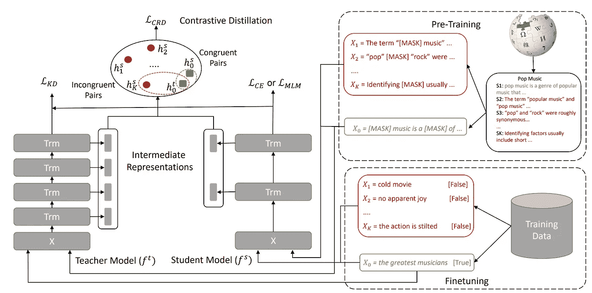

# CODIR:训练更小、更快的 NLP 模型

> 原文：<https://towardsdatascience.com/codir-train-smaller-faster-nlp-models-bac6318a9950?source=collection_archive---------79----------------------->

## 知识提炼的独特方法

亚当·温格在 [Unsplash](https://unsplash.com?utm_source=medium&utm_medium=referral) 上的照片

随着 BERT 和 GPT-3 等大型预训练模型的出现，自然语言处理领域发生了革命性的变化。这些模型已经能够从它们接受训练的大量文本中捕获难以置信的大量信息，并使用这些信息来达到最先进的性能，并不断改进各种各样的任务，如分类、摘要和推理。

这些型号性能出色的一个原因是它们的尺寸。BERT-base 有 1.1 亿个参数，BERT-large 有 3.4 亿个参数，GPT-2 有 15 亿个参数，GPT-3 有 1750 亿个参数。随着这些模型规模的增长，预处理它们所需的时间和资源也在增加。为了提高这些模型的成本和资源效率，一系列专注于减小模型大小的研究正在兴起。为此，采用了几种技术:

*   **量化**专注于减少模型权重的大小(从 32 位数减少到 16 或 8 位数)。
*   **修剪**识别冗余权重并尝试丢弃它们。
*   **知识蒸馏**专注于通过尝试将较大的模型(教师)与较小的模型(学生)匹配来创建较小的微调模型。像 DistilBERT 和 MobileBERT 这样的模型扩展了这个概念，使用 BERT 老师创建了更小的预训练模型。

一般来说，知识提炼包括两个部分:

1.  **原始训练目标:**该目标着重于让学生模型学习正确的标签(在微调期间)或正确的预训练目标
2.  **提炼目标:**这个目标试图将学生的输出概率(以及可能的隐藏状态)与教师的输出概率相匹配。这是通过选择一个距离度量并最小化学生和老师之间的距离来实现的。

微软动态 365 人工智能研究所的研究人员试图通过不同的视角来解决蒸馏问题。与其尝试最小化老师和学生之间所有例子的距离，为什么不尝试最大化错误例子之间的距离，最小化真实例子之间的距离？这导致他们提出了 CODIR，一种使用对比学习向学生提取教师隐藏状态的技术。CODIR 可应用于预训练和微调阶段。

与传统的知识提炼技术不同，CODIR 有 3 个组成部分:

1.  **最初的训练目标:**这与常规 KD 相同
2.  **蒸馏目标:**与常规 KD 不同，该目标使用 KL 散度损失来教导学生预测与教师相似的概率分布。它只适用于学生模型的输出。
3.  **对比学习目标:**该目标着重于将学生的隐藏状态与教师的隐藏状态拉开距离，以获得负面示例，并将其与正面示例相匹配。

孙等人的 CODIR 训练框架。

将 CODIR 应用于微调阶段非常简单。因为训练样本有标签，所以负样本只是那些与正样本有不同标签的样本。

在预培训阶段，没有标签，因此应用对比学习目标变得更具挑战性。研究人员在 RoBERTa 模型上测试 CODIR，该模型使用掩蔽语言建模作为预训练目标。在这种情况下，反面例子是来自同一篇文章的被掩盖的句子或文本，因此它们在语义上与正面例子相似。这样，对比学习的目标就不会变得太容易解决。

研究人员使用 CODIR 将 Roberta 模型减少到 6 层，并在 GLUE 数据集上验证其有效性。该模型实现了与原始 BERT 模型几乎相同的精度，而推理时间只有原来的一半。

这里有一个[链接](https://arxiv.org/pdf/2009.14167.pdf)到论文，如果你想了解更多关于 CODIR 的内容，一个[链接](https://github.com/intersun/CoDIR)到代码，你可以提炼出你自己的模型，点击[这里](https://aka.ms/mmai)可以看到更多我们的出版物和其他工作。

**参考文献**

1.  维克多桑，弗拉达利首次亮相，朱利安肖蒙德，和托马斯沃尔夫。2019.**蒸馏伯特，伯特的蒸馏版:更小、更快、更便宜、更轻。** arXiv 预印本 arXiv:1910.01108。
2.  孙志清、俞鸿坤、宋、刘、和周丹妮。2020. **Mobilebert:一个紧凑的任务无关的 bert，用于资源有限的设备。arXiv 预印本 arXiv:2004.02984。**
3.  孙思齐，何哲，俞成，，方，王硕航，。**“用于语言模型压缩的中间表示的对比提取”** *arXiv 预印本 arXiv:2009.14167* (2020)。