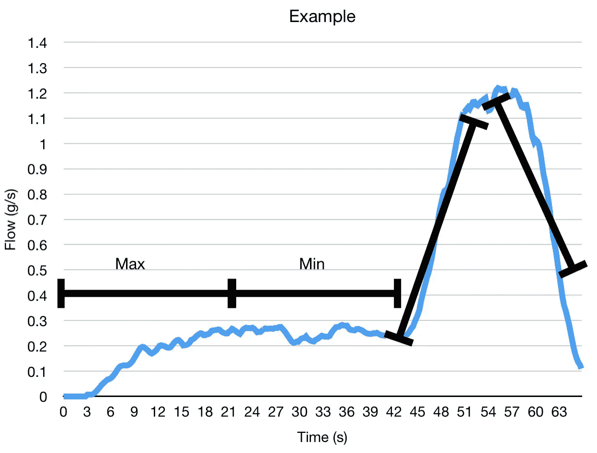
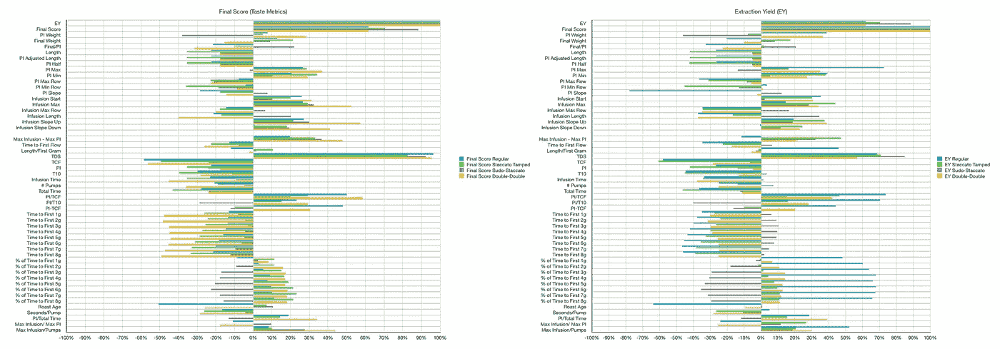
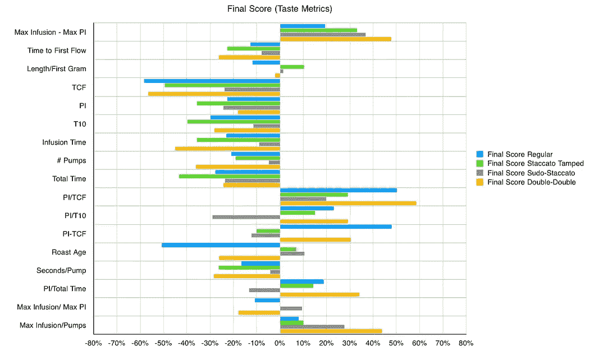
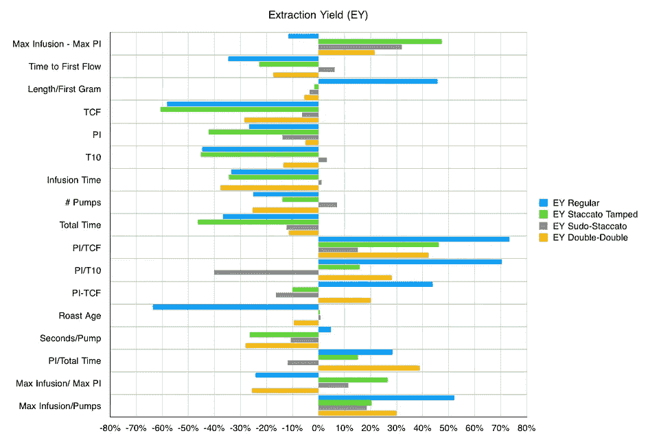
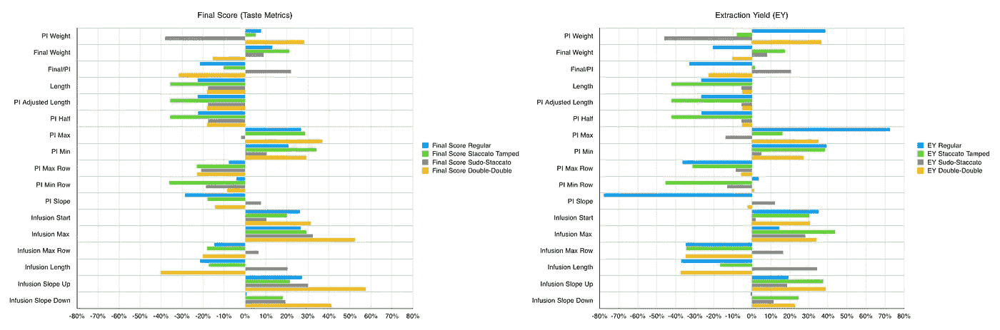

# 按镜头类型的咖啡流量分析

> 原文：<https://towardsdatascience.com/coffee-flow-analysis-by-shot-type-51bc41a5032c?source=collection_archive---------22----------------------->

## 咖啡数据科学

## 更多关于分层浓缩咖啡的分析

在之前的中，我研究了流量参数与一杯好的浓缩咖啡的关系。我没有发现任何新的东西，但后来我对镜头类型进行了细分，我开始看到一些有趣的变量。我的数据中的一个混淆变量在多种类型的分层拍摄中，它们在流动上有差异。

浓缩咖啡系列:

1.  普通浓缩咖啡
2.  [断奏被篡改](/staccato-tamping-improving-espresso-without-a-sifter-b22de5db28f6)
3.  [Sudo-Staccato](/how-to-make-sudo-staccato-espresso-with-a-niche-grinder-without-a-sifter-7b4cdcd70231)
4.  [双双](/designing-the-double-double-sudo-staccato-espresso-shot-5c435c292672?source=your_stories_page-------------------------------------)

# 绩效指标

我使用两个指标来评估技术之间的差异:最终得分和咖啡萃取。

[**最终得分**](https://towardsdatascience.com/@rmckeon/coffee-data-sheet-d95fd241e7f6) 是评分卡上 7 个指标(辛辣、浓郁、糖浆、甜味、酸味、苦味和余味)的平均值。当然，这些分数是主观的，但它们符合我的口味，帮助我提高了我的拍摄水平。分数有一些变化。我的目标是保持每个指标的一致性，但有时粒度很难确定。

**使用折射仪测量总溶解固体量(TDS)，该数字与咖啡的输出重量和输入重量相结合，用于确定提取到杯中的咖啡的百分比。**

# **流量指标**

**我编了一些我认为可能对心流感兴趣的指标。我把预输注(PI)和输注分开。我没有看压力脉动，而是平稳的流动。**

**对于预注入，我将其减半，因为通常 PI 开始缓慢，然后加速。对于输液，我看着向上和向下的趋势，如下图所示，至于我的杠杆机器，我在整个拍摄过程中积极调整流量。**

****

**此外，我还查看了喝 1 克咖啡以及 2、3、4、5、6、7 和 8 克咖啡的时间。**

**[覆盖过滤器的时间(TCF)和 T10(达到 10 毫升的时间)](/pre-infusion-for-espresso-visual-cues-for-better-espresso-c23b2542152e?source=your_stories_page-------------------------------------)这两个变量我已经使用了将近一年，以帮助在更高水平上跟踪流量的差异。它们和一杯好的浓缩咖啡有很好的相关性。**

# **数据分析**

**在我之前的[作品](/flow-analysis-over-multiple-espresso-shots-8e36b2b27069)中，我解释了我从流量日志中获得的变量。这项工作中使用的主要指标是相关性。**

**[相关性](https://en.wikipedia.org/wiki/Correlation_coefficient)是衡量两个变量彼此相似程度的指标。高度相关并不意味着一个变量会引起另一个变量，而是当情况发生变化时，两个变量的涨跌幅度相同。相关性可以是正的(趋势相同)或负的(趋势相反)。0 表示没有相关性。**

**这是按镜头类型的第一个细分:**

****

**似乎很清楚，对于常规拍摄，有一些与第一个输出权重块的时间百分比相关的流度量。**

**让我们把这些图表分成更小的部分。**

********

**π/TCF 对于普通投篮和两双来说是一个很好的指标，但对于其他人来说可能就没那么好了。压力脉动泵的数量似乎也无关紧要。对于常规拍摄，预灌注的斜率似乎影响较大。**

****

**如果我们关注不同重量的时间和达到这些重量的击球时间的百分比，一些有趣的趋势出现了。就味道而言，击球速度越快，双倍击球的味道就越好，但这并不适用于 sudo-staccato。而 EY 也有类似的趋势。**

****

**然而，达到一定重量所需的时间百分比与常规注射的高提取率高度相关。这意味着花费在预输注(PI)中的时间比例越高越好，因为前 8 至 10g 通常是在这些注射的预输注期间。**

**我从这些故障中得出的最好结论是，情况仍不明朗。似乎这些不同类型的分层快照从根本上彼此不同，因此修改每个分层快照的参数可能具有挑战性。**

**我原以为更多的数据会揭示出简单的模式或者一些新的东西，但是浓缩咖啡面临的挑战是多重的、相互关联的变量问题。我怀疑，如果找到一种简单明了的方法，全力以赴从多方面改进浓缩咖啡，那会令人失望。**

**如果你愿意，可以在 Twitter 和 YouTube 上关注我，我会在那里发布不同机器上的浓缩咖啡视频和浓缩咖啡相关的东西。你也可以在 [LinkedIn](https://www.linkedin.com/in/robert-mckeon-aloe-01581595?source=post_page---------------------------) 上找到我。也可以关注我[中](https://towardsdatascience.com/@rmckeon/follow)。**

# **[我的进一步阅读](https://rmckeon.medium.com/story-collection-splash-page-e15025710347):**

**[浓缩咖啡系列文章](https://rmckeon.medium.com/a-collection-of-espresso-articles-de8a3abf9917?postPublishedType=repub)**

**[工作和学校故事集](https://rmckeon.medium.com/a-collection-of-work-and-school-stories-6b7ca5a58318?source=your_stories_page-------------------------------------)**

**[个人故事和关注点](https://rmckeon.medium.com/personal-stories-and-concerns-51bd8b3e63e6?source=your_stories_page-------------------------------------)**

**[乐高故事启动页面](https://rmckeon.medium.com/lego-story-splash-page-b91ba4f56bc7?source=your_stories_page-------------------------------------)**

**[摄影启动页面](https://rmckeon.medium.com/photography-splash-page-fe93297abc06?source=your_stories_page-------------------------------------)**

**[改进浓缩咖啡](https://rmckeon.medium.com/improving-espresso-splash-page-576c70e64d0d?source=your_stories_page-------------------------------------)**

**[断奏生活方式概述](https://rmckeon.medium.com/a-summary-of-the-staccato-lifestyle-dd1dc6d4b861?source=your_stories_page-------------------------------------)**

**[测量咖啡磨粒分布](https://rmckeon.medium.com/measuring-coffee-grind-distribution-d37a39ffc215?source=your_stories_page-------------------------------------)**

**[咖啡萃取](https://rmckeon.medium.com/coffee-extraction-splash-page-3e568df003ac?source=your_stories_page-------------------------------------)**

**[咖啡烘焙](https://rmckeon.medium.com/coffee-roasting-splash-page-780b0c3242ea?source=your_stories_page-------------------------------------)**

**[咖啡豆](https://rmckeon.medium.com/coffee-beans-splash-page-e52e1993274f?source=your_stories_page-------------------------------------)**

**[浓缩咖啡滤纸](https://rmckeon.medium.com/paper-filters-for-espresso-splash-page-f55fc553e98?source=your_stories_page-------------------------------------)**

**[浓缩咖啡篮及相关主题](https://rmckeon.medium.com/espresso-baskets-and-related-topics-splash-page-ff10f690a738?source=your_stories_page-------------------------------------)**

**[意式咖啡观点](https://rmckeon.medium.com/espresso-opinions-splash-page-5a89856d74da?source=your_stories_page-------------------------------------)**

**[透明 Portafilter 实验](https://rmckeon.medium.com/transparent-portafilter-experiments-splash-page-8fd3ae3a286d?source=your_stories_page-------------------------------------)**

**[杠杆机维护](https://rmckeon.medium.com/lever-machine-maintenance-splash-page-72c1e3102ff?source=your_stories_page-------------------------------------)**

**[咖啡评论和想法](https://rmckeon.medium.com/coffee-reviews-and-thoughts-splash-page-ca6840eb04f7?source=your_stories_page-------------------------------------)**

**[咖啡实验](https://rmckeon.medium.com/coffee-experiments-splash-page-671a77ba4d42?source=your_stories_page-------------------------------------)**