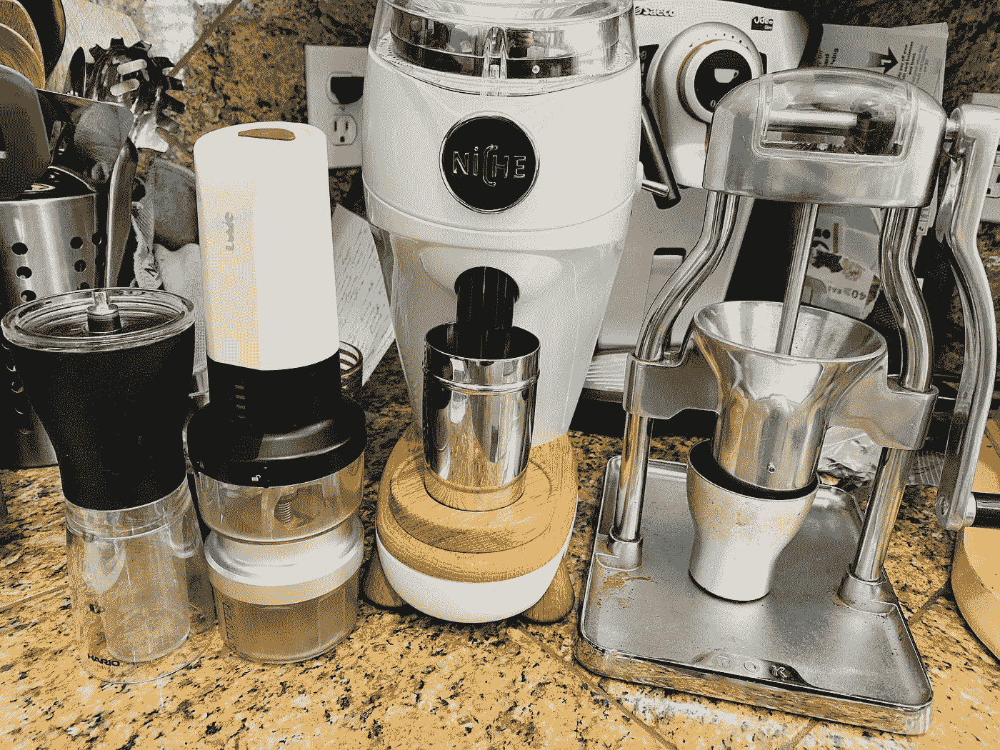
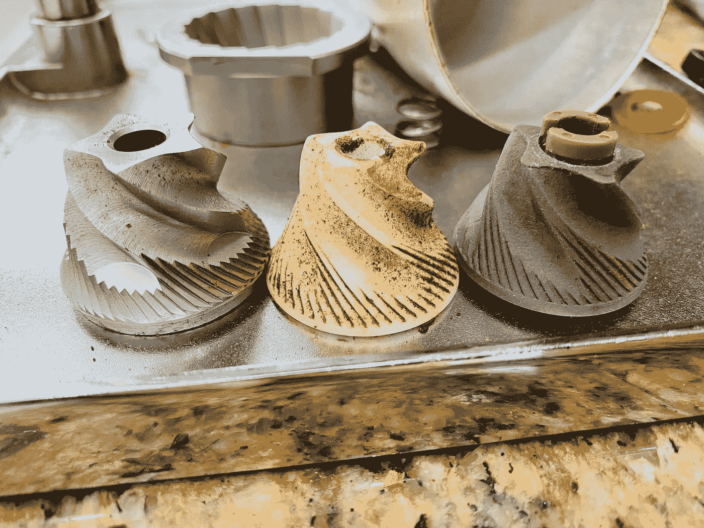
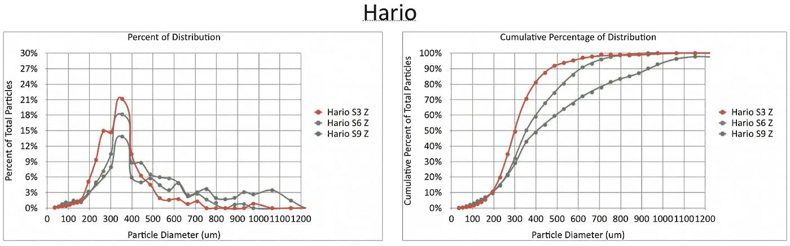
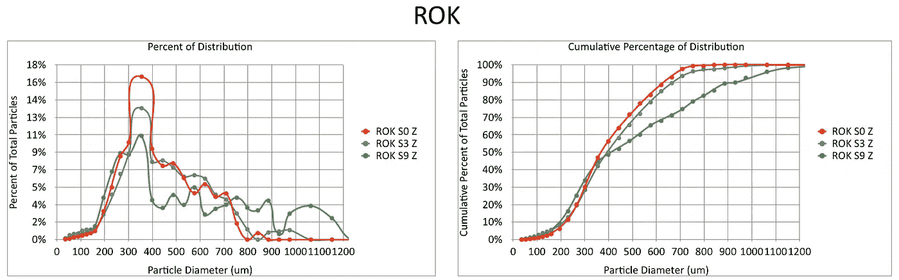
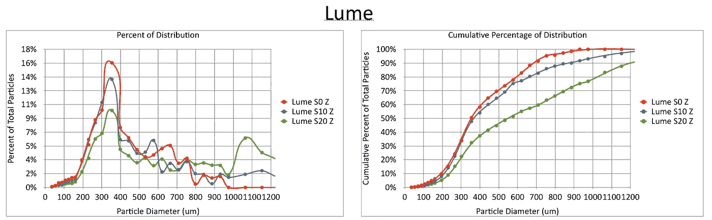
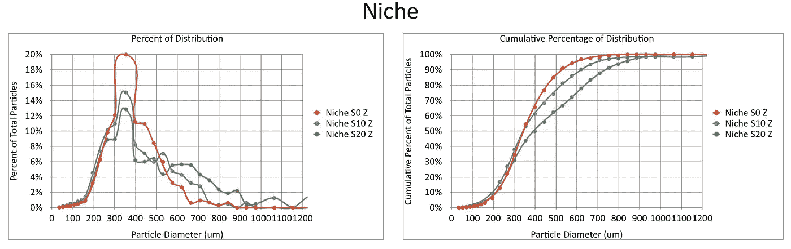
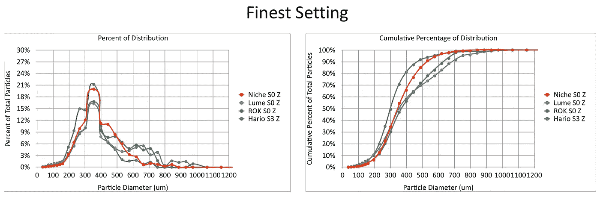
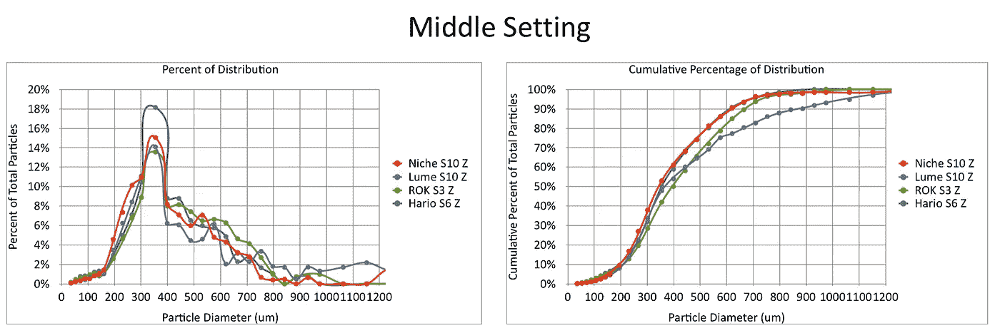
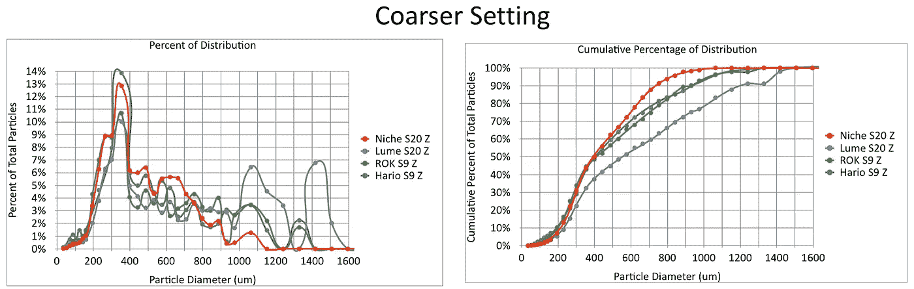

# 通过颗粒分布比较咖啡研磨机

> 原文：<https://towardsdatascience.com/coffee-grinder-comparison-via-particle-distribution-607534fe1897?source=collection_archive---------27----------------------->

## 咖啡数据科学

最近发生了两件事:我买了一个利基零，我开发了一个基于图像的颗粒分布测量方法。当我清理我的[韩国研磨机](https://link.medium.com/ehGzqpuIDeb)准备退休或搬迁时，我想我可以很容易地在几个研磨设置的研磨机之间进行比较，看看它们的性能如何。

所有图片由作者提供

我有四台研磨机，按购买顺序排列如下:

1.  [哈里欧](https://global.hario.com/seihin/productgroup.php?group=MSS-1B)
2.  [韩国](https://www.rok.coffee/)
3.  [Lume](https://www.hellolume.com/shop/lume-automatic-travel-coffee-grinder-camp-light)
4.  [小生](https://www.nichecoffee.co.uk/)

我一开始买了一个 Hario 研磨机，因为我很便宜，我没有意识到它不是一个好的浓缩咖啡研磨机。然后我买了一辆 Rok，5 年来它一直是我的支柱。我买了一辆旅行车。为了磨时间和方便，我决定买个小生。

所有的毛刺除了壁龛的。我不是为了好玩才拿出全新的刀片。顺序:韩国、Lume、Hario

研磨机比较中的大多数颗粒分布是单一研磨设置。我做了一些研磨设置，以了解研磨机如何在多种情况下工作。我尝试使用类似的点击量，通常，我知道什么是太精细，什么是太粗糙，什么是刚刚好。

# 单个研磨机数据

这里是每个研磨机的分布。

Hario 是最难操作的，因为它磨起来很慢，很难拨入。

我爱韩国。我已经用了好几年了，通常是在零位。它很好地控制了地面设置的变化。

我为旅行买了 Lume，但是它没有我想要的那么快。这是非常敏感的设置，但我已经得到了很好的咖啡。

利基是可怕的，真的允许细微的增量变化。

# 比较 3 个设置

我不认为这些设置是等价的，但我认为比较精细、中等和粗糙设置会很有趣。

Lume 在最精细的设置下有一个更多细屑的奇怪缺口，但这可能只是比其他研磨机更精细一点。

对我来说很奇怪的是，Hario 的设置 6 与 Niche 的设置 10 如此接近

这个粗的确实能看出 Lume 是怎么起飞的，但是发行还是有很多细的。我不确定这是否令人惊讶，因为它们都是锥形毛刺。

最终，我的目标是使用这种方法来更好地了解小生境，并且，私下里，我正试图在多种研磨设置中给出平面和锥形毛刺之间的量化比较。这也有助于鉴定研磨机，也许我们最终可以查看多个研磨机，以了解它们应该如何相互排序。

如果你愿意，可以在 Twitter 和 YouTube 上关注我，我会在那里发布不同机器上的浓缩咖啡视频和浓缩咖啡相关的东西。你也可以在 [LinkedIn](https://www.linkedin.com/in/robert-mckeon-aloe-01581595?source=post_page---------------------------) 上找到我。也可以关注我[中](https://towardsdatascience.com/@rmckeon/follow)。

# [我的进一步阅读](https://rmckeon.medium.com/story-collection-splash-page-e15025710347):

[浓缩咖啡系列文章](https://rmckeon.medium.com/a-collection-of-espresso-articles-de8a3abf9917?postPublishedType=repub)

[工作和学校故事集](https://rmckeon.medium.com/a-collection-of-work-and-school-stories-6b7ca5a58318?source=your_stories_page-------------------------------------)

[个人故事和关注点](https://rmckeon.medium.com/personal-stories-and-concerns-51bd8b3e63e6?source=your_stories_page-------------------------------------)

[乐高故事启动页面](https://rmckeon.medium.com/lego-story-splash-page-b91ba4f56bc7?source=your_stories_page-------------------------------------)

[摄影启动页面](https://rmckeon.medium.com/photography-splash-page-fe93297abc06?source=your_stories_page-------------------------------------)

[使用图像处理测量咖啡研磨颗粒分布](/measuring-coffee-grind-particle-distribution-using-image-processing-84882e6dd4fd?source=your_stories_page-------------------------------------)

[使用筛子改进咖啡研磨测量](/improving-coffee-grind-measurement-using-a-sifter-7b358f9c8331?source=your_stories_page-------------------------------------)

[使用先进的图像处理技术测量咖啡渣中的粉末](/measuring-fines-in-coffee-grounds-using-advanced-image-processing-148f048bdb7?source=your_stories_page-------------------------------------)

[使用自适应阈值改善咖啡研磨分布](/improving-coffee-grind-distribution-using-adaptive-thresholds-194e001f301?source=your_stories_page-------------------------------------)

[拍摄咖啡渣进行研磨分布分析](https://medium.com/nerd-for-tech/photographing-coffee-grounds-for-grind-distribution-analysis-d3494e980c28?source=your_stories_page-------------------------------------)