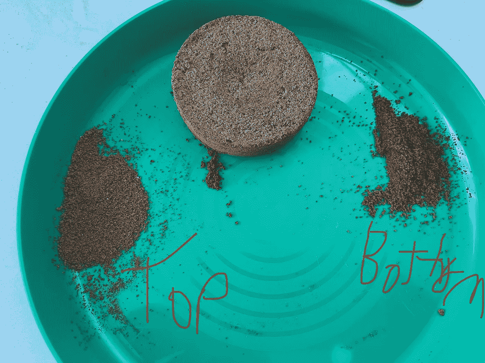
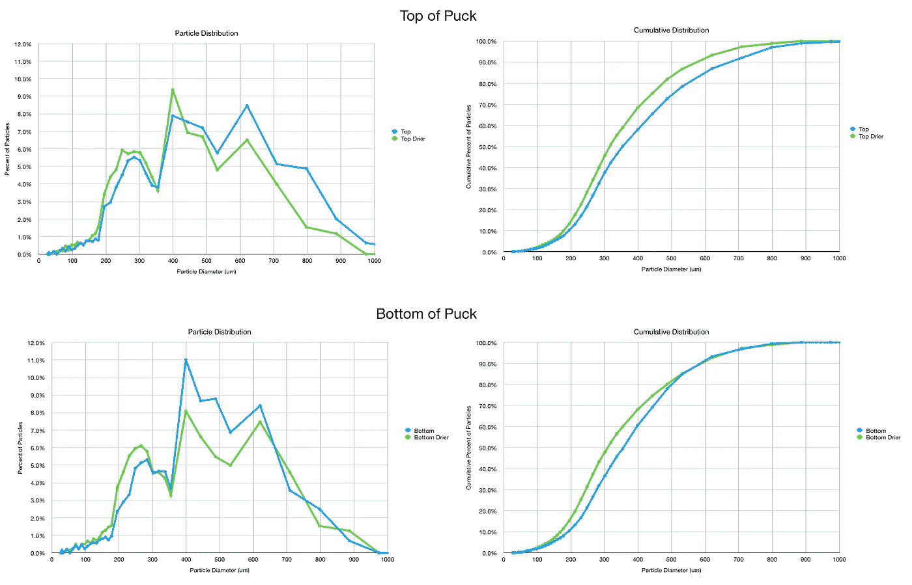
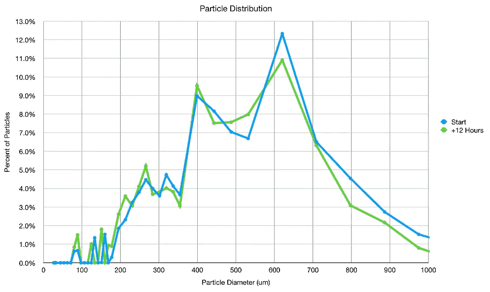
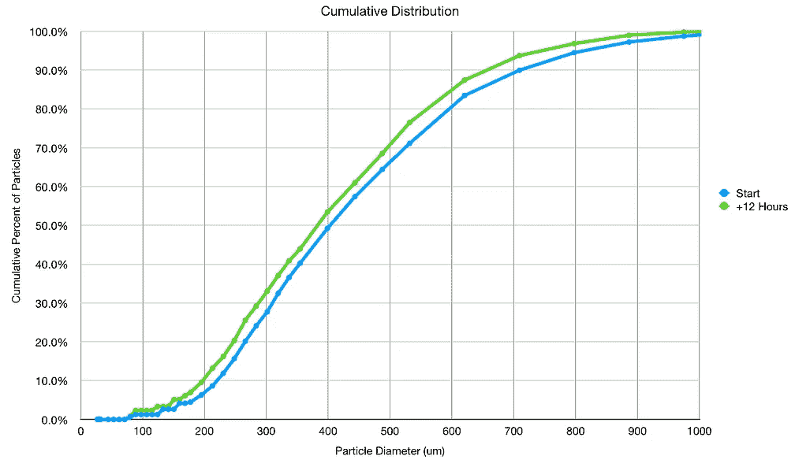
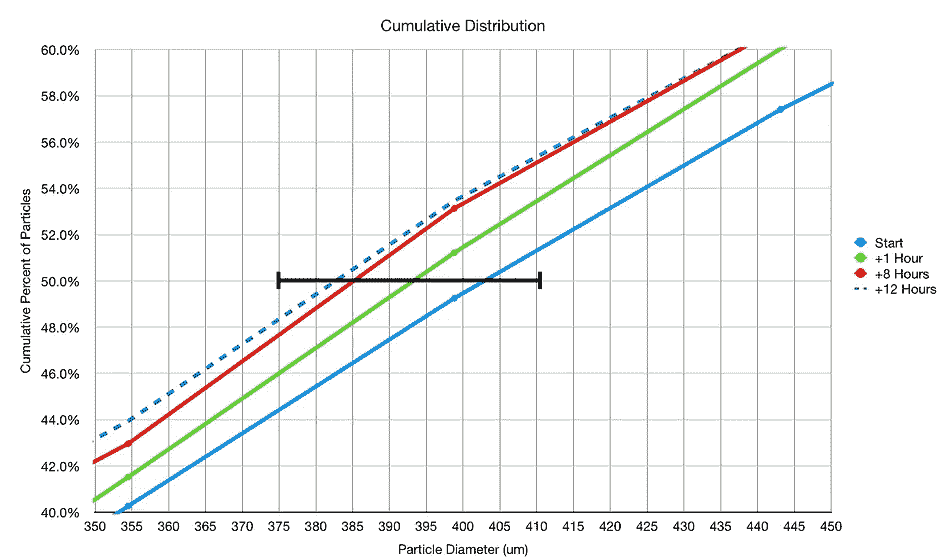
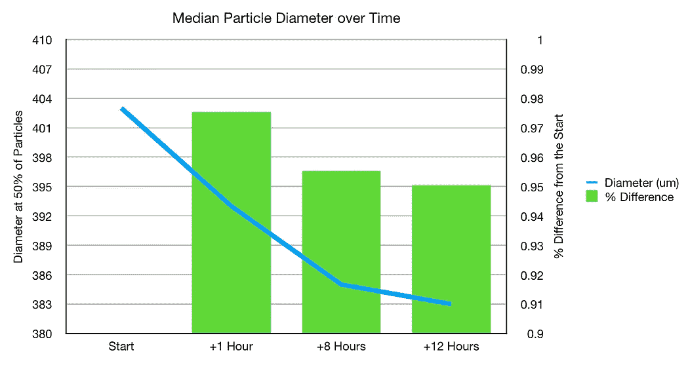

# 咖啡渣遇水膨胀

> 原文：<https://towardsdatascience.com/coffee-grounds-expand-with-water-9f0b2ddb8a56?source=collection_archive---------35----------------------->

## 咖啡数据科学

## 使用研磨分布了解水如何影响咖啡

以前，我研究过咖啡渣遇水膨胀的想法。我利用冰球缩小的体积得出了这个结论。然而，我有机会通过使用咖啡渣和研磨分布来近距离观察。我还观察了一次拍摄前后的研磨分布，由于拔牙的缘故，[的研磨面缩小了。](/post-espresso-shot-coffee-particle-distribution-bf5096d612e3?source=your_stories_page-------------------------------------)

作者的所有图片

我首先在一些数据中注意到了干燥的影响。我测量了一堆地上的两个样本的分布。更具体地说，我从一个干的用过的咖啡球的顶部和底部取样。一天后，我取了另一个样本，我注意到两个分布都发生了变化。

这是咖啡渣吸收了水分的有力证据，但我想要更多的控制，因为我测量了两个不同的样本。

所以我取了一个样本，测量了它的分布。然后我让它干 12 个小时(过夜)；我的房子很干燥。新的测量是对同一个样本进行的，在分布上有一个明确的变化。

我从一开始就测量了几次这个样本的分布，有一个明确的颗粒收缩的趋势。

这种分布上的变化是一个很好的证据，表明咖啡在提取过程中吸收了水分，随着水分从咖啡渣中变干，咖啡渣开始膨胀，这表明咖啡渣在收缩。

这些数据还表明，一旦开始拍摄，咖啡磨粒之间的[潜在间隙](/debunking-fines-migration-in-espresso-989f486eef0e)将会缩小，因此冰球内任何粒子移动的主要时间将是在拍摄的最开始。

如果你愿意，可以在推特[和 YouTube](https://mobile.twitter.com/espressofun?source=post_page---------------------------)上关注我，我会在那里发布不同机器上的浓缩咖啡照片和浓缩咖啡相关的视频。你也可以在 [LinkedIn](https://www.linkedin.com/in/robert-mckeon-aloe-01581595?source=post_page---------------------------) 上找到我。也可以在[中](https://towardsdatascience.com/@rmckeon/follow)关注我，在[订阅](https://rmckeon.medium.com/subscribe)。

# [我的进一步阅读](https://rmckeon.medium.com/story-collection-splash-page-e15025710347):

[浓缩咖啡系列文章](https://rmckeon.medium.com/a-collection-of-espresso-articles-de8a3abf9917?postPublishedType=repub)

[工作和学校故事集](https://rmckeon.medium.com/a-collection-of-work-and-school-stories-6b7ca5a58318?source=your_stories_page-------------------------------------)

[个人故事和关注点](https://rmckeon.medium.com/personal-stories-and-concerns-51bd8b3e63e6?source=your_stories_page-------------------------------------)

[乐高故事启动页面](https://rmckeon.medium.com/lego-story-splash-page-b91ba4f56bc7?source=your_stories_page-------------------------------------)

[摄影启动页面](https://rmckeon.medium.com/photography-splash-page-fe93297abc06?source=your_stories_page-------------------------------------)

[使用图像处理测量咖啡研磨颗粒分布](https://link.medium.com/9Az9gAfWXdb)

[改进浓缩咖啡](https://rmckeon.medium.com/improving-espresso-splash-page-576c70e64d0d?source=your_stories_page-------------------------------------)

[断奏生活方式概述](https://rmckeon.medium.com/a-summary-of-the-staccato-lifestyle-dd1dc6d4b861?source=your_stories_page-------------------------------------)

[测量咖啡磨粒分布](https://rmckeon.medium.com/measuring-coffee-grind-distribution-d37a39ffc215?source=your_stories_page-------------------------------------)

[咖啡萃取](https://rmckeon.medium.com/coffee-extraction-splash-page-3e568df003ac?source=your_stories_page-------------------------------------)

[咖啡烘焙](https://rmckeon.medium.com/coffee-roasting-splash-page-780b0c3242ea?source=your_stories_page-------------------------------------)

[咖啡豆](https://rmckeon.medium.com/coffee-beans-splash-page-e52e1993274f?source=your_stories_page-------------------------------------)

[浓缩咖啡滤纸](https://rmckeon.medium.com/paper-filters-for-espresso-splash-page-f55fc553e98?source=your_stories_page-------------------------------------)

[浓缩咖啡篮及相关主题](https://rmckeon.medium.com/espresso-baskets-and-related-topics-splash-page-ff10f690a738?source=your_stories_page-------------------------------------)

[意式咖啡观点](https://rmckeon.medium.com/espresso-opinions-splash-page-5a89856d74da?source=your_stories_page-------------------------------------)

[透明 Portafilter 实验](https://rmckeon.medium.com/transparent-portafilter-experiments-splash-page-8fd3ae3a286d?source=your_stories_page-------------------------------------)

[杠杆机维修](https://rmckeon.medium.com/lever-machine-maintenance-splash-page-72c1e3102ff?source=your_stories_page-------------------------------------)

[咖啡评论和想法](https://rmckeon.medium.com/coffee-reviews-and-thoughts-splash-page-ca6840eb04f7?source=your_stories_page-------------------------------------)

[咖啡实验](https://rmckeon.medium.com/coffee-experiments-splash-page-671a77ba4d42?source=your_stories_page-------------------------------------)