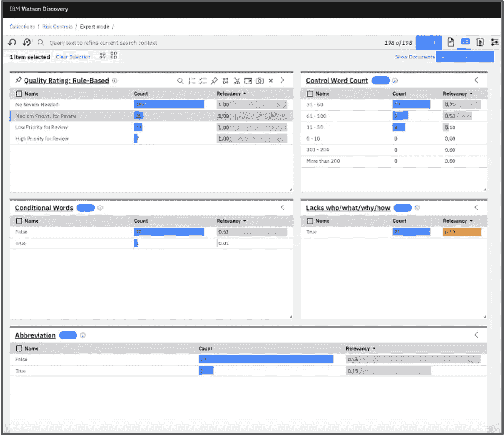
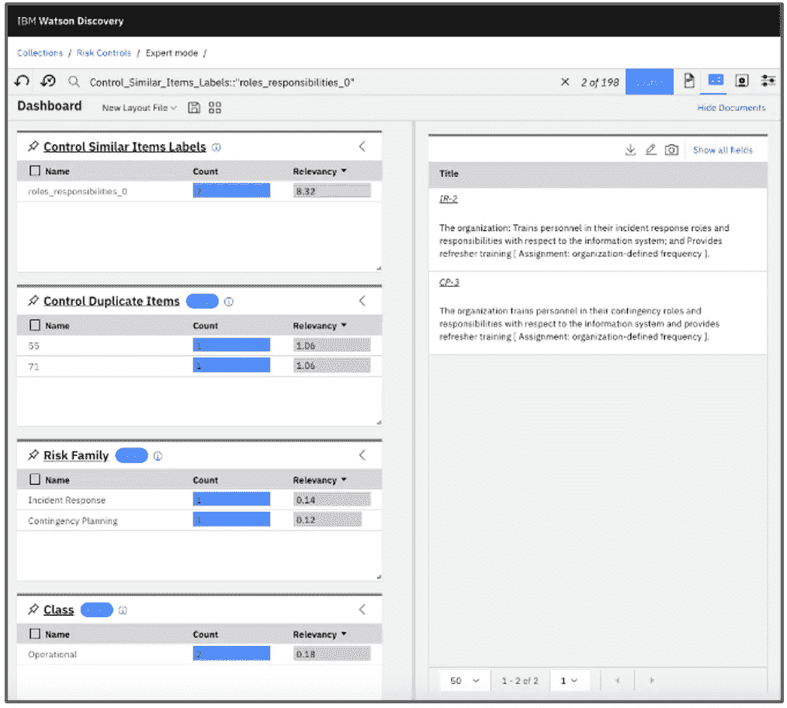
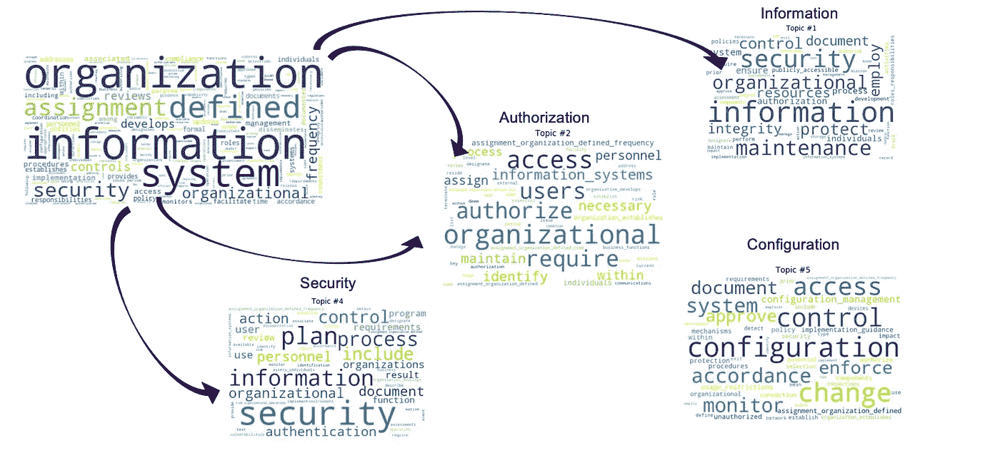
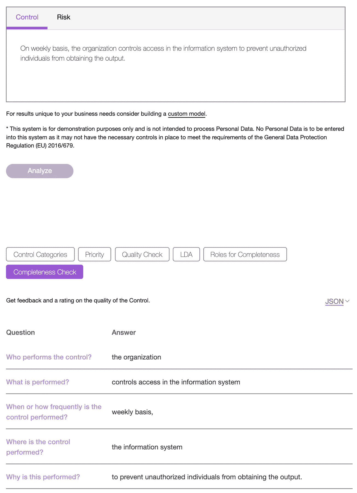
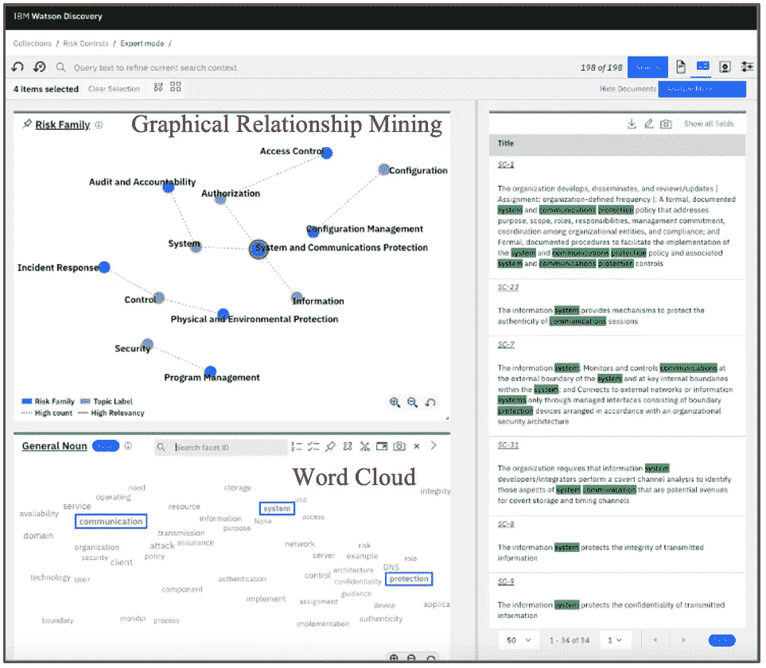
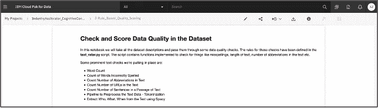
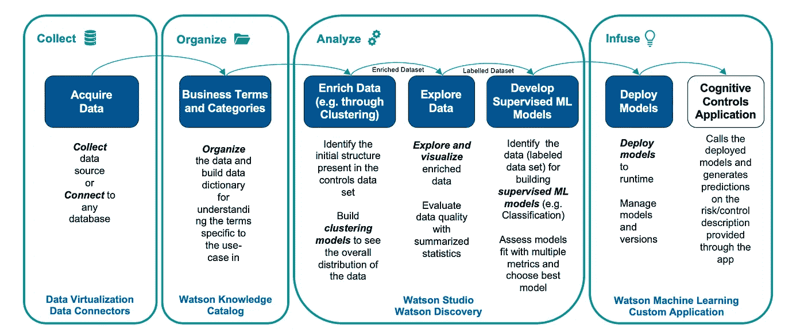
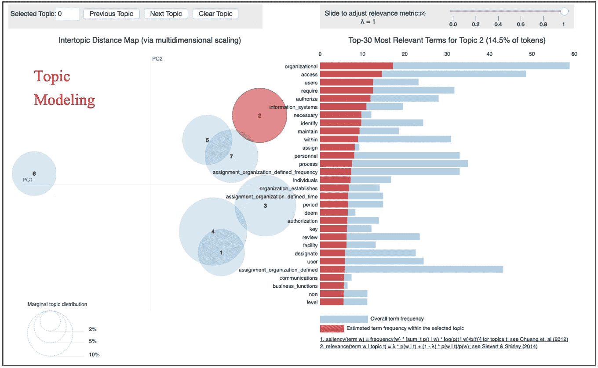

# 认知风险管理

> 原文：<https://towardsdatascience.com/cognitive-risk-management-7c7bcfe84219?source=collection_archive---------15----------------------->

## [行业笔记](https://towardsdatascience.com/tagged/notes-from-industry)

## 自然语言处理技术的商业应用

*由* [*亚历山大*](https://medium.com/@AlexanderEPtrv)*[*约翰·托马斯*](https://medium.com/@johnjaithomas)*[*李嘉图*](https://medium.com/@rbalduino)*[*马克西姆【阿拉德】*](https://medium.com/@maxime.allard) *，以及* [*阿坎克沙乔希*](https://medium.com/@aakanksha_joshi)***

****

**作者图片**

# **介绍**

**机器学习(ML)应用已经变得无处不在。每天都有关于自动驾驶汽车、在线客户支持、虚拟个人助理等人工智能的消息。然而，如何将现有的商业实践与所有这些惊人的创新联系起来，可能并不明显。一个经常被忽视的领域是自然语言处理(NLP)和深度学习的应用，以帮助快速有效地处理大量的业务文档，从而在大海捞针。**

**允许有机应用 ML 的领域之一是金融机构和保险公司的风险管理。关于如何应用 ML 来改进风险管理，组织面临许多问题。以下是其中的几个例子:**

**如何识别可以从使用人工智能中受益的有影响力的用例？**

**如何弥合主题专家的直觉期望和技术能力之间的差距？**

**如何将 ML 集成到现有的企业信息系统中？**

**如何在生产环境中控制 ML 模型的行为？**

**本文旨在分享 IBM 数据科学和人工智能精英(DSE)以及 IBM 专家实验室团队的经验，这些经验基于风险控制领域的多个客户项目。IBM DSE 已经构建了各种加速器，可以帮助组织快速采用 ML。在这里，我们将浏览风险管理领域的用例，介绍认知风险控制加速器，并讨论机器学习如何在这一领域转变企业业务实践。**

# **风险管理草图**

**2020 年，多家金融机构遭受了单个机构超过数亿美元的罚款。罚款的原因是国家风险控制不足。**

**这引发了对金融公司的呼吁，要求它们确保必须处理的大量风险控制措施的高质量。这包括明确识别风险、实施风险控制以防止风险发展，以及最终建立测试程序。**

**对于非专业人士来说，风险控制有点令人费解。这是怎么回事？一个简单的定义是，风险控制是为了监控公司业务运营的风险。例如，安全风险可能是入侵者猜测密码，并因此获得对某人账户的访问权。一种可能的风险控制可能被设计为建立一种策略，该策略要求通过组织的系统强制执行长且重要的密码。作为萨班斯-奥克斯利法案(SOX)的结果，上市公司需要有效管理此类风险的方法，作为建立风险控制和评估这些控制质量的一部分。**

**对于风险经理来说，一个重要的因素是控制措施是否定义良好。对此的评估可以通过回答以下问题来完成:谁来监控风险，应该为风险识别或预防做些什么，在组织的生命周期中应该多久执行一次控制程序，等等。这些问题都要回答。现在我们需要认识到，在一个企业中，这种控制的数量从几千到几十万，并且很难手工对控制主体进行评估。这就是当代人工智能技术能够提供帮助的地方。**

**当然，这种类型的挑战只是一个例子，试图在一篇文章中涵盖风险管理的广阔领域是不切实际的，因此我们将重点关注从业者在日常实践中面临的一些具体挑战，这些挑战已经使用认知风险控制加速器实现了。**

**可用的公共风险控制数据库不多，因此加速器中的解决方案基于在[https://nvd.nist.gov/800-53](https://nvd.nist.gov/800-53)提供的针对安全控制的 NIST 特别出版物 800–53。这个安全控制数据库很小，但它允许我们展示可以扩展到大量和不同风险控制领域的方法。**

# **使用文本分析和深度学习进行风险控制**

**一个关键的用例类别是使现有的风险控制合理化:挑战是现有的风险控制是如何发展的可能有许多历史方面。例如，一些风险控制可以通过复制其他现有控制进行最小的修改来构建。再比如有些风险控制可能是把多个风险控制整合成一个而形成的。这种方法的常见后果是重复的控制和不再与业务相关的控制的存在。最困难的挑战之一是评估现有风险控制的总体质量状态。因此，从商业的角度来看，第一个目标是建立质量评估:自动评估控制描述的质量，通过只关注那些真正重要的评审和改进，节省了大量阅读描述的时间。一个很好的问题是人工智能在这里是如何出现的。基于 NLP 的 ML 模型在常见的语言相关任务中变得非常有效，特别是在诸如回答问题的挑战中。这里可以引用的一种模型是基于 Transformer 架构的(有关更多详细信息，请参见位于[https://medium . com/inside-machine-learning/what-is-a-Transformer-d 07 DD 1 fbec 04](https://medium.com/inside-machine-learning/what-is-a-transformer-d07dd1fbec04)的一篇关于 Transformer 架构的文章)。**

**在风险管理草图中，回答有关风险控制描述的问题的能力是评估控制描述质量的关键。从鸟瞰图来看，未回答问题的数量是控制描述质量的一个很好的指标。最好的消息是，借助变形金刚等当代人工智能模型的能力和额外的实用规则，这种提出正确问题的技术成为一种有效的机制，可以在人工智能的协助下，由一个小团队控制大量的控制描述。**

****

**控制质量评估(图片由作者提供)**

**通常，在文档中寻找重复被认为是一项简单的任务，而 [Levenshtein 距离](https://en.wikipedia.org/wiki/Levenshtein_distance)可以帮助找到用相似措辞表达的条目。然而，如果我们想要找到语义相似的描述，这就变成了一个更具挑战性的任务。这是当代人工智能可以发挥作用的另一个领域——使用大型神经网络(例如，自动编码器、语言模型等)构建的嵌入。)可以捕捉语义相似度。从实际结果的角度来看，我们的经验是，发现重复和重叠可能导致控制量减少 30%。**

****

**重叠分析(作者图片)**

**此外，通过 ML 技术(如聚类)来分析信息的内部结构已经成为一种常见的做法。这使业务人员能够更好地了解更大范围内的控制内容，并查看现有的风险和控制分类是否与内容保持一致，或者两者中可能缺少什么。**

****

**聚类示例(作者图片)**

**以前的用例侧重于对现有控件的分析。另一个用例侧重于帮助风险经理创建新的风险控制。使用语义相似性为给定风险推荐控制措施可以显著减少人工工作量，并为构建控制措施提供灵活的模板。机器学习可以帮助分析风险描述，并找出正确的控制措施来解决每个风险。**

**在大型组织中，团队通常致力于其他团队可能使用的解决方案和最佳实践。在整个组织中采用最佳实践需要大量的培训。在这种情况下，机器学习非常有用。例如，可以将控制分类为预防性或检测性。在此使用案例中，我们使用受监督的机器学习，通过使用特定团队的现有标记集，将控制分类扩展到整个控制集，即使用机器学习完成知识转移，而不是耗时的人员培训。**

**IBM DSE 风险控制加速器中的认知技术允许我们构建风险控制，为用自然语言表达的风险推荐控制，识别控制中的重叠，并分析控制的质量。**

**accelerator 提供了一个认知控制分析应用程序，该应用程序集成了开发的模型并将其应用于非结构化风险控制内容。**

# **使用 IBM Cloud Pak for Data 实现认知风险控制**

**从逻辑上讲，认知风险控制加速器包含几个组件:**

*   **第一个是所谓的认知助手，它是一个应用 ML 模型来促进内容处理的应用程序，例如，通过识别风险控制优先级、类别和评估控制描述的质量。作为产品化的一部分，认知助手成为企业信息系统的一部分。**

****

**认知助手(图片由作者提供)**

*   **第二个组成部分是内容分析:当数据通过机器学习模型丰富时，Watson Discovery 内容挖掘可用于在丰富的内容中寻找见解**

****

**使用 Watson Discovery 进行内容分析(图片由作者提供)**

*   **还有一个组件是一套支持数据科学模型的 Jupyter 笔记本**

****

**沃森工作室的 Jupyter 笔记本(图片由作者提供)**

**让我们看看使用 IBM Cloud Pak 实现数据的基于加速器的实现。**

**在此之前，让我们简要回顾一下 IBM 平台和方法。IBM 对人工智能之旅有一个描述性的方法，叫做人工智能阶梯。在他的[*人工智能阶梯:揭开人工智能挑战的神秘面纱*中，罗布·托马斯(SVP，IBM 云&认知软件)](https://www.oreilly.com/online-learning/report/The-AI-Ladder.pdf)证实，要将数据转化为洞察力，您的组织应该遵循下列阶段:**

**收集—能够轻松访问数据，包括虚拟化数据**

**组织—对数据进行编目、构建数据字典以及确保访问数据的规则和策略的方法**

**分析——这包括交付 ML 模型，使用认知工具和人工智能技术使用数据科学来识别洞察力。这自然需要构建、部署和管理您的机器学习模型**

**注入——从许多角度来看，这是一个关键阶段。这是指以一种允许业务信任结果的方式操作人工智能模型的能力，即在生产模式下在企业系统中使用你的机器学习模型，同时能够确保这些模型的持续性能及其可解释性。**

**Cloud Pak for Data 是 IBM 的多云数据和人工智能平台，提供信息架构并提供所有概述的功能。下图捕捉了在 AI 阶梯环境中开发实现的细节。**

****

**阶段(图片由作者提供)**

**它记录了基于 DSE 加速器的认知风险控制项目的实施阶段:**

*   **实施风险控制项目的前两个阶段是获取和编目数据集，例如，在加速器中，我们使用 NIST 控制数据集。这里的控件表示为自由文本描述。**
*   **下一个阶段是在 Watson Studio 中丰富所获得的非结构化数据:聚类被用作理解内容内部结构的一种方式。风险控制叙述可能很长，可能会讨论多个主题，因此可能需要某种机制来跟踪描述过程中不断变化的主题。在我们的聚类实践中，我们使用了基于嵌入的 K-means 和潜在的 Dirichlet 分配(LDA)。它确实需要数据科学家和主题专家的仔细协调，因为数学可能不会与 SME 的期望理想地一致。更广泛的丰富在这里也是可能的——一个很好的例子是对描述的质量进行分类。**

****

**主题建模(图片由作者提供)**

*   **当浓缩完成后，我们需要理解产生的数据集。这就把我们带到了探索阶段。实际上，挑战在于数量；内容审查是最耗时的过程之一，因为它需要仔细阅读大量文本。我们如何探索海量的非结构化信息？Watson Discovery 内容挖掘工具使这成为可能，并大大减少了工作量。**
*   **在内容被 SME 审查之后，它形成了构建监督机器学习模型的基础。IBM 平台提供了部署模型、监控漂移和获得复杂模型所做决策的可解释性的方法。所有这些都包含在机器学习的可操作化中，并由 IBM Cloud Pak For Data 提供支持。**

# **结论**

**本文介绍了机器学习在当代商业中日益增长的应用领域之一——认知风险控制。访问我们的[加速器目录](https://community.ibm.com/accelerators/catalog/content/Cognitive-Control)，了解更多关于认知控制加速器的信息。如果您有兴趣了解更多关于认知风险控制和人工智能技术的信息，请随时联系 [IBM 数据科学和人工智能精英团队](https://www.ibm.com/analytics/services/data-science-and-ai-elite)。此外，如果您发现您的用例与所展示的相似，或者如果您的业务和技术挑战可以通过提到的方法或工具解决，请联系 IBM。**

## **承认**

**作者(IBM DSE 和专家实验室)对他们的同事持续协作和开发认知控制的业务和技术方法表示感谢:斯蒂芬·米尔斯(IBM Promontory 董事总经理)、迈尔斯·拉维兹(IBM Promontory 高级负责人)、罗德尼·赖德奥特(IBM 全球业务服务部交付主管)、维奈·拉奥·檀丁(数据科学家)、艾西瓦娅·斯里尼瓦桑(IBM DSE 数据科学家)和拉克什思·达塞纳哈里·林加茹(IBM DSE 数据科学家)。**