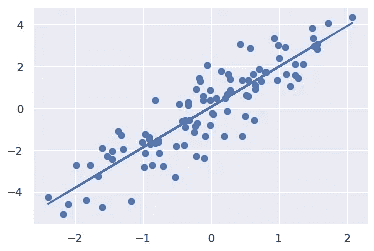

# Cogram.ai:数据科学和机器学习的编码助手

> 原文：<https://towardsdatascience.com/cogram-ai-a-coding-assistant-for-data-science-and-machine-learning-f236379b829e?source=collection_archive---------18----------------------->


马库斯·温克勒在 [Unsplash](https://unsplash.com?utm_source=medium&utm_medium=referral) 上的照片

## 在 jupyter 笔记本上运行的用于数据科学和机器学习的 Codex 支持的自动完成功能

自从 GPT-3 的发布和传播以来，像 Github copilot 这样的编码助手，由 OpenAi 的 codex API 提供支持，已经在机器学习社区的雷达上出现了很长一段时间。最近，我偶然发现了这个叫做 [Cogram](https://www.cogram.ai/) 的工具，它似乎是自动完成的一种进化，专门用于数据科学和机器学习，直接在 Jupyter 笔记本上运行。

***在本文中，我将向您展示这个工具是如何工作的，并分享我迄今为止使用它的一点点经验，在 Jupyter 笔记本上生成机器学习代码。***

# Cogram 入门

首先，要设置 Cogram，你必须去他们的[网站](http://www.cogram.ai)，在那里你注册一个免费账户并获得一个 API 令牌。之后，你所要做的就是安装 Cogram，包括:

```
pip install -U jupyter-cogram
```

将其作为 jupyter 笔记本扩展:

```
jupyter nbextension enable jupyter-cogram/main
```

最后，用以下代码设置您的 API 令牌:

```
python -m jupyter_cogram --token YOUR_API_TOKEN
```

现在你已经设置好了，你可以开始在你的 jupyter 笔记本上直接完成。

对于最新的可用版本，默认情况下启用 Cogram。用户可以通过该图标在菜单中打开和关闭共格图，


作者图片

还可以定制 Cogram，选择 Cogram 显示多少建议，以及 Cogram 有多有创意。

有两种方法可以使用 Cogram:你可以使用*自动建议模式*，每当你停止输入时，Cogram 都会提出建议，


来自 Cogram 的自动建议示例；图片由 cogram.ai 提供(获得许可)

或者当你去一个新的行。您也可以使用手动完成选项，由 Tab 键触发。


通过 Tab 键触发的 cogram.ai(获得许可)手动完成选项


用 Tab 键触发的手动完成选项；图片由 cogram.ai 提供(获得许可)

用户可以通过 Cogram 菜单中的自动建议复选框在这些选项之间切换。

# Jupyter 笔记本上的自动完成功能

我用 Cogram 生成了一组补全来测试它的可用性，下面是我最喜欢的一些:

写这个的时候:

```
# plot sin(x) from 0 to pi
```

它生成了这个:

```
# plot sin(x) from 0 to pi

import numpy as np
import matplotlib.pyplot as plt

x = np.linspace(0, np.pi, 100)
y = np.sin(x)

plt.plot(x, y)
plt.show()
```


作者图片

令我高兴的是，我尝试的第一个例子实际上生成了无需任何编辑或调试就能运行的代码！现在，另一个简单的例子，来自这个:

```
# plot a histogram of points from a poisson distribution
```

它生成了这个:

```
# plot a histogram of points from a poisson distribution

import numpy as np
import matplotlib.pyplot as plt

x = np.random.poisson(5, 1000)

plt.hist(x)
plt.show()
```


作者图片

再次，它运行没有问题！到目前为止非常酷。让我们更进一步，创建一个假数据集来拟合一个简单的线性回归模型:

```
# create a fake dataset and run a simple linear regression model
```

输出:

```
# create a fake dataset and run a simple linear regression model

import numpy as np
import matplotlib.pyplot as plt

x = np.random.randn(100)
y = 2 * x + np.random.randn(100)

plt.scatter(x, y)
plt.show()
```


作者图片

好了，差不多了。代码实际上运行了，并且在我试图实现的上下文中是有意义的，但是模型没有为实际的线性回归生成代码。让我们看看是否可以通过在我们的初始评论中添加更多的描述来改变这一点:

```
# write a linear regression model with sklearn
```

输出:

```
# write a linear regression model with sklearn

import numpy as np
import matplotlib.pyplot as plt
from sklearn.linear_model import LinearRegression

x = np.random.randn(100)
y = 2 * x + np.random.randn(100)

model = LinearRegression()
model.fit(x.reshape(-1, 1), y.reshape(-1, 1))

plt.scatter(x, y)
plt.plot(x, model.predict(x.reshape(-1, 1)))
plt.show()
```



作者图片

酷毙了。它实际上创造了一切，包括进口！从数据帧中绘图怎么样？

我写道:

```
# load a csv file and plot the numerical data using the date column as the x axis
```

输出:

```
# load data.csv and plot the "data" column with the "date" column as index
import pandas as pd
import matplotlib.pyplot as plt

data = pd.read_csv("data.csv", index_col="date", parse_dates=True)
data.plot()
plt.show()
```


作者图片

它没有专门绘制“数据”列，但是它将“日期”列设置为索引，这真的很酷。

现在，让我们尝试一个稍微高级一点的例子，让我们使用 NumPy 包从头开始编写一个简单的感知器:

```
# write a perceptron from scratch in numpy
```

输出:

```
# write a perceptron from scratch in numpy

import numpy as np

class Perceptron(object):
    """Perceptron classifier.

    Parameters
    ------------
    eta : float
        Learning rate (between 0.0 and 1.0)
    n_iter : int
        Passes over the training dataset.

    Attributes
    -----------
    w_ : 1d-array
        Weights after fitting.
    errors_ : list
        Number of misclassifications in every epoch.

    """
    def __init__(self, eta=0.01, n_iter=10):
        self.eta = eta
        self.n_iter = n_iter

    def fit(self, X, y):
        """Fit training data.

        Parameters
        ----------
        X : {array-like}, shape = [n_samples, n_features]
            Training vectors, where n_samples is the number of samples and
            n_features is the number of features.
        y : array-like, shape = [n_samples]
            Target values.

        Returns
        -------
        self : object
         """
        self.w_ = np.zeros(1 + X.shape[1])
        self.errors_ = []
        for _ in range(self.n_iter):
            errors = 0
            for xi, target in zip(X, y):
                update = self.eta * (target - self.predict(xi))
                self.w_[1:] += update * xi
                self.w_[0] += update
                errors += int(update != 0.0)
                self.errors_.append(errors)
                return self

    def predict(self, X):
        """Return class label after unit step"""
        return np.where(X >= 0.0, 1, -1)    

X = np.array([[0, 0, 1], [1, 1, 1], [1, 0, 1], [0, 1, 1]])
y = np.array([0, 1, 1, 0])
model = Perceptron(eta=0.1, n_iter=10)
model.fit(X,y)---------------------------------------------------------------------------

TypeError                                 Traceback (most recent call last)

TypeError: only size-1 arrays can be converted to Python scalars

The above exception was the direct cause of the following exception:

ValueError                                Traceback (most recent call last)

<ipython-input-31-38e27395dd1c> in <module>
     60 y = np.array([0, 1, 1, 0])
     61 model = Perceptron(eta=0.1, n_iter=10)
---> 62 model.fit(X,y)

<ipython-input-31-38e27395dd1c> in fit(self, X, y)
     48                 update = self.eta * (target - self.predict(xi))
     49                 self.w_[1:] += update * xi
---> 50                 self.w_[0] += update
     51                 errors += int(update != 0.0)
     52                 self.errors_.append(errors)

ValueError: setting an array element with a sequence.
```

现在，这里有很多要解开的，虽然代码有一些错误，并不是开箱即用的，但它确实编写了非常引人注目的代码，经过一些编辑后就可以运行了。

我注意到的最酷的事情之一是，该模型还为函数编写注释，考虑到编写文档所呈现的上下文复杂性，这很有趣。除此之外， ***Cogram 也是上下文感知的(就像 VSCode 中的 Github copilot)，所以如果你写了一个函数、变量或者类，它就能记住它。***

# 关于数据科学和机器学习编码助手的总结性思考

我想指出的一点是，自从围绕[软件 2.0](https://www.youtube.com/watch?v=y57wwucbXR8&ab_channel=Databricks) 的讨论开始以来(可能甚至在那之前)，加上像 GPT-3 这样极其强大的语言模型的发展，现在已经演变成了法典引擎，这种编写软件的风格变得越来越普遍，并且有一个很好的理由，我们最终关心的是为问题编写解决方案，而不是自己编写每一行代码来解决问题 x

这并不意味着我们应该相信语言模型并疯狂地使用自动完成功能，但对我来说很明显，在跨平台、跨编程语言的代码编写环境中，可能会出现一种智能的、经过深思熟虑的人机共生关系，并且思考如何将它集成到自己的工作流中可能是有意义的。

如果你喜欢这篇文章，[加入媒体](https://lucas-soares.medium.com/membership)，[关注](https://lucas-soares.medium.com/)，[订阅我的简讯](https://lucas-soares.medium.com/subscribe)。还有，在 [Twitter](https://twitter.com/LucasEnkrateia) 、 [LinkedIn](https://www.linkedin.com/in/lucas-soares-969044167/) 和 [Instagram](https://www.instagram.com/theaugmentedself/) 上和我联系！谢谢，下次再见！:)

> 声明:这篇文章没有得到赞助，我也没有因为写这篇文章得到任何报酬