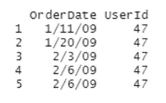
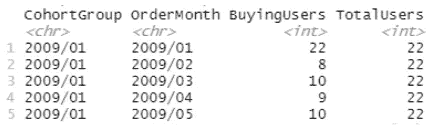
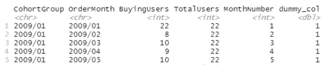
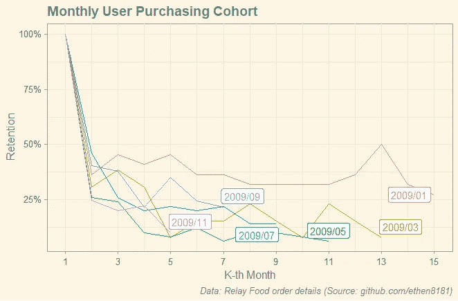
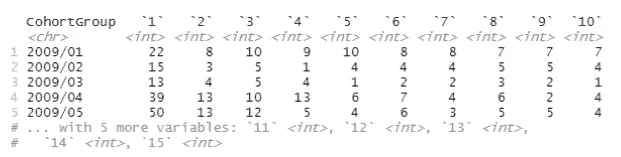
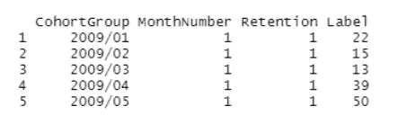
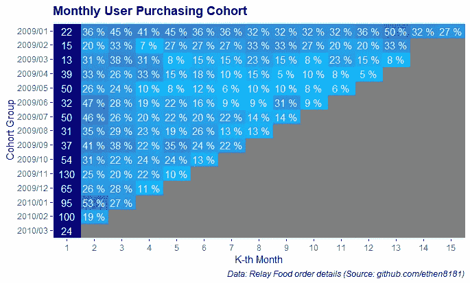

# R 队列分析可视化

> 原文：<https://towardsdatascience.com/cohort-analysis-visualization-with-r-d57830bf1cd0?source=collection_archive---------8----------------------->


[Adrien Delforge](https://unsplash.com/@adriendlf?utm_source=unsplash&utm_medium=referral&utm_content=creditCopyText) 在 [Unsplash](https://unsplash.com/s/photos/queue?utm_source=unsplash&utm_medium=referral&utm_content=creditCopyText) 上拍摄的照片

## 让 ggplot2 以优雅的方式可视化您的群组分析

如果你是 B2C(企业对消费者)行业的数据从业者，或者只是一个分析过一些消费者数据的数据极客，那么你很有可能必须熟悉群组分析。

群组分析是一种分析方法，其中我们首先将属于数据集的个体分组到具有特定时间跨度的不同群组中，在该时间跨度内，同一群组中的个体共享相同的特定经历。然后进行适当的分析，将这些组群作为分析单位。

在其他使用案例中，群组分析允许我们在执行特定指标时，观察用户保留率随时间的变化。这是通过比较不同年龄组的表现来实现的。

在本文中，我将分享如何创建群组分析可视化。为此，我们将使用 R 及其流行的 ggplot2 包。将显示两种群组分析可视化:**线图**和**热图**。

# **数据**

使用的数据是在这个 [Github 存储库](https://github.com/ethen8181/machine-learning/tree/master/python/cohort)中可用的`relay-food`数据。该数据包含某个食品零售商的订单详细信息。在整篇文章中，我们只对每月一次的**用户购买群体**的可视化感兴趣。因此，我们将只考虑如下两列数据:

1.  `OrderDate`:订单发生的日期
2.  `UserId`:用户 ID

# 形象化

## 线形图

和往常一样，首先要做的是导入必要的库。

```
# import libraries
library(dplyr) #handy data manipulation
library(ggplot2) #our today's super star
library(stringr) #to manipulate string date
library(ggthemes) #many nice themes
library(mdthemes) #handy text in plot formatting
library(gghighlight) #will abuse it a bit to show nice label
```

接下来加载数据。

```
#load the data
df = read.csv("relay-foods.csv")#inspect first 5 rows of the data
df %>% select(OrderDate, UserId) %>% head(5)
```



显然，`OrderDate`栏的日期格式还不标准。因此我们需要调整它。

```
# adjust date formatting of OrderDate column
df$OrderDate = format(as.Date(df$OrderDate, '%m/%d/%Y'), '%Y/%m/%d')
df$OrderDate = gsub('00','20',df$OrderDate)
```

接下来，由于我们想要查看月度群组，我们需要从`OrderDate`列派生出`OrderMonth`列。

```
# create OrderMonth column from OrderDate (to  make monthly cohort)
df$OrderMonth = str_sub(df$OrderDate,end = 7)
```

群组分析需要数据集中每个用户的群组信息，因此我们建立一个群组。

```
# create reference data frame of cohort group (month level)
cohort_group_df = df %>% group_by(UserId) %>% 
                    summarize(CohortGroup = min(OrderDate))cohort_group_df$CohortGroup =  str_sub(cohort_group_df$CohortGroup,                    end = 7) # join with the initial df
df = inner_join(df, cohort_group_df, by = 'UserId')
```

接下来，我们创建一个参考数据框架，其中包含每个群组的总用户数，以及每月购买的用户数。

```
# create reference data frame of total users for each cohort group
base_cohort_df = df %>% group_by(CohortGroup) %>%
  summarise(
   TotalUsers = n_distinct(UserId)
  )# create purchase activity data frame
activity_cohort_df = df %>% group_by(CohortGroup, OrderMonth) %>%
 summarise(
  BuyingUsers = n_distinct(UserId)
 )# join activity_cohort_df and base_cohort_df
user_cohort_df = inner_join(activity_cohort_df, base_cohort_df, 
                  by = 'CohortGroup')
```

数据检查点。到目前为止我们得到了什么？

```
user_cohort_df %>% head(5)
```



注意`OrderMonth`列仍然是上面的字符串格式。对于绘图，我们希望它是整数格式，成为 x 轴。

```
# transform OrderMonth to integer
user_cohort_df = user_cohort_df %>% group_by(CohortGroup) %>% mutate(MonthNumber = 1:n())
```

最后，我们将只绘制数据的子集，以避免过度绘制。

```
# subsetting the data
plot_user_cohort_df = inner_join(base_cohort_df[seq(1,11,2),c(“CohortGroup”)], user_cohort_df, by = “CohortGroup”)
```

在要画的情节中，我想在线条的末端有漂亮的图例。为此，我使用 gghighlight 包。我知道这有点不太好，所以如果你们知道更合适的方法，请在下面评论。

```
# dummy column for in-place legend
plot_user_cohort_df$dummy_col = 1
```

好了，我们完成了线图的数据准备工作。下面是数据的最终形式。

```
plot_user_cohort_df %>% head(5)
```



所以，我们准备有我们的第一个情节！

```
# plotting line plot
ggplot(plot_user_cohort_df) +
  geom_line(aes(x = MonthNumber,
                y = BuyingUsers/TotalUsers,
                col = CohortGroup)) +
  gghighlight(dummy_col == 1) +
  scale_x_continuous(breaks = seq(from = 1, to = 15, by = 2)) +
  scale_y_continuous(labels = scales::percent_format()) +
  mdthemes::md_theme_solarized() +
  labs(
    title = "**Monthly User Purchasing Cohort**",
    caption = "*Data: Relay Food order details (Source: github.com/ethen8181)*", 
    x = "K-th Month",
    y = "Retention",
    col = "Cohort Group"
  )
```



图 1 —线形图中的队列分析

从图中可以得出结论，接力食品往往会遇到用户保留率降低的问题，因为年轻群体的保留率(2009-11 年)低于年长群体的保留率(2009-01 年)。

## 热图

根据我的经验，有些人更喜欢看到热图这类的图表来可视化这些群体。所以我们也画一个吧。

我们将继续上述工作，而不是从头开始。特别是我们将从`user_cohort_df`开始。

```
# create base dataframe for heat map visualization
cohort_heatmap_df = user_cohort_df %>% select(CohortGroup,      MonthNumber, BuyingUsers) %>%
          spread(MonthNumber, BuyingUsers)# inspect data
cohort_heatmap_df %>% head(5)
```



我们还创建了数据的百分比版本。

```
# the percentage version of the dataframe
cohort_heatmap_df_pct = data.frame(
  cohort_heatmap_df$CohortGroup,
  cohort_heatmap_df[,2:ncol(cohort_heatmap_df)] / cohort_heatmap_df[["1"]]
)# assign the same column names
colnames(cohort_heatmap_df_pct) = colnames(cohort_heatmap_df)
```

接下来，我们融合两个数据帧以取悦 ggplot2。

```
# melt the dataframes for plotting
plot_data_abs = gather(cohort_heatmap_df, "MonthNumber", "BuyingUsers", 2:ncol(cohort_heatmap_df))
plot_data_pct = gather(cohort_heatmap_df_pct, "MonthNumber", "Retention", 2:ncol(cohort_heatmap_df_pct))
```

我们为热图准备标签。

```
# prepare label names containing absolute number of buyers for the first month and retention percentages for the rest months
label_names = c(plot_data_abs$BuyingUsers[1:(ncol(cohort_heatmap_df)-1)],plot_data_pct$Retention[(ncol(cohort_heatmap_df_pct)):(nrow(plot_data_pct))])
```

最后，我们把所有的东西放在一个数据框架中，准备绘图。

```
# beautify percentage labels
beauty_print <- function(n) {
  case_when( n <= 1  ~ sprintf("%1.0f %%", n*100),
             n >  1  ~ as.character(n),
             TRUE    ~ " ") # for NA values, skip the label
}# create dataframe ready for plotting
plot_data = data.frame(
  CohortGroup = plot_data_pct$CohortGroup,
  MonthNumber = plot_data_pct$MonthNumber,
  Retention = plot_data_pct$Retention,
  Label = beauty_print(label_names)
)
plot_data$MonthNumber = as.numeric(plot_data$MonthNumber)
```

热图可视化数据框架的最终形式如下。

```
plot_data %>% head(5)
```



击鼓！生成热图的代码如下。

```
# plotting heatmap
ggplot(plot_data) +
  geom_raster(aes(x = MonthNumber,
                  y = reorder(CohortGroup, desc(CohortGroup)),
                  fill = Retention)) +
  scale_fill_continuous(guide = FALSE, type = "gradient",
                        low = "deepskyblue", high = "darkblue") +
  scale_x_continuous(breaks = seq(from = 1, to = 15, by = 1),
                     expand = c(0,0)) +
  geom_text(aes(x = MonthNumber,
                y = reorder(CohortGroup, desc(CohortGroup)),
                label = Label), col = "white") +
  mdthemes::md_theme_gray() +
  labs(
    title = "**Monthly User Purchasing Cohort**",
    caption = "*Data: Relay Food order details (Source: github.com/ethen8181)*", 
    x = "K-th Month",
    y = "Cohort Group"
  )
```



图 2—热图中的群组分析

请注意，热图的第一列显示了在相应月份进行购买的用户的绝对数量。因此，这种队列可视化的热图版本比其折线图版本更加丰富，因为它提供了关于队列组绝对大小的更多背景信息。

# 在你走之前

在本文中，我们通过一步一步的 R 代码教程，以线图和热图的形式生成队列分析的优雅可视化。对于更喜欢跟踪 Github 代码的读者来说，本文的完整代码可以在我的 Github 库[这里](https://github.com/pararawendy/cohort-analysis-in-R)找到。

最后，感谢阅读，大家在 [LinkedIn](https://www.linkedin.com/in/pararawendy-indarjo-5b87bab7/) 上和我连线吧！👋