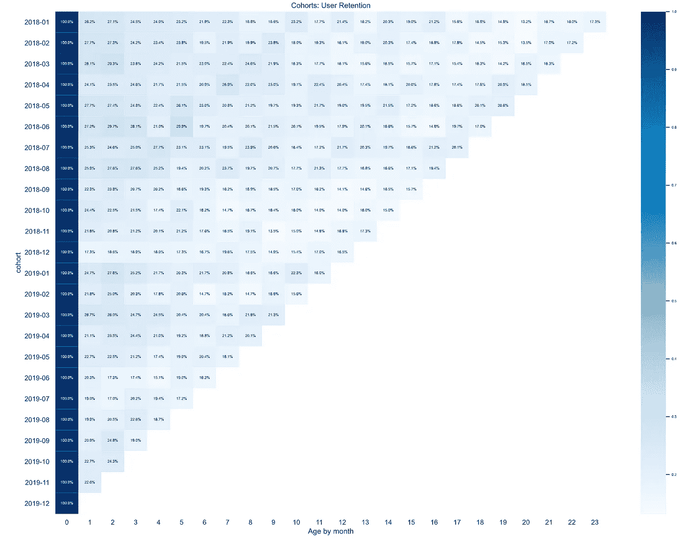
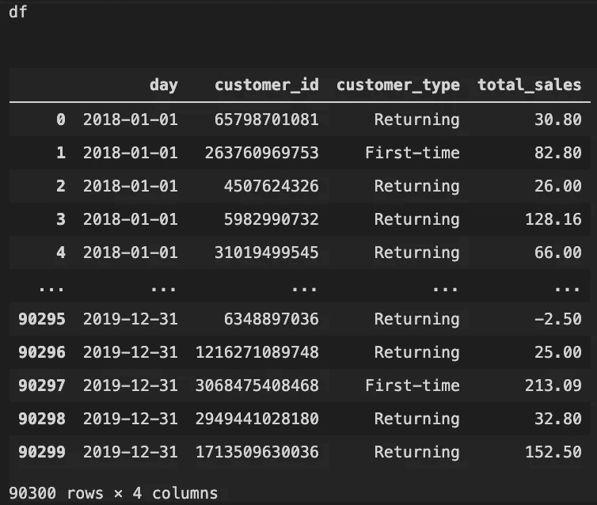
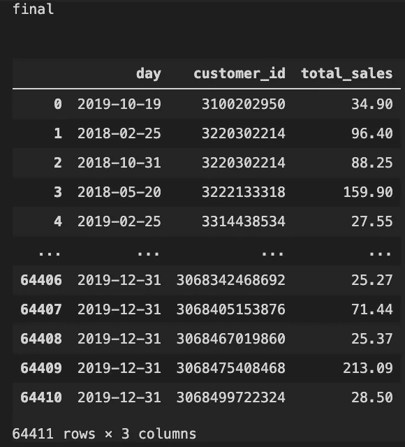
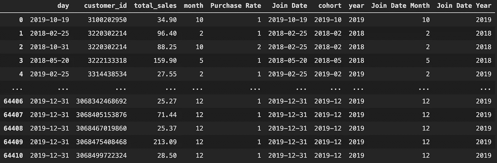
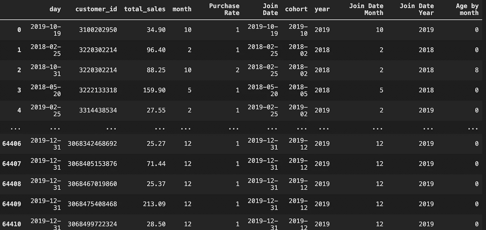
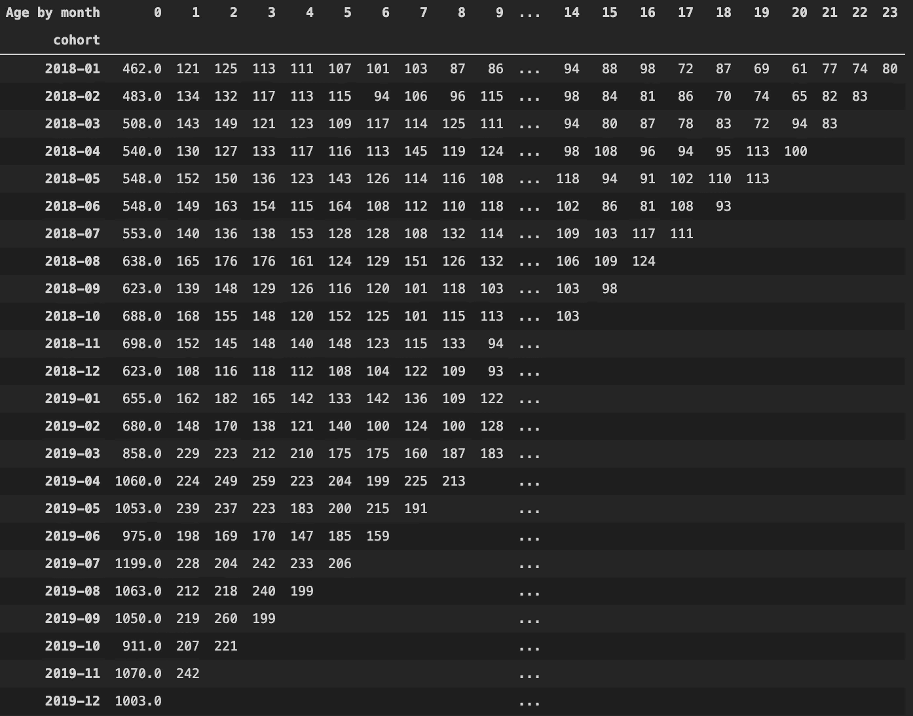
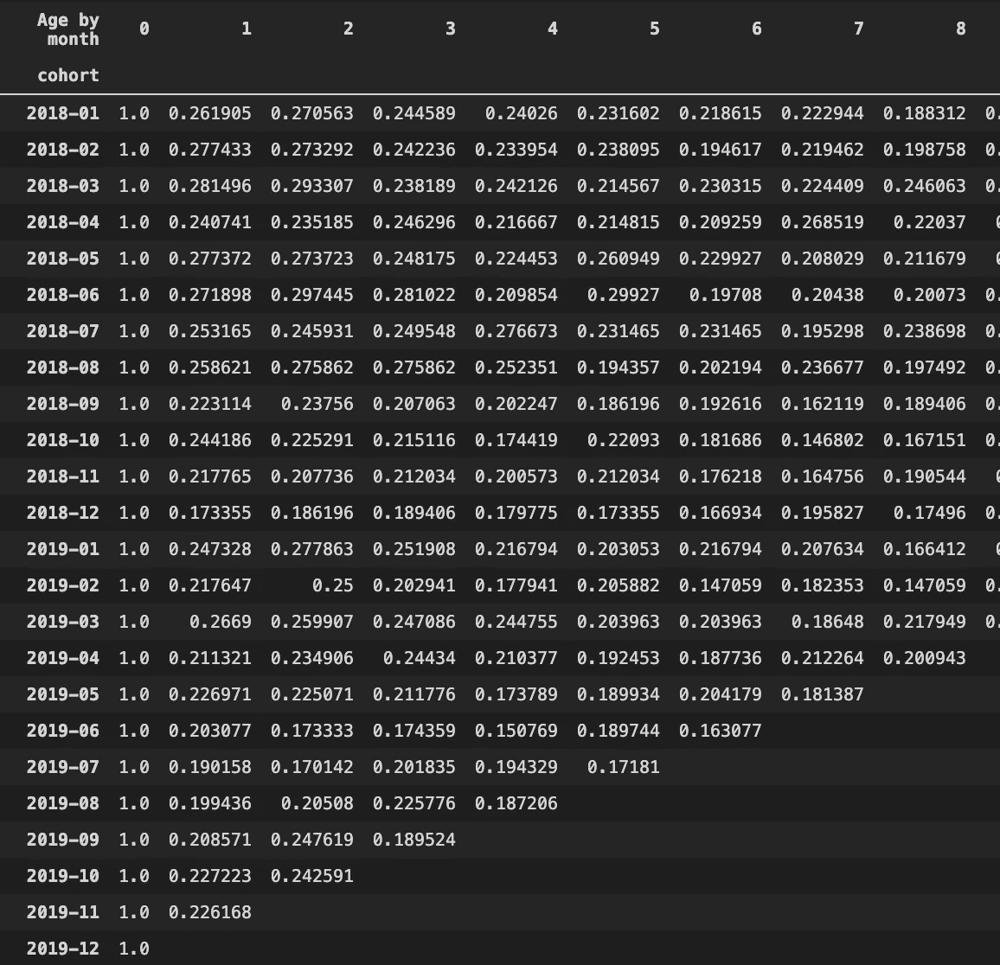
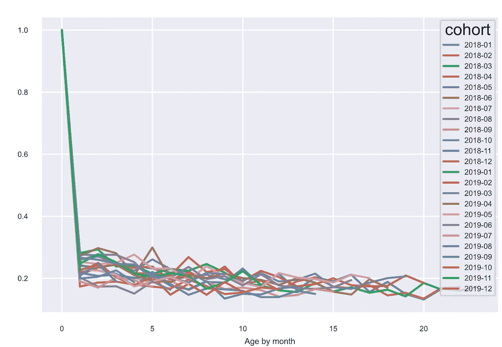

# 使用 Python 进行队列分析

> 原文：<https://towardsdatascience.com/cohort-analysis-with-python-2bdf05e36f57?source=collection_archive---------15----------------------->

## 每个电子商务数据分析师都必须掌握的数据聚类技能



# 介绍

如果你是一名为电子商务公司工作的数据分析师，你的工作任务之一很可能是从客户数据中发现洞察力，以提高客户保留率。

然而，客户数据是海量的，每个客户的行为都不同。2020 年 3 月获得的客户 A 表现出与 2020 年 5 月获得的客户 B 不同的行为。因此，有必要将客户分成不同的群，然后调查每个群随时间推移的行为。这叫做**队列分析**。

> 群组分析是一种数据分析技术，用于了解特定客户群体在一段时间内的行为。

在这篇文章中，我不会详细介绍群组分析的理论。如果你不知道群组分析是怎么回事，我强烈建议你先看看这篇博客。

这篇文章更多的是向您展示**如何**将客户分成不同的群组，并观察每个群组在一段时间内的保留率。

让我们开始吧！

## 导入数据和 python 库

你可以在这里下载数据[。](https://github.com/joetrankang/cohort-analysis/raw/main/sales_2018-01-01_2019-12-31.csv)

```
import pandas as pd
import matplotlib.pyplot as plt
import seaborn as snsdf = pd.read_csv('sales_2018-01-01_2019-12-31.csv')
df
```



VS 代码 2

## 将首次顾客与回头客分开

```
first_time = df.loc[df['customer_type'] == 'First-time',]final = df.loc[df['customer_id'].isin(first_time['customer_id'].values)]
```

简单地选择`df.loc[df['customer_type']]`是不明智的。我来解释一下原因。在该数据中，`customer_type`栏下的`First_time`是指新客户，而`Returning`是指回头客。因此，如果我在 2019 年 12 月 31 日首次购买，数据将显示我在 2019 年 12 月 31 日是新客户，但在我的第二、第三……时间是回头客。群组分析着眼于新客户及其后续购买行为。因此，如果我们简单地使用`df.loc[df['customer_type']=='First-time',]`,我们将忽略新客户的后续购买，这不是分析群体行为的正确方法。

因此，我在这里所做的是，首先创建一个所有首次客户的列表，并将其存储为`first_time`。然后从原始客户数据框架`df`中只选择那些 id 属于`first_time`客户组的客户。通过这样做，我们可以确保我们获得的数据只包含首次购买的客户以及他们随后的购买行为。

现在，让我们删除`customer_type`列，因为它已经没有必要了。另外，将`day`列转换成正确的日期时间格式

```
final = final.drop(columns = ['customer_type'])
final['day']= pd.to_datetime(final['day'], dayfirst=True)
```

## 先按客户 ID，再按日期对数据进行排序

```
final = final.sort_values(['customer_id','day'])final.reset_index(inplace = True, drop = True)
```



## 定义一些函数

```
def purchase_rate(customer_id):
    purchase_rate = [1]
    counter = 1
    for i in range(1,len(customer_id)):
          if customer_id[i] != customer_id[i-1]:
                 purchase_rate.append(1)
                 counter = 1
          else:
                 counter += 1
                 purchase_rate.append(counter) return purchase_ratedef join_date(date, purchase_rate): join_date = list(range(len(date))) for i in range(len(purchase_rate)): 
          if purchase_rate[i] == 1:
                 join_date[i] = date[i]
          else:
                 join_date[i] = join_date[i-1] return join_date def age_by_month(purchase_rate, month, year, join_month, join_year): age_by_month = list(range(len(year))) for i in range(len(purchase_rate)): if purchase_rate[i] == 1: age_by_month[i] = 0 else: if year[i] == join_year[i]: age_by_month[i] = month[i] - join_month[i] else: age_by_month[i] = month[i] - join_month[i] + 12*(year[i]-join_year[i]) return age_by_month
```

`purchase_rate`功能将确定每位顾客的第二次、第三次、第四次购买。

`join_date`功能允许我们识别客户加入的日期。

`age_by_month`函数给出了客户从当前购买到第一次购买有多少个月。

现在输入已经准备好了。让我们创建群组。

## 创建群组

```
final['month'] =pd.to_datetime(final['day']).dt.monthfinal['Purchase Rate'] = purchase_rate(final['customer_id'])final['Join Date'] = join_date(final['day'], final['Purchase Rate'])final['Join Date'] = pd.to_datetime(final['Join Date'], dayfirst=True)final['cohort'] = pd.to_datetime(final['Join Date']).dt.strftime('%Y-%m')final['year'] = pd.to_datetime(final['day']).dt.yearfinal['Join Date Month'] = pd.to_datetime(final['Join Date']).dt.monthfinal['Join Date Year'] = pd.to_datetime(final['Join Date']).dt.year
```



```
final['Age by month'] = age_by_month(final['Purchase Rate'], final['month'],final['year'],final['Join Date Month'],final['Join Date Year'])
```



```
cohorts = final.groupby(['cohort','Age by month']).nunique()
cohorts = cohorts.customer_id.to_frame().reset_index()   # convert series to framecohorts = pd.pivot_table(cohorts, values = 'customer_id',index = 'cohort', columns= 'Age by month')
cohorts.replace(np.nan, '',regex=True)
```



> **如何解读此表** 以 cohort 2018–01 为例。2018 年 1 月，新增客户 462 家。在这 462 名顾客中，有 121 名顾客在 2018 年 2 月回来购买，125 名在 2018 年 3 月购买，以此类推。

## 转换成群组百分比

```
for i in range(len(cohorts)-1):
    cohorts[i+1] = cohorts[i+1]/cohorts[0]cohorts[0] = cohorts[0]/cohorts[0]
```



## (英)可视化(= visualization)

```
cohorts_t = cohorts.transpose()cohorts_t[cohorts_t.columns].plot(figsize=(10,5))sns.set(style='whitegrid')plt.figure(figsize=(20, 15))plt.title('Cohorts: User Retention')sns.set(font_scale = 0.5) # font sizesns.heatmap(cohorts, mask=cohorts.isnull(),cmap="Blues",annot=True, fmt='.01%')plt.show()
```



就是这样。希望你们喜欢这篇文章，并从中有所收获。如果你有任何问题，请在下面的评论区写下来。谢谢你的阅读。祝你今天愉快，新年快乐🎉🎉🎉