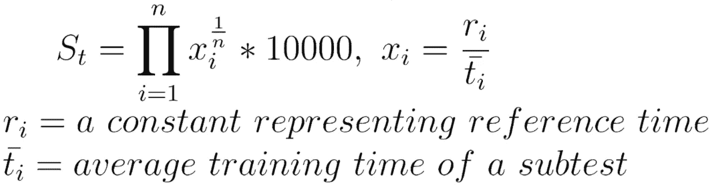
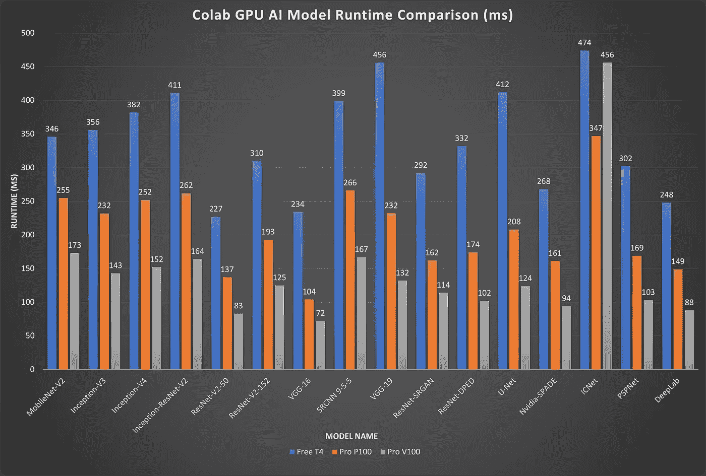

# Colab Pro 与 Free-AI 计算性能

> 原文：<https://towardsdatascience.com/colab-pro-vs-free-ai-computing-performance-4e983d578fb2?source=collection_archive---------7----------------------->

## GPU 加速值不值得每月 10 美元的费用？

> **动机** : *当我考虑是否要为 Colab Pro 支付 10 美元的升级费用时，我主要关心的是“GPU 加速是否值得每月付费？”可悲的是，我无法找到一个好的来源来回答这个问题，所以我写了这个故事来帮助像我这样的人。😉*

**我应该升级到 Colab Pro 吗？如果你用谷歌搜索这个问题，你会发现很多很棒的文章。例如:**

1.  GPU、RAM、高级训练时间对比 by[Dario rade CII](https://medium.com/u/689ba04bb8be?source=post_page-----4e983d578fb2--------------------------------):[https://towardsdatascience . com/colab-pro-is-it-worth-the-money-32a 1744 f 42 A8](/colab-pro-is-it-worth-the-money-32a1744f42a8)
2.  Colab Pro 主要功能:[https://colab.research.google.com/signup](https://colab.research.google.com/signup)
3.  Reddit 讨论:[https://www . Reddit . com/r/machine learning/comments/f0wm0l/n _ colab _ pro _ more _ ram _ longer _ run _ time _ faster _ GPU/](https://www.reddit.com/r/MachineLearning/comments/f0wm0l/n_colab_pro_more_ram_longer_run_time_faster_gpus/)

为了给正在进行的讨论带来一些新的东西，我将利用这篇文章在 Google Colab 的背景下更深入地探究他们在**人工智能计算性能**方面的差异。

# 背景

要比较不同 Colab 层的 AI 计算性能，只看硬件规格是不够的。最好的方法可能是在专业版和免费版上运行实际的、固定的 AI 模型，并查看它们完成固定训练工作的运行时间。

## 比较工具

为了进行比较，我们使用 [AI 基准](https://ai-benchmark.com/)，这是来自 [Github](https://github.com/houseofai/ai-benchmark) 的开源工具。这个工具是由苏黎世联邦理工学院的一组研究人员开发的，它通过运行下面的代码来工作。当我们执行代码时，工具会收集 [19 个不同机器学习模型](https://ai-benchmark.com/alpha.html)在特定[数据集](https://github.com/houseofai/ai-benchmark/tree/master/ai_benchmark/data)上的训练和推理时间。

## 得分

除了时间，该基准还根据预定义的分数来评估训练、推理和整体人工智能性能。尽管该工具没有明确解释得分公式，但我查看了它的源代码，并总结了下面的公式。

计算训练分数。作者图片

虽然它是训练分数的公式，但推理分数的计算方法类似，然后将它们的总和用作总的 AI 分数。我假设您可能希望在以下内容中更多地关注培训性能方面，因为 Colab 更多地用作研究工具，而不是部署。

# 比较

基准测试在以下时间进行:

1.  仅带 CPU 的 Colab 免费([实验链接](https://colab.research.google.com/drive/1bT27UJLOIbPxmWBpZKZB9VL4zsAc4cGJ?usp=sharing))
2.  Colab 免费与 T4 ( [实验链接](https://colab.research.google.com/drive/1-pq7qLhhUTLSCwvDTVjc8n7e087bU-Mv?usp=sharing)
3.  仅带 CPU 的 colab pro([实验链接](https://colab.research.google.com/drive/1IOUV-EPcRdUmpxBGshwLlu9wT7z0z2PU?usp=sharing))
4.  Colab pro 与 P100 ( [实验环节](https://colab.research.google.com/drive/1-pq7qLhhUTLSCwvDTVjc8n7e087bU-Mv?usp=sharing))
5.  Colab pro 带 V100 ( [实验环节](https://colab.research.google.com/drive/15sRxi3W_r6vQ7uvhpt4OKwclw5DvyaHF?usp=sharing))

Colab 在免费版本中支持 K80，但有一段时间没有看到它，所以不包括在内。至于 P100 和 V100，是由 Colab Pro 随机给出的。通常，P100 会有更大的机会。

作者图片

**注:** *为便于观察，图表中并未包含所有信息。这些模型由不同的数据集训练，因此跨模型比较运行时间不会有很大帮助。*

## 训练分数排名

1.  带 V100 的 colab pro—**16289 分**
2.  P100 的 colab pro—**11428 分**
3.  与 T4 的免费可乐— **7155 分**
4.  仅带 CPU 的 Colab 免费 **—187 分**
5.  仅带 CPU 的 colab pro**—175 分**

## 观察

我创建了这个[谷歌表单](https://docs.google.com/spreadsheets/d/1PVreTT97noFVPrNFN5bLoPNKlrtx6dvS/edit?usp=sharing&ouid=112516007716982105981&rtpof=true&sd=true)来包含更多的细节。从那里，您可以观察到以下情况:

*   平均而言，配备 V100 和 P100 的 Colab Pro 分别比配备 T4 的 Colab Free 快 146%和 63%。(资料来源:“比较”表，表 E6-G8)
*   即使来自 Colab Pro 的 GPU 通常更快，但仍然存在一些异常值；例如，Pixel-RNN 和 LSTM 在 V100 上的训练速度比 T4 慢 9%-24%。(资料来源:“比较”表，表 C18-C19)
*   当只使用 CPU 时，Pro 和 Free 的性能相似。(来源:“培训”表，B 栏和 D 栏)

# 结论

如果你把训练时间长当成研究时的痛点，我强烈推荐你升级到 Colab Pro。例如，我发现自己每个月花在 Colab 上的时间超过 20 个小时，将近 50%的时间花在模型训练上。所以，Colab Pro 每个月给我节省了 20*0.5=10 多个小时。然而，如果我不是一个 Colab 的重度用户，或者有一个不同的地方来加速模型训练，用这 10 美元给自己买一个夏威夷广场似乎是一个更好的主意。

**同样，本文只关注 AI 计算性能。**在做出决定之前，您应该明确考虑其他方面，如 RAM、运行时等等。

# 免费的 4 个 V100 GPUs

如果你在寻找更多免费的 GPU 资源，我想介绍一下 **AIbro** ，一个无服务器的模型训练工具，我和我的朋友们目前正在开发。它可以帮助你用一行代码在 AWS 上训练 AI 模型。为了收集更多早期用户的反馈，我们现在为您提供免费的**p 3.8x large(4x V100)版本。更多细节，你可能想看看我以前的故事:**

** [## 用一行代码在云上训练神经网络

### 你可能见过的最简单的无服务器模型训练工具

towardsdatascience.com](/train-neural-network-on-cloud-with-one-line-of-code-8ae2e378bc98) 

AIpaca Inc .图片作者**