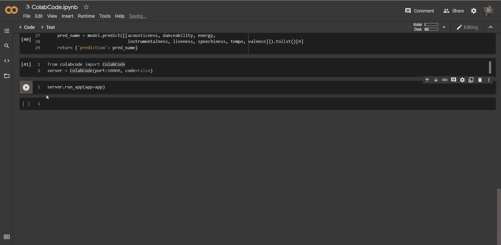
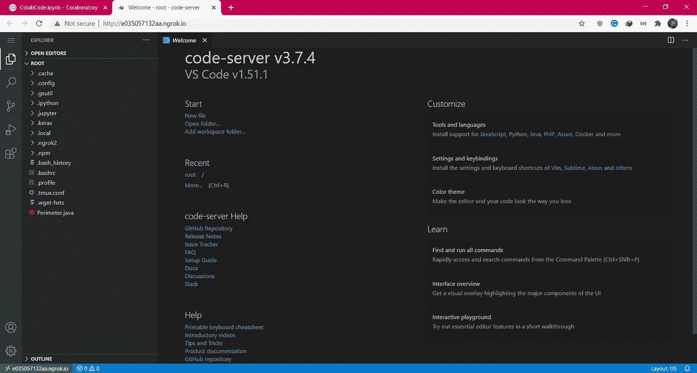
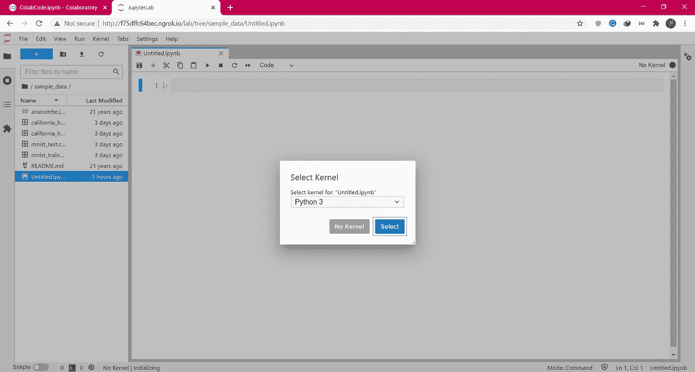

# ColabCode:从 Google Colab 部署机器学习模型

> 原文：<https://towardsdatascience.com/colabcode-deploying-machine-learning-models-from-google-colab-54e0d37a7b09?source=collection_archive---------4----------------------->

## **启动 VS 代码服务器、Jupyter 实验室或 FastAPI**


照片由 [Niclas Illg](https://unsplash.com/@nicklbaert?utm_source=medium&utm_medium=referral) 在 [Unsplash](https://unsplash.com?utm_source=medium&utm_medium=referral) 上拍摄

Google colab 是 Python 和数据科学爱好者最方便的在线 IDE。它于 2017 年向公众发布，最初是谷歌研究团队用于合作不同人工智能项目的内部项目。从那以后，由于其易于使用的界面，Jupyter 笔记本的相似性，以及 GPU 的支持，它获得了很大的人气。

大多数流行的机器学习库，如 numpy，pandas，seaborn，matplotlib，sklearn，TensorFlow，都预装在这个云环境中，因此您不需要任何显式的先决条件。您也可以安装您选择的任何 python 包来运行您的代码。在本文中，我将向您解释一种使用 FastAPI 和 ngrok 将您的机器学习模型部署为 API 的简单方法。

# 什么是 FastAPI？

它是一个用 Python 构建 API 的高性能 web 框架。传统上，大多数开发人员使用 flask 作为构建 API 的首选，但由于一些限制，但不限于数据验证、身份验证、异步等，FastAPI 获得了很大的流行。FastAPI 通过 pydantic 模型提供自动文档生成功能、身份验证和数据验证。要详细了解这两个框架之间的显著差异，您可以在这里查看我关于分析 Vidya 的文章:

<https://www.analyticsvidhya.com/blog/2020/11/fastapi-the-right-replacement-for-flask/>  

FastAPI 有助于设置生产就绪的服务器，但是如果您想在将它部署到实际的云平台(如 Heroku)之前与您的团队共享，该怎么办呢？ngrok 通过隧道将您的本地主机暴露给互联网来解救您。现在，任何人都可以通过提供的链接访问您的 API 端点，但是如果所有这些都只能在 Google Colab 上完成呢？解决这个问题的方法是 ColabCode！

# 什么是 ColabCode？

它是一个 Python 包，允许您直接从您的 Colab 笔记本上启动代码服务器，而无需在您的系统上进行任何本地设置。它可以用来启动 VS 代码环境、Jupyter 实验室服务器，或者将 FastAPI 服务器隧道连接到 web，所有这些都在 colab 笔记本中。这对于那些在云上训练他们的模型，并且现在想要以 API 的形式与世界分享他们的发现的爱好者来说是一个很好的加分点。我们将讨论 ColabCode 的所有功能，直到本文结束。

# 为 ColabCode 准备 FastAPI 代码

我将在本文中使用的问题陈述是一个决策树分类器，用于在两种音乐流派之间进行分类:Hip-Hop 或 Rock。我已经清理了数据集，它在我的 [GitHub 库](https://github.com/kaustubhgupta/Technocolab-Final-Project)上。现在我已经有了数据集，我简单地把它导入笔记本并训练了一个决策树模型，没有任何预处理或 ed a 的东西，因为本文更多的是关于部署。所以这个模型可能会返回一些错误的结果！

模型创建代码

1.  现在，如果您知道 FastAPI 架构，我们将需要一个数据类作为输入。这个数据类允许 FastAPI 验证要发送给模型的输入，如果给出了任何错误的输入，它只是引发错误，而不会将错误提供给模型。
2.  创建数据类非常简单，只需要接受参数和数据类型。为了进一步定制，您还可以添加一个定制示例来快速测试结果。这个类的代码是:

数据类别代码

3.现在，我们需要创建一个服务所有请求的端点。FastAPI 中的端点创建与 flask 非常相似，只需要端点函数接受数据类进行验证。

FastAPI 代码

如果你想探索一些很酷的项目，请查看我的 GitHub 档案:

<https://github.com/kaustubhgupta>  

# 可乐码

我们的 FastAPI 已经准备好了，现在唯一需要的就是通过 colab 环境运行它。首先，导入这个包并初始化服务器:

```
from colabcode import ColabCodeserver = ColabCode(port=10000, code=False)
```

端口号可以由您选择，代码参数应该为 false。现在，服务器已经准备好接收 FastAPI 对象，在 ngrok 的帮助下，本地主机通过一个唯一的 URL 被隧道化并暴露给公众。

```
server.run_app(app=app)
```

就这样！你将得到一个 ngrok URL，你可以与你的社区、团队或任何人分享。一旦你终止了单元格进程，链接就会失效，如果你不这样做，Google Colab 会在一段时间后终止它。此过程的 GIF 示例如下所示:



作者 GIF

在这里，单击链接后，我导航到 FastAPI 自动生成的端点/文档，在这里，我们可以测试结果。如果你想运行并尝试这个东西，这里有完整的笔记本代码。打开笔记本运行所有单元格。

作者代码

# 其他功能

ColabCode 并不局限于在 Colab 上运行 FastAPI 代码还可以提供 VS 代码服务器和 Jupyter 实验室服务器！它可以帮助用户对基于云的服务有一个熟悉的环境。资源非常有限的用户也可以从这些服务中受益。它变得非常类似于新引入的 GitHub Codespaces，它在 web 上提供 VS 代码环境。要通过 ColabCodes 运行 VS 代码服务器，请执行以下操作:

```
from colabcode import ColabCode
ColabCode()
```

您将被提示一个 ngrok URL，加载完成后，您将在 web 浏览器上运行 VS 代码，如下所示:



作者图片

类似地，如果您想打开一个 Jupyter 实验室服务器，将 lab 参数作为 true 传递，将 code 作为 false。

```
from colabcode import ColabCode
ColabCode(code=False, lab=True)
```

您将获得一个 URL 和一个令牌，用于对服务器进行身份验证。输入令牌并点击 login，会出现类似如下的屏幕:



作者图片

# 结论

在本文中，我解释了 ColabCode 提供了什么，并简单介绍了 FastAPI。目前，该软件包的创建者 Abhishek Thakur 发布了 v0.2.0。如果您想投稿，请查看这个包的 [GitHub 库](https://github.com/abhishekkrthakur/colabcode)。

说到这里，这篇文章就结束了，我希望你能有新的想法，我会通过其他文章加入你的反馈。

**我的领英:**

<https://www.linkedin.com/in/kaustubh-gupta/>  

**我的其他热门文章:**

</build-dashboards-in-less-than-10-lines-of-code-835e9abeae4b>  </rebuilding-my-7-python-projects-8c629079c8e6>  </run-python-code-on-websites-exploring-brython-83c43fb7ac5f>  </github-action-that-automates-portfolio-generation-bc15835862dc> 