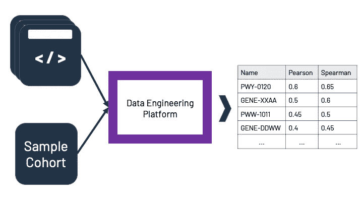

# 数据科学家和数据工程师之间的协作变得简单

> 原文：<https://towardsdatascience.com/collaboration-between-data-scientists-and-data-engineers-made-simple-57b90b116572?source=collection_archive---------28----------------------->

## 如何在您的数据科学家和数据工程师之间创造协同效应

DayTwo 拥有世界上最大的微生物数据库，拥有超过 85K 个独特的基因组序列。分析高达数百 TB 的海量数据需要可靠而坚实的工程基础设施，能够由多名数据科学家同时进行持续探索和分析。

# 数据科学家需求清单

在我们开展的每个研究项目的核心，都有数据分析部分，我们的数据科学家需要分析和探索海量数据，以寻找有价值的商业见解。这种探索应该仔细设计，因为不理解基础设施的限制可能会导致失望和浪费时间。

因此，在每次实验之前，我们都会查看一份简短的清单，以展示我们可能会遇到的一些依赖和障碍:

1.  我们的输入和输出数据的实际大小是多少
2.  根据上面的大小，需要多少内存？
3.  我们应该在 jupyter 笔记本还是 VS-Code 上运行它？
4.  我们应该投资并行吗？

值得注意的是，并不是所有的实验都需要分析大量的数据。但是为了这篇文章，我们假设情况就是这样。

# 数据工程师前来救援

在我们看来，数据工程师是我们数据科学家工作的重要组成部分。在一个没有我们的数据工程师支持的研究项目中工作看起来会有很大的不同，而且不是一种好的方式。它从收集和查询数据的可靠基础设施开始，继续到特征选择和模型训练，当适当的工具和脚本可用时，项目的任何方面都可以被简化和更好地结构化。

托德·夸肯布什在 [Unsplash](https://unsplash.com?utm_source=medium&utm_medium=referral) 上的照片

回到我们分析数十 TB 数据的使用案例，我们通过定义一个用于发送和接收数据的共享通道来利用我们的数据工程团队的能力。

更简单的说，我们定义了两个核心组件: **(1)** 我们应该计算的计算量。 **(2)** 应该使用的相关数据子集。

通过这种方式，每个复杂且未记录的分析任务都变得结构化且易于跟踪，这使我们的研究人员能够专注于寻找见解，并将它们从科学家通常遇到的大多数工程麻烦中清除。

作者图片

# 收场白

数据工程师早已成为每家科技公司必不可少的一部分。在 DayTwo，除了他们“*组织公司数据库*的琐碎角色之外，我们还利用他们在构建工具和基础架构方面的渊博知识来简化我们的数据科学团队工作流。将我们的数据工程师整合到我们的数据科学流程中，使我们能够扩展我们的研究和数据分析能力，此外还有一个显而易见的好处，即让更多人了解当前最热门的话题之一——m lops。

如果你想了解更多关于我们正在开发的最新最棒的产品，请随时联系我。

[亚龙](https://www.linkedin.com/in/yaronv/)