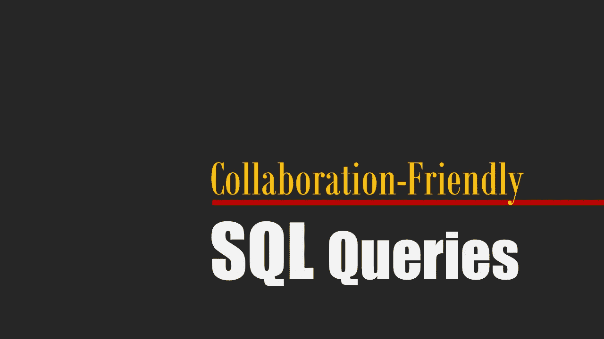

# 协作友好的 SQL 查询

> 原文：<https://towardsdatascience.com/collaboration-friendly-sql-queries-ee7e14547a61?source=collection_archive---------36----------------------->

## 数据工程和数据科学

## 提高 SQL 查询质量和更好协作的一些技巧



作者照片。

一个数据管道卡住了，需要有人注意。或者需要使用新表重构查询，因为其中一个使用的表已经过时或不可用。或者我们需要向非常旧的数据管道的 SQL 逻辑中添加更多内容。

在所有这些情况下，几分钟后我们会有一种感觉。我们要么感谢以前的代码作者，要么被困在数百行 SQL 查询中。我敢打赌，大多数人(如果不是全部的话)都希望自己的工作得到赏识。然而，许多数据工程师和数据科学家不知道如何以协作友好的方式设计 SQL 查询。

本文将为您提供一些基本的技巧，帮助您开发专业的、协作友好的 SQL 查询和数据管道。

# 避免选择*

不要误解我，我经常使用 SELECT *，但只是在临时的特别查询中使用，以调查表或进行快速数据检查。很少在非临时的管道或查询中使用 SELECT *。

不使用 SELECT *很重要的原因是，当您希望以后更新或重构您的管道或查询时。更新查询(例如，用另一个表替换一个表)的第一件事是了解查询/管道中使用了哪些列。让我们考虑一个例子。

假设我们正在维护一个表，用于根据一些度量标准来识别我们的高级员工。出于某种原因，我们不能再使用`performance_review`表了(例如，因为一些隐私问题)。我们的任务是用其他可访问的表替换`performance_review`表。

```
WITH current_senior_employees AS (
    SELECT *
    FROM employee
    WHERE age>=45
        AND is_current = true
        AND years_in_company >= 6
),
performance_last_5years AS (
    SELECT *
    FROM performance_review
    WHERE year BETWEEN 2016 AND 2020
)
SELECT
    ARBITRARY(a.first_name), 
    ARBITRARY(a.last_name), 
    ARBITRARY(a.email),    
    SUM(b.num_of_managed_employees) AS total_num_managed_employees,
    SUM(b.num_of_managed_projects) AS total_num_of_managed_projects,
    SUM(b.revenue_generated_by_managed_projects) AS total_revenue
FROM current_senior_employees AS a
LEFT JOIN avg_performance_last_5years AS b
ON a.id = b.employee_id
GROUP BY b.employee_id
```

如您所见，由于 SELECT *的误用，我们无法轻松识别维护该表需要哪些表中的哪些列。我们需要更深入地研究代码，找出`num_of_managed_employees`、`num_of_managed_projects`、`revenue_generated_by_managed_projects`和`employee_id`是我们应该在其他表中找到的列。当然，与实际工作中的常规查询相比，我的示例非常小，并且不难发现使用了哪些列。但是在实际项目中，一个查询可能包含数百行和数十个连接的表。在这些情况下，如果程序员首先使用 SELECT *读取所有内容，然后从一堆加载的列中选择列，那么深入代码找出哪些列来自哪些表是非常困难的。

在我的例子中，编写这个查询的更好的方法是:

```
WITH current_senior_employees AS (
    SELECT 
        id, 
        first_name, 
        last_name, 
        email
    FROM employee
    WHERE age>=45
        AND is_current = true
        AND years_in_company >= 6
),
performance_last_5years AS (
    SELECT 
        employee_id, 
        num_of_managed_employees, 
        num_of_managed_projects,
        revenue_generated_by_managed_projects
    FROM performance_review
    WHERE year BETWEEN 2016 AND 2020
)
SELECT
    ARBITRARY(a.first_name), 
    ARBITRARY(a.last_name), 
    ARBITRARY(a.email),    
    SUM(b.num_of_managed_employees) AS total_num_managed_employees,
    SUM(b.num_of_managed_projects) AS total_num_of_managed_projects,
    SUM(b.revenue_generated_by_managed_projects) AS total_revenue
FROM current_senior_employees AS a
LEFT JOIN avg_performance_last_5years AS b
ON a.id = b.employee_id
GROUP BY b.employee_id
```

# 使用别名

一个不好的做法是在连接多个表时避免使用别名。看下面的例子。

```
WITH current_senior_employees AS (
    ...
),
performance_last_5years AS (
    ...
)
SELECT
    ARBITRARY(first_name), 
    ARBITRARY(last_name), 
    ARBITRARY(email),    
    SUM(num_of_managed_employees) AS total_num_managed_employees,
    SUM(num_of_managed_projects) AS total_num_of_managed_projects,
    SUM(revenue_generated_by_managed_projects) AS total_revenue
FROM current_senior_employees
LEFT JOIN avg_performance_last_5years
ON id = employee_id
GROUP BY employee_id
```

这是与上一节相同的例子。唯一的区别是我在这里没有使用别名(例如，`a`和`b`)。在这个例子中，很难判断出`email`列来自哪个表。仅仅因为列名是唯一的，就不应该停止使用别名(尤其是在连接多个表时)。

现在想象一下，如果我除了不使用别名之外还使用 SELECT *的话。

```
WITH current_senior_employees AS (
    SELECT *
    FROM employee
    WHERE age>=45
        AND is_current = true
        AND years_in_company >= 6
),
performance_last_5years AS (
    SELECT *
    FROM performance_review
    WHERE year BETWEEN 2016 AND 2020
)
SELECT
    ARBITRARY(first_name), 
    ARBITRARY(last_name), 
    ARBITRARY(email),    
    SUM(num_of_managed_employees) AS total_num_managed_employees,
    SUM(num_of_managed_projects) AS total_num_of_managed_projects,
    SUM(revenue_generated_by_managed_projects) AS total_revenue
FROM current_senior_employees
LEFT JOIN avg_performance_last_5years
ON id = employee_id
GROUP BY employee_id
```

即使对于简单的查询，使用 SELECT *并避免使用别名也会导致很大的混乱。

请记住，使用别名可以使您的查询更易读、更容易理解。

# 没有无意义的别名

停止使用无意义的别名，如 a、b、c 等等。不使用别名之后的下一件坏事就是使用无意义的别名。在数据工程师和科学家中，当他们连接表时，使用像 a 和 b 这样的简单别名是很常见的。我不反对将 a 和 b 用于临时的特别查询，但是我不会将它们用于长期查询或管道。当你和别人分享一个查询或者很久以后再回到你的查询，用没有意义的别名是不容易理解的。同样，对于像上一个例子一样的超短查询，不难发现 a 和 b 指的是什么，但是当查询变长时，它会占用我们太多的短期记忆来理解查询并在必要时修复它。例如，在我的查询中，我可以使用:

```
WITH current_senior_employees AS (
    SELECT 
        id, 
        first_name, 
        last_name, 
        email
    FROM employee
    WHERE age>=45
        AND is_current = true
        AND years_in_company >= 6
),
performance_last_5years AS (
    SELECT 
        employee_id, 
        num_of_managed_employees, 
        num_of_managed_projects,
        revenue_generated_by_managed_projects
    FROM performance_review
    WHERE year BETWEEN 2016 AND 2020
)
SELECT
    ARBITRARY(employee.first_name), 
    ARBITRARY(employee.last_name), 
    ARBITRARY(employee.email),    
    SUM(perform.num_of_managed_employees) 
        AS total_num_managed_employees,
    SUM(perform.num_of_managed_projects) 
        AS total_num_of_managed_projects,
    SUM(perform.revenue_generated_by_managed_projects) 
        AS total_revenue
FROM current_senior_employees AS employee
LEFT JOIN avg_performance_last_5years AS perform
ON employee.id = perform.employee_id
GROUP BY perform.employee_id
```

# cte 很友好

不要害怕使用 cte。我见过数据工程师和科学家使用复杂的嵌套子查询来避免使用 cte(没有明显的原因！).让我向您展示如果我使用子查询而不是 cte，我的示例查询是如何变得复杂的。

```
SELECT
    ARBITRARY(employee.first_name), 
    ARBITRARY(employee.last_name), 
    ARBITRARY(employee.email),    
    SUM(perform.num_of_managed_employees) 
        AS total_num_managed_employees,
    SUM(perform.num_of_managed_projects) 
        AS total_num_of_managed_projects,
    SUM(perform.revenue_generated_by_managed_projects) 
        AS total_revenue
FROM (
    SELECT 
        id, 
        first_name, 
        last_name, 
        email
    FROM employee
    WHERE age>=45
        AND is_current = true
        AND years_in_company >= 6
) AS employee
LEFT JOIN(
    SELECT 
        employee_id, 
        num_of_managed_employees, 
        num_of_managed_projects,
        revenue_generated_by_managed_projects
    FROM performance_review
    WHERE year BETWEEN 2016 AND 2020
) AS perform
ON employee.id = perform.employee_id
GROUP BY perform.employee_id
```

想象一下，如果我们有几十个连接的表(有时是嵌套的)，这会有多复杂。请记住，使用 cte 有多种好处:

1.  cte 对人类的短记忆是友好的(更有条理)。
2.  您可以在一个查询中多次使用 CTE，使您的查询更有条理(与子查询相反)。

# 使用 JINJA2 的基本查询

Jinja2 非常受数据工程师和科学家的欢迎，用于开发数据管道。它使他们能够通过`Template()`函数进行动态查询和压缩大型 ETL 查询。这里我只关注 Jinja2 数百个模板应用中的一个。我的重点是向您展示 Jinja2 模板如何帮助您编写更清晰的 SQL 查询。

如果管道中有多个查询使用相同的 CTE 或子查询，请考虑使用定义一个基本查询，并通过 Jinja2 在查询中替换它。下面是一个伪查询的例子。

```
WITH cte1 AS (
        SELECT ... 
        FROM table3
        JOIN (    
 **SELECT 
                ...
            FROM table1
            JOIN table2
            ON table1.col1 = table2.col2
            WHERE ... 
            AND ...** 
        ) AS table_x
        ON ...
        WHERE ...),
    cte2 AS (
        SELECT ... 
        FROM table4
        JOIN (
 **SELECT 
                ...
            FROM table1
            JOIN table2
            ON table1.col1 = table2.col2
            WHERE ... 
            AND ...**
        ) AS table_x
        ON ...
        WHERE ...),
    ) 
    SELECT 
        ... 
    FROM cte1 
    JOIN cte2 
    ON ... 
    WHERE ...
```

如果仔细观察，您会注意到粗体子查询在`cte1`和`cte2`中重复出现。使用 Jinja2 模板(例如，在 Python 中)，您可以为重复查询定义一个基本查询，并在主查询中替换它。您可能会认为我们可以定义一个 CTE，而不是在这个例子中使用 Jinja2 模板。你完全正确！如果管道中只有一个带有这种子查询的查询，使用 CTE 是更好的解决方案。但是，如果您的管道中有多个单独的查询(例如，用于不同的任务)使用同一个子查询，那么您可以使用 Jinja2 模板在它们之间共享同一个查询。

如果你不知道如何使用 Jinja2 模板，这里有一个 Python 中的例子。

```
from jinja2 import Templatebase_query = """ 
    SELECT 
        ... 
    FROM table1
    JOIN table2
    ON table1.col1 = table2.col2
    WHERE ... 
        AND ... 
"""main_query = Template("""
    WITH cte1 AS (
        SELECT ... 
        FROM table3
        JOIN ({{subquery}}) AS table_x
        ON ...
        WHERE ...),
    cte2 AS (
        SELECT ... 
        FROM table4
        JOIN ({{subquery}}) AS table_x
        ON ...
        WHERE ...),
    ) 
    SELECT 
        ... 
    FROM cte1 
    JOIN cte2 
    ON ... 
    WHERE ...
""").render(subquery=base_query)
```

# 一些最终(但重要！！！)小贴士

最后，我想给你一些重要的一般性建议，告诉你如何设计你的查询或管道，以实现更好的协作。

由于大多数关系数据库系统的查询优化特性，您编写的查询在执行之前就得到优化。因此，在许多情况下，您可能会编写一个低效的查询(例如，将所有列加载到一个 CTE 中，然后选择列)。但是，优化器会找到一个最佳的查询计划来执行，并且机器性能仍然很好。但是，请记住，仅仅因为优化器帮助您获得了更好的性能，并不意味着您可以按照自己喜欢的方式编写查询。我们必须体谅现在和将来与我们合作维护代码的人。

最后，如果您认为有些事情在查询开发阶段可能会花费您的时间，但它会为阅读它的人节省时间，那么您必须这样做。例如，找到并使用一个合适的别名而不是随机的“a”或“b”可能会花费你一点时间，但是它会为后来阅读它的人(甚至是你自己)节省很多时间。

关注我在[媒体](https://tamimi-naser.medium.com/)和[推特](https://twitter.com/TamimiNas)上的最新报道。