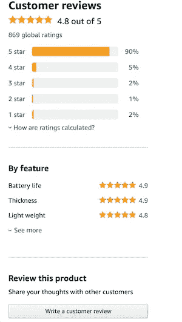
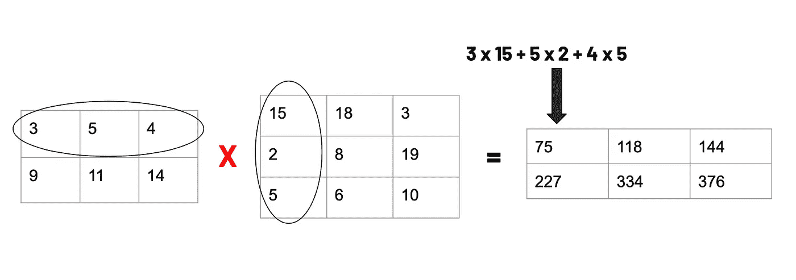
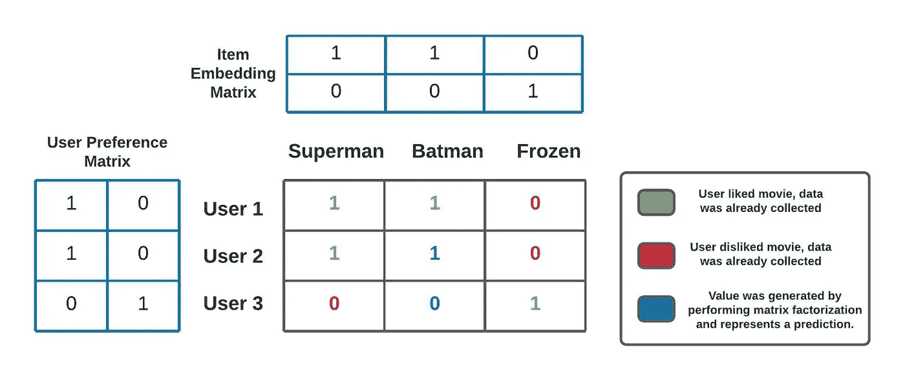

# 简化的协同过滤:推荐系统背后的基础科学

> 原文：<https://towardsdatascience.com/collaborative-filtering-simplified-the-basic-science-behind-recommendation-systems-1d7e7c58cd8?source=collection_archive---------22----------------------->

## [入门](https://towardsdatascience.com/tagged/getting-started)

由[卡里·谢伊](https://unsplash.com/@karishea?utm_source=medium&utm_medium=referral)在 [Unsplash](https://unsplash.com?utm_source=medium&utm_medium=referral) 上拍摄的照片

# **简介**

在做出消费者决策时，我们似乎经常在有意识地选择我们使用的服务和我们偏好的产品。然而，竞争我们业务的公司不断以微妙的方式影响我们的决策。公司经常推荐特定的产品，以增加我们选择他们而不是竞争对手的可能性，我们接触到的产品选项组合越来越符合我们的个人偏好。这是基于这样一种理论，即某人更有可能购买和享受符合其偏好的产品。推荐系统允许公司提高用户参与度，增加销售额，并不断调整产品以适应用户的偏好[1]。实际上，我们看到的歌曲或产品的推荐列表可能看起来很简单。然而，一个复杂、直观的工程过程在幕后产生这个列表。

推荐系统利用从用户行为产生的数据来推断用户偏好。在 Spotify，用户数据可以是歌曲选择，而亚马逊经常根据用户观看的产品、购买的产品和对产品的评论进行推荐。如何实现推荐系统的细节由用例决定，但是已经有了生成推荐的通用技术。最显著和最强大的技术是协同过滤，我们现在将进一步探讨它。

# 协同过滤

协同过滤使用大量关于用户交互的数据来生成一组推荐。协同过滤背后的想法是，对某些项目有相似评价的用户现在和将来都会喜欢同样的东西[2]。例如，假设用户 A 和用户 B 都喜欢项目 X 和 y。基于该信息，我们可以假设用户 A 和 B 具有相似的偏好。因此，如果用户 B 喜欢项目 Z，我们可以向用户 a 推荐项目 Z。这种从用户之间的相似性中寻找推荐的过程就是这种技术被称为“协作”过滤的原因。

驱动协同过滤系统的交互数据可以经由显式提示从用户处获得，或者从用户行为中隐式提取。在显式数据的情况下，用户提供关于他们喜欢某个项目的程度的清楚和直接的数据。这通常是用户被明确提示提供的“喜欢”或等级(见下图)[5]。也可以隐含地收集用户偏好数据。这需要根据跟踪的行为间接推断用户是否更喜欢某个项目。这些行为可以包括用户浏览了哪些页面，他们点击了哪里，他们花了多少时间看一些东西，等等[3]。例如，如果用户长时间查看某个项目，这通常意味着他们喜欢该项目或对其感兴趣。

亚马逊要求顾客评论的例子(截图直接来自 Amazon.com)

一旦收集了交互数据，接下来的问题就是如何将这些数据转化为推荐？最流行的方法之一是称为矩阵分解的强大的线性代数技术。矩阵分解为应用协同过滤提供了具体的数学基础，因为它允许我们将交互数据转换成确定用户是否会喜欢某个项目的模型。

# 矩阵分解

为了理解矩阵分解，我们必须了解矩阵乘法是如何工作的。矩阵是一组按行和列排列的数字，形成一个数组。当两个矩阵相乘时，结果矩阵的行数与第一个矩阵相同，列数与第二个矩阵相同。对于结果矩阵中的每个元素，我们在第一个矩阵中取相应的行，在第二个矩阵中取相应的列。然后，我们将所选行和列的相应元素相乘，并将结果相加。下图显示了该过程如何工作的示例。结果矩阵中的值 75 在第一行，所以我们选择第一个矩阵的第一行。值 75 也在第一列中，所以我们选择第二个矩阵的第一列。然后将行和列中的相应值相乘，并将结果相加，得到值 75。

矩阵乘法的一个例子(图片由作者提供)

乘法就是可以通过因式分解的过程来倒推。例如，3 和 4 相乘得到数字 12。然后，数字 12 可以分解为因子 3 和 4，因为它们相乘得到 12。同样的事情也可以用矩阵来做。对于大多数矩阵，存在两个矩阵因子，它们相乘得到同一个矩阵，或者是一个非常接近的矩阵。在上图中，第三个矩阵可以分解为前两个矩阵。这是因为将这两个矩阵相乘会得到第三个矩阵。为给定矩阵寻找两个因子的过程称为矩阵分解。

在推荐系统中，用户交互存储在一个大矩阵中。考虑电影推荐系统的情况。在矩阵的一个轴上，我们可以有不同的用户，而在另一个轴上是不同的电影。矩阵中的每个值对应于用户对该电影的喜爱程度(隐式或显式，取决于收集的数据)。然后，我们可以得到这个矩阵，并应用矩阵分解。结果因子将是表示用户偏好的矩阵和表示电影的矩阵。让我们看一个例子来获得更多关于这是如何工作的直觉。

# 协作过滤示例

**此图像用于以下协作过滤示例。蓝色数字是未收集的数据。它们表示通过执行矩阵分解做出的预测(图片由作者提供)。**

考虑上图中有三个用户和三部电影的情况。黑色轮廓的矩阵代表交互数据。绿色和红色的数字是通过观察用户动作收集的，而蓝色的数字是通过执行矩阵分解生成的。如果值为 1，则用户喜欢相应的电影，如果值为 0，则用户不喜欢。

交互矩阵已经被分解为用户和项目的嵌入矩阵。两个新矩阵中的数字使得两个矩阵相乘得到相互作用矩阵。例如，为了得到交互矩阵左上角的值，我们对用户矩阵中第一行和项目嵌入矩阵中第一列的相应元素的乘积求和。这个值是 1*1 + 0*0 = 1，与左上交互值相匹配。注意，以前未知的蓝色值现在可以通过应用相同的过程得到。例如，可以使用用户矩阵的第二行和项目矩阵的第二列来计算用户 User 2 喜欢蝙蝠侠的程度的值。

检查交互值将表明我们的协同过滤应用已经成功了！请注意，用户 1 和 2 有相似的偏好，因为他们都喜欢超人，不喜欢《冰雪奇缘》。因此，因为用户 1 喜欢蝙蝠侠，所以用户 2 也可能喜欢蝙蝠侠，这由该点中蓝色生成的值 1 所证实。相反，请注意，用户 3 的偏好与用户 1 和 2 非常不同。因此，由于这两个用户都喜欢蝙蝠侠，用户 3 可能不喜欢蝙蝠侠，这一点由我们在该点生成的蓝色值 0 所证实。这个简单的例子演示了矩阵分解如何确定用户是否喜欢某个项目。通过推荐用户最可能喜欢的项目，这些信息可以转化为推荐。实际上，数据集会更大，计算会更复杂。虽然本例中的值是手工设计的，但生产级推荐系统的计算将使用内置机器学习功能的库自动处理[4]。

我们还没有解决的一件事是，这些推荐是如何在没有定义任何电影信息的情况下做出的。在我们的例子中，我们知道蝙蝠侠和超人都是动作片，而《冰雪奇缘》是一部更面向家庭的电影。然而，我们从来没有定义过电影的类型，但是无论如何，检查用户行为仍然会导致似乎考虑电影类型的预测。潜在特征使得在没有关于项目的定义信息的情况下推荐项目的能力成为可能。潜在特征是我们没有明确定义的项目特征或用户偏好。然而，在寻找一组能够*解释*我们的相互作用数据的嵌入矩阵值时，矩阵分解中使用的计算无意中发现了一组相关特征。这是因为潜在特征首先影响了用户交互。这些特征可以是从流派信息到价格的任何东西。没有办法明确知道哪些特性会生效，但是我们通常可以根据我们推荐的项目类型进行假设[5]。潜在特征提供了协作过滤的真正力量，因为它们给大量数据带来了秩序。这最终为用户提供了可能是准确的推荐。

# 冷启动问题

关于协同过滤的最后一件事是它最大的缺点，冷启动问题。你可能已经注意到，在我们之前的例子中，我们能够确定用户 2 和 3 有多喜欢蝙蝠侠，因为我们知道用户 1 有多喜欢它。然而，如果我们不知道用户 1 对这部电影的想法，我们如何为其他 2 个用户做出预测呢？当然，我们可以意识到蝙蝠侠是一部动作片，类似于超人。这意味着用户 2 可能会喜欢，而用户 3 不会。然而，这违背了在协同过滤中使用潜在特征的目的。这种难以预测没有交互数据的项目的问题被称为冷启动问题。

当协作过滤系统最初被创建时，由于缺乏关于用户偏好的信息，它通常是无效的。这阻碍了这种类型的推荐系统的性能，并且可能导致它在用户基数小或者项目太多的情况下无效。通常，这可以通过存储关于每部电影的一些相关的显式特征信息(例如，流派、评级等)来解决。)并将其与用户过去的偏好进行匹配。由于冷启动问题，这种混合方法在现实世界中经常发生。

# 入门指南

现在我们已经回顾了基础知识，您可以开始探索一些工具并创建您自己的推荐系统。许多编程语言都可以用来创建推荐系统，但最常用的是 Python。Python 有很棒的工具，比如 pandas 和 NumPy，它们可以让你将交互数据转换成一种便于计算的形式。TensorFlow 和 PyTorch 等工具具有内置功能，可以处理协作过滤所需的强大计算。

推荐系统在现代商业中已经变得非常普遍。它们允许公司通过根据用户的偏好定制产品来实践先进的微营销策略。推荐系统的力量只会继续增长，因为它们从我们的行为中学到了更多关于我们个人偏好的东西。有了这些工具和我们在这里讨论的概念，你将有一个很好的开始来创建你自己的推荐系统，并在你自己的企业中利用技术的力量。

注意:本文主要介绍了协同过滤的基础知识，并提供了一个简单的例子来说明它是如何工作的。您可以期待未来的一些更高级的文章，介绍构建功能性推荐系统的技术步骤！

# 参考

[1] C. Underwood，“商业中推荐系统的使用案例——当前应用和方法”，Emerj ，2020 年 3 月 4 日。【在线】。可用:[https://emerj . com/ai-sector-overviews/use-cases-recommendation-systems/。](https://emerj.com/ai-sector-overviews/use-cases-recommendation-systems/.)【访问时间:2020 年 10 月 10 日】。

[2] V .鞍马，《协同过滤简单介绍》，*内置*，04-Sep-2019。【在线】。可用:[https://builtin . com/data-science/collaborative-filtering-recommender-system。](https://builtin.com/data-science/collaborative-filtering-recommender-system.)【访问时间:2020 年 10 月 10 日】。

[3] S .罗，《推荐系统导论:协同过滤》，*中*，2019 年 2 月 6 日。【在线】。可用:[https://towards data science . com/intro-to-recommender-system-collaborative-filtering-64a 238194 a26。](/intro-to-recommender-system-collaborative-filtering-64a238194a26.)【访问时间:2020 年 10 月 10 日】。

[4]“协同过滤|推荐系统|谷歌开发者”，*谷歌*。【在线】。可用:[https://developers . Google . com/machine-learning/recommendation/collaborative/basics。](https://developers.google.com/machine-learning/recommendation/collaborative/basics.)【访问时间:2020 年 10 月 10 日】。

[5] P. Pandey，《现实世界中的推荐系统》，*中*，2019 年 5 月 25 日。【在线】。可用:[https://towardsdatascience . com/recommendation-systems-in-the-real-world-51e 3948772 f 3。](/recommendation-systems-in-the-real-world-51e3948772f3.)【访问时间:2020 年 10 月 10 日】。