# 使用 fast.ai 的协同过滤

> 原文：<https://towardsdatascience.com/collaborative-filtering-using-fast-ai-f33cfea62812?source=collection_archive---------13----------------------->

## 了解推荐系统

想知道网飞是如何为用户推荐合适的内容的吗？这一深度探讨集中在推荐系统和嵌入[潜在因素]上，以从用户-项目交互中获得意义。如果你以前没有使用过推荐系统，这个博客对你来说是一个完美的开始。本文描述的模型使用 fast.ai 库，并假设您对 python 编程语言以及 PyTorch 有基本的了解。让我们开始吧。

在 [Unsplash](https://unsplash.com?utm_source=medium&utm_medium=referral) 上由 [Sayan Ghosh](https://unsplash.com/@7th_verse?utm_source=medium&utm_medium=referral) 拍摄的照片

## 数据分析

首先，让我们熟悉一下“电影镜头”数据集。要将数据输入 jupyter 笔记本，只需运行下面的单元格。fast.ai 函数会帮你完成剩下的工作。

注意:该数据集使用 100，000 个电影排名的子集。

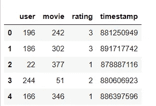

**样本收视率数据**

收视率数据正是我们所需要的。用户栏、电影 id、相应的评级和时间戳。为什么要建立模型？因为评价是不完整的，并且推荐者试图为用户以前没有看过的电影填充缺失的评价。

## 了解潜在因素

对于那些不熟悉推荐系统的人来说，这是重要的一步。潜在因素基本上是为数据集中的每个用户和电影随机初始化的参数。如果您在这一点上没有得到它，也不要太担心，但请尝试并了解这些潜在因素在协同过滤中的作用(下面的解释)。

假设我们知道用户喜欢一部电影所属类别(流派)的程度。现在假设我们也知道关于每部电影的相同信息[即电影与这一类别的紧密程度]。现在，为了填补缺失的评级，只需将这两个潜在因素相乘。答案是你对那部电影的预测评分。信息太多？让我们看一个小例子来理解这个概念。

尝试运行下面这段代码的代码块:

这里假设潜在因子的范围在-1 和 1 之间，正数表示强匹配，负数表示弱匹配。这个例子中的类别是“科幻小说”、“动作片”和“老电影”。也就是说，电影《原力觉醒》有它的潜在因素:1 为 0.98，表示它“有多科幻”，潜在因素:2 为 0.9，表示它“有多动作”，潜在因素:3 为-0.9，表示它“有多老”。

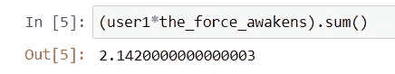

**科幻电影预测**

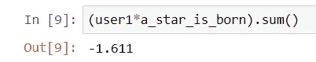

**言情电影预测**

我们在这里做了什么？我们基本上是将两个潜在向量/因子相乘，然后将它们的结果相加。如果你想用数据科学术语，你可以称之为“点积”。很简单，对吧？对于数据集中的每个用户和电影都会发生这种情况，这就是该模型的基本原理。从上面的例子中，你可以清楚地看到我对科幻/动作电影感兴趣，所以《原力觉醒》[2015]的评分高于《一个明星诞生》[1937]。

> 重要提示:正如这里提到的，评级预测基本上是潜在因素的点积。一旦计算了点积，该模型就试图通过调整潜在因子来最小化损失(使用随机梯度下降，本文将不讨论其细节，但模型实现将简要解释其功能)。

就这样—让我们从实际的代码开始:)

## 创建数据加载器

为了使这成为一个有趣的练习，让我们将电影片名引入到我们的数据集中，并将它们与收视率数据合并。表“u.item”由映射到标题的电影 ID 组成，所以让我们把它们拖进来。

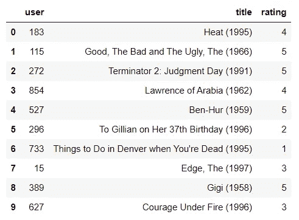

**为了更好的直觉，标题被合并**

Dataloaders 对象通常将第一列作为用户，第二列作为项目，评级作为第三列。由于我们的项目是电影，我们将其重命名为“标题”，批量大小为 64。

## 协同过滤的 PyTorch 表示

潜在因素需要以某种方式表示出来，以便我们对模型有所了解。pyTorch 表示它们的方式是使用矩阵。这是使用“torch.randn”函数完成的。工作原理是——py torch 根据用户和电影的总数随机创建用户和电影潜在因素。然后用点积来得出评级。我们已经确立了这一点。但是要做这个点积，就要在我们的电影潜在因子矩阵中查找电影的索引，在用户矩阵中查找用户索引。这不是深度学习模型知道的。这就需要嵌入【一个很简单的话题】。

在我们继续之前，请随意查看 pyTorch 如何在没有嵌入的情况下创建以下潜在因素:

## 嵌入

尽管“嵌入”这个术语听起来很奇怪，但其基本概念却很简单。这也是直接索引条目的行话。为了定义嵌入，让我们创建一个类和一个函数来定义潜在因素(嵌入)以及这些因素的点积，以达到预测的评级。

很简单，对吧？第一块使用嵌入创建用户和电影潜在因素，而第二块将两者相乘(点积)。

这里要理解的关键是模型接受一个形状张量(batch_size x 2)作为输入。这里第一列代表用户 id，第二列代表电影 id。嵌入层用于表示用户和电影潜在因素的矩阵。再次，自己探索一下数据。例如，分别看一下 x 和 y。

## 模范学习者

嵌入完成后，我们只剩下运行模型了。

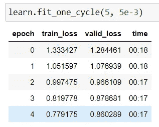

**历元&损失— I**

结果相当不错。我们可以通过使用 sigmoid_range 来进一步改进它，以确保我们的预测评级在 0 到 5 之间。

现在让我们尝试运行模型

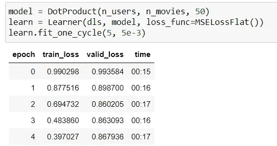

**时期&损失-II(具有乙状结肠范围)**

差别不大。我们肯定能做得比这更好。我们可以尝试的一件重要或显而易见的事情是考虑偏见。如果我们可以为每个用户添加一个数字，并对每部电影都这样做，我们将考虑用户和电影的偏见。所以让我们来试试这个。

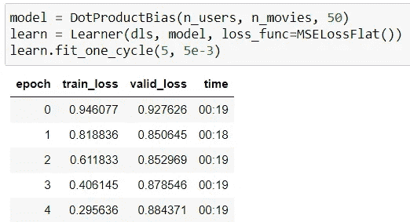

**时代&损失— III(有偏差)**

不太好。我们的结果变得更糟了。我们可以尝试的最后一件事肯定会改善我们的模型结果。让我们介绍一下我们数据科学家称之为加权衰减或 L2 正则化。该参数将基本上控制我们添加到损耗中的平方和，并减少过拟合。

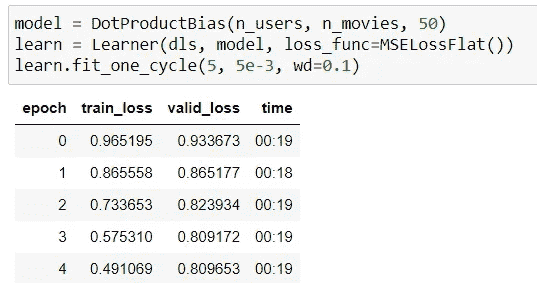

**纪元&损失—四(与 L2)**

好多了。我们的成绩终于提高了。现在，让我们从这些建议中获得一些视觉效果和见解。

## 解释嵌入和偏见

该模型为我们提供了建议，但看到它识别出了哪些因素是非常有趣的。让我们试着看看偏见。下面的代码给了我们偏差最小的电影。

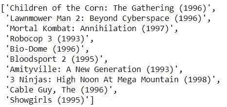

**偏见最低的电影**

这是什么意思？这基本上是在告诉我们，这些电影可能与某些用户的潜在因素非常匹配，但最终仍然不被用户喜欢。我们可以只按平均评级对电影进行分类，但这种使用偏见的观点更有趣，因为它不仅告诉我们一部电影是否是人们不太喜欢的那种，而且告诉我们这样一个事实，即它完全属于他们喜欢的类别，但他们并不总是喜欢它。

我很赞同这个模式。这些是一些糟糕的电影(其中一些是闻所未闻的，至少对我来说是这样——比如《歌舞女郎》, Bio-Dome 的互联网评分低于 5 分)

从这个意义上说，这是获得最具偏见的电影的代码。

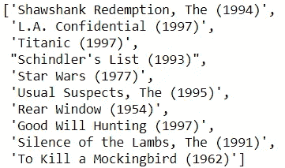

**偏见最高的电影**

这也是我不得不同意的一点。这是一个疯狂的电影列表。我个人已经看了全部 10 部电影，所以电影中的偏见已经被很好地考虑进去了。

## 用于可视化电影的 PCA

解释嵌入并不那么直接，因为维数通常很高。但是我们可以使用主成分分析来提取最重要的信息，并观察电影是如何分散在较低的维度中的。

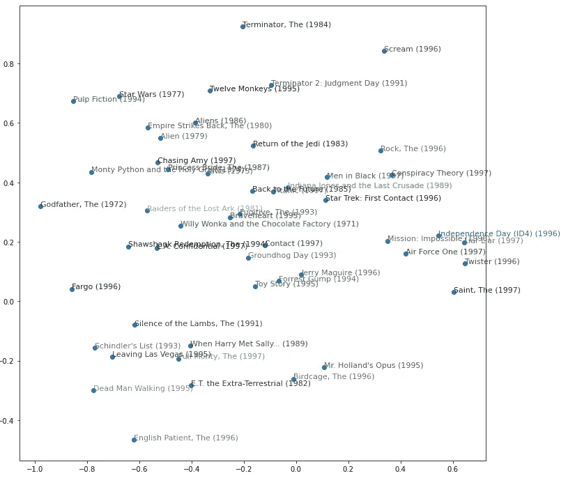

潜在空间中的电影 PCA 情节

这个情节挺有意义的。如果你注意到，我们有一些科幻电影，如《帝国反击战》、《绝地归来》、《星际迷航》、《印第安纳琼斯》等。左边是一些新黑色电影，如《教父》和《法戈》。这是几个例子，说明相似的电影在潜在空间中表现得有多相似。

这篇博客到此结束。要查看完整代码和其他机器学习算法的笔记本，请关注我的[***【github***](https://github.com/the-mean-square)。