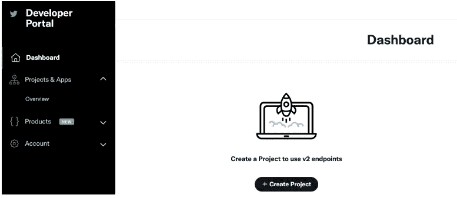
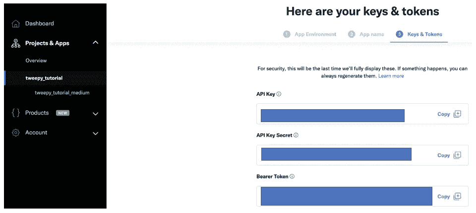
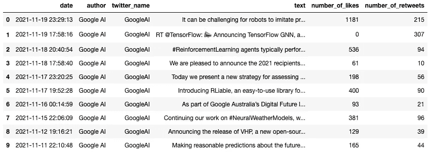

# 从 Twitter 收集数据:使用 Tweepy 的逐步实现

> 原文：<https://towardsdatascience.com/collect-data-from-twitter-a-step-by-step-implementation-using-tweepy-7526fff2cb31?source=collection_archive---------8----------------------->

## 本文是使用 tweepy 从 Twitter 收集数据的全面概述


布雷特·乔丹在 [Unsplash](https://unsplash.com/photos/4UgUpo3YdKk) 上的照片

# 介绍

获取数据是任何数据科学/机器学习项目生命周期的第二步，就在框定你想要解决的问题之后，这将使这一步成为其余阶段的支柱。此外，社交媒体是收集数据的好地方，尤其是用于竞争对手分析、话题研究、情感分析等。本文旨在逐步实现如何获取凭证，并在一个简单的用例上实现。

## Twitter，一个相关的数据收集场所

> Twitter 拥有 3.13 亿活跃用户( [Statista，2017](https://journals.sagepub.com/doi/full/10.1177/1609406917750782#) )，这意味着这种数据收集方法可以减少基于研究人员地理位置和研究资源的研究参与障碍。它还可以最大限度地利用资源，包括时间、精力和便利

## **Tweepy 的实现示例**

在执行任何类型的分析之前，要执行的第一个操作是获取您的 Twitter 认证凭证，如下所述。

**获取认证凭证**

1.  *注册开发者账户*

[这里的](https://developer.twitter.com/en/portal/dashboard)是进入下一页的链接。



(图片由作者提供)

*2。获取您的认证凭证*

在此页面上，创建一个项目并回答所有问题。然后，您将获得包含所有凭证的以下页面。确保你不会与任何人分享这些信息。



(图片由作者提供)

**实施要求**

*   安装 tweepy 模块

```
pip install tweepy # install the tweepy module
```

*   导入所需的模块

```
import tweepy # tweepy module to interact with Twitter
import pandas as pd # Pandas library to create dataframes
from tweepy import OAuthHandler # Used for authentication
from tweepy import Cursor # Used to perform pagination
```

**Python 实现**

*   实现实用函数来获取 tweets:
    在这个例子中有三个主要的函数。(1)认证功能。(2)为了与 Twitter API 交互的客户端功能。(3)最后一个功能，收集推文并创建一个数据框，其中包含关于给定 Twitter 帐户的一些特定信息。收集的信息如下:
    >推文的创建日期
    >推文的作者**推文的作者**
    >与推特账户上的名字相对应的**网名**
    >**该推文获得的点赞数**
    >推文转发数

```
"""
Twitter Authentification Credentials
Please update with your own credentials
"""
cons_key = ''
cons_secret = ''
acc_token = ''
acc_secret = ''# (1). Athentication Function
def get_twitter_auth():
    """
    [@return](http://twitter.com/return):
        - the authentification to Twitter
    """
    try:
        consumer_key = cons_key
        consumer_secret = cons_secret
        access_token = acc_token
        access_secret = acc_secret

    except KeyError:
        sys.stderr.write("Twitter Environment Variable not Set\n")
        sys.exit(1)

    auth = tweepy.OAuthHandler(consumer_key, consumer_secret)
    auth.set_access_token(access_token, access_secret)

    return auth# (2). Client function to access the authentication API
def get_twitter_client():
    """
    [@return](http://twitter.com/return):
        - the client to access the authentification API
    """
    auth = get_twitter_auth()
    client = tweepy.API(auth, wait_on_rate_limit=True)
    return client # (3). Function creating final dataframe
def get_tweets_from_user(twitter_user_name, page_limit=16, count_tweet=200):
    """
    [@params](http://twitter.com/params):
        - twitter_user_name: the twitter username of a user (company, etc.)
        - page_limit: the total number of pages (max=16)
        - count_tweet: maximum number to be retrieved from a page

    [@return](http://twitter.com/return)
        - all the tweets from the user twitter_user_name
    """
    client = get_twitter_client()

    all_tweets = []

    for page in Cursor(client.user_timeline, 
                        screen_name=twitter_user_name, 
                        count=count_tweet).pages(page_limit):
        for tweet in page:
            parsed_tweet = {}
            parsed_tweet['date'] = tweet.created_at
            parsed_tweet['author'] = tweet.user.name
            parsed_tweet['twitter_name'] = tweet.user.screen_name
            parsed_tweet['text'] = tweet.text
            parsed_tweet['number_of_likes'] = tweet.favorite_count
            parsed_tweet['number_of_retweets'] = tweet.retweet_count

            all_tweets.append(parsed_tweet)

    # Create dataframe 
    df = pd.DataFrame(all_tweets)

    # Revome duplicates if there are any
    df = df.drop_duplicates( "text" , keep='first')

    return df
```

**所有的功能最终都实现了，现在我们可以继续收集数据了。比方说，我们想收集谷歌人工智能的推文。创建数据框的函数将 Twitter 用户名/屏幕名称作为强制参数，在本例中，它是 **GoogleAI** ，没有@符号。**

****

**图片来自作者定制的 [GoogleAI Twitter 账户](https://twitter.com/GoogleAI)**

```
googleAI = get_tweets_from_user("GoogleAI")print("Data Shape: {}".format(googleAI.shape))
```

*****打印*** 指令显示 ***数据形状:(1743，6)*** 含义我们有 1743 条来自 Google AI 的推文，下面的 ***。head(10)*** 给出了数据帧中的前 10 条推文**

```
googleAI.head(10)
```

****

**googleAI.head 的结果(10)**

## **tweepy 的优点和缺点**

****优点****

*   **写得很好的文档，有一个非常活跃的社区**
*   **提供关于给定推文的许多特征(例如，关于推文的地理位置的信息，等等。)**

****缺点****

*   **将用户限制在时间线中的最后 3200 条推文。**

## **文章结尾**

**在本文中，您了解了如何获得 Twitter 开发人员证书，以及如何使用 tweepy 从 Twitter 获取数据。此外，您已经了解了该工具的局限性和优点。**

**如需进一步阅读，请随时查阅以下链接:**

## **额外资源**

**[Github 上的源代码](https://github.com/keitazoumana/Social-Media-Scraping/blob/main/Twitter%20Scraping.ipynb)**

**[Twitter 开发者文档](https://developer.twitter.com/en/docs/twitter-api/tools-and-libraries/v2)**

**[十二页文档](https://docs.tweepy.org/en/latest/)**

**[Twint 文档](https://pypi.org/project/twint/)**

**[如何访问 Twitter API](https://developer.twitter.com/en/docs/twitter-api/getting-started/getting-access-to-the-twitter-api)**

**[使用 Twitter 收集医疗保健消费者的数据:范围审查](https://journals.sagepub.com/doi/full/10.1177/1609406917750782)**

**再见🏃🏾**