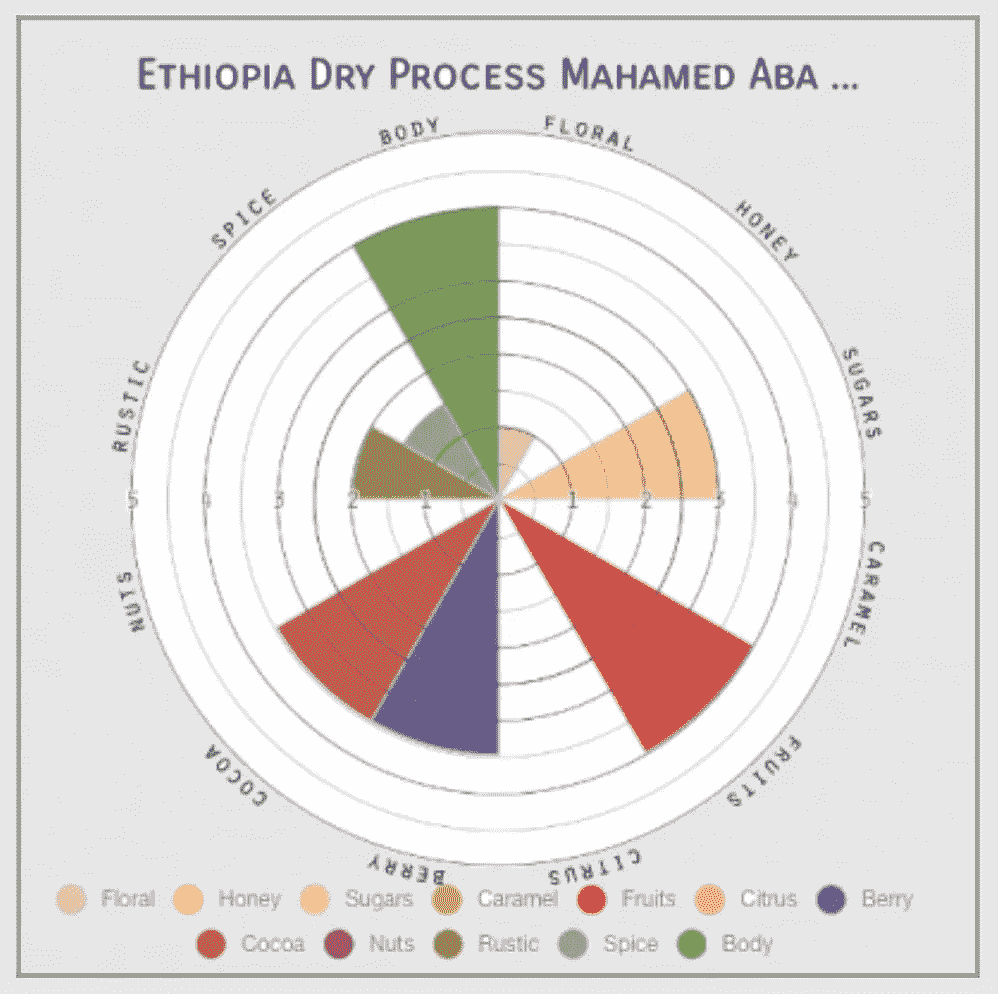

# 收集爱好数据集:咖啡

> 原文：<https://towardsdatascience.com/collecting-a-hobby-dataset-454e07a3f48e?source=collection_archive---------41----------------------->

## 数据科学

## 管理野生数据集的短暂旅程

现代的数据科学已经允许人们参加一个训练营，在那里给他们清理过的数据集来训练分类器。虽然结果可能令人兴奋，但进行分析或培训只是成为数据科学家的一小部分。如果有的话，实验设计、数据收集、数据验证和数据清理消耗了你的大部分时间。如果你已经做好了所有这些事情，那么训练和分析是直截了当的，甚至时间。

从专业角度来说，我已经单独或作为团队的一员完成了所有这些步骤。就我个人而言，我收集了我感兴趣的事物的数据集。

当我想买一辆新的[汽车](https://medium.com/overthinking-life/buying-a-car-an-analysis-7bf7caf58e04)时，我建立了一个我想要的关键特征的小数据集。一旦我面前有了所有的特征，最佳选择就很清楚了，奇怪的是，它并不是由我认为的决定性因素决定的。对汽车来说，一切都是平等的，这意味着只有像 CarPlay 这样的小功能才能使它们与众不同。

当我想更好地了解[的营业额](https://rmckeon.medium.com/abandon-ship-how-a-startup-went-under-c5ca8e5bb970)和我之前公司的健康状况时，我开始建立一个数据集。这需要耐心。没人给我或想给我数据。事实上，我的数据来自公司的电话列表这样简单的东西。随着时间的推移，我的数据集变得越来越清晰，几年后，很明显，基于不可持续的周转率，该公司正在走向破产。

# 咖啡数据集

几个月前，我开始对寻找咖啡 Q 等级的大型数据集感兴趣。q-分级是一种用标准化的味道分级系统来比较咖啡的方法。我想对它们做一些分析，看看它们在确定更好的混合或解释为什么混合效果好方面有多大用处。

除非另有说明，所有图片均由作者提供

虽然我发现一个数据集(CQI)管理得相当好，但我真的想从 Sweet Maria's 建立一个更有用的数据集，因为我在那里买了大部分的绿咖啡。sweet Maria’s 也有咖啡的味道，这是 CQI 的数据集中没有的。

> 难点在于:这需要大量的手工工作。

# 原始数据

Sweet Maria's 将他们所有的旧咖啡作为存档页面，每一种都有价格、总 Q 值和一些图片。每个都有一个显示 Q 分数的子矩阵的图像和一个显示味道的图像。这两个图像都显示为一个蜘蛛图。

图片经 Sweet Maria's 许可转载

这个列表中有 300 多个条目。我不得不在一个页面上查看所有的咖啡，点击每个咖啡的快速摘要，点击 Q-score 图表，然后选择全部，并复制。我为味道图重复了这个步骤。这个过程大概花了两个小时。我最终这样做了两次，因为我第一次建立这个数据库时，我没有收集风味等级。

屏幕截图，合理使用

此外，我对所有这些产品进行了比较，这样我就可以获得元数据，如加工方法、地区和品种。

截屏，合理使用

# 分数提取

对于 Q-score 和 flavor [蜘蛛图](/extracting-data-from-a-spider-graph-99dd12abda4c)，我编写了一个脚本来分割图像，识别圆圈，然后提取分数。

对于口味，我不得不稍微修改脚本，但我能够相对容易地得到分数。

Q-scores 有一个我单独得到的最终分数，还有一个 cupper 的修正。我编写了一个脚本来手动输入 cupper 的更正，这样我就可以帮助验证 cupper 的总得分。这让我可以在几分钟内浏览全部 300 张图片。

我使用这两条信息来计算 Q 分数子矩阵的平均误差，并通过这个误差来修正所有的子矩阵。结果，当我进行一些数据验证时，数据的每个子指标的误差小于 0.1。

然后，我通过随机采样数据、查看图像并验证提取的子测量分数与图像匹配来验证数据。这花了一些时间，但它有助于确保我的蜘蛛图提取工作正常。

然后我将它链接到元数据，数据集就可以处理了。

# 数据分析

我用这些数据来了解每个分项指标相对于总分的[质量](/a-review-of-coffee-data-grades-and-flavors-5ccb6fc51941)，甜蜜玛利亚的 Q-等级与[有多相似，以及](/comparing-coffee-using-pattern-recognition-35b92cca4502)[甜蜜玛利亚的 Q-分数与 CQI 的 Q-分数](/specialty-coffee-comparing-grading-methods-36777cae220f)有多相似。

这里我展示了每个[指标与](/a-review-of-coffee-data-grades-and-flavors-5ccb6fc51941)的相互关系:

以下是这些分数如何被用来[比较咖啡和其他咖啡](/comparing-coffee-using-pattern-recognition-35b92cca4502)并了解咖啡是如何相似的:

以下是 CQI 咖啡评分与甜甜玛利亚咖啡评分的相似之处:

总的来说，这项工作非常耗时，而且回报也不明朗。由此产生的分析可能是浪费时间，但更令人兴奋的分析部分是为分析做准备。否则，分析不会如此有趣，我也不会有如此强烈的情感依恋。

如果你愿意，可以在 Twitter 和 YouTube 上关注我，我会在那里发布不同机器上的浓缩咖啡视频和浓缩咖啡相关的东西。你也可以在 [LinkedIn](https://www.linkedin.com/in/robert-mckeon-aloe-01581595?source=post_page---------------------------) 上找到我。也可以关注我[中](https://towardsdatascience.com/@rmckeon/follow)。

# [我的进一步阅读](https://rmckeon.medium.com/story-collection-splash-page-e15025710347):

[浓缩咖啡系列文章](https://rmckeon.medium.com/a-collection-of-espresso-articles-de8a3abf9917?postPublishedType=repub)

[工作和学校故事集](https://rmckeon.medium.com/a-collection-of-work-and-school-stories-6b7ca5a58318?source=your_stories_page-------------------------------------)

[个人故事和关注点](https://rmckeon.medium.com/personal-stories-and-concerns-51bd8b3e63e6?source=your_stories_page-------------------------------------)

[乐高故事启动页面](https://rmckeon.medium.com/lego-story-splash-page-b91ba4f56bc7?source=your_stories_page-------------------------------------)

[摄影启动页面](https://rmckeon.medium.com/photography-splash-page-fe93297abc06?source=your_stories_page-------------------------------------)

[弃船:一家初创公司如何破产](https://medium.com/@rmckeon/abandon-ship-how-a-startup-went-under-c5ca8e5bb970?source=your_stories_page-------------------------------------)

[从蜘蛛图中提取数据](/extracting-data-from-a-spider-graph-99dd12abda4c?source=your_stories_page-------------------------------------)

学习新语言的技巧

[买车:分析](https://medium.com/overthinking-life/buying-a-car-an-analysis-7bf7caf58e04?source=your_stories_page-------------------------------------)

[与星共舞(DWTS):分数膨胀？](https://medium.com/overthinking-life/dancing-with-the-stars-dwts-score-inflation-3a3620601aba?source=your_stories_page-------------------------------------)