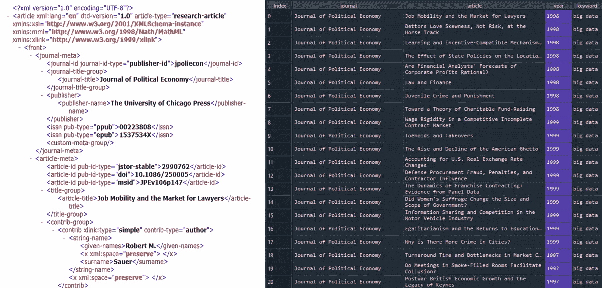
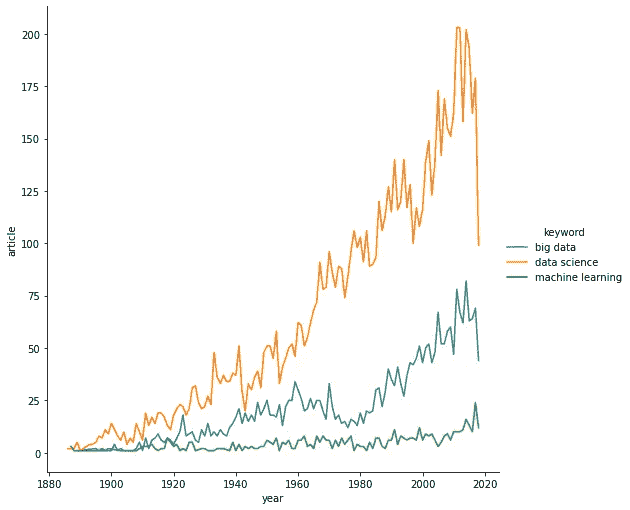

# 在 Python 中收集、转换和清理 JSTOR 元数据

> 原文：<https://towardsdatascience.com/collecting-transforming-and-cleaning-jstor-metadata-in-python-fef9f8689e3a?source=collection_archive---------28----------------------->

## 使用 ElementTree XML 从 JSTOR 数据解析元数据的简单指南。


照片由[🇸🇮·扬科·菲利](https://unsplash.com/@itfeelslikefilm?utm_source=medium&utm_medium=referral)在 [Unsplash](https://unsplash.com/?utm_source=medium&utm_medium=referral) 上拍摄

STOR 数据库是 50 多个科学领域研究论文的主要来源之一。在[用于研究的数据部分](https://about.jstor.org/whats-in-jstor/text-mining-support)，研究人员可以访问数据集，用于图书馆发布的文章和书籍的研究和教学。通过该服务可以获得的数据包括元数据、n-grams 和 JSTOR 上大多数文章、书籍章节、研究报告和小册子的字数。但是，数据请求的输出不是简单的 csv。或者 txt。文档，但 XML 文件需要一些处理和清理才能有效地处理数据。在 R 中，2020 年中期发布的包 [Jstor](https://cran.r-project.org/web/packages/jstor/index.html) 使得整个过程简单得多。

为了让数据科学家和研究人员更容易访问大量数据，在本文中，我展示了用于解析 XML 输出的 python 代码，解释了从 JSTOR data for research 数据库收集数据的过程，并展示了这种数据的一个很好的应用。

# 收集数据

研究数据(DfR)支持手动请求，一次最多可将 25，000 个文件作为外部链接发送到您的邮箱。这些文件可能包括数据库中发表的文章和书籍的元数据(文章或书籍名称、期刊名称、出版年份、参考文献等)。)，以及 N-grams(文章和书籍的标记化文本)。

例如，我们可能会对从《泰晤士报》创刊到现在为止的 5 种顶级经济学期刊(*《美国经济评论》、《计量经济学》、《经济学季刊》、《政治经济学杂志》和《经济研究评论》*)中关注*数据科学*、*机器学习*和*大数据*的文章频率感兴趣。要提出这样的请求，这些查询需要放在[这里](https://www.jstor.org/dfr/results?Query=):

**(机器学习)jcode:(amereconrevi 或计量经济学或 revieconstud 或 quarjecon 或 jpoliecon)**

**(数据科学)jcode:(amereconrevi 或计量经济学或 revieconstud 或 quarjecon 或 jpoliecon)**

**(大数据)jcode:(amereconrevi 或计量经济学或 revieconstud 或 quarjecon 或 jpoliecon)**

这些请求产生了 576 篇关于机器学习的文章，9 459 篇关于数据科学的文章，3 059 篇关于大数据的文章，以 XML 格式存储。

# 数据转换

从导入必要的库开始， *ElementTree* 用于解析 XML 文件，这些文件是 *DfR* 请求的输出， *os* 模块提供创建目录的功能，以便单个循环可以一起访问这些文件， *Pandas* 和 *Numpy* 进行数据操作， *matplotlib* 和 *seaborn* 绘制图形。

```
import xml.etree.ElementTree as ET
import os
import pandas as pd
import seaborn as sns
import numpy as np
import matplotlib.pyplot as plt
```

将所有文件存储在文件夹 *data 中，*该循环首先访问三个子文件夹*机器学习*、*数据科学*和*大数据*，并在每个子文件夹中解析源文件。它遵循 XML 文件的层次结构，忽略书评和通知。

循环从每个文件中存储期刊标题、文章标题、出版年份和关键字(与存储文件的子文件夹的名称相同)。数据列表随后被转换为熊猫数据框。

# 数据清理

为了发现数据中的研究趋势，论文综述、索引、讨论、笔记和成员列表都被删除。通过这种基本的数据清理，只有发表的文章留在数据中，这提供了关于研究人员随着时间的推移对数据科学在经济学中的应用的兴趣的有价值的信息。

对原始 XML 源文件和 Pandas data frame 中转换后的数据集进行快速比较，可以看出其中的神奇之处:



最后，让我们使用 seaborn relplot 绘制系列图:

我们可以看到，自 20 世纪 60 年代以来，对数据科学的研究兴趣呈指数增长。自 20 世纪 80 年代以来，大数据经历了一场繁荣，自 21 世纪初以来，对机器学习的兴趣稳步增长。140 年跨度的数据涵盖了现代经济研究的重要发展。



来源:自己的作品。

# 结论

JSTOR data for research 提供了关于所有科学学科研究趋势的有价值的数据。研究人员和数据科学家可以使用文本挖掘、机器学习和其他数据科学技术来发现数据中有价值的模式。处理最终数据集可能具有挑战性，因为源数据文件是以 XML 格式发送给用户的。有了我介绍的 Python 代码，这些操作不再是一项具有挑战性的任务。

**更新:2021 年 5 月，用于研究的 JSTOR 数据切换到新平台** [**星座**](https://constellate.org/) **。**

*PS:你可以订阅我的* [*邮箱列表*](https://medium.com/subscribe/@petrkorab) *每次我写新文章都会收到通知。如果你还不是中等会员，你可以在这里加入*[](https://medium.com/@petrkorab/membership)**。**

# *感谢*

*本文是与 David str ba(布拉格 Lentiamo)合作编写的。*