# 图像处理中的颜色交换技术。

> 原文：<https://towardsdatascience.com/color-swapping-techniques-in-image-processing-fe594b3ca31a?source=collection_archive---------15----------------------->

## 理解色彩空间并在 Python 中实现色彩交换。

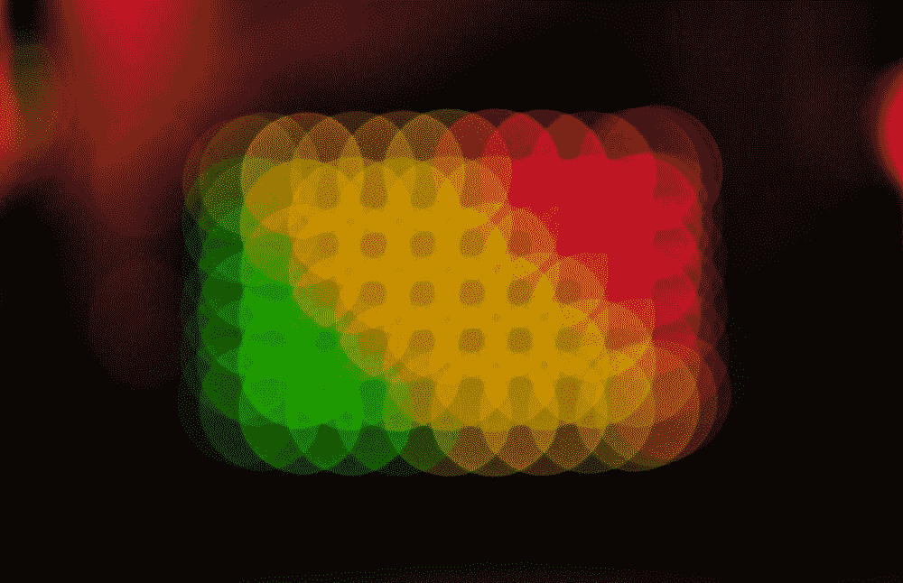

照片由 [**维克多**](https://unsplash.com/@sonance) 上[**下**](https://unsplash.com/)

*在这篇文章中，我试图解释我的探索，即为什么需要交换图像中的颜色，以及我们如何使用简单的图像处理方法，通过在 Python 中实现来智能地交换图像中的颜色。*

## **为什么要换颜色？**

**数据科学家对颜色交换感兴趣可能有几个原因:**

1.  **作为数据科学从业者，我们可能希望使用颜色交换方法作为数据增强策略，这有助于在处理深度学习算法的同时增加数据量。**
2.  **很多时候，找到一个真实的、开源的大型数据集来研究算法是很有挑战性的，在这种情况下，使用合成数据会变得非常有帮助。因此，当图像数据有限时，这些图像处理技术在生成高质量的合成图像时会非常方便。**
3.  **我们可能想尝试一些很酷的东西，比如在参加会议时交换背景色，调整衬衫的颜色等等。**

# **色彩空间**

**类似于我们有不同类型的数字系统来表示一个数(例如:二进制、十进制、十六进制等。)，同样，在特定的显示/图像中，有不同的数字系统来表示颜色/颜色的关联。这些系统被称为**色彩空间**。**

**在开始实现智能色彩映射之前，首先，让我们试着理解一些在计算机视觉和图像处理领域广泛使用的色彩空间:**

## ****RGB 颜色空间:****

**它是基于 RGB 颜色模型的三维空间。在这个模型中，任何颜色都是三原色分量(红色、蓝色和绿色)的不同强度的混合。这些分量可以被认为是色彩空间的数学坐标。借助于 3D 笛卡尔空间中的立方体，该模型被最佳可视化:**

**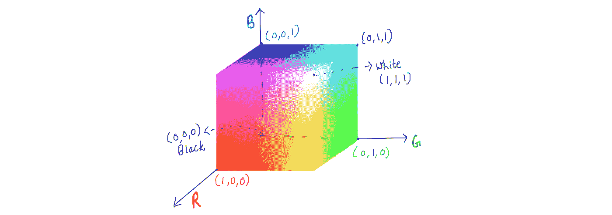**

**图 3:一个单位边长的 RGB 颜色立方体.图片作者。**

**所有分量以全强度会聚，产生白色。默认情况下，OpenCV 以 BGR 格式读取和存储图像。**

## ****HSV 颜色空间:****

**它是基于 HSV 颜色模型的三维颜色空间。在这个模型中，我们用单独的组件来表示颜色和强度:
*** Hue -** 表示颜色(蓝色、红色、绿色等。)，其取值范围为 0 到 360*。
***饱和度-** 代表一种颜色的**纯度**或**色彩度**的多少。较低的饱和度值意味着褪色或变灰的颜色。
* **Value -** 代表一个色调的明度或暗度。**

**这个模型最好在圆柱坐标系的帮助下可视化(虽然大多数文本使用 3D 圆锥体，但 3D 圆柱体实际上是更精确的数学表示)。**

**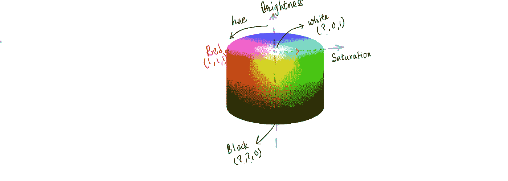**

**图:HSV 颜色模型，有单位半径和单位高度。**？**”表示该组件的值是多少并不重要。图片作者。**

**在此模型中，方位角(0–360 *)指定色调分量，距中心的径向距离与饱和度分量相关，沿轴的距离代表图像的亮度。**

## ****LAB 色彩空间:****

**类似于 HSV 颜色空间如何从强度和亮度分量中分离颜色分量，LAB 颜色空间使用 2 个分量来表示颜色，1 个单独的分量来表示亮度值。
* L:明度分量，
* A:指定红/绿色组合的颜色分量，
* B:指定蓝/黄色组合的颜色分量。**

**借助于 3-D 空间中的球体，颜色模型被最好地可视化。**

****

**图:带单位半径的 LAB 颜色模型。图片作者。**

**这些不同空间中的每一个都有其自身的优点和缺点，这取决于使用的应用。**

# **实验**

**让我们进入实现部分。让我们考虑几种颜色交换的情况，我们将从一个简单的颜色交换图像开始(简单的意思是颜色分布变化不大),然后逐渐转到图像具有变化的颜色分布的例子，在这些例子中，交换选择的特定颜色是相当棘手的。**

**让我们考虑下图。它看起来像一支绿色的塑料笔身，由金属笔尖和绿色的塑料笔帽组成，笔帽上有一些金属部分和黑色的设计。**

**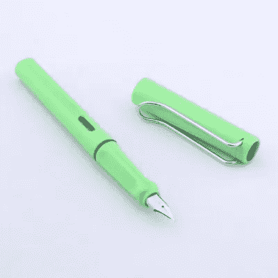**

**图:钢笔的原始图像。图片作者。**

**现在，我们想把笔身的颜色从绿色改为紫色，并希望生成的图像像原来一样逼真，并且需要在生成的图像中考虑所有的照明和阴影。我们能在 RGB 空间中实现吗？让我们试一试。注意:在 Open-CV 库的帮助下加载图像时，特定颜色空间中的组件范围通常是从 0 到 255。**对于 HSV，OpenCV 使用 H:0–179，S:0–255，V:0–255。****

**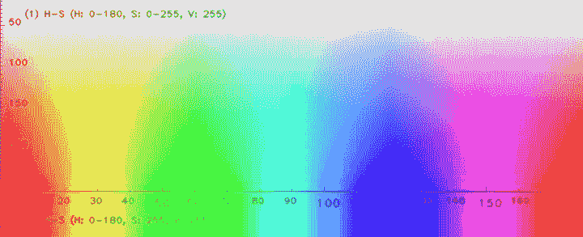**

**图:x 轴代表[0，180]中的`Hue`**

**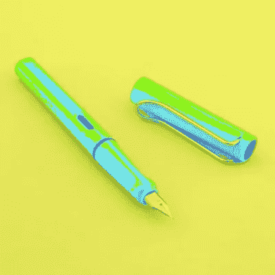**

**图:将**【B】**分量的值增加一个固定的量，会导致颜色和强度值都发生变化。图片作者。**

**这个奇怪的合成图像的原因是:**

*   **RGB 空间借助所有三个分量(R、G 和 B)来指定颜色和亮度信息。**
*   **RGB 图像中的每个像素都是这些成分的特定组合，我们无法解释一个成分需要改变多少才能获得所需的颜色。**
*   **R、G、B 分量中任何一个的任何变化都会引起像素的颜色和亮度值的变化。**

**如果有一个空间，其中颜色和亮度信息都在彼此独立的单独组件中指定，那么交换颜色将会非常容易。这就是像 HSV 和 LAB 这样的色彩空间出现的原因。现在让我们试着通过改变 HSV 颜色空间中的色调值来交换钢笔颜色。**

**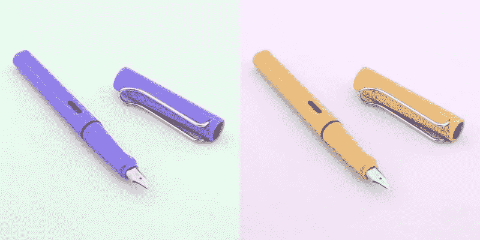**

**图:通过改变图像的**色调**分量得到的图像。亮度和饱和度值没有干扰。图像看起来很真实。图片作者。**

**类似于改变色调值如何不影响图像的亮度分量，让我们检查我们是否可以改变图像的亮度而不干扰图像的颜色/色调分量。**

**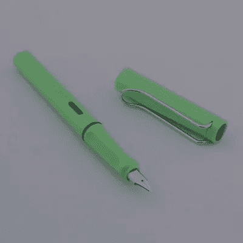**

**图:通过降低亮度分量获得的图像。图片作者。**

**显然，在 HSV 颜色空间中使用不同的组件非常容易。我们看到了修改不同的组件如何帮助我们分别转换图像的颜色组件和亮度。**

**将亮度通道乘以 0.6(暗化效果)也会导致背景变暗。在早期的图像中，我们也看到改变色调值会导致背景颜色的变化。**

**让我们来研究一下，如何只改变钢笔的颜色或者只改变前景的亮度而不改变背景。注意，还有其他基于深度学习的技术，如 GANs，也可以用来实现相同的目的，在本文中，我们只讨论解决该问题的简单图像处理技术。**

**这个想法是为背景或前景创建一个颜色范围二元蒙版，然后使用该蒙版有选择地将颜色变化应用于前景。但是，面具适合哪种颜色呢？为了回答这个问题，如果我们为我们的色调/颜色通道绘制直方图就好了。这是我们的色调通道和直方图的样子:**

**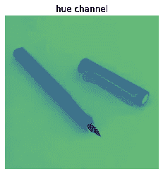**

**图:原始笔图像的色调通道。图片作者。**

**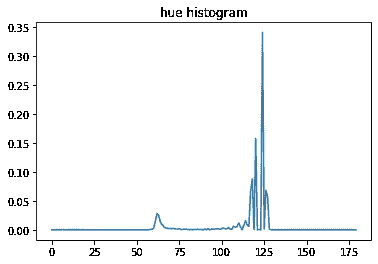**

**图:颜色分布直方图。图片作者。**

**上面的直方图暗示峰值出现在~120，这是我们图像中的主要背景色和噪声。从上面的 HSV 颜色空间中，可以注意到绿色在 55–65 附近达到峰值，这也是为什么我们在上面的图中在相同的间隔附近看到一个小峰。因此，我们试图为相似的色调范围创建一个遮罩。**

**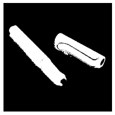**

**图:钢笔的颜色遮罩(前景)。图片作者。**

**现在，让我们增加这个二元蒙版中非零像素的色调值。**

**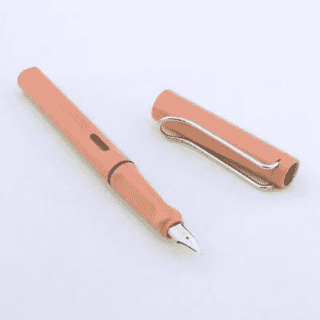**

**图 5:我们改变了前景色，但没有改变背景。所有的照明都完好无损。图片作者。**

**这就是我们如何能够成功地交换图像的颜色，而不操纵背景颜色。**

**最后，我想提一下在电视和电影中非常流行的 [**色度键控**](https://en.wikipedia.org/wiki/Chroma_key) 方法。这种技术也可以用来交换图像中的颜色。这里的想法是从两个图像开始，一个是安装在绿色或黑色屏幕上的前景，第二个是需要叠加在背景上的图像。方法是首先提取图像中的所有绿色或黑色像素，使这些像素透明，这将使我们能够在背景中覆盖所需的图像。 ***但是，这种方法要求表面非常光滑，只有很少的光照。*****

**我希望你喜欢颜色交换的想法。我很乐意回答上述任何概念的问题。我想知道任何阅读这篇文章的人的反馈。你可以通过 Linkedin 联系我。**

**谢谢大家！**

**特别感谢 Apurva Gupta 对博客的评论。**