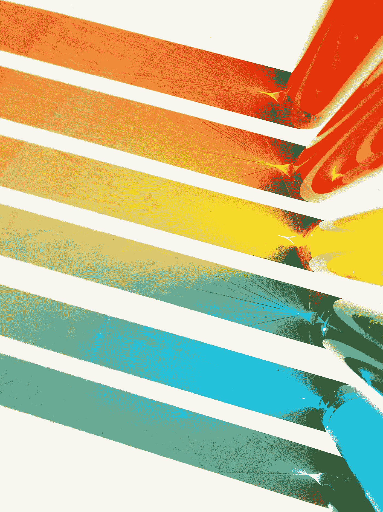
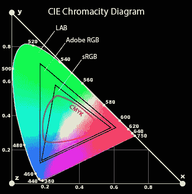
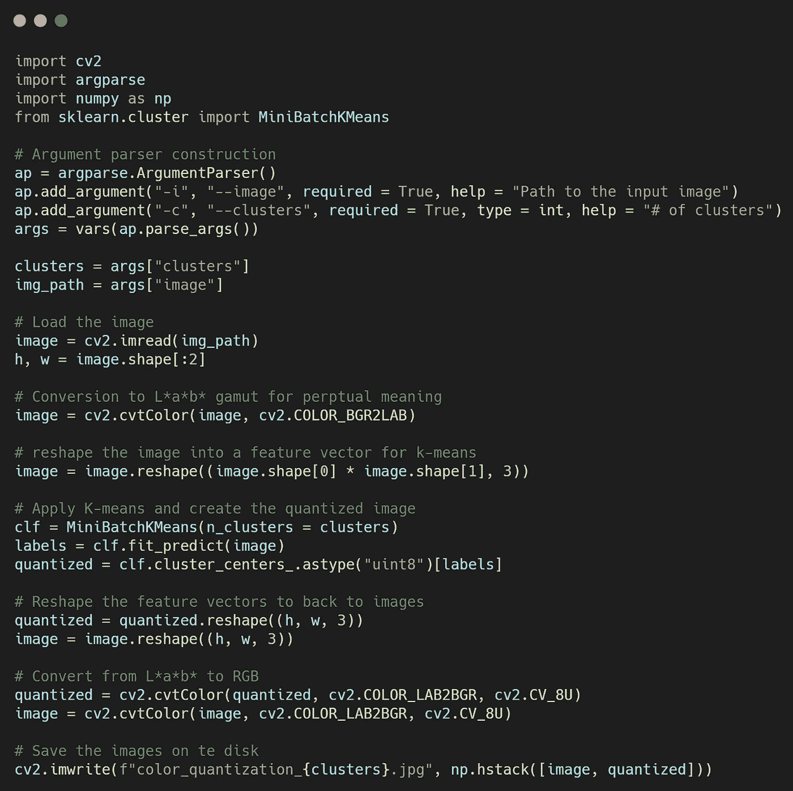
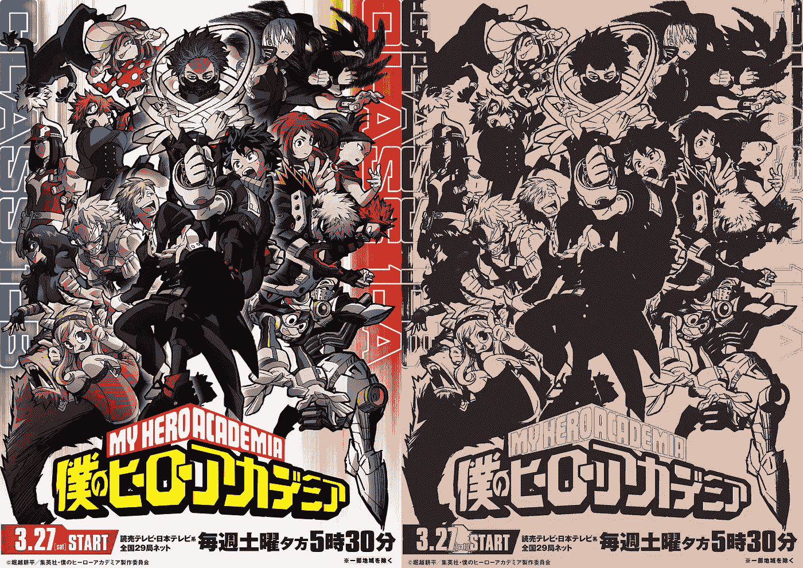
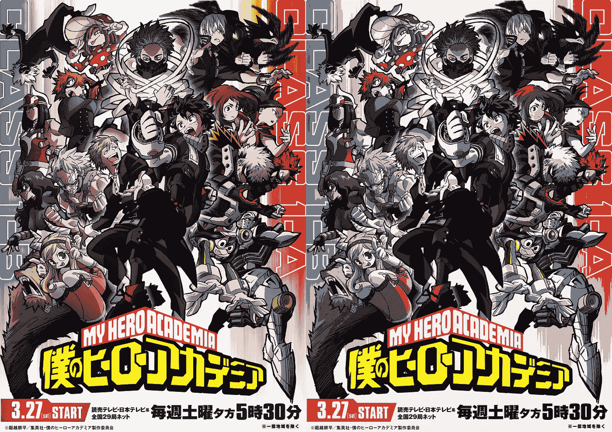
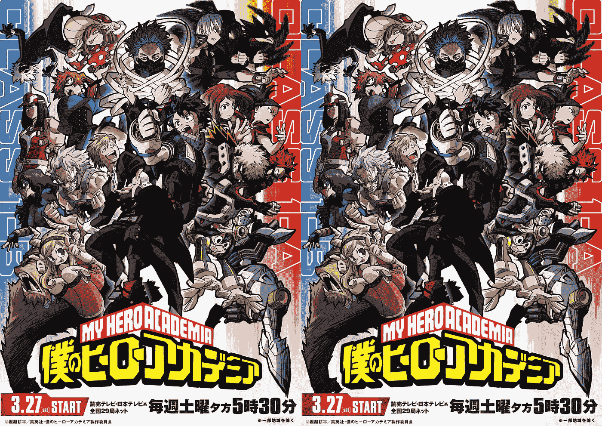
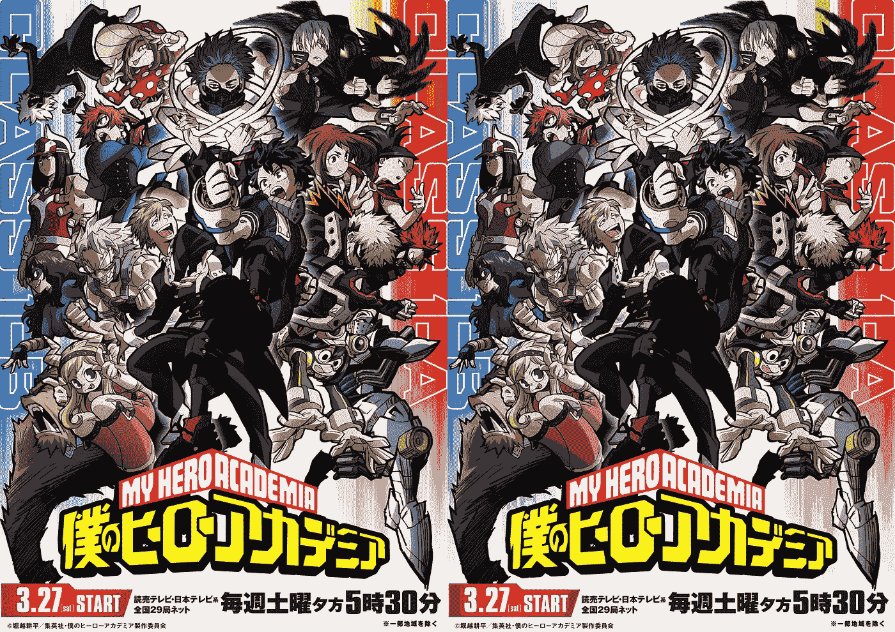

# 基于 K-均值的彩色图像量化

> 原文：<https://towardsdatascience.com/colour-image-quantization-using-k-means-636d93887061?source=collection_archive---------19----------------------->

## 一个关于如何使用 Python 和 OpenCV 减少图像中不同颜色数量的简单教程

Joyce McCown 在 [Unsplash](https://unsplash.com?utm_source=medium&utm_medium=referral) 上的照片

**颜色量化**是一种减少图像颜色数量的过程，同时试图保持图像质量和重要的全局信息。图像由像素组成，在 RGB 颜色空间的情况下，每个像素可以与 **16，777，216** 种不同的颜色相关联，这可能是最常用的颜色空间。每种颜色都可以表示为一个 3d 矢量，每个矢量元素都有一个 8 位的动态范围，这意味着 2⁸=256 不同的值(即 256x256x256 =16，777，216)。这种表示通常被称为 RGB 三元组。成功的颜色量化的关键因素是适当选择能够充分概括初始图像信息的**调色板**。

**动机** : *什么时候应该使用彩色图像量化？*

如果我们想要在仅支持有限数量颜色(有限调色板)的设备中渲染图像，彩色图像量化可能是至关重要的，这通常是由于内存限制而发生的。

## 作为聚类问题的颜色量化

解决图像色度压缩的最常见方法之一是使用聚类，其中特征是图像的颜色。K-means 是一种非常流行的矢量量化聚类方法，多亏了 scikit-learn 库，它真的很容易使用(只要你知道它是如何工作的)。当然，其他聚类方法如奇异值分解、高斯混合模型等。把工作做好。

## 色彩空间

颜色空间是描述颜色表现方式的数学模型。最简单的方法是想象一个盒子，里面装着所有可能的颜色，这些颜色可以由光的三原色混合而成:*红色*、*绿色*和*蓝色*、[光源](https://www.photoreview.com.au/tips/outputting/colour-spaces-explained/)。在图 1 中，您可以看到数学家为了将三个轴(红色、绿色和蓝色)拟合为二维格式而绘制的图表:

图 1: CIE 色度图[ [来源](https://www.photo.net/learn/using-lab-color-adjustments/)

Adobe RGB、sRGB 和 CMYK 都是色域(范围)，是 1976 年由[国际照明委员会](https://en.wikipedia.org/wiki/International_Commission_on_Illumination)(简称 CIE)定义的 **L*a*b*** 色域的子集，旨在作为**感知均匀空间**，其中给定的数值变化对应于相似的感知颜色变化。我这样说是因为对于 K-means，我们需要一个距离度量来衡量特征之间的相似性。**感知上不一致的 RGB 颜色空间**意味着具有相同欧几里德距离的两对颜色可能被感知为不相等的不同(由于每种颜色的不同波长以及人眼对如何感知每一种颜色的敏感性)。

**键取**:应用 K-means 之前，将图像转换为 **L*a*b*** 颜色空间。

## 守则

下面是使用 **scikit-learn** 库(实现 K-means 方法)和 **OpenCV** 库进行图像处理的颜色量化代码。

您可以在我的 [GitHub](https://github.com/skanelo/Image-Quantization-KMeans) 上找到代码(作者图片)

*   最初，我们期望用户给出两个命令行参数:(1)输入图像的路径，以及(2)集群的数量。
*   我们加载图像，并将其转换为 L*a*b*色域。
*   我们将原始图像重新整形为(*宽*高，3* ),因为 k-means 将二维数组而不是三维数组作为输入。
*   我们用用户决定的 K 个聚类初始化我们的分类器。

**注意:**我之所以选择使用**minibatch kman s**是因为它比普通 kman 快得多，尽管与对整个人群进行操作的 kman 相比，它对小批量的 kman 进行操作，质心可能不那么稳定。从迷你批次开始是一个很好的做法，如果结果不太令人满意，您可以尝试使用迷你批次。

*   *clf . fit _ preview(image)*返回每个像素的预测值，即该像素属于哪个聚类。
*   *量化= clf.cluster_centers_。a type(“uint 8”)[labels]*通过将原始图像中的每个像素值重新分配到其对应的最近中心来创建量化图像。
*   我们将初始和量化的特征向量重新整形为图像，并将其转换为 RGB 色域。
*   最后，我们将(原始图像和量化图像的)拼接保存到磁盘上。

## 结果

在这一段中，我将把上述程序的结果应用在一张海报上，这张海报是我从 [**我的英雄学院维基**](https://myheroacademia.fandom.com/wiki/My_Hero_Academia_Season_5) 借来的我最喜欢的动漫《博库无英雄学院》🎆。

**K = 2**

图 2:我们的调色板包括两种颜色，黑色和米色(图片由作者提供)

**注意:**该算法最初从给定数据中随机选择 K 个质心，并在每一步将每个数据点分配给最近的质心。当所有数据点(特征)都被分配给一个质心时，重新计算 K 个聚类的每个平均值，这两个平均值就是新的两个质心。重复该过程，直到没有质心更新(或者至少小于阈值)发生。因此，这两种颜色**并不是**在初始图像中最频繁出现的颜色(可能会产生误解)，但是您可以将它们想象为这两种颜色，这两种颜色是两个聚类的平均值(即中心),并且意味着**其他颜色分别与这两个中心的距离总和的最小化**。

## K = 8

图 3:我们的调色板由 8 种颜色组成——可以观察到不同深浅的灰色、红色和黄色(图片由作者提供)

## K = 32

图 4:我们的调色板由 32 种颜色和绿色组成(图片由作者提供)

## K = 40

图 5:我们的调色板由 40 种颜色组成，我们可以看到它非常接近原始图像(作者的图像)

# 结论

总之，在这篇文章中，我们看到了几行代码如何对图像进行颜色量化。图 5 显示，由于内存限制，设备仅支持有限数量的颜色(比如 40 种颜色),这种方法可以转换初始图像，但质量不会明显下降，并且重要信息得以保留。