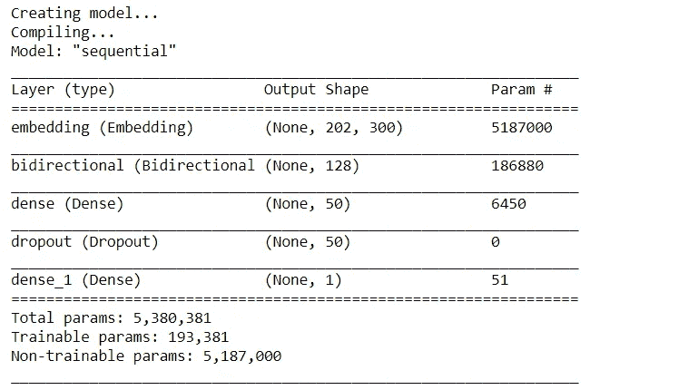

# 对抗深度学习中的过度拟合

> 原文：<https://towardsdatascience.com/combating-overfitting-in-deep-learning-efb0fdabfccc?source=collection_archive---------21----------------------->

## 阻止你的深度学习模型过度拟合

在 [Unsplash](https://unsplash.com?utm_source=medium&utm_medium=referral) 上由 [Waldemar Brandt](https://unsplash.com/@waldemarbrandt67w?utm_source=medium&utm_medium=referral) 拍照

# 过度拟合问题

过度拟合是指机器学习模型在训练数据上表现良好，但在验证数据上表现糟糕的情况。简单地说，当机器学习模型记住了训练数据中的模式，但未能推广时，这被称为过度拟合。

服装行业就是一个过度合身的真实例子。设计师们试图裁剪他们的尺码，这样一个尺码就能适合各种不同的体型和大小——例如，一个人穿中号可能会显得肌肉发达，而另一个人穿中号就会显得松松垮垮。

如果设计师决定为体型较小的人量身定做尺寸，这种服装就不能适用于各种体型和尺寸。这里你有过度拟合的问题。

# 解决过拟合问题

在 [*情绪分析:预测一条推文是否是关于一场灾难的*](/sentiment-analysis-predicting-whether-a-tweet-is-about-a-disaster-c004d09d7245)**中，我进行了一些可视化，建立了几个模型，其中我的双向 LSTM 名列前茅。**

****

**作者图片**

**经过仔细检查，我意识到我的模型过度拟合了训练数据。使用强大的模型时可能出现的许多问题之一。**

**我们可以通过两种主要方式来解决深度学习模型中的过度拟合问题:**

*   **对模型的改进**
*   **我们数据的改进**

**我知道你在想什么…我该如何改进我的模型？我如何改进我的数据？这些描述很模糊。所以让我们开始吧。**

> ****注**:本文中用于生成模型的所有代码都可以在 Github 上找到。**

**<https://github.com/kurtispykes/twitter-sentiment-analysis/blob/master/notebook/03_kpy_data_exploration.ipynb>  

## 对模型的改进

**简化模型**:我们最初建立的模型有 193381 个可训练参数。那是相当高的。随着可训练参数数量的增加，我们的模型更容易记住每个训练实例的标签，这绝对是我们想要的。最初的模型结果是:

*   训练 F1 分数— 0.9019 (4 标准英尺)
*   验证 F1 分数— 0.7444 (4 标准偏差)

以及我们模型的总结…

作者图片

我们可以通过减少网络的容量来简化我们的模型，这样我们的模型就别无选择，只能学习给网络带来价值的数据模式，或者用深度学习的术语来说，最小化损失。方法是移除隐藏层。

作者图片

> **注意**:看我是如何在双向 LSTM 后去掉密集层的。

对我的验证数据运行后的结果是:

*   训练 F1 分数— 0.8362 (4 标准英尺)
*   验证 F1–0.7622(4 平方英尺)

**正则化:**我们可以解决深度学习模型中过拟合问题的另一种方法是应用正则化。本质上，正则化是添加信息以解决不适定问题或防止过度拟合的过程[ **来源** : [维基百科](https://en.wikipedia.org/wiki/Regularization_(mathematics)) ]。

两种流行的正则化技术是 L1 和 L2 正则化。L1 正则化不利于权重的绝对值，这导致一些权重等于 0，而 L2 正则化取所有特征权重的总和，并强制权重较小但不为 0。

吴恩达在 Coursera 上的机器学习课程中完美地解释了这种直觉。

对于我们的例子，我将添加 L2 正则化到我们的初始模型。

作者图片

我们修正模型的结果是:

*   训练 F1 分数— 0.8899 (4 标准英尺)
*   验证 F1 分数—07504 (4 标准偏差)

这是对初始模型的一点改进，但我们可以做得更好。

**Dropout Layers:**Dropout Layers 是另一个有效的正则化工具，它的名字非常直观。实际上，丢弃图层会将图层的输出要素随机设置为零。在我们最初的网络中，我们已经有了一些，但我们可以添加更多。

作者图片

向我们的模型添加漏失层的结果:

*   训练 F1 分数— 0.8205 (4 标准英尺)
*   验证 F1 分数— 0.7700 (4 标准英尺)

**早停:**早停这个名字也挺直观的。本质上，你提前停止训练过程，而不是训练固定数量的时期。停止训练的队列是当验证误差停止减小并开始上升时。

作者图片

提前停止的结果:

*   训练 F1 分数— 0.8650 (4 标准英尺)
*   验证 F1 分数— 0.7525 (4 标准偏差)

## 数据的改进

**收集更多数据:**当训练样本很少，但特征很多时，模型往往会过拟合。如果资源可用，那么回到绘图板并收集更多数据可能是一个好主意，至少，您希望有比功能更多的训练示例。

**特征选择:**收集数据在时间和资金方面都是一个昂贵的过程，因此，只有当它能显著提高模型的性能时，我才会推荐它。首先，我们需要收集数据的人，然后我们需要标记数据的人。我们可能决定进行特征选择，而不是获取更多的实例。这是我们选择只使用带来最大价值的特性的时候。

</getting-started-with-feature-selection-3ecfb4957fd4>  

## 包裹

在这篇文章中，我向你介绍了在深度学习模型中对抗过度拟合的各种方法。结果仍然不完美，但大多数时候我们看到我们的模型有所改进。请记住，我是单独执行每一种正则化技术的，因为如果一起执行，我们可以实现一个真正强大的分类器。然而，太多的正则化会导致我们的模型拟合不足，这是一个完全不同的问题。

在 [LinkedIn](https://www.linkedin.com/in/kurtispykes/) 和 [Twitter](https://twitter.com/KurtisPykes) 上与我联系，了解我关于数据科学、人工智能和自由职业的最新帖子。**