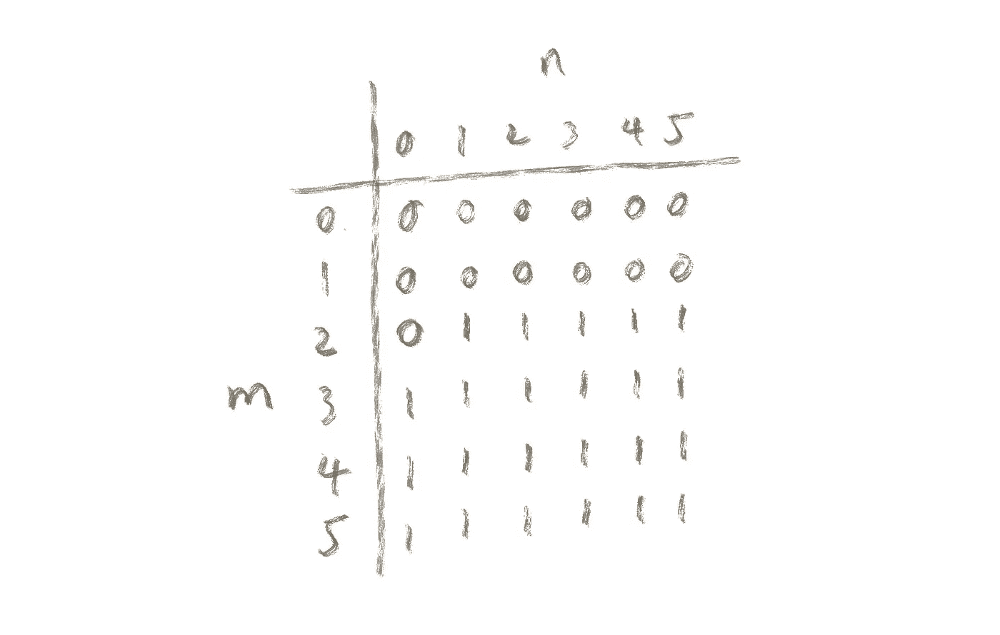

# 组合优化:背包问题

> 原文：<https://towardsdatascience.com/combinatorial-optimization-the-knapsack-problem-9f7047e16028?source=collection_archive---------31----------------------->

## 将动态规划技术应用于一个有趣的优化问题


作者图片

在这个故事中，我们将讨论动态编程技术在优化算法中的应用。通过开发最佳解决方案的过程，我们可以学习各种编程技术，从而获得更好的性能(最后还有一个惊喜！).

## 问题描述

> 背包问题

这个问题被称为背包问题，因为人们在将物品装入背包时会遇到类似的问题，同时试图优化所装物品的重量和价值。

因此，给定一个字符串列表:

```
r1 = ['001', '11', '01', '10', '1001']
```

并且给定一个最多可以容纳 5 个 0 和 5 个 1 的容器。

```
m = 5
n = 5
```

我可以装入容器的字符串的最大数量是多少？

一个选择是:

```
c1 = ['001', '1001', '11']
```

在这种情况下，我们已经包装在 3 个字符串中，并使用了 4 个 0 和 5 个 1，这是我们能做的最好的吗？

事实上，我们可以做得更好:

```
c2 = ['001', '11', '01', '10']
```

在这种情况下，我们已经用完了 4 个 0 和 5 个 1，并且我们装入了 4 个字符串。

问题是，我们如何着手系统地解决这个问题？

## 第一次尝试

> 只是想完成工作

我们从哪里开始？对我来说，最简单的方法是显而易见的:

循环遍历每个字符串，在循环中，如果可能的话，将当前字符串放入容器中，然后尝试找到在假设当前字符串已经在容器中的情况下可以装入容器的最大剩余字符串数，即使用递归。

```
def count_dim(string):
    *'''
    Counts the number
    of zeros and ones
    in a string* ***:param*** *string: '00111'* ***:return****: (2, 3)
    '''* m = 0
    n = 0
    for i in string:
        if i == '0':
            m = m + 1
        else:
            n = n + 1

    return m, n

def preprocess_input(strings):
    *'''
    Transforms list of strings
    to tuples of dimensions* ***:param*** *strings: ['100', '011']* ***:return****: [(2, 1), (1, 2)]
    '''* dim_list = [count_dim(string)
                for string in strings]

    return dim_list

def max_subset(input_data, m, n):
    *'''
    Loops through each string,
    recursively try to find the max
    subset of the remaining strings
    and add up the results* ***:param*** *input_data: ['10', '11']* ***:param*** *m: 2* ***:param*** *n: 4* ***:return****: 2
    '''* max_count = 0
    for i, tup in enumerate(input_data):
        if tup[0] <= m and tup[1] <= n:
            new_input = input_data[:i] \
                        + input_data[i+1:]
            max_count = max(max_count,
                            1 + max_subset(new_input,
                                           m - tup[0],
                                           n - tup[1]))

    return max_count

r1 = ['001', '11', '01', '10', '1001']
m = 5
n = 5

r1 = preprocess_input(r1)

print(max_subset(r1, m, n))

# Outputs:
# 4
```

算法足够简单，但执行起来如何？让我们来看看。

在每次调用 max_subsets 的过程中，它会遍历输入中的字符串数，所以如果我在输入中有 L 个字符串，第一次递归会处理循环 L 次，第二次递归会处理循环 L-1 次，以此类推。因此，算法的复杂性是:


O(L！)(图片由作者提供)

这是你能做的最糟糕的事情了。

## 第二次尝试

> 更智能的循环

实际上有一种简单的方法来加速它，而不是一遍又一遍地遍历输入中的每个字符串，我们只遍历一次字符串列表。想想看，这个问题涉及到从字符串列表中挑选出字符串的子集，所以本质上你是在试图寻找最佳的二进制字符串，例如:

```
r1 = ['001', '11', '01', '10', '1001']
c1 = ['001', '1001', '11']
b1 = 11001
```

b1 本质上是 c1 作为 r1 子集的表示

所以游戏计划是从第一根弦开始，你有两个选择:保留它或者丢弃它。首先，尽量保持它(1)，并递归地找到剩余字符串的最大子集。然后尝试丢弃它(0)，并递归查找剩余字符串的最大子集。两个结果中较大的一个是整个输入的最大子集。

```
def max_subset(input_data, m, n):

    if len(input_data) <= 0:
        return 0

    if m < 0 or n < 0:
        return -1

    tup = input_data[0]
    new_input = input_data[1:]
    max_count = max(max_subset(new_input, m, n),
                    1 + max_subset(new_input,
                                   m - tup[0],
                                   n - tup[1]))

    return max_count
```

该算法产生相同的结果，但是具有更好的复杂度。在每个“max_subset”调用中，您调用了“max_subset”两次，并且在字符串列表中正好有 L 个字符串，复杂性将是:


O(2^n)(图片来自作者)

好多了，但还是没那么好…

## 记忆增强

> 用空间换时间

当前形式的算法仍有许多冗余，例如:

```
r1 = ['001', '11', '01', '10', '1001']
b1 = 1001?
b2 = 1010?
```

当您到达字符串“1001”时，您可能会采用几种不同的路径，其中两种是:1001 和 1010，或者['001 '，' 10' ]和['001 '，' 01']。

两条路径剩余的 0 和 1 的数量完全相同:(2，3)。所以一旦你到达步骤‘1001’所需要的计算是相同的，并且它被做两次，并且当问题变大的时候潜在地更多次。

使用备忘录来保存已经计算过的结果将是一个加快这个过程的好方法。

在这种情况下，我们需要一个索引为(I，j，k)的映射，其中“I”是字符串列表中的当前位置，“j”是剩余的 0 的数量，“k”是剩余的 1 的数量。

```
def max_subset(input_data, m, n, memo={}):

    if len(input_data) <= 0:
        return 0

    if m < 0 or n < 0:
        return -1

    if (len(input_data), m, n) in memo:
        return memo[(len(input_data), m, n)]

    tup = input_data[0]
    new_input = input_data[1:]
    max_count = max(max_subset(new_input, m, n, memo),
                    1 + max_subset(new_input,
                                   m - tup[0],
                                   n - tup[1],
                                   memo))

    memo[(len(input_data), m, n)] = max_count
    return max_count
```

这个算法表现如何？嗯，由于 memo 中的每个元素只计算一次，字符串的长度为 L，所以 0 的个数为 M，1 的个数为 n，算法的时间复杂度为:


O(L*M*N)(图片由作者提供)

由于 memo 中的每个(I，j，k)都可能有一个条目，所以空间复杂度也是 O(L*M*N)。

## 动态规划

> 让算法变得更好

你会问，我们能进一步改进算法吗？

事实上，有一个非常聪明的方法可以降低算法的空间复杂度，那就是使用动态规划算法。

想象你在输入字符串列表的第三个元素:“01”。

你问自己这个问题，如果字符串列表从开始到‘01’，我需要知道什么才能算出我可以装入容器的最大子集，即:

```
'001', '11', '01'
```

?

好吧，如果我知道给定 4 个 0 和 4 个 1 容器，我可以用“001”、“11”构造的最大子集，以及给定 5 个 0 和 5 个 1 容器，我可以用它们构造的最大子集，那么给定 5 个 0 和 5 个 1，我可以用“001”、“11”、“01”构造的最大子集是:

```
max_subset(['001', '11', '01'], 5, 5) = \
    max(max_subset(['001', '11'], 5, 5),     # without '01'
        1 + max_subset(['001', '11'], 4, 4)) # with '01'
```

这种关系构成了我们将要创建的动态编程算法的基础。

我们可以做的是有一个大小为(m+1，n+1)的备忘录地图，最初，它都用零填充。

当我们开始处理第一个字符串“001”时，我们尝试从(5，5)开始更新映射:

```
max_subset(['001'], 5, 5) = \
    max(max_subset([], 5, 5),
        1 + max_subset([], 3, 4))
```

然后(5，4)，(5，3) …，(4，5)，(4，4)，…，直到(2，1)，因为‘001’有 2 个 0 和 1 个 1，所以我们不能再减少容器的维数了。

我们有了更新后的地图，如下图所示:



(图片由作者提供)

现在，映射中的每个位置都表示给定字符串列表['001']和容器(m，n)的最大子集。

对字符串列表中的剩余字符串重复这个过程，最终的 memo map，在位置(5，5)将包含我们问题的答案。

```
def init_memo(m, n):
    return [[0 for i in range(n + 1)] for j in range(m + 1)]

def update_memo(z, o, m, n, memo):

    for i in reversed(range(z, m + 1)):
        for j in reversed(range(o, n + 1)):
            memo[i][j] = max(1 + memo[i - z][j - o],
                             memo[i][j])

def max_subset(input_data, m, n, memo=None):

    if memo is None:
        memo = init_memo(m, n)

    if len(input_data) <= 0:
        return memo[m][n]

    current = input_data[0]
    input_data = input_data[1:]

    update_memo(current[0], current[1], m, n, memo)

    return max_subset(input_data, m, n, memo)
```

我们来看看这个算法的性能。由于我们遍历每个字符串一次，并且在每次迭代期间，我们更新大小为 M*N 的备忘录映射，因此时间复杂度为:


O(L*M*N)(图片由作者提供)

和以前一样。

但是因为我们只使用大小为 M*N 的地图，所以空间复杂度是:


O(M*N)(图片由作者提供)

我们将空间复杂度降低了 1 倍！

你会问，有什么问题？为什么现在需要的备忘录地图的大小减少到 O(M*N)？这与地图的“动态”本质有关。想想看，在每次迭代期间，您都在用新信息更新存储在映射中的值，以考虑到添加的字符串，因此您丢弃了不再需要的旧信息，从而将映射的空间需求从 O(L*M*N)减少到 O(M*N)。

## 结论

老实说，我第一次尝试这个问题的时候，我认为我们对时间和空间复杂度的最佳结果是 O(L*M*N)，但是一个非常聪明的观察帮助我们大大降低了空间复杂度。因此，感谢动态编程，我们能够了解对算法进行改进的可能性，而这种改进并不明显。它还提醒我们，无论问题是什么，都要对新的或更好的解决方案保持开放的心态。