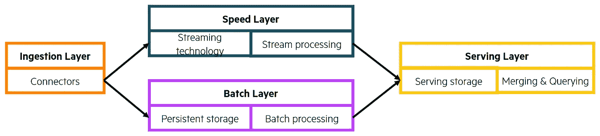
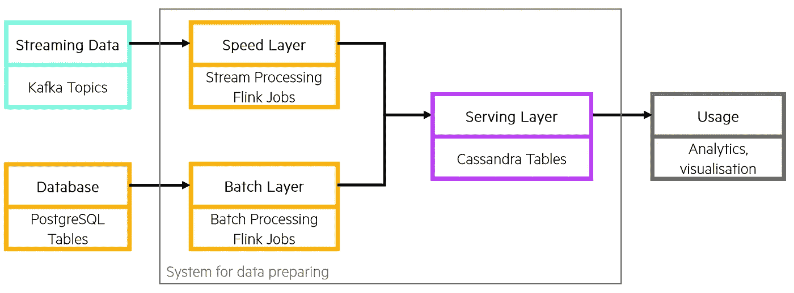
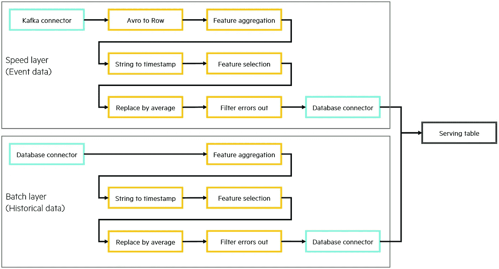

# 使用 Apache Flink 组合和预处理您的异构数据以进行分析

> 原文：<https://towardsdatascience.com/combine-and-preprocess-your-heterogeneous-data-for-analytics-with-apache-flink-518a66425850?source=collection_archive---------17----------------------->


作者图片

## 通过使用该架构在一个地方清理和合并您的实时和历史数据，使您作为数据科学家的生活更加轻松。忘记访问多个系统和清理日常分析任务。

# 介绍

数据驱动的决策和应用是未来业务的[核心](https://online.hbs.edu/blog/post/data-driven-decision-making)。从数据中获得洞察力意味着成本降低、效率提高和战略优势。越来越多的公司通过应用[以数据为中心的架构](https://www.hpe.com/psnow/doc/a00119742eew)，在数据库中生成和收集除经典批量数据之外的流数据或实时数据。因此，公司面临的挑战是在分析中处理流数据和批量数据，以获得整体和最新的见解。

流数据和批处理数据必须先合并，然后才能作为组合数据集进行可视化和处理。本文描述了一个基于 Apache Flink 和 Lambda 架构的 Lambda 架构的实现，以解决这一挑战。Apache Flink 是一个计算无界和有界数据流的框架。Flink 在不同的抽象层次提供了多个 API，并为不同的[用例](https://flink.apache.org/flink-applications.html)提供了专用的库。为了更具体，我将在整篇文章中使用一个端到端的例子。

# 出发点

我们使用包含空气测量站的事件数据的数据集。在这组数据中，我们发现了九个传感器对空气中不同物质的每小时测量值。除此之外，还记录了日期、时间、温度和空气湿度。数据集由 De Vito 等人发表在 [UCI 机器学习知识库](https://archive.ics.uci.edu/ml/datasets/Air+Quality)上。

## 我们在哪里？

我们假设，作为物联网设备的测量站每小时将数据发布到 Apache Kafka 主题中，我们可以在其中使用这些数据。数据在被删除之前会在 Apache Kafka 主题中保留一段固定的时间。因为我们不想丢失这些历史数据，所以我们定期将它存储在一个持久数据库中，以便随时进一步处理数据。这两个系统构建了我们的混合数据存储架构。

作为数据科学家，我们希望访问所有数据——来自 Kafka 的实时数据和来自数据库的历史数据——以便实时访问所有数据和进行全面分析。通常我们必须用不同的访问方法查询两个系统，这既不方便，也不可扩展，也不容易维护。

## 我们想去哪里？

这就是为什么我们需要一个来自 Kafka 和数据库甚至更多系统的数据的组合视图，我们只需要访问一个系统就可以一次获得从历史到最近数据点的所有数据。因为它是使用最广泛的技术，我们希望使用数据库作为所有数据的一站式商店。

流数据和批处理数据在模式、数据类型、相同情况的表示以及最终的数据质量方面可能有所不同。所以，数据需要标准化。此外，作为数据科学家，我们还希望通过自动清理原始数据来摆脱日常工作。

## λ架构

我们展示的系统基于 Lambda 架构，由 Nathan Marz 于 2011 年首次推出[。简而言之，Lambda 架构包含三个相关层。批处理层处理来自数据库或数据湖的所有批处理数据。速度层实时处理所有流数据。因此，可以以最小的延迟访问新数据。服务层是最后一个组件，负责合并来自其他两个层的清理数据，并将其提供给其他应用程序。通常，专用(例如 Java 或 Python)应用程序用于从两层加载数据，并在服务层以标准化的形式将数据汇集在一起。使用 Flink，标准化已经在速度和批次层完成。如果你想更详细地了解 Lambda 架构，我推荐](http://nathanmarz.com/blog/how-to-beat-the-cap-theorem.html)[这篇文章](https://betterprogramming.pub/an-overview-of-lambda-architecture-baf460cabc81)。



Lambda 架构的示意图。作者图片

# 架构概述

提议的系统基于 Lambda 架构，但通过巧妙使用现代技术解决了它的一些主要弱点。我们主要使用两种工具。第一个是阿帕奇弗林克。Flink 是一个能够处理流数据和实时数据的框架。因此，它非常适合这个用例。我们使用 Flink 的连接器实时消费来自给定 Kafka 主题的消息，或者通过 JDBC 连接从数据库中读取历史数据。速度图层有一个 Flink 作业，批处理图层有另一个 Flink 作业。它们只是在数据接收方面有所不同。对于一个用例，处理和输出部分是完全相同的。我们将在后面的示例中查看数据处理。Flink 可以将数据输出到各种数据接收器。对于我们的系统，我们使用 Apache Cassandra 数据库，因为它针对繁重的编写工作负载进行了优化。



建议的数据准备系统的架构。作者图片

## 利益

你可以在这里阅读关于 Apache Flink 的精彩介绍。我们声明我们想要标准化和准备数据。

> 使用 Flink，我们可以使用相同的代码来处理批量数据和流数据，因为 Flink 将批量数据作为有限的数据消息流来处理。

这是一个独特的卖点，有利于 Flink 反对类似的选项，如 Spark 或 Storm。此外，Flink 为复杂的转换提供了很大的灵活性，因为我们可以使用 Java、Python 甚至 SQL 来处理数据。Apache Flink 由多个组件构建而成，其中每个组件都包含针对不同数据结构(数据流与表)或特定应用需求(机器学习)的特定功能。

# 示例:准备数据

在探索性的数据分析过程中(本文跳过了这一步)，我们意识到
时间和日期的格式不正确
有许多错误值，我们应该以某种方式修复它们
已知的错误值是“-200.0”
其中一个属性(NMHC(GT))有太多的错误值，我们需要删除整个列

为了准备和合并数据，我们遵循以下路径:在下图中，您可以看到我们有两条管道，一条用于流数据，一条用于批处理层。本文的以下部分分为“加载数据”，在这里我们将使用卡夫卡和 JDBC 连接器。然后“处理数据”，在这里我们使用“映射”和“过滤”功能，甚至窗口功能来清理和标准化数据。这个管道的最后一步当然是“合并和提供”数据。Flink 将处理后的数据交付给数据库，在那里进行合并和存储以备将来使用。

在这个用例中，Kafka 中的所有数据都是通过 Apache Avro 模式定义的。Avro 就像节俭或协议缓冲区。Avro 作为一个序列化系统被用在许多生产环境中，因为序列化的数据更小。Avro 具有丰富的数据结构，提高了传输和处理效率。



转换在批处理和速度层中流动。作者图片

## 加载数据

让我们从导入数据开始。我们在速度层的 Flink 作业中建立了一个 Kafka 消费者。我们需要提供主题名、Kafka 节点的地址和一些连接属性，比如模式注册 URL。我将消费者和生产者代码转移到一个专用的 java 类( *KafkaConnection* )，这样我们就可以在更多的工作中轻松使用它。

```
public class KafkaConnection {
    public static <avroSchema> FlinkKafkaConsumer010
    getKafkaConsumer(Class avroSchemaClass, String inTopic, String
    schemaRegistryUrl, Properties properties) {
        FlinkKafkaConsumer010<avroSchema> kafkaConsumer = new
        FlinkKafkaConsumer010<avroSchema>(
            inTopic,
            (DeserializationSchema<avroSchema>)
            ConfluentRegistryAvroDeserializationSchema.forSpecific(
                avroSchemaClass, schemaRegistryUrl),
            properties);
        kafkaConsumer.setStartFromLatest();
        return kafkaConsumer;
    }
}
```

这个 Kafka 消费者将 Avro 模式 *AirQuality_value* 中定义的收集到的消息发送到数据流中。该使用者在 Flink 作业中构建数据流的源。

```
// Initialize KafkaConsumer
FlinkKafkaConsumer010 kafkaConsumer = KafkaConnection.getKafkaConsumer(AirQuality_value.class, 
    inTopic, 
    schemaRegistryUrl, 
    $properties);// Set KafkaConsumer as source
DataStream<AirQuality_value> inputStream = environment.addSource(kafkaConsumer);
```

为了读取 PostgreSQL 数据库，我们定义了一个 JDBC 连接器。因此，我们使用 Flink 的 JDBC 连接器包的 *JdbcInputFormatBuilder* ，并传递必要的参数，如下所示。因此，我们创建了一个带有*行*模式的数据流。

```
JdbcInputFormat.JdbcInputFormatBuilder inputBuilder = JDBCConnection.getSource($fieldTypes,
    $driverName,
    $dbURL,
    $sourceDB,
    $selectQuery,
    $dbUser,
    $dbPassword);DataStream<Row> inputStream = environment.createInput(inputBuilder.finish());
```

在我们可以在两层中平等地转换数据之前，我们需要将速度层中的数据从 Avro 模式转换为更通用的*行*模式。你会在上图中看到这一步是速度层的第一个动作。然后，批处理和速度层中的数据流具有相同的内部格式，我们可以用相同的方式转换它们。

## 转换数据

我们通过应用模块化转换器来转换数据，每个转换器执行一个特定的操作。我们设置了转换器，用于**从流中过滤**消息，其他的**操作**值，**改变**单一数据类型或者**删除**属性。此外，还有窗口和 SQL 转换，例如**删除重复的**。我们将这些转换器实现为 java 类，让我们通过提供一些参数来调整确切的行为。它们被设计为由数据流的*过滤器()*、*映射()*或*窗口()*函数调用。当然，这些变压器是基本的，但我们可以将它们堆叠起来，构建强大的转换管道。

为了处理空气质量数据，我们首先通过 *FeatureAggregation()* 将“日期”和“时间”属性(在索引 0 和 1 处)连接成一个属性。然后，我们在第二行将结果字符串转换为 SQL 就绪的时间戳。接下来，我们删除原来的日期和时间属性，因为不再需要它们了。此外，我们删除了 NMHC(GT)属性，它有太多的错误，不能通过调用*feature selection*transformer 来清除。转换器只保留新的时间戳属性和除 NMHC(GT)之外的所有属性。

```
DataStream<Row> timestampStream = inputstream
    .map(new FeatureAggregation(0, 1, "+"))
    .map(new StringToDate(14, "dd/MM/yyyy HH.mm.ss"))
    .map(new FeatureSelection($keptAttributes);
```

现在它变得稍微高级一些:我们使用一个窗口函数，用在一个时间窗口内计算的平均值来代替误差值(-200.0)。您可能知道 SQL 中的这种方法是“ *OVER* ”子句与“*ROWS before*”的组合。我们将这个转换器应用于包含传感器数据的所有属性。之前，我们需要创建窗口，这样数据流中的消息就可以拆分到不同的窗口上。像在 SQL 中一样，我们需要一个键来控制窗口分割。我们将窗口的“大小”定义为 20 秒:使用这种配置，来自同一天的、在 20 秒内到达的所有消息都将被路由到同一个窗口。对于每个属性，计算一个平均值来代替所有的误差值。

```
DataStream<Row> windowedStream = timestampStream
    .keyBy(new DateAsKey())
    .window(EventTimeSessionWindows.withGap(Time.seconds(20)))
    .process(new ReplaceMultipleByAverage(replace_fields,"==",
        -200.0f));
```

不幸的是，这不足以完全清除数据。一些属性包含如此多的错误，以至于当前窗口中计算的平均值也被错误值破坏。因此，我们需要从数据流中过滤出所有剩余的有错误的消息。

```
DataStream<Row> outputStream = windowedStream.filter(
    new RemoveErrorValues(0,"==", -200.0f));for (int i = 1; i < outputStream.getType().length(); i++) {
    outputStream.filter(new RemoveErrorValues(i,"==", -200.0f));
}
```

我们通过在一个循环中多次应用过滤函数来检查所有字段。最后，数据可以写入数据库，并在以后的应用程序中使用。

## 合并并提供数据

剩下的唯一事情就是将数据写到数据库中。将它写入服务层会同时合并流数据和批处理数据:通过将它写入一个表来合并。我们使用下面的 Cassandra 接收器将处理过的流输出到同一个 Cassandra 表。但是你也可以使用 JDBC 水槽。

```
CassandraSink.addSink(outputStream)
    .setClusterBuilder(
        new ClusterBuilder() {
            @Override
            public Cluster buildCluster(Cluster.Builder builder) {
                Cluster cluster = null;
                try {
                    cluster = builder.addContactPoint(cassandraURL)
                        .withPort(cassandaPort)
                        .withCredentials(
                            cassandraUser,
                            cassandraPassword)
                        .build();
                } catch (Exception e) {
                    e.printStackTrace();
                }
                return cluster;
            }
        }
    )
    .setQuery(insertQuery)
    .build();
```

*insertQuery* 只是一个普通的 SQL“Insert…”查询。重要的是要理解批处理层只写历史数据，而速度层应该在当前的时候已经写了。因此，批处理图层会覆盖速度图层中的数据，因为它更加准确和可信。您需要确保 speed 层不会插入任何带有现有主键的数据，而 batch 层必须能够覆盖带有相同主键的现有行。这可以通过配置表中的主键约束并为每个作业定义违反约束时的操作来实现。使用这种策略，我们只需要一个标准表，不需要合并服务。数据按主键排序，没有任何冲突或重复。所有想要使用预处理数据的服务都可以通过传统方法(连接器、REST APIs 等)访问 DBMS。).

# 结论

本文解释了如何只用四种工具和一些可重用的 java 代码来处理实时和历史数据。

> 您不需要复杂的管道，就可以拥有一个可扩展的安全解决方案来清理和处理您的原始数据，并将其用于您的分析。

简而言之，将 Kafka 主题用于实时事件数据，将您选择的持久性数据存储用于历史数据，将 Apache Flink 用于处理，并将输出数据存储在某个地方，直到您对其进行分析。该体系结构将帮助您更快地从数据中获得价值，并有效地实施数据清理和准备。

声明:我在[惠普公司](https://www.hpe.com/us/en/home.html)和【Bernd Bachmann 博士的支持下完成了我的学士论文。