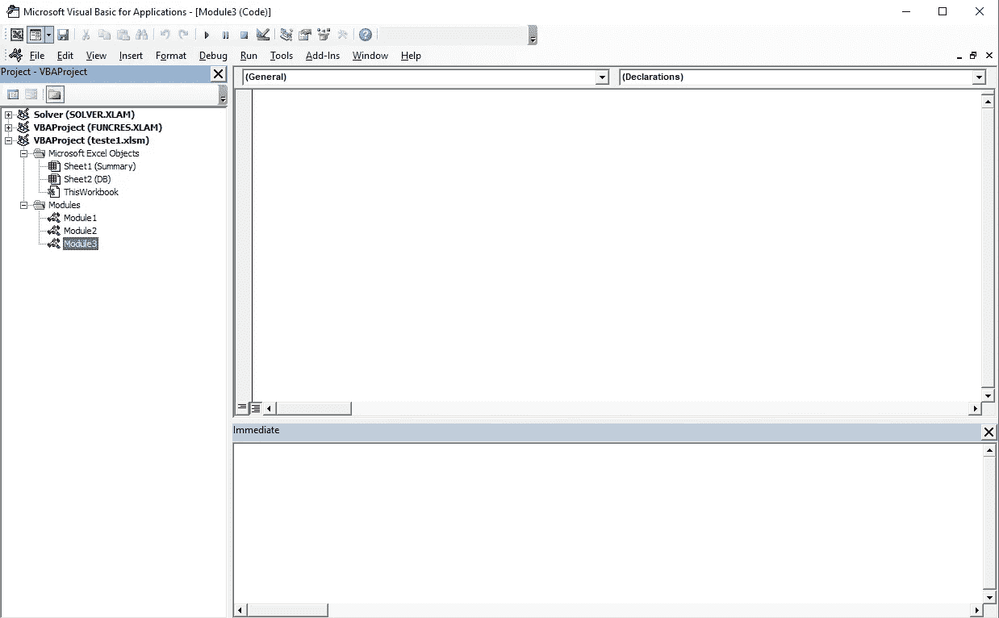
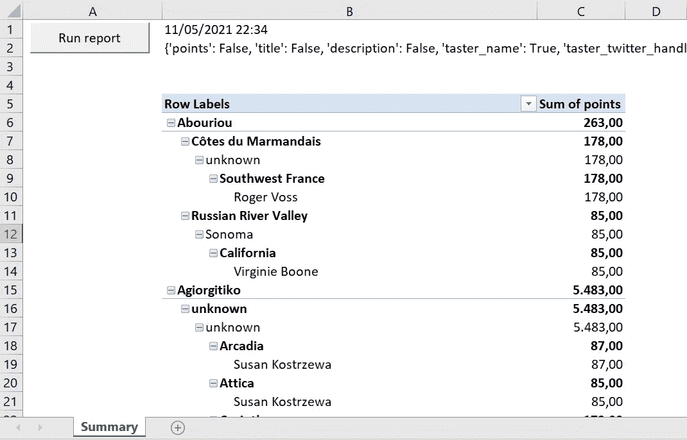
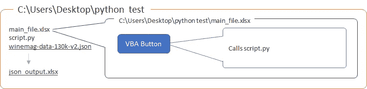

# 结合 MS Excel 和 Python 的优点

> 原文：<https://towardsdatascience.com/combine-the-best-of-ms-excel-and-python-c85cad9fdc3b?source=collection_archive---------13----------------------->

## 您还不需要(也不应该)完全逃离 Excel


尼克·里克特在 [Unsplash](https://unsplash.com?utm_source=medium&utm_medium=referral) 上的照片

你听说过 Python 是新的 Excel 吗？老实说，我已经读过好几遍了。

那么，为什么我看到很多人还在用 Excel 呢？

首先，这两个工具的目的不同，其次，Excel 本身就很强大(如果不是这样，它不会流行这么多年)。

然而，编程语言每年都变得越来越流行，有些人，比如你和我，对验证已知的活动如何以不同的方式处理感兴趣，当然，也很容易。

这是这篇文章的一个关键方面。有一种 MS Office 原生编程语言叫做 VBA (Visual Basic for Applications)。尽管你可能不知道，但你可能已经用过了。为什么使用所谓的宏。

长话短说，VBA 是一种由微软开发的编程语言，它是如何配置宏，一堆定义好的命令。这是故事变得有趣的时刻。Python 最著名的用例之一是自动化多种类型的任务，包括但不限于 Excel 用例。然而，这类问题不是已经被 VBA 解决了吗？请记住，我们在这里是为了做得更好，做得与众不同。此外，很多宏都是由不知道如何改变或适应它们的人使用的。他们只是在那里呆了几年…

宏已经被使用的事实对你来说可能是一个很大的障碍，主要原因是**的便利性**。为什么？我注意到的原因是:

1.  人们习惯于点击宏按钮，这对他们来说已经足够了。他们只是希望工作完成(而且这是公平的，有道理的)；
2.  有些人就是不愿意学习一门(新的)编程语言。

如上所述，举例来说，很难将您设法开发的 Python 脚本的唯一用途分散到整个组织中。你需要让人们能够使用 Excel 和宏，就这样。这样，他们感觉很舒服，你可能会以某种方式继续练习。

## 为什么要这么做？

尤其是如果你刚刚开始用 Python 运行一些程序，很可能你正在寻找真正的使用问题来解决，有时，这可能不太容易预先找到。

最重要的是尽可能多的坚持练习。今天你们要学习这个例子，我将要展示给你们，但是你们不应该就此打住。

如前所述，Python 是过去几年中发展最快的编程语言之一，这并非毫无意义。它的易用性和大量的库吸引了全球数百万程序员的注意，这是它如此受欢迎的关键。

## 怎么做？

那么，还记得那位同事抱怨他们需要每天准备并发送给经理的无聊报告吗？我可以肯定地告诉你，使用 Python 可以帮助他们实现这一点，如果你的同事想了解 Python，他们不需要了解任何东西，相信我。

对于解决这个问题可能存在的宏呢？嗯，如前所述，继续允许人们使用宏是很重要的。然而，这不会是他们所习惯的宏，**他们只是不知道他们正在使用 Python** 。

我们将使用以下内容:

1.  VBA 和壳牌
2.  Python 文件
3.  表单控件按钮

我们去看看。

# 1.VBA 和壳牌

别生我的气，但我会让你用一点 VBA。这只是一种设置让我们能够提前使用 Python 所需的变通方法的方式。

打开您将在本练习中使用的 excel 文件。我将使用以下代码:

```
C:\Users\Desktop\python test\main_file.xlsm
```

一旦你打开它，键入 F11，然后 VBA 图形用户界面将打开。它应该类似于下图:



如果没有可用的模块，只需点击顶部菜单中的“插入”，然后点击“模块”。好了，让我们来看看代码本身:

很简单。我们来分析一下以上最重要的几个方面。

需要使用命令“Dim”来声明变量。所以我们宣布:

1.  Python 解释器路径(“python_exe”)
2.  Python 脚本路径(“python_py”)。 *Chr(34)可能需要，如果你的路径包含空格，像我一样。*
3.  当前目录路径(“目录路径”)

声明这些变量后，需要使用一个[外壳函数](https://docs.microsoft.com/en-us/office/vba/language/reference/user-interface-help/shell-function)。简单地说，适用于我们场景的这个 Shell 函数的基本语法是:

```
program_to_excute file_to_execute command_line_argument
```

它非常类似于在 Linux 发行版中使用的 [Windows Powershell](https://docs.microsoft.com/en-us/powershell/) 和 [Bash](https://www.gnu.org/savannah-checkouts/gnu/bash/manual/bash.html) 中用于 shell 脚本的语法(或任何其他 Shell)。

*看看下面的故事，我探索了 Linux 中基本 Shell 脚本的一些功能。*

<https://levelup.gitconnected.com/python-and-linux-i-o-redirection-for-managing-investments-ef009be30f39>  

从这个意义上说，我们已经设置了 Python 解释器来执行 Python 文件，并且我们正在设置一个将在 Python 文件中使用的参数。向前移动…

# 2.Python 文件

最后，万能的 Python 文件。

让我们强调一下你为什么真的喜欢使用 Python 的更详细的原因。Python 在过去几年变得如此流行肯定有几个原因。当然，其中之一是它的多功能性。尽管对于某些领域来说，这最终会成为一个缺点(因为它会使脚本变慢)。由于我们不是在谈论实时用例，它真的不会对我们产生负面影响。

其多功能性主要是由于三个原因:

1.  解释语言。可以交互地运行脚本的每一行(它不是一种编译语言)。这甚至导致实时敏感性案例使用 Python 来构建他们的应用程序原型，因为这比一些常见的替代方法更简单。
2.  动态类型语言。与 VBA 和其他语言不同，你不需要显式声明你将在程序中使用的变量类型。内存是在给每个变量赋值时分配的。
3.  大型社区。有大量的图书馆可供使用。很有可能你想要达到的目标已经被别人完成了。在真正尝试之前，花时间去寻找它。

好了，评论完了，让我们看看剧本。它分为两部分:

1.  Windows API
2.  数据操作

下面，让我带你看一下每一个。

## 1.Windows API

这里提到的 API 可以通过包 [pywin32](https://pypi.org/project/pywin32/) 获得。它允许我们从另一个应用程序控制 Windows 应用程序。在这种情况下，来自 Python 脚本。

请记住，这个图书馆里的物品很像 VBA 本身。

让我们看看 Python 脚本的第一部分:

向前发展…

## 2.数据操作

当然，从这里开始，这真的取决于你的情况。我们将探索一些使用 Python 可以轻松实现的常见需求。

我会考虑一个来自 Kaggle 的数据库，[葡萄酒评论](https://www.kaggle.com/zynicide/wine-reviews?select=winemag-data-130k-v2.json)。更具体地说，该文件命名为“winemag-data-130k-v2.json”。

假设您同事的日常活动是共享类似数据透视表的报表，该报表包含以下行层次结构:

```
variety; region_1; region_2; province; taster_name
```

随后是每种情况的“点数”。

您可能会注意到这个数据库中有一些空值。此外，您不确定他们需要在报告中使用的字段(或列)是否会受到任何空案例的影响。从这个意义上说，根据每一列的数据类型填充空值是明智的。

这就是即使在 Excel 中使用 Python 而不是 VBA 的主要优势之一。你能想象在不借助[熊猫](https://pandas.pydata.org/docs/)的情况下如何做到以上几点吗？

让我们来看看实现这一点的代码。

通过执行上述操作，您的同事可以确保所有被标识为包含空值的列都填充了正确的值。

现在，是时候生成所需的数据透视表了，因为这是该领域的每个人用来管理、探索以及采取适当行动的方式。

您是否注意到“主”Excel 文件正在更新，现在它显示了数据透视表？



文章结果的屏幕截图(数据继续显示在右侧和底部)

你应该得到了类似上面的东西。

# 结论

您设法处理了与一个已知用例相关的多个文件(json 和 Excel 文件),您可以在日常工作中使用 Python 脚本轻松处理这些文件。



案例结构

通过利用 Python 的多功能性，您使用一个非常强大的名为 pandas 的库来操作数据源中包含的数据。除此之外，请记住，还有许多其他流行的库可以用于 web 应用程序、机器学习和可视化用例。

最重要的是:你要让用户保持他们通常的工作方式。希望你(不小心)成功唤醒用户开始学习 Python。