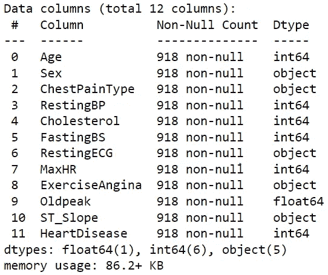
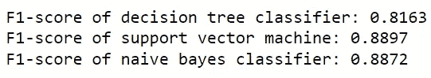
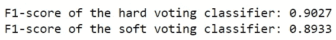

# 把你的机器学习模型和投票结合起来

> 原文：<https://towardsdatascience.com/combine-your-machine-learning-models-with-voting-fa1b42790d84?source=collection_archive---------1----------------------->

## 利用被低估的集合方法获得更好预测性能的指南

照片由来自 [Pexels](https://www.pexels.com/photo/man-people-desk-abstract-8850706/?utm_content=attributionCopyText&utm_medium=referral&utm_source=pexels) 的 [Tara Winstead](https://www.pexels.com/@tara-winstead?utm_content=attributionCopyText&utm_medium=referral&utm_source=pexels) 拍摄

当你冒险踏上机器学习之旅时，你无疑会遇到各种各样的机器学习算法。

从像 K-最近邻这样的懒惰学习分类器到像决策树这样的急切学习分类器，在构建模型时有许多不同的算法可供选择。

你有没有想过让这些模型协同工作会是什么样子？幸运的是，这可以通过一种叫做**投票**的技术轻松实现。

投票是一种集合方法，它将多个模型的性能结合起来进行预测。

你可能会想:首先把模型的预测结合起来有什么意义呢？当您可以单独评估分类器并选择最佳分类器时，为什么要将所有分类器合并为一个呢？

# 投票的好处

合并投票有很多好处。

首先，由于投票依赖于许多模型的性能，它们不会被来自一个模型的大误差或错误分类所阻碍。一款车型的不佳表现可以被其他车型的强劲表现所抵消。

为了更好地理解这个概念，我们用投资来打个比方。

当你投资时，人们经常建议你将财富分配到各种股票上。如果你把所有的钱都放在一只股票上，你的整个投资组合都依赖于这只股票的表现，这让你面临很高的风险。另一方面，如果你把钱投资于各种股票，风险就会降低；一只表现不佳的股票不会阻碍你的成功。

投票以类似的方式进行。通过组合模型来进行预测，您可以利用其他可以做出正确预测的模型来降低一个模型做出不准确预测的风险。这种方法使得估计器更加稳健，并且易于过拟合。

在分类问题中，投票有两种:**硬投票**和**软投票**。

硬投票需要挑选具有最高票数的预测，而软投票需要组合每个模型中每个预测的概率，并挑选具有最高总概率的预测。

回归问题中的投票有些不同。通过投票构建的回归模型不是查找出现频率最高的预测，而是获取每个模型的预测，并计算它们的平均值以得出最终预测。

在分类或回归问题中，投票是提高预测性能的一种手段。

# 投票的缺点

当你了解到组合模型的好处时，你可能会在你未来的所有机器学习项目中使用投票。

毕竟，当您可以将它们全部集成到一个评估器中并创建“完美的模型”时，为什么要经历考虑每个模型的优缺点的麻烦呢？

不幸的是，这种思路是有缺陷的。

要明白，用投票建立的模型不应该被视为机器学习中一刀切的方法。毕竟，投票集成方法也有其局限性。

首先，在某些情况下，单个模型可以胜过一组模型。例如，在回归问题中，如果预测特征和目标变量具有很强的线性关系，单个线性回归模型无疑可以表现得很好。但是，用其他回归模型做出的投票估计会使线性回归模型的准确预测无效。

其次，由于投票需要使用多种模型，因此它们的计算量自然更大。因此，创建、培训和部署这样的模型将更加昂贵。

最后，只有当机器学习分类器在相似的水平上执行时，投票才是有益的。从具有相反效率水平的模型构建的投票估计器可能不稳定地运行。

# Python 中的应用

Python 中的 sklearn 包使得实现投票集成方法变得非常容易。它提供了投票分类器和投票回归器，这两个估计器分别用于构建分类模型和回归模型。

您可以使用以下代码导入它们:

由作者创建

让我们利用 sklearn 库来看看投票集合方法的效果。

# 个案研究

有了医院患者的数据集(此处可访问)，让我们创建单独的机器学习分类器和投票分类器，以确定哪种方法最好地预测心脏病。

以下是数据集要素的预览:

由作者创建

代码输出(由作者创建)

本案例研究的目标变量是“心脏病”。

让我们在建模之前准备数据集。预处理阶段需要:

*   删除丢失的值(如果有)
*   编码分类特征
*   将数据分成训练集和测试集
*   标准化输入要素

接下来，我们用训练集训练决策树模型、逻辑回归模型和朴素贝叶斯模型，然后用测试集评估它们。这些模型的性能将根据它们的 f-1 分数来衡量。

代码输出(由作者创建)

如输出所示，支持向量机是表现最好的模型，f-1 得分为 0.8897。

请注意 3 个分类器的 f-1 分数是多么相似。这是投票估计器将适用于预测心脏病的指标。

让我们创建一个分类器，将决策树分类器、逻辑回归模型以及朴素贝叶斯模型合并为一个分类器。通过给分类器中的“投票”参数赋值，可以在硬投票和软投票之间进行选择。为了便于演示，我们将使用这两种投票技术。

代码输出(由作者创建)

由硬投票和软投票构成的投票分类器的性能都优于支持向量机。

# 结论

照片由来自 [Pexels](https://www.pexels.com/photo/black-and-white-laptop-2740956/?utm_content=attributionCopyText&utm_medium=referral&utm_source=pexels) 的 [Prateek Katyal](https://www.pexels.com/@prateekkatyal?utm_content=attributionCopyText&utm_medium=referral&utm_source=pexels) 拍摄

现在，你了解了投票的来龙去脉，以及它在机器学习中的应用。

结合机器学习模型可以显著提高预测建模的质量。

然而，即使这种集合方法在构建模型时可以作为一种很好的选择，您也不应该将其视为一种可行的方法，因为它的成本更高，而且并不总是胜过单个模型。

我祝你在机器学习的努力中好运！