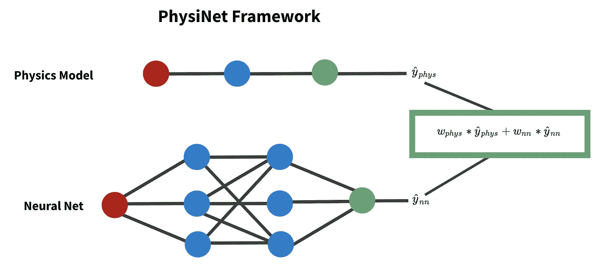
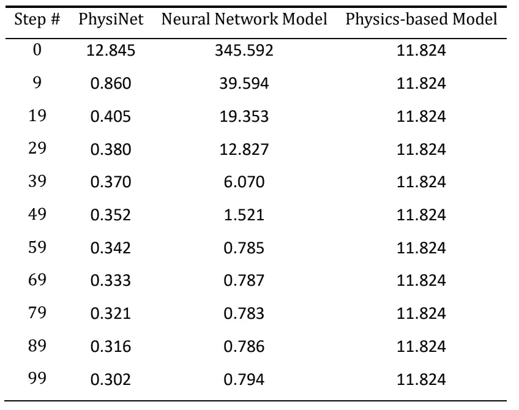

# 结合物理和深度学习

> 原文：<https://towardsdatascience.com/combining-physics-and-deep-learning-54eac4afe146?source=collection_archive---------21----------------------->

## 什么是数字双胞胎，它们是如何工作的？

随着过去 10 年计算能力的提高，我们看到模拟的数量急剧增加。数字双胞胎就是这样一个例子。它们是可以在各种场景中模拟的物理对象或过程的虚拟复制品。

约尔根·哈兰在 [Unsplash](https://unsplash.com?utm_source=medium&utm_medium=referral) 上的照片

数字双胞胎面临的一个问题是，他们如何将潜在的嘈杂的经验数据与物理结合起来。

2021 年，谢菲尔德大学的研究人员开发了一个非常简单的数字双胞胎框架，称为 [PhysiNet](https://arxiv.org/pdf/2106.14790.pdf) 来解决这个问题。PhysiNet 将深度学习与物理模型相结合，以开发对设备性能的稳健预测。

虽然数字双胞胎确实需要大量的开发资源，但在物理测试极其昂贵或危险的情况下，它们可以成为有效的替代方案。

事不宜迟，让我们开始吧…

# 技术 TLDR

数字双胞胎是物理系统的电子副本。他们依赖于黑箱和基于规则(物理、经济等)。)模特。然而，由于这两种方法都有不足之处，我们建议通过对每个模型的预测值进行加权线性组合来将两者结合起来。

当迭代训练黑盒模型时，在每个时期，我们重新调整两个模型预测的权重，以优化准确性。预测值的这种线性组合有效地结合了两种模型并优化了准确性。

# 但是，到底是怎么回事呢？

让我们提供一些关于数字双胞胎的背景知识，并讨论本文中的方法。

## 数字双胞胎的背景

如上所述，数字双胞胎是物理事物的数字副本，例如风力涡轮机或供应链。它们通常是基于物理的产品的 3D 模型，但可以简单得多。

2010 年，美国宇航局首次使用它们来帮助开发航天器，但在物理原型难以测试和/或测试成本高昂的应用中，它们越来越受欢迎。它们最符合逻辑的用例是在产品构思和开发期间，但是它们也可以与生产产品一起使用，以获得洞察力和预测失败。

利用数字双胞胎的行业从[产品生命周期管理](https://arxiv.org/pdf/2107.03324.pdf)到[建筑加热/冷却优化](https://arxiv.org/pdf/2106.15502.pdf)到[汽车传感器](https://arxiv.org/pdf/2007.04350.pdf)。

## 问题是

大多数数字双胞胎严重依赖规则或经验数据。然而，通常最稳健的模型结合了先验规则和经验数据。有多种方法可以做到这一点，但 PhysiNet 提出了可以说是最简单的解决方案。

## 解决方案

PhysiNet 将神经网络(NN)预测与物理模型预测相结合。神经网络处理经验数据，而物理规则将系统绑定到现实——因为现实世界的数据可能有噪声，物理模型通常非常有用。

让我们参考下面的图 1…

图 PhysiNet 框架的图形表示。图片作者。

首先，我们拟合我们的物理模型(top)，它通常是变量的线性组合。因为这些模型很少需要迭代来训练，所以我们只能进行静态预测。

第二，我们拟合一个神经网络(下图)。神经网络利用多个时期的反向传播来训练它们的权重。对于每个时期，除了更新网络中的权重向量，我们还开发了结合物理和 NN 预测的预测(显示在绿色框中)。

由 *w* 表示的两个权重相加为 1。因此，如果物理权重等于 0，我们只使用 NN 预测，反之亦然。根据物理和经验数据的质量，该框架自动更新我们的预测值以优化准确性。

图 PhysiNet、神经网络和一个基于物理学的模型在不同时期的性能— [src](https://arxiv.org/pdf/2106.14790.pdf) 。图片作者。

如上面的图 2 所示，这个极其简单的框架拥有相对于单独的任一模型的性能改进。物理模型往往过于简单，而神经网络需要大量高质量的数据，因此通过结合两种模型，我们可以避免两种缺点。

# 摘要

数字双胞胎是昂贵的物理测试的有效替代品。对于基于物理的模拟，PhysiNet 结合了物理模型和黑盒机器学习模型的加权预测。这个框架拥有相对于单独的任一模型的准确性改进。

该框架非常简单，并且可以扩展，例如通过使用[物理模型预测作为神经网络中的特征](https://arxiv.org/pdf/2101.05908.pdf)。如果你对该话题有资源/看法，请留下评论。非常感谢！

*感谢阅读！我会再写 33 篇文章，把学术研究带到 DS 行业。查看我的评论，链接到这篇文章的主要来源和一些有用的资源。*