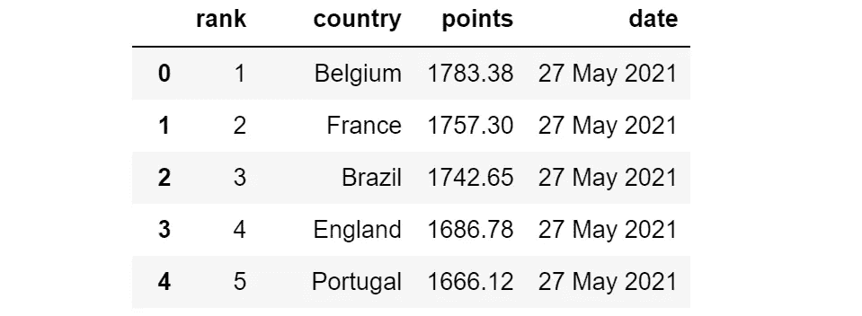
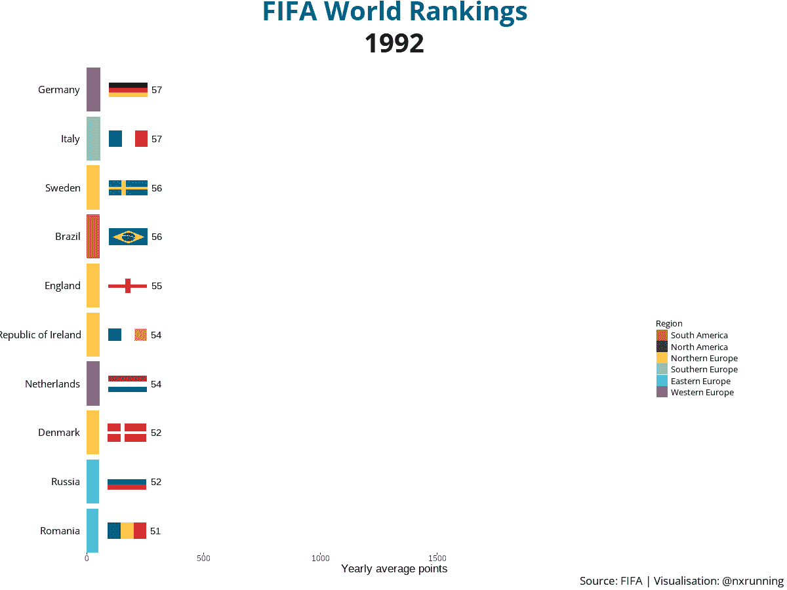
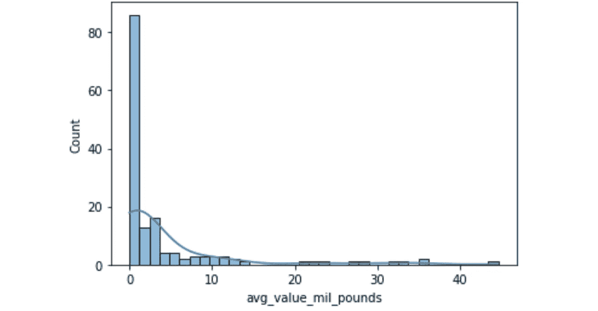
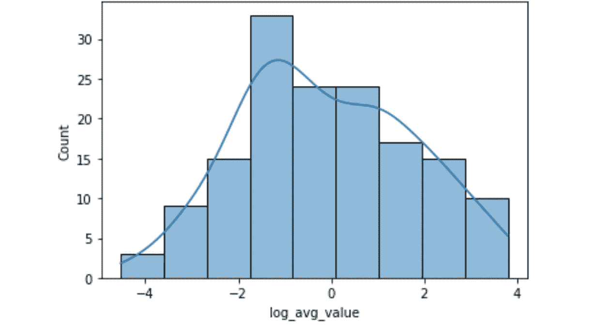
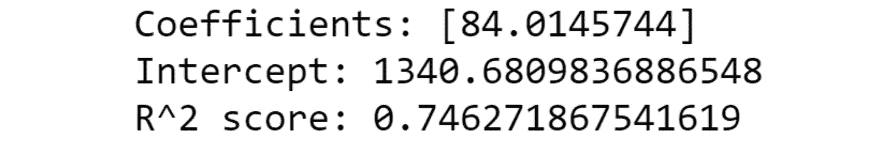
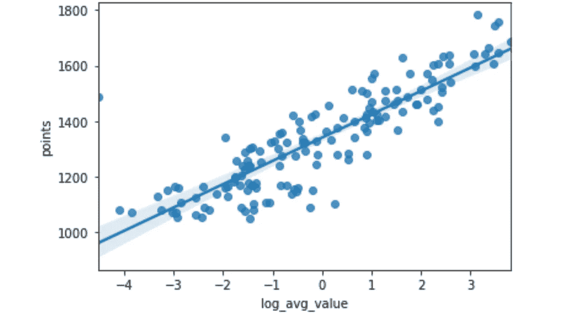
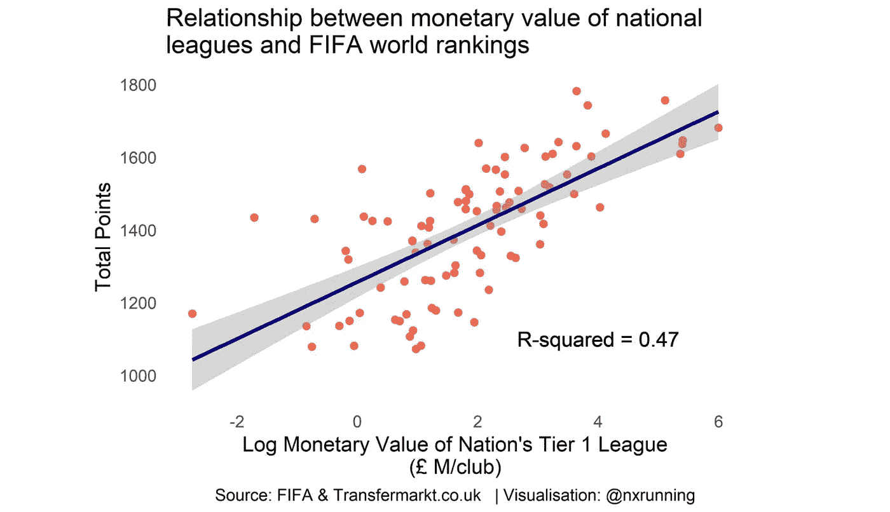

# 结合 Python 和 R 进行 FIFA 足球世界排名分析

> 原文：<https://towardsdatascience.com/combining-python-and-r-for-fifa-football-world-ranking-analysis-d71bb6ceacdb?source=collection_archive---------8----------------------->

## 展示 Python 和 R 在数据科学和分析领域的互补优势

杰森·查特斯在 [Unsplash](https://unsplash.com?utm_source=medium&utm_medium=referral) 上的照片

Python 和 R 之间的“语言战争”是数据科学中长期争论的话题，至今仍被广泛讨论。

事实上，最好的语言是最适合具体工作的语言。毕竟，Python 和 R 只是数据从业者执行最关键任务的工具——**用数据解决业务问题。**

在这次 FIFA 足球世界排名分析中，我们探索 Python 和 R 的不同和共同优势，以及它们如何在现代数据科学工具包中互补。

## 内容

> ***(1)****[*数据无罪释放(Python 中的网页抓取)*](#7daa)***(2)****[*数据可视化(条形图竞在 R)*](#48dc)**

****这个项目是由* [***投念翔***](https://www.linkedin.com/in/nien-xiang-tou-phd-a15594184/) *和* [***梁家骅***](https://www.linkedin.com/in/kennethleungty/) *联合协作完成的。****

***查看**[**GitHub repo**](https://github.com/kennethleungty/FIFA-Football-World-Rankings)获取实现代码。*****

# *******使用 Python 中的 Web 抓取进行数据采集*******

*****Python 作为一种通用编程语言，经常用于 web 抓取等通用任务。这种数据搜集工作最流行的工具之一是 Selenium。*****

*****Selenium 是一个用于 web 浏览器控制的开源自动化工具，用于自动化重复操作，如按钮点击、表单填写、文本提取和页面滚动。*****

*****在国际足联男子排名页面上应用了[网页抓取脚本](https://github.com/kennethleungty/FIFA-Football-World-Rankings/blob/main/01_FIFA_Rankings_Data_Acquisition_Preparation.ipynb)(带有 [Chrome 网络驱动](https://chromedriver.chromium.org/downloads))来检索 1992 年至 2021 年间的国家队积分和排名。提取的数据导出为 CSV 文件，用于数据分析。*****

**********

*****FIFA 排名数据前五行截图|作者图片*****

# *******数据可视化与 R 中的条形图竞赛*******

*****与 Python 类似，R 是一种开源编程语言，提供了无数的功能。但是，它通常用于统计分析和创建图形。*****

*****后者是 R 的一个显著优势，因为它可以生成高质量的可高度定制的图形。在这一部分中，我们将演示如何使用几个 R 包来创建动态可视化。*****

**********

*****FIFA 世界排名柱状图竞赛|作者图片*****

*****上图是一个条形图比赛动画，它显示了国际足联前十名的排名在过去三十年中是如何演变的。这些国家通过汇总它们的年平均分数来排名。*****

*****数据可视化分两步生成。首先，使用流行的 *ggplot2* 包(加载在 [*tidyverse*](https://www.tidyverse.org/) 中)创建了一个静态条形图，它允许通过将图形分成不同的组件进行高度定制。*****

*****许多软件包现在可用于补充 *ggplot2* 图。在这种情况下，我们通过使用 [*ggimage*](https://cran.r-project.org/web/packages/ggimage/index.html) 包添加标记图像来定制绘图。*****

*****第二，使用 [*gganimate*](https://gganimate.com/) 对静态剧情进行动画处理。具体来说， *transition_time* 函数只需增加一行代码就可以控制条形图逐年变化！*****

# *******使用 Python 和 R 进行回归分析*******

*****Python 和 R 都是非常有效的统计分析工具。为了证明这一点，我们用 Python 和 R 展示回归建模来回答具体的足球问题。*****

## *******(一)国际足联排名与国家队货币价值之间的关系(Python 中的线性回归)*******

*****我们想确定一个国家队的国际足联积分是如何受到该队球员平均货币价值的影响的。*****

*****球队阵容的数据(基于最近的锦标赛，如 2020 年欧锦赛、2021 年美洲杯等。)和相应的球员市场价值(以英镑计)从公共足球网站*Transfermarkt.co.uk*获得(截至 2021 年 8 月 12 日准确)。*****

*****我们通过合计每个球员的市场价值来计算每个国家队的货币价值。因为每个队可能有不同的球员数量，所以**平均**货币价值(即总价值除以球队规模)被用于分析。*****

*****在建模之前，将数据可视化是一个很好的做法。特别是，我们希望确保我们的独立变量(平均货币价值)遵循正态分布，这是一个需要满足线性回归的假设。*****

*****使用 [*seaborn*](http://seaborn.pydata.org/) 库，我们可以创建一个直方图(用 [KDE](https://en.wikipedia.org/wiki/Kernel_density_estimation) )来显示平均货币值的分布。*****

**********

*****KDE 直方图|作者图片*****

*****该图揭示了一个显著的右偏，因为几个团队的货币价值比其他团队高得多。解决方案是将**对数变换**应用于平均货币值。这样做后，我们得到一个更接近正态分布的图。*****

**********

*****KDE 直方图(对数变换后)|作者图片*****

*****自变量转换成功后，我们可以进行回归分析。最直观的基线模型是线性回归。*****

*****众多的 Python 包允许我们执行线性回归，其中最流行的是 [*scikit-learn*](https://scikit-learn.org/stable/index.html) 的 [*linear_model*](https://scikit-learn.org/stable/modules/linear_model.html) 模块。*****

*****在为 *LinearRegression()* 函数提供因变量和自变量后，我们获得了以下指标:*****

**********

*****线性回归指标|作者图片*****

*****0.746 的 R(决定系数)分数意味着该模型占国际足联点数可变性的 74.6%。鉴于我们的模型只有一个独立变量，这是一个相当不错的结果！*****

*****这意味着国家队的平均货币价值与其国际足联积分有较强的正相关性。*****

*****最后，使用 *seaborn* 创建回归图，以可视化线性回归模型拟合:*****

**********

*****Python 中的回归图|作者图片*****

## *******(ii)国际足联排名与国家联赛货币价值之间的关系(R 中的线性回归)*******

*****我们还对 FIFA 积分和国家(T2)一级足球联赛(T3)的货币价值之间的关系感兴趣。联赛货币价值的数据同样来自 Transfermarkt.co.uk 的*。******

*****鉴于不同联赛中参与俱乐部的数量不同，国家联赛的货币价值被标准化为每个俱乐部的英镑价值。*****

*****与之前的回归分析类似，国家联盟货币值的分布是右偏的，因此应用了**对数变换**。*****

*****由于 R 通常用于统计分析，线性建模已经包含在基本包中，不需要导入额外的库。 *lm* 函数通过简单地指定 Y ~ X 格式的公式，使线性模型符合数据。*****

*****结果显示，R 为 0.47，表明国家联赛的货币价值占国家国际足联积分可变性的不到一半。这种关系可以在下面的散点图中看到:*****

**********

*****作者 R |图像中的回归图*****

*****我们观察到，国家队货币价值的数据点比 Python 散点图更远离线性回归线。*****

*****总的来说，我们可以从这两项分析中解读出，国家队的货币价值比国家联赛的价值更能预测一个国家的国际足联积分。*****

**********

*****[乱足球齿轮](https://unsplash.com/@chaossoccergear?utm_source=medium&utm_medium=referral)在 [Unsplash](https://unsplash.com?utm_source=medium&utm_medium=referral) 上拍照*****

# *****摘要*****

*****Python 和 R 都是优秀的数据分析编程语言，在数据科学工具包中各有其位置。如果您专注于统计建模或从数据生成图形可视化，R 是一个更直接的选择。*****

*****另一方面，如果您的项目需要通用编程任务或与其他应用程序集成，Python 是更合适的选择。*****

*****总之，争论 Python 和 R 哪个更好是徒劳的。**理想的工具取决于用例、你打算回答的问题以及你的团队和行业的文化。*******

*****<https://www.linkedin.com/in/nien-xiang-tou-phd-a15594184/>  

## 在你走之前

欢迎您**加入我的数据科学学习之旅！**点击此[媒体](https://kennethleungty.medium.com/)页面，查看我的 [GitHub](https://github.com/kennethleungty) ，了解更多精彩的数据科学内容。*****