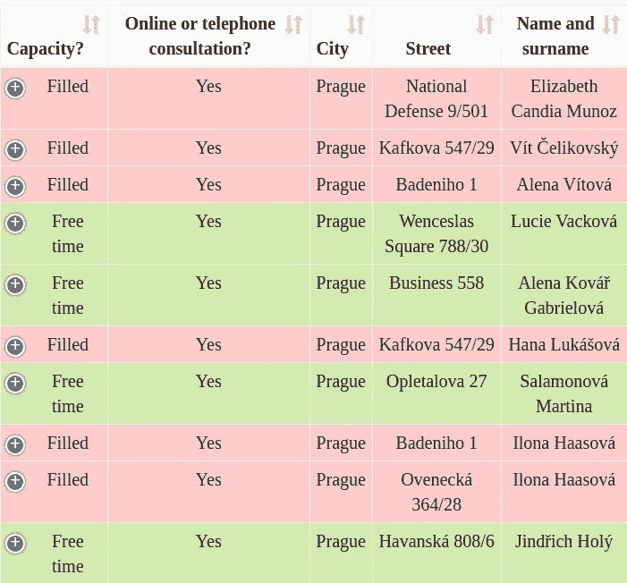
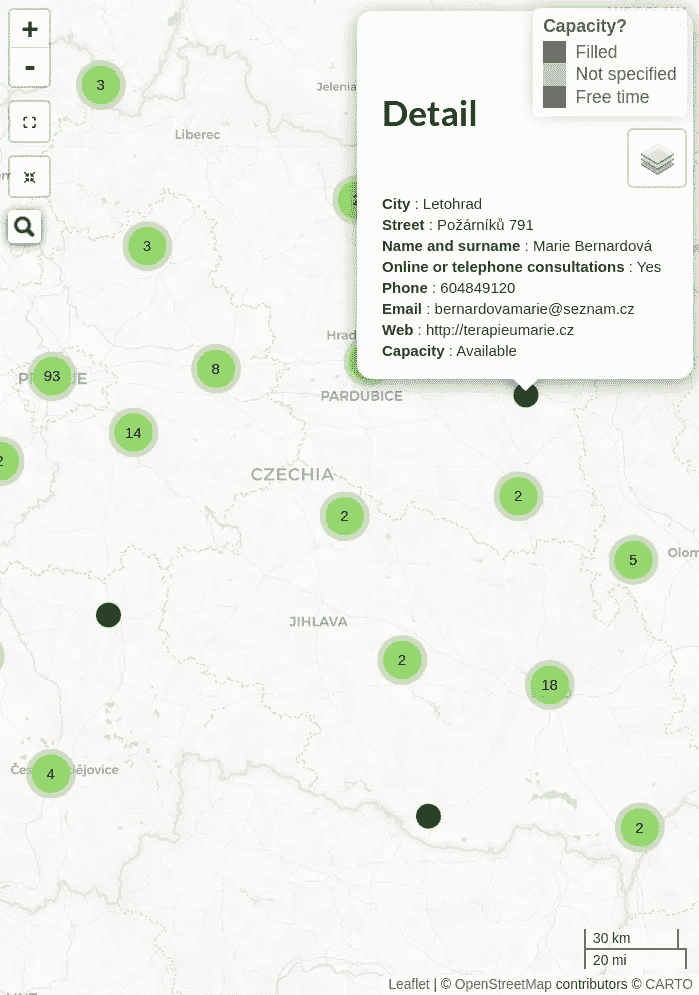

# 结合 R {tidyverse，fleet，DT，flexdashboard}和 Python {pandas，GeoPy}创建无服务器心理治疗仪表板

> 原文：<https://towardsdatascience.com/combining-r-tidyverse-leaflet-dt-flexdashboard-and-python-pandas-geopy-to-create-a-c25c5ef7d2d9?source=collection_archive---------32----------------------->


照片由[维特·加布雷](https://www.data-must-flow.com/projects/photos/photos.html)拍摄

# 介绍

在捷克共和国，只有一小部分精神治疗护理(T3)由健康保险公司(T6)承保(T5)。因此，当最大的此类公司之一 VZP 向其客户提供 7 000 CZK(约合 280 欧元)的心理治疗津贴时，这是一个受欢迎的举措。

然而，给自己找一个心理治疗师的方法并不是最方便的，因为你必须滚动浏览一个. pdf [文件](https://media.vzpstatic.cz/media/Default/dokumenty/seznam-terapeutu.pdf?ver=0303)。幸运的是，[捷克心理治疗协会](https://www.linkedin.com/in/dominika-%C4%8Dechov%C3%A1-m-a-b6b95724/)[](https://czap.cz/eng)*的董事会成员 Dominika echová，通过谈判从 VZP 获得了更多信息，比如哪些心理治疗师可以接受新客户。*

*我的任务是将这些信息整合成一种更加用户友好的方式，让你自己找到一个治疗师，从而使服务更加容易获得。重点是交付的速度和部署的简易性，所以我决定用[**flex dashboard**](https://rmarkdown.rstudio.com/flexdashboard/)来完成 **R** ，这个包允许创建**交互式**和**无服务器**仪表盘。*

*我有以前的[项目](https://www.data-must-flow.com/post/)中的大部分构建模块——R 实现 [**传单**](https://rstudio.github.io/leaflet/) 用于地图，以及 [**数据表**](https://rstudio.github.io/DT/) 用于表格。 [**Tidyverse**](https://www.tidyverse.org/) 用于装载和角力数据。*

*然而，输入表不包含纬度和经度，这是在地图上显示治疗师位置所需的两个元素。之前我已经用 [**ggmap**](https://github.com/dkahle/ggmap) 调整过数据。然而，Google API 需求的变化使得这变得有些不方便。*

*所以，我决定寻找一个替代方案。然后偶然看到了 [Abdishakur](https://shakasom.medium.com/) 的文章[*Geocode with Python*](/geocode-with-python-161ec1e62b89)，很棒的介绍 Python 的包 [**GeoPy**](https://geopy.readthedocs.io/en/stable/) 。*

*现在，虽然 R 是我的特殊数据朋友，但我也喜欢在我的工作流程中有利的地方集成其他语言和工具，如 Python、熊猫、T21。*

*在这篇文章中，我想回顾一下我是如何创造理想结果的。*

*你可以在这里找到最终的**仪表盘**[](https://www.data-must-flow.com/posts/psychotherapy_vzp/)**和带有交互元素的**原创文章**[**这里**](https://www.data-must-flow.com/posts/python_r_therapy/) 。***

# ***r 包***

***让我们从加载所需的包开始:***

```
****# Load required packages*
library(flexdashboard) *# dashboard wrapping*
library(tidyverse) *# data wrangling*
library(crosstalk) *# interactivity*
library(broom) *# output of built-in functions cleanup*
library(DT) *# Table formatting*
library(htmltools) *# widgets*
library(reshape2) *# data taransformations*
library(leaflet) *# interactive maps*
library(leaflet.extras) *# interactive features****
```

# ***输入数据***

***您可以在 [**GitHub**](https://github.com/VGabrhel/datamustflow/blob/master/public/posts/python_r_therapy/vzp_data_geo.csv) 上找到输入数据集。***

```
****# Initial dataset*
vzp_data = read.csv("vzp_data_geo.csv") %>%
    select(name, surname, alias, website, address,
           city, region, psc, phone, email, Kapacita, remote_therapy)***
```

# ***计算机编程语言***

## ***激活***

***首先你需要打开 r 中的 Python 接口，我用的是 [**reticulate**](https://rstudio.github.io/reticulate/index.html) 。***

```
****# Python interoperability in R*
library(reticulate)*# Specifying which version of python to use.*
use_python("/home/vg/anaconda3/bin/python3.7",
           required=T)  *# Locate and run Python****
```

## ***包和数据争论***

***即使有可能一次运行下面所有的代码块，让我们遵循[做一件事](https://blog.codinghorror.com/curlys-law-do-one-thing/)的原则，根据它们的功能将它们分开。***

***Python 包优先:***

```
***from geopy.geocoders import Nominatim
from geopy.extra.rate_limiter import RateLimiter
import pandas as pd***
```

***激活地理编码器:***

```
***locator = Nominatim(user_agent="myGeocoder")***
```

***将部分地址链接到一个变量-将用于地理编码:***

```
***df = r['vzp_data']df['state'] = "CZ"df["ADDRESS"] = df["address"] + "," + df["city"] + "," + df["state"]df["Adresa"] = df["address"] + ", " + df["city"]***
```

## ***使用 GeoPy 进行地理编码***

***为了减少`Too Many Requests`误差，使用`RateLimiter`。正如 GeoPy 的[文档](https://geopy.readthedocs.io/en/stable/)所说，在地理编码调用之间添加一个延迟*，以减少地理编码服务*的负载。***

```
****# 1 - conveneint function to delay between geocoding calls*
geocode = RateLimiter(locator.geocode, min_delay_seconds=1)*# 2- create location column*
df['location'] = df['ADDRESS'].apply(geocode)*# 3 - create longitude, laatitude and altitude from location column (returns tuple)*
df['point'] = df['location'].apply(**lambda** loc: tuple(loc.point) **if** loc **else** None)*# 4 - split point column into latitude, longitude and altitude columns*
df[['latitude', 'longitude', 'altitude']] = pd.DataFrame(df['point'].tolist(), index=df.index)***
```

## ***导出地理编码数据***

***现在，您可能会问——为什么我要导出这个表？我不打算把数据作为 Python/R 对象进一步处理吗？***

***不幸的是，当包含 Python 代码时，flexdashboard [还不能被编织](https://community.rstudio.com/t/python-code-inside-flexdashboard-framework/44873/2)。因此，在使用仪表板时，我必须创建两个独立的工作流—一个用于数据地理编码，另一个用于编译仪表板。然而，我想使仪表板编码更具可重复性，同时将所有重要的组件保持在一个工作流中。***

***幸运的是，其他 R Markdown 输出如 R notebook 很乐意包装 Python 代码。这就是您在代码中看到这一步的原因。当然，这不是最有效的工作流程，但是你知道他们说什么——完成(和工作)比完美更好。***

***当然，如果目标是包含一些 Python 块的 R Markdown 文档，您可以简单地在 R 块中添加`vzp_data = py[df]`,将 pandas 数据帧转换成 R 数据帧，并顺利进行下一部分。***

```
****# Convert pandas DataFrame into R Data Frame (tibble)*
vzp_data_geocoded = py['df']vzp_data_geo <- vzp_data_geocoded %>%
    select(name, surname, alias, website, address,
           city, region, psc, phone, email, `Kapacita`, remote_therapy,
           state, Adresa, latitude, longitude)vzp_data_geo <- apply(vzp_data_geo,2,as.character)
write.csv(vzp_data_geo, file = "vzp_data_geo.csv")***
```

# ***稀有***

## ***tidyverse 中的数据争论***

***仅选择将在输出中使用的列并格式化它们:***

```
****# Data import and wrangling*
vzp_data = read.csv("vzp_data_geo.csv") %>%
  select(name,
         surname,
         alias,
         website,
         address,
         city,
         phone,
         email,
         Kapacita,
         remote_therapy,
         latitude,
         longitude) %>%
  mutate_all(list(~str_trim(.,side = "both"))) %>%
  mutate(`Jméno a příjmení` = paste(name,surname),
         latitude = as.numeric(latitude),
         longitude = as.numeric(longitude)) %>%
  rename("Email" = email,
         "Telefon" = phone,
         "Web" = website,
         "Online nebo telefonické konzultace?" = remote_therapy,
         "Kapacita?" = Kapacita,
         "Město" = city,
         "Ulice" = address) %>%
  mutate(`Kapacita?` = case_when(`Kapacita?` == "volno" ~ "Volno",
                              `Kapacita?` == "naplněno" ~ "Naplněno",
                              `Kapacita?` == "Naplněno" ~ "Naplněno",
                              TRUE ~ `Kapacita?`),
         `Online nebo telefonické konzultace?` = case_when(`Online nebo telefonické konzultace?` == "Ano" ~ "Ano",
                                                           `Online nebo telefonické konzultace?` == "Ano/ možnost konzultací v anglickém jazyce" ~ "Ano",
                                                           `Online nebo telefonické konzultace?` == "Ne" ~ "Ne",
                                                           `Online nebo telefonické konzultace?` == "ne" ~ "Ne",
                                                           TRUE ~ `Online nebo telefonické konzultace?`)
         )*# Replace "NaN" with "Neuvedeno"*
vzp_data[vzp_data=="NaN"] <- "Neuvedeno"***
```

# ***输出***

## ***可用心理治疗师列表***

***下表是使用`DataTable`包完成的最终[查找表](https://www.data-must-flow.com/posts/psychotherapy_vzp/)的快照。这个包意味着许多交互元素供您使用。您可以添加跨列搜索和过滤、排序、分页等等。此外，它可以很容易地与使用`crosstalk`的过滤器连接。***

***由于输出是捷克语，我建议您的浏览器的`Translate to English`功能获得更多价值。***

```
***vzp_data_table <- vzp_data %>%
  select(`Kapacita?`, `Online nebo telefonické konzultace?`,
        Město,
        Ulice,
         `Jméno a příjmení`, 
         Email, Telefon, Web, Ulice,
         `Online nebo telefonické konzultace?`) test_shared <- crosstalk::SharedData$new(vzp_data_table)DT::datatable(test_shared,
    extensions = c(
      "Responsive"
    ),
    rownames = FALSE,  *# remove rownames*
    style = "bootstrap",
    class = 'cell-border display',
    options = list(
      pageLength = 10,
      dom = 't',
      deferRender = TRUE,
      scroller = TRUE,
      columnDefs = list(list(className = 'dt-center', targets = "_all"))
        )
      ) %>% formatStyle(
  "Kapacita?",
  target = 'row',
  backgroundColor = styleEqual(c("Naplněno", "Volno"), c('#ffcccb', '#d2e9af')))***
```

******

## ***心理治疗师分布图***

***由于通过地图搜索可能更方便，我决定用传单添加一个。类似于数据表，传单允许多个交互式元素。包括基于字符串或不同地图图层的搜索。***

***同样，由于输出是捷克语，我建议您的浏览器的`Translate to English`功能获得更多价值。***

```
****# prepare a palette - manual colors according to branch column*
pal <- leaflet::colorFactor(palette = c("Naplněno" = "#8b0000",
                                        "Neuvedeno" = "#A9A9A9",
                                        "Volno" = "#006400"
                                        ), 
                               domain = vzp_data$`Kapacita?`)points_fin <- SharedData$new(vzp_data)map1 <- leaflet(data = points_fin, width = '100%', height = 800) %>%
          addProviderTiles("CartoDB.Positron", group = 'Základní') %>%
          addProviderTiles("Esri.WorldImagery", group = 'Letecká') %>%
          addProviderTiles("OpenStreetMap.Mapnik", group = 'Uliční') %>%
          addProviderTiles("OpenTopoMap", group = 'Zeměpisná') %>%
          addScaleBar('bottomright') %>%
          setView(15.4129318, 49.7559455, zoom = 8.2) %>%
          addCircleMarkers(
                   group = 'Obor', 
                   stroke = FALSE, 
                   opacity = 0.9,
                   fillOpacity = 0.9,
                   fillColor = ~sapply(`Kapacita?`, **switch**, USE.NAMES = FALSE,
                                        "Volno" = "#006400", 
                                        "Naplněno" = "#8b0000",
                                        "Neuvedeno" = "#A9A9A9"
                                     ),
                   popup = ~paste0('<h2>Detail</h2> <br>',
                                   '<b>Město</b>: ', Město, '<br>',
                                   '<b>Ulice</b>: ', Ulice, '<br>',
                                   '<b>Jméno a příjmení</b>: ', `Jméno a příjmení`, '<br>',
                                   '<b>Online nebo telefonické konzultace</b>: ', `Online nebo telefonické konzultace?`, '<br>',
                                   '<b>Telefon</b>: ',`Telefon`, "<br>",
                                   '<b>Email</b>: ', Email, '<br>',
                                   '<b>Web</b>: ', Web, '<br>',
                                   '<b>Kapacita</b>: ', `Kapacita?`, '<br>')
                   ,
                   clusterOptions = markerClusterOptions(showCoverageOnHover = FALSE,
                    iconCreateFunction=JS("function (cluster) {    
    var childCount = cluster.getChildCount(); 
    var c = ' marker-cluster-';  
    if (childCount < 100) {  
      c += 'small';  
    } else if (childCount < 1000) {  
      c += 'medium';  
    } else { 
      c += 'large';  
    }    
    return new L.DivIcon({ html: '<div><span>' + childCount + '</span></div>', className: 'marker-cluster' + c, iconSize: new L.Point(40, 40) }); }"))) %>%
  addLegend(position = "topright",
            values = ~`Kapacita?`,
            opacity = .7,
            pal = pal,
            title = "Kapacita?") %>%
  leaflet.extras::addResetMapButton() %>%
   addLayersControl(
                baseGroups = c("Základní", "Letecká", "Uliční", "Zeměpisná"),
                options = layersControlOptions(collapsed = TRUE)
              ) %>%
      addSearchOSM()map1***
```

******

# ***结束语***

***我相信当以上述方式集成 R 和 Python 时，有些人会皱起眉头。"*为什么不选择一种工具并使用它呢？*“你可能会问自己。在我的例子中，我需要在模板中添加一部分。虽然它的部分是用 R 编写的，但我不想把自己局限在一种工具上。***

***同时，通过查看当前的限制，我们可以促进未来集成的便利性。在这里，我必须承认 [RStudio](https://www.rstudio.com/solutions/r-and-python/) ，在我看来是处理数据的最好工具之一，已经在集成 Python 方面迈出了重要的几步。然而，在特定的用例中，这仍然是一段有点颠簸的旅程。***

***最终，我想试验和测试极限。我相信 Python 和 R 在处理数据时各有利弊，所以为什么不探索一下如果将它们结合在一起可以达到什么目的呢？***