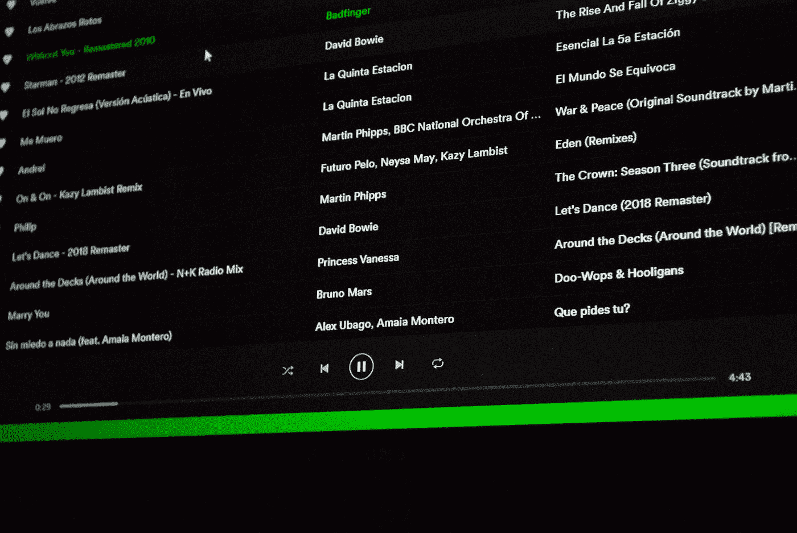
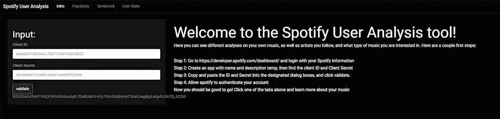
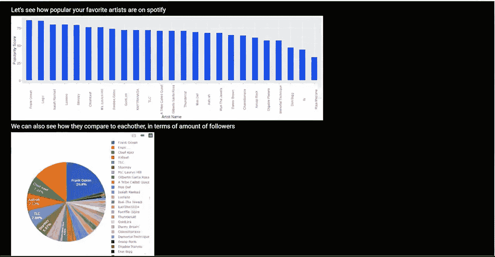
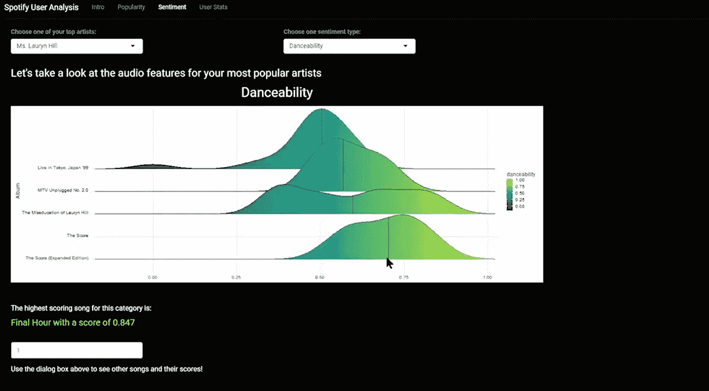
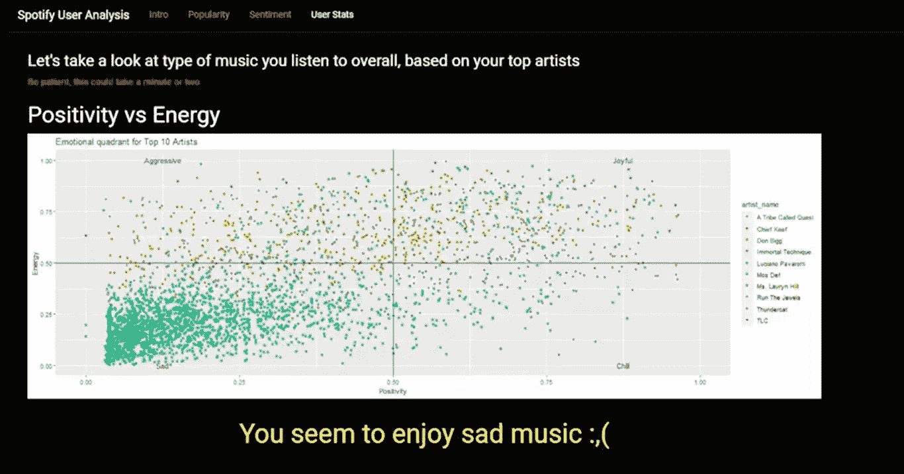
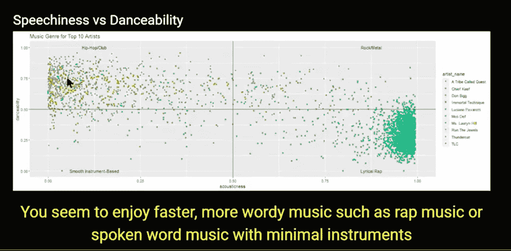
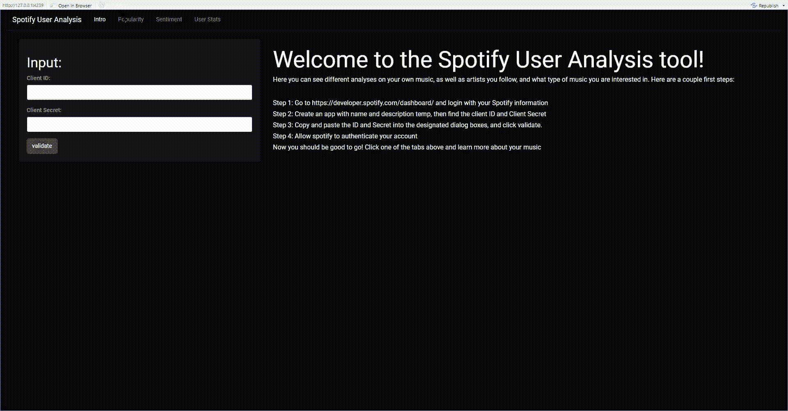

# 结合 Spotify 和 R——一个交互式 Rshiny 应用程序+ Spotify 仪表盘教程

> 原文：<https://towardsdatascience.com/combining-spotify-and-r-an-interactive-rshiny-app-spotify-dashboard-tutorial-af48104cb6e9?source=collection_archive---------11----------------------->

## 了解如何制作一个直观的 Spotify + Rshiny 应用程序，告诉用户他们的音乐个性、最受欢迎的艺术家和专辑比较等信息

塞尔吉·卡夫雷拉在 [Unsplash](https://unsplash.com?utm_source=medium&utm_medium=referral) 上的照片

*(滚动到底部，以 GIF 格式查看完整应用的现场演示)。本文详细介绍了如何使用 Rshiny 制作一个集成的 Spotify 应用程序。这个应用程序使用了*[*Spotify API*](https://developer.spotify.com/dashboard/)*，并揭示了如何以更简单的方式使用 Rshiny 作为类似程序(如 Python 的 Streamlit 或 Javascript)的替代方案。Rshiny 是一个 R 包，它允许用户轻松地创建 web 应用程序，因为它使用 R，所以允许比 Javascript 更直观的数据可视化和操作。要创建一个 Rshiny 应用程序，最好至少有一个 ui。r(用户界面)脚本，一个服务器。r 脚本和运行。r 脚本。用户界面。r 文件的工作方式和 HTML 文件一样，只是外观不同，功能不同。服务器。r 文件的行为类似于。js 文件，这个文件也是定义所有函数的最佳位置。这个文件中的函数和对象构成了 ui。r 文件“工作”，并且最好在开始之前在脑海中想象一下整个项目的视觉效果。我绘制了每个标签(又名页面)应该包含的内容，从登录页面开始，然后是人气、人气和用户统计标签。这直接转化为用户界面。r 脚本。然后是在服务器中创建的函数和对象。r 脚本可以继续工作，因为它们现在可以被构建出来。最后，跑步。r 文件，通常只是一个具有 runApp 功能的简单文件。该项目现在可以通过 Heroku 或 shiny apps 来完成和部署。*

我开始这个项目是因为我希望用户可以轻松地输入他们在 Spotify 的用户名和密码，然后他们的信息就会被加载，用户可以通过不同的表格和可视化方式看到他们音乐品味的酷的方面。

可悲的是，用于 R 的 Spotify 软件包 spotifyr 不支持用户登录，用户需要实际的 Spotify API 才能看到他们的数据(也就是客户端 id 和客户端机密)。该应用程序仍然工作，它只是需要一个用户有 API，让他们看到自己的音乐品味。不管怎样，这款应用制作起来还是很有趣的，并且让可视化对用户来说更具互动性。

我将首先检查应用程序的布局，所以我们开始吧！

我希望该应用程序有 4 个不同的标签是:

*   简介选项卡—允许用户输入他们的客户端 id 和客户端密码，API 它还提供了如何获取 API 密钥来使用该工具的说明

作者图片

*   流行度选项卡—显示用户收听的艺术家的不同流行度指标。它有一个可视化图表，从 Spotify 的内部流行度指标 1-100 显示用户最常听的艺术家(我设置为 25 位艺术家)的流行度。它还在一张饼状图上按关注者对这些艺术家进行了比较。

作者图片

*   情感标签——可能是最复杂的标签，它允许用户滚动浏览他们最受欢迎的艺术家(前 25 名)的专辑，并查看每张专辑的情感评分。情绪是音乐的不同属性，它们包括:“可跳舞性”、“能量”、“响度”、“语速”、“声音”、“活跃性”、“积极性”和“节奏”。该标签还显示了最具有某种音乐属性的艺术家的歌曲。举个例子，艺术家劳伦·希尔女士最适合跳舞的歌曲是《最后一小时》,其可舞性得分为 0.847。我在这里获得了这张脊线图[的灵感。](https://vladyslavkushnir.medium.com/exploring-spotify-api-in-r-284f1ef32f46)

作者图片

*   用户统计——全面查看用户的 10 位最受欢迎的艺术家，并绘制艺术家的集体情感图表。然后它判断用户的音乐个性。在所示的例子中，用户似乎喜欢悲伤的音乐，因为音乐的能量和积极性平均较低。注意，对于非英语音乐，这不是最准确的。这也表明用户可能喜欢本质上更罗嗦的说唱音乐。我在这里得到了这个视觉化[的灵感。](https://medium.com/@joypham7/spotify-personal-data-analysis-858c8fbe6983)

作者图片

作者图片

这些是我在做这个项目之前考虑的事情，在写代码之前我已经把大部分都计划好了。说到代码，让我们开始吧！

照片由[弗洛里安·奥利佛](https://unsplash.com/@florianolv?utm_source=medium&utm_medium=referral)在 [Unsplash](https://unsplash.com?utm_source=medium&utm_medium=referral) 上拍摄

我将从 ui 开始。r 文件，所有的“前端开发”都在这里进行。代码将会显示，并解释之后会发生什么。我将包括图片，因为媒体不能识别 Rshiny 代码。

让我们一步一步地看看第一个选项卡:

*   ShinyUI 是包含所有用户界面代码的地方。我们需要添加 fluidPage，以允许自动调整页面尺寸。最后，我们需要一个 navbarPage 来封装所有的 tabPanels(类似于独特的 HTML 页面)。
*   Intro tabPanel 包括一个侧边栏面板，允许用户输入他们的 Spotify 客户端 id 和客户端密码。spotifyr 包目前不允许直接输入用户名和密码，因此用户必须使用 Spotify API。textInput、actionButton 和 textOutput 中的第一个字符串参数都是将在服务器中使用的变量。r 文件。
*   主面板包括注册 Spotify API 的基本说明。很明显，h#只是 Rshiny 中不同的标题大小。
*   如果您遇到问题，可能需要在启动应用程序之前声明客户端 id 和客户端密码。

现在是第二个标签:

*   这个 Popularity tabPanel 只包含一个 mainPanel，它包含两个绘图，名为 popularity_plot_output 和 follower_plot_output，我们将在 server.R 中创建它们。
*   还有一个名为 favorite_artists_table 的数据表也将在 server.R 中创建。

让我们看第三页:

*   该情感选项卡面板有两个 fluidRows，包含艺术家姓名和情感类型的下拉列表(分别为 artist_name 和 perspective _ type)。
*   在两次下拉之后，存在两个文本输出。一个在情节情绪 _ 情节 _ 输出之前，另一个在数字输入之前。第一个文本“情绪 _ 文本”只是一个情节标题，而第二个“情绪 _ 情绪”是下面数字输入框的输出。其工作方式是，无论用户输入什么数字，都将是歌曲的排名，该排名基于在情绪类型中选择的情绪。
*   tags$style 的工作方式类似于 CSS 在 web 开发中的工作方式，并且格式化给定的对象。此外，br()只是增加了一个额外的空间。

最后，标签四:

*   这个最后的 tabPanel 有两个 textOutputs 和两个 plotOutputs。我们首先创建能量与积极性输出图，它将显示用户从他们所听的音乐中获得的整体积极性和能量。然后，它将显示一个名为 energy_vs_positivity 的文本输出，该文本输出根据用户的顶级艺术家来表达用户的音乐个性。

这就完成了 ui。现在我们来看看 server.R。

照片由[劳塔罗·安德烈亚尼](https://unsplash.com/@lautaroandreani?utm_source=medium&utm_medium=referral)在 [Unsplash](https://unsplash.com?utm_source=medium&utm_medium=referral) 上拍摄

现在我们处于 Rshiny 项目的“后端开发”部分。我们需要在 ui 中创建我们定义的变量和对象。我们将使用许多 spotifyr 函数从 Spotify API 中提取数据。

这一部分可以分为两个部分。首先，我将讨论一些显示一些可视化效果和运行应用程序所必需的函数，然后我将展示 shinyServer 函数，它与 shinyUI 函数类似。

*   authenticate 函数:允许 spotifyr 对 API 进行身份验证，并允许访问所有数据。参数只是客户端 id 和客户端机密。
*   fav_artists 函数:制作一个表格，其中包括用户的顶级艺术家，以及他们的受欢迎程度(由 Spotify 排名)、Spotify 每月总听众人数和音乐流派等信息。它使用 spotifyr 函数 get_my_top_artists_or_tracks，然后使用 R 的[数据操作函数](https://www.datanovia.com/en/courses/data-manipulation-in-r/)和强大的[管道操作符](https://www.datacamp.com/community/tutorials/pipe-r-tutorial)将表格精简为最基本的必需品。这个函数主要用在 tabPanel 二中。
*   fav_artists_datatable 函数:格式化从最后一个函数创建的表格，使其对用户友好。
*   audio_features_fav_artist 函数:创建一个包含艺术家姓名的表，以及 Spotify 为每首歌曲测量的一些音频功能。这些衡量标准是“可跳舞性”、“能量”、“响度”、“语速”、“声音”、“活力”、“积极性”和“节奏”。这个函数使用 spotifyr 的 get_artist_audio_features 函数，我们做了一些字符串操作来将 valence 的标题改为 positivity。在第四个 tabPanel 中大量使用。唯一的参数是 artist_name。
*   从上一个函数生成一个 R 数据表。最终没有使用这个函数，但它在某些场景中可能很重要，因为 plotly 有时比普通的 R 数据帧更适合使用 datatable 对象。同样，唯一的参数是 artist_name。

现在我们在实际的 shinyServer 中，项目的所有“复杂”方面都在这里。这并不复杂，但是所有的对象都源自这里，所以如果你在实际的可视化或者从 Spotify API 提取数据时出现问题，这可能就是原因。

*   我们需要 shinyServer 来创建“后端”，因此我们可以使用 Rshiny eventReactive 函数创建 validate 函数([这个函数和 Reactive 函数一样常用，所以请在这里阅读](https://riptutorial.com/shiny/example/32341/eventreactive))，将输入$btn 作为触发器，并执行我们在 ui.R 中声明的 validate 函数。我们还可以使用 Rshiny 的 renderText 函数将 validate 函数的输出保存为文本。

TabPanel two 有 4 个对象:popularity_data、popularity_plot_output、follower_plot_output 和 favorite_artists_table。

*   popularity_data 只是保存我们之前在 server.R 中创建的 fav_artists 函数的输出的 dataframe 对象，我们需要使用 Rshiny [反应函数](https://stackoverflow.com/questions/39691240/understanding-reactive-functions-in-shiny)将该函数引入 shinyServer。这个函数非常重要，在服务器中经常使用。r 文件。
*   popularity _ plot _ output 将是保存流行度条形图的对象，它比较用户库中前 25 位艺术家的 Spotify 流行度指标。这些图表的语法非常简单明了，因为更困难的问题通常是“可视化应该是什么？”
*   follower_plot_output 与上一个图类似，只是它使用了 plotly。Plotly 通常需要更多的数据操作来创建图表，但它们是动态的，而标准的 ggplots。
*   favorite_artists_table 是页面末尾的一个简单表格，用户可以看到他们关注的每个艺术家的详细信息

第三个选项卡面板也包含 4 个对象:情绪 _ 数据、情绪 _ 文本、情绪 _ 绘图 _ 输出和大多数情绪。

*   情绪数据是音频特征收藏艺术家函数的数据帧对象，输入是用户在这个页面的下拉菜单中选择的艺术家姓名。我们还使用一个反应函数来允许使用我们之前创建的 audio_features_fav_artist 函数。
*   仅仅显示用户在下拉列表中选择的情感，但是字体更大。
*   sensition _ plot _ output 首先获取用户选择的情绪类型，并用 casefold 函数使其小写。这被保存到称为文本的向量(或 1D 数据帧)中，并且文本被用于以降序组织情绪数据。然后，为了实际制作 ggplot，我们需要为 x 轴使用文本，因为文本变量依赖于用户的输入。这看起来很复杂，但是我们这样做是为了让图表根据用户的输入而改变。
*   most _ perspective 使用与上一个图相同的逻辑来保持情绪名称的动态，它基本上只是打印出情绪类型和单个音轨的分数。

TabPanel 4 有 5 个对象:top _ artist _ invision _ data、energy_vs_positivity _ plot _ output、energy _ vs _ positivity、speech ness _ vs _ dance ability _ plot _ output 和 speech ness _ vs _ dance ability

*   top _ artist _ invision _ data 基本上意味着使用 audio_features_fav_artist 表，但是使用 popularity_data 作为索引。这样做是为了获得用户库中前 10 位艺术家的音频。这个对象基本上是一个艺术家名字的数据帧和艺术家所有歌曲的所有音频特征。
*   energy _ vs _ positivity _ plot _ output 将该数据帧绘制成散点图，对每个艺术家使用不同的颜色。我用不同的描述给每个象限贴上标签，又名“愤怒”,代表能量较高但积极性较低的音乐。我们使用顶级艺术家情感数据来创建这个可视化
*   energy_vs_positivity 将 energy 和 positivity 的分数绑定，并计算分数，决定哪种情绪最能代表用户的音乐品味。然后输出描述用户音乐个性的语句。
*   speech ness _ vs _ danceability _ plot _ output 与前面的图类似，只是使用 speech ness 和 dance ability 作为情绪。
*   speechiness_vs_danceability 也给出了描述用户音乐个性的陈述。

这就差不多解决了。我们需要的只是逃跑。r 文件，我们的 app 就完成了！请查看以下内容:

卢克·切瑟在 [Unsplash](https://unsplash.com?utm_source=medium&utm_medium=referral) 上的照片

对于一些人来说，查看制作 Rshiny 应用程序的过程似乎很复杂，但实际上这比尝试用 Javascript 甚至 Python 的 Streamlit 包做同样的事情要容易得多。它还允许您使用 R 在一个有效的交互式数据科学应用程序中提供的非常强大的数据操作工具，其他人可以使用和享受这些工具！

我希望这能让一些数据科学爱好者和应用程序开发人员大开眼界，并希望激发更多与数据相关的应用程序，这些应用程序具有用户真正喜欢的功能，如他们最喜欢的指标的直接和交互式可视化。

来源:

 [## GitHub-kingazaan/spotifyr-r-shiny

### 现在你应该可以走了！点击其中一个标签，了解更多关于你的音乐链接到网站(目前关闭)…

github.com](https://github.com/kingazaan/spotifyr-r-shiny)  [## Spotify Web API 的 GitHub - charlie86/spotifyr: R 包装器

### spotifyr 是一个 R 包装器，用于从 Spotify 的 Web API 中批量提取音轨音频功能和其他信息。由…

github.com](https://github.com/charlie86/spotifyr)  [## 使用 Spotify API 逐步可视化音乐流派

### 你听什么就是什么。我们能否用数据来辨别，或看出音乐流派的差异？

towardsdatascience.com](/step-by-step-to-visualize-music-genres-with-spotify-api-ce6c273fb827)  [## 探索 R 中的 Spotify API

### Spotify API 在 R 中的威力——基于 Lorde 音乐的分析

vladyslavkushnir.medium.com](https://vladyslavkushnir.medium.com/exploring-spotify-api-in-r-284f1ef32f46)  [## Spotify 个人数据分析

### 带 R

medium.com](https://medium.com/@joypham7/spotify-personal-data-analysis-858c8fbe6983)