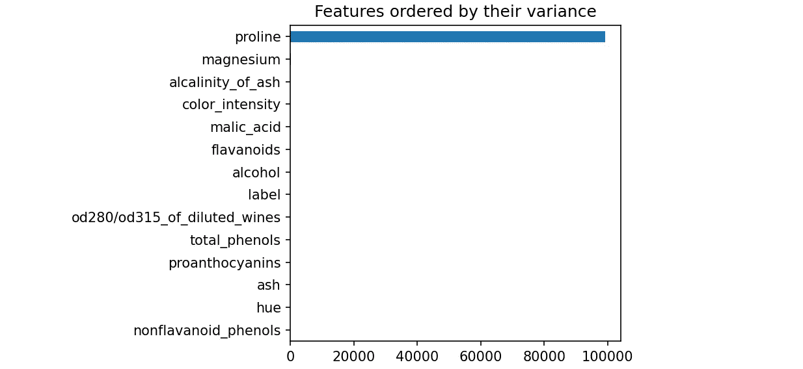
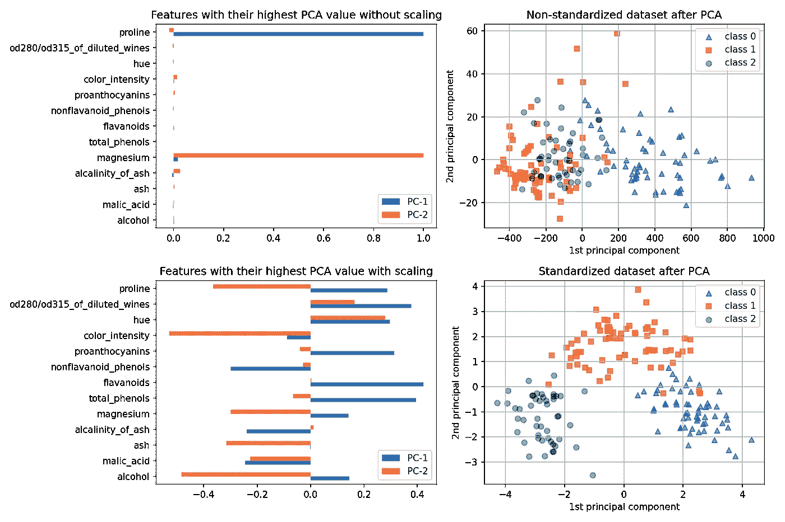
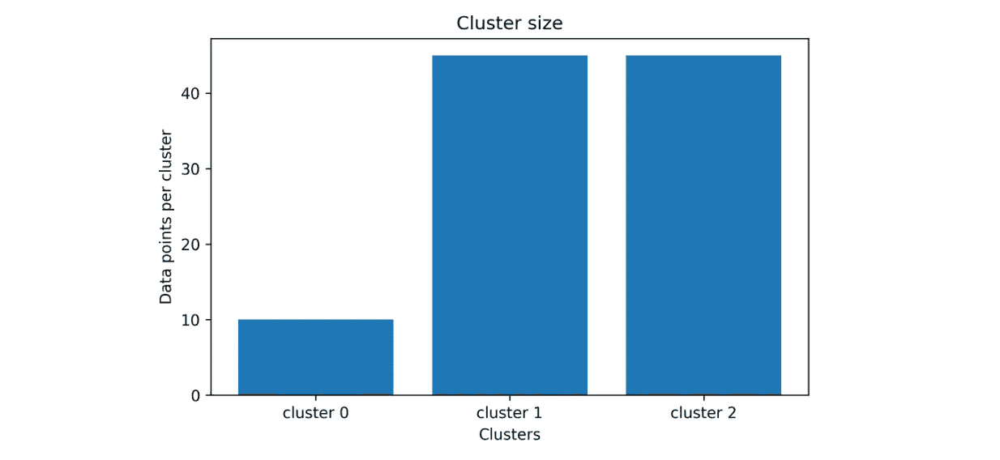
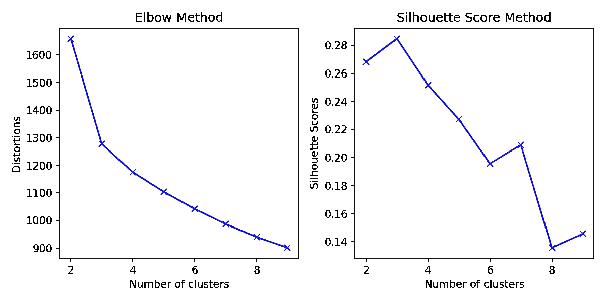
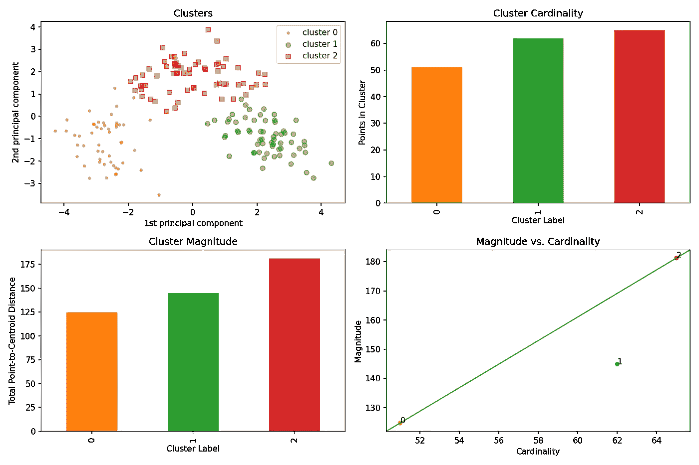
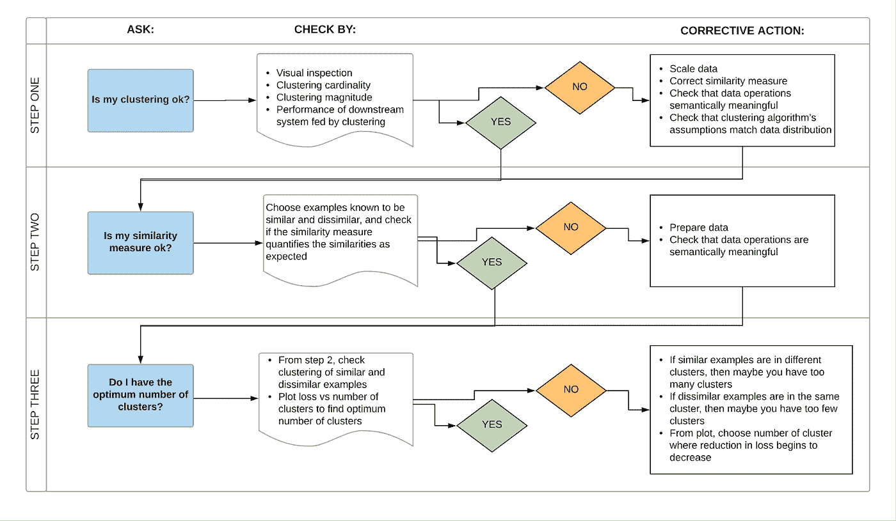
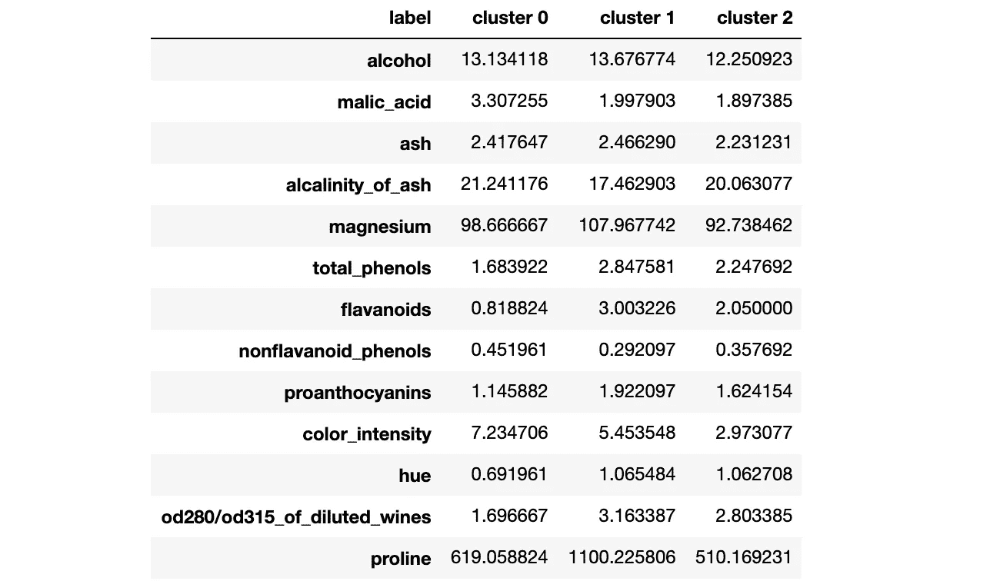
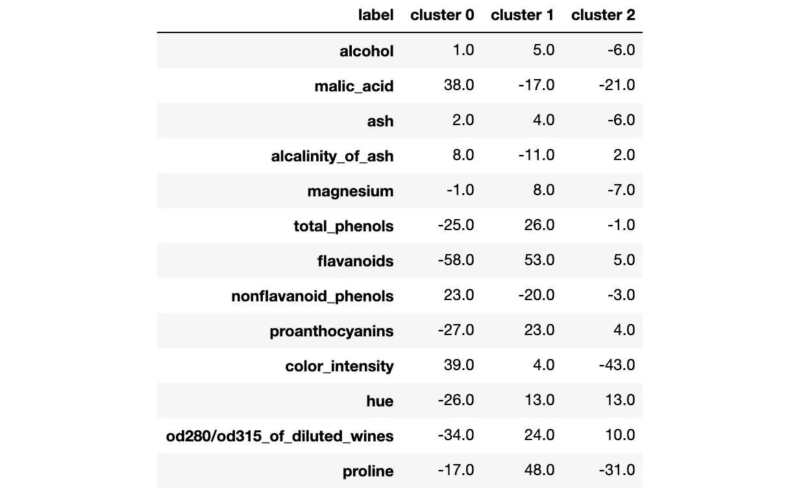
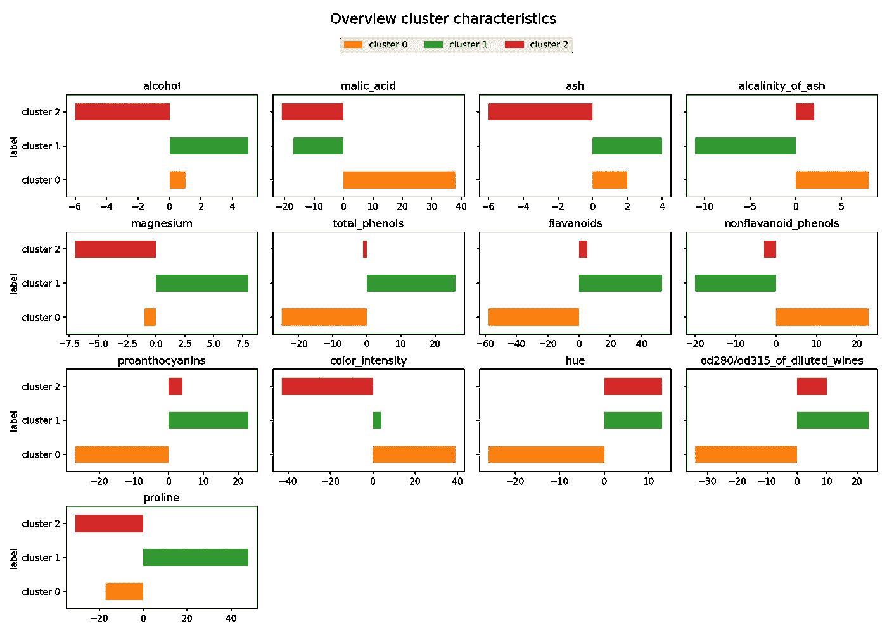
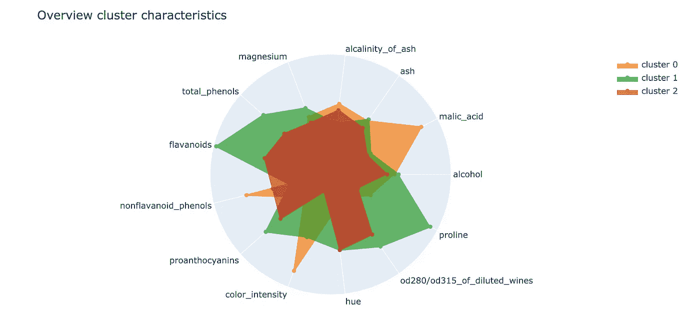

# 集群中你应该避免的四个错误

> 原文：<https://towardsdatascience.com/common-mistakes-in-cluster-analysis-and-how-to-avoid-them-eb960116d773?source=collection_archive---------7----------------------->

## 每个人都应该知道的聚类分析的关键步骤

照片由来自 [Pexels](https://www.pexels.com/photo/close-up-photography-of-yellow-green-red-and-brown-plastic-cones-on-white-lined-surface-163064/?utm_content=attributionCopyText&utm_medium=referral&utm_source=pexels) 的 [Pixabay](https://www.pexels.com/@pixabay?utm_content=attributionCopyText&utm_medium=referral&utm_source=pexels) 拍摄

**TL；博士**

*   缺乏详尽的探索性数据分析和可消化的数据清理
*   缺少特征缩放
*   没有建立代表性的集群
*   缺少分类结果的描述

答在看了大量聚类方法和分析并做了大量工作后，我想与您分享聚类分析中的四个常见错误以及如何避免它们。

# 错误#1:缺乏详尽的探索性数据分析(EDA)和可消化的数据清理

使用像`.describe()`和`.isnull().sum()`这样的常用方法是开始探索性分析的一个非常好的方法，但绝对不应该是你的 EDA 的结束。变量的**更深层次(视觉)分析**和**它们如何相互关联****至关重要**。否则，异常值等异常值可能无法完全检测出来，某些变量之间的相关性也可能无法发现。这些步骤中的错误将牵连随后的特征选择步骤和聚类结果。

如果您在数据集中发现了缺失值或异常值，您通常可以选择是**用巧妙的方法**替换这些值(如 KNNImputer，使用平均值/中值)**还是从数据集中删除它们**。不管你在这种情况下决定做什么，重要的是要清楚地解释为什么你决定选择各自的方法。因此，你应该经常问自己这些问题(并证明答案的正确性):

*   我的清理步骤对分析和建模有什么影响？
*   如果我从数据集中删除 x%的行，这意味着什么？
*   离群值对我的数据集有什么影响，为什么我决定保留/删除它们？
*   这些异常值的原因是什么？

# 错误#2:缺少特征缩放

如果您正在使用基于距离的聚类算法，如 k-means，在应用该算法之前，标准化所使用的特征**是非常重要的。这一步骤的原因在于计算聚类的方式。**

稍后确定的聚类是由数学空间中数据点之间的距离(例如欧几里德距离)定义的**。数据集中的变量通常有不同的单位，因此也有不同的取值范围。例如，如果有一个变量的取值范围比另一个变量的取值范围大得多，它可能会强烈影响聚类结果。数据集中的每个变量通常也有不同的含义(例如，体重和身高)，因此，变量不能直接比较(例如，1 公斤比 1 米更重要吗？).**通过标准化我们的特征，我们可以通过将其转换为无单位的度量或相对距离来获得每个特征的相对权重。****

展示标准化重要性的最佳方式是使用葡萄酒数据集示例，该示例也在 sklearn 的文章“特性缩放的重要性”([链接](https://scikit-learn.org/stable/auto_examples/preprocessing/plot_scaling_importance.html))中使用。

如果我们看一看通常的描述性数字(tbl。1)我们不仅可以看到变量具有不同的取值范围(由于它们的单位不同)，而且其中一些变量与其他变量相比具有较高的标准偏差(std)值。

表 1。我们的葡萄酒数据集的描述性分析。

例如，与其他变量如*镁* ( **14.28** )或*苹果酸* ( **1.12** )相比，变量*脯氨酸*具有较高的标准偏差 **314.91** 。

当比较单个变量的方差(std)时，巨大的差异变得更加明显(图 1)。

图一。按方差排序的特征方差。

很明显，与其他变量相比，脯氨酸的方差最大。

为了显示像*脯氨酸*和*镁*这样的具有高方差的变量可能主导聚类，我们应用了主成分分析(PCA ),不使用和使用所用特征的预先标准化(图 2)。

主成分分析侧重于最大化方差的成分。如果像*酒精*这样的一个变量由于其各自的单位(例如*体积百分比*对*毫克/升*)而比另一个变量(例如*脯氨酸*)变化更小，如果这些特征没有被缩放，则 PCA 可以确定最大变化的方向与*脯氨酸*轴更紧密地对应。

图二。缩放和不缩放的特征及其对 PCA 的影响。

在**未缩放的情况**(图 2 中的第一行)中，具有最高方差*脯氨酸*和*镁* **的特征主导方向，这导致数据点**的噪声聚类。

虽然您可以在**缩放案例**(图 2 中的第二行)中看到，对于所有特征来说，t **的幅度大致相同，并且数据点**的聚类在这里要清晰得多**。**

我希望这个例子向您清楚地展示了为什么特征缩放对于基于距离的聚类算法(如 k-means)如此重要，尽管丢失特征缩放并不是常见聚类分析中的唯一错误。

# 错误 3:没有建立有代表性的集群

另一个非常常见的错误是没有建立有代表性的集群。我这么说是什么意思？一些聚类结果可能如下所示:

图 3。无代表性集群的示例。

与簇 1 和 2 相比，簇 0 的大小**明显更小**。当然，在某些情况下，这样的结果可能是有效的**，如果在那个**后面有可理解的推理的话。

然而，这种情况通常是例外的，并且**每个聚类的相对相等数量的数据点应该总是针对**。通常**错误在于**或者是**缺少特征缩放/选择**或者是**选择的聚类数量**。

在 k-means 中你通常可以使用**肘方法**或者**剪影评分方法**来确定合适的聚类数(图 4)。

图 4。肘部和轮廓评分法。

使用**肘方法**，您**计算多个聚类 K** **的失真**(即从聚类中心到各个聚类的平方距离的平均值)**或惯性**(即样本到其最近的聚类中心的平方距离的总和)。然后，在一个图表中，将变形/惯性值与聚类数 K 一起可视化。在失真/惯性开始线性下降后，通过**寻找**图中的扭结或肘状点**，从视觉上确定**最佳集群数**。看看我们的例子，这意味着 3 是最佳集群的数量。**

除了肘图法，还可以使用**(平均)剪影评分法**。

至于肘图法，我们也对几个聚类大小 K 运行 k-means。但我们不是计算失真/惯性，**而是计算每个 K 的轮廓系数**。

> 轮廓系数定义为:(x-y)/max(x，y)。

其中 **y 代表平均类内距离**(即从一个点到同一类中其他点的平均距离)。而 **x 表示平均最近聚类距离**(即，到下一个最近聚类的点的平均距离)。

计算完成后，我们绘制系数值和聚类数 K，以直观地确定合适的聚类数。在这里，我们**为选定数量的 K 个集群寻找全局最优值**(即图中的最高点)。至于肘图，轮廓系数图的最佳聚类数将是 3。

在应用了具有确定的最佳聚类数的聚类之后，您应该查看一下聚类结果。

**关注属性非常有用，例如**:

*   集群基数
*   集群星等
*   数量与基数

下图 5 显示了上述属性以及使用 PCA 的聚类可视化。

图 5。我们的集群、集群基数、数量和数量与基数的关系的可视化。

**群集基数**或群集大小图显示了每个群集的点数。您可以使用此图表来查看某些分类包含的数据点是否明显少于或多于其他分类。在我们的示例中，每个集群的数据点分布看起来不错。

**群集幅度**图显示了每个群集的总点到质心的距离。此图表可用于查看每个聚类中的点的“分布”有多高，以及是否有任何簇或宽簇。

**基数对数量**图比较了集群基数和集群数量。基数较高的聚类往往也具有较高的聚类数量级。这个想法是正常的星团位于或非常接近 45 度线上。异常往往离它更远。在我们的例子中，群集 1 是异常的。

我强烈推荐你看看谷歌开发流程图([链接](https://developers.google.com/machine-learning/clustering/interpret))来检查你的集群质量。

图 6。流程图“如何检查你的聚类质量”(作者 [Google Dev](https://developers.google.com/machine-learning/clustering/interpret) )。

# 错误#4:最后但同样重要的是:缺少对集群特征的描述

这可能是聚类过程中最重要的一步:描述我们的发现。不幸的是，这一步大多被忽略了。

**我们的目标是以一种非技术人员一眼就能理解的方式描述每个集群。**

你应该回答的问题是:

*   哪些特征代表了每个分类？
*   哪些特征区分了我的集群？

一个快速简单的解决方案是计算每个聚类的每个特征的平均值(tbl。2).

表二。每个聚类的每个特征的平均值。

像这样的表格为读者提供了每个聚类中的特征看起来如何的第一概述。例如，我们可以看到，与其他聚类相比，聚类 1 包含较高的脯氨酸和镁值。

作为绝对值的替代方法，您也可以计算相对差异(tbl。3).在这种情况下，计算每个聚类的每个要素与每个要素的总体平均值的相对差异(百分比)。

这意味着，例如，值为 619 时，聚类 0 中的特征脯氨酸与特征脯氨酸的总体平均值(743)相差-17%(=(743–619)/743)。

表 3。每个聚类的每个特征相对于每个特征的总体平均值的差异百分比。

除了表格可视化之外，绘制结果图通常也很有帮助。根据聚类和特征的数量，不同的可视化选项是合适的。

例如，其中之一是在单独的图表中显示每个特征的平均值的相对差异(图 7)

图 7。每个特征与平均值的相对差异显示为条形图。

但是，如果您必须处理许多功能，很容易很快失去对概览的关注。

另一个可视化选项是用雷达图而不是条形图来显示集群特征(图 8)。

图 8。以雷达图形式显示的每个特征平均值的相对差异。

聚类及其特征或与平均值的相对偏差显示为彩色区域。根据集群的数量，单个集群的特征可以一眼快速识别。

C 光泽分析是一种(无监督的)方法，它将没有标记或分类的数据进行分组。因此，我们有责任使用正确的应用方法和最佳实践程序在数据中找到可解释和可理解的模式。但是在我们对数据进行聚类之前，不仅适当的 EDA 和清理是必不可少的，而且特性缩放也是必不可少的。一旦我们建立了我们的集群，我们必须确保这些结果不仅具有代表性，而且对于(商业)用户来说是可以理解的。

我希望这篇文章有助于填补一些空白，并为您的下一次聚类分析提供有用的提示。