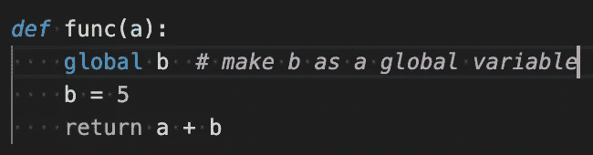
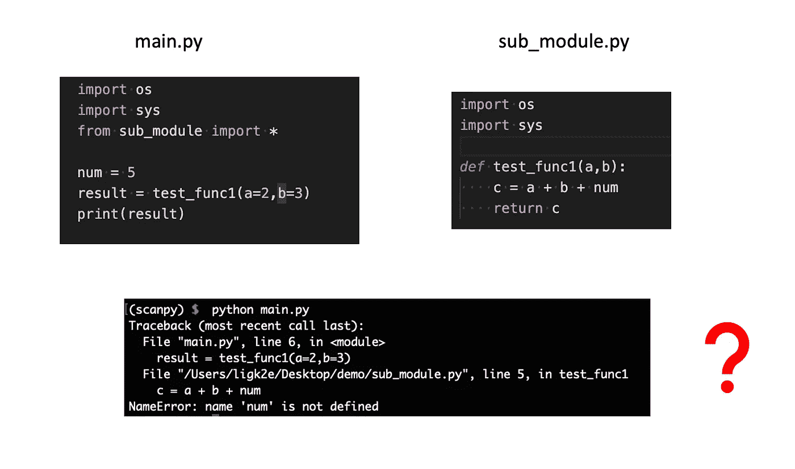
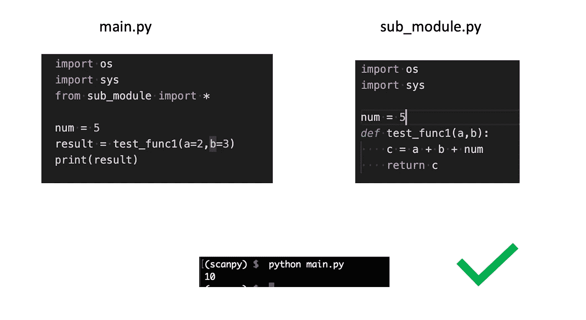
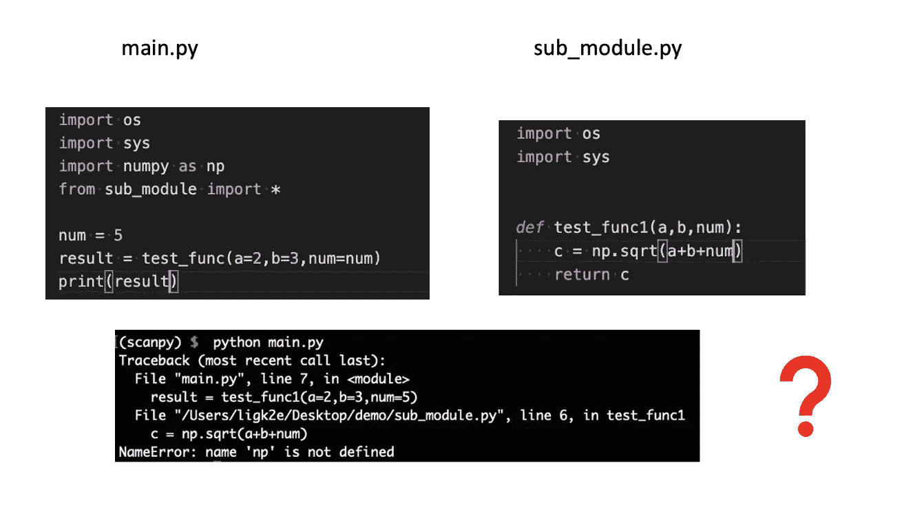
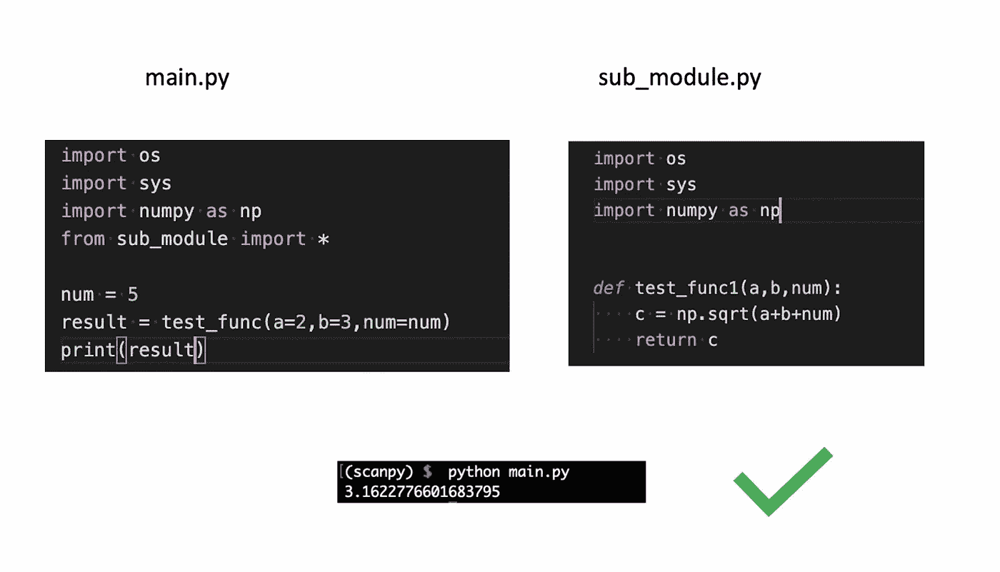
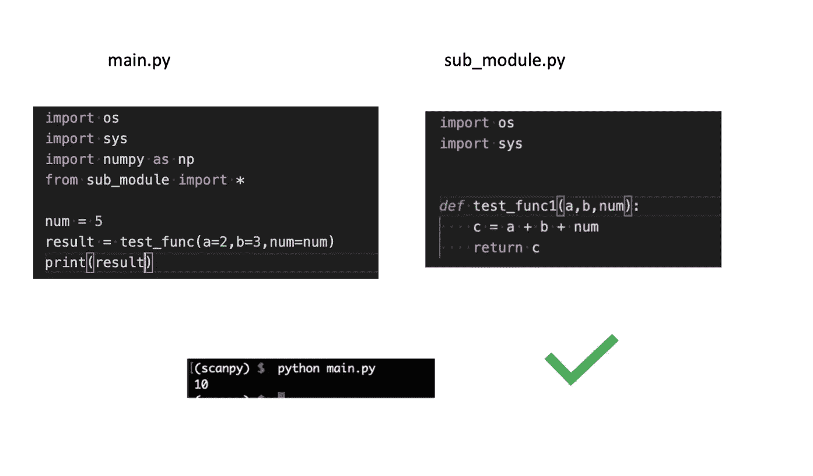
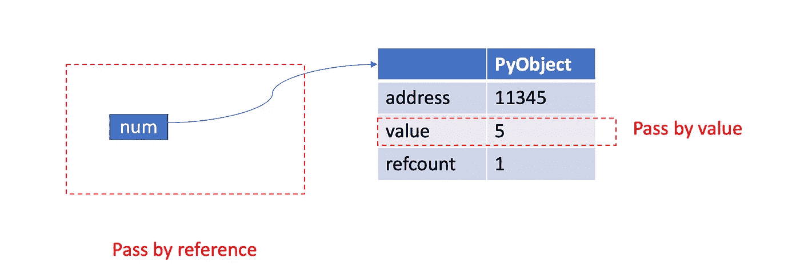
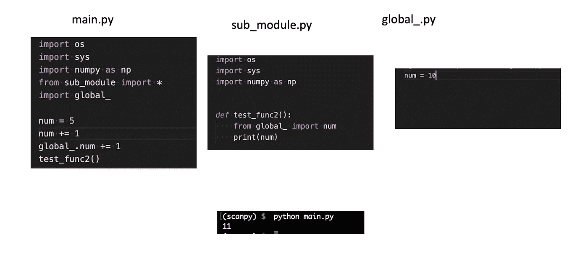
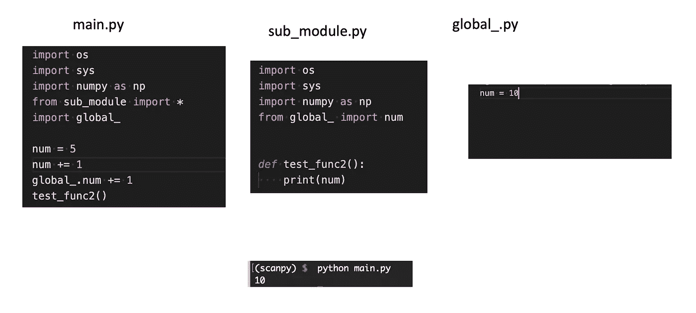

# 处理多个 Python 文件时的常见错误

> 原文：<https://towardsdatascience.com/common-mistakes-when-dealing-with-multiple-python-files-b4f4dc4d5643?source=collection_archive---------3----------------------->

## Python 中的“模块”概念

照片由 [Daniela Holzer](https://unsplash.com/@matscha?utm_source=medium&utm_medium=referral) 在 [Unsplash](https://unsplash.com?utm_source=medium&utm_medium=referral) 上拍摄

在最简单的情况下，我们在单个 Python 文件中编写代码(文件名以。py)。我们运行它，一切都像预期的那样工作，我们很高兴。然而，当您必须将代码分成多个 Python 文件时，事情会变得有点复杂，通常是为了更容易的代码管理和可读性。在这篇文章中，我将带你走过我陷入的一些常见错误，我希望你不要犯和我一样的错误。

在 Python 中，每个 Python 文件实际上都有一个称为“模块”的特定术语，当您使用著名的`import`语法时，您正在几个不同的 Python 模块之间建立连接，以在您的上下文中完成复杂的任务。在此，我将阐述以下主题:

1.  每个文件都有自己的全局变量
2.  该函数总是记得它是在哪里创建的
3.  Python 是“按引用传递”的
4.  使用一个单独的文件来保存跨多个 Python 文件的全局变量

如果你想进一步了解它们，请继续阅读！

# 每个模块/文件都有自己的全局变量

当您在 Python 文件中创建一个变量(不在函数中)时，您将这个变量挂载到当前模块的名称空间中。这个 Python 文件中的每个命令都可以访问、读取和修改变量的值，也就是说，它变成了一个全局变量。你也可以通过声明一个变量`global.`来明确地在函数中定义一个全局变量

将局部变量设为全局变量(图片由作者提供)

然而，全局变量不能在不同的 Python 文件之间共享。为了说明这一点，让我们看下面的例子:

全局变量对于每个模块都是唯一的(图片由作者提供)

逻辑非常清晰，我在`sub_module.py`中定义了一个函数，并尝试在`main.py`文件中调用它。好像我在`main.py`文件中定义了变量`num=5`，但结果是函数不能访问它，原因是`sub_module.py`不能访问其他 Python 模块中的全局变量，所以`num=5`对程序是不可见的。怎么修？在正确的文件中定义`num`即可。

在 sub_module.py(作者图片)中定义一个变量

# Python 函数总是记得它被创建的位置

我不确定你是否对上面的例子感到困惑？当我第一次看到这个例子时，我确实这么做了，因为我将`sub_module.py`中的`test_func1`显式地导入到了`main.py`中，很自然地认为该函数已经在当前作用域中了，不是吗？

但是 **Python 函数总是知道它是在哪里创建的**。尽管看起来`test_func1`在`main.py`中，但当被执行时，它仍然属于`sub_module.py`，因为这是它被创建的地方。现在来看另一个有用的实用技巧:

> 记得在子模块中导入必要的包！

忘记在子模块中导入数字(图片由作者提供)

在上面的例子中，由于我们忘记在`sub_module.py`中导入 NumPy 包，即使我们在`main.py`中导入了它，它仍然不能被`test_func1`访问。现在让我们来解决它:

在子模块中导入 Numpy 包(图片由作者提供)

# 通过引用传递与通过值传递

第一个例子是可行的，但是看起来很奇怪，不是吗？通常，我们将只在子模块中定义函数和类，而不是放入单个变量`num=5`。解决这个问题的常见方法实际上是在`test_func1`中添加`num`作为参数，并且在`main.py`文件中调用函数时也将`num=5`传递给该函数。

将变量作为参数传递(图片由作者提供)

现在的问题是，这样做如何能让`sub_module.py`识别出`num`在哪里？是因为 Python 总是**传引用**而不是**传值。**为了说明这一点，让我们来看看调用该函数时实际发生了什么:

通过引用传递与通过值传递(图片由作者提供)

当你在`main.py`中键入`num=5`时，你基本上创建了一个驻留在一块物理内存中的整数类型的`PyObject`，你用名字`num`指向这块物理内存。既然 Python 总是通过引用传递，那么你可以想到`test_func1`就会知道`num`这个名字指向哪里。因此，它可以访问`value` 5，因为它知道这个值在哪里。

# 我可以在不同的文件中共享一个全局变量吗？

正如我们所讨论的，全局变量对于它自己的模块是唯一的。但有时我们真的希望有一个全局变量，可以被目录中的每个 Python 文件访问和修改。实现这一点的规范方法是用全局变量创建另一个文件。

保存全局变量的独立文件(图片由作者提供)

我故意把这个例子弄得有点复杂；这里我们有一个包含`num=10`的`gloabl_.py` python 文件。但是在`main.py`文件中，我也创建了一个`num=5`。虽然它们都被命名为`num`，但是它们在不同的范围内，所以它可以告诉你它们的区别。在`main.py`中，我们通过增加 1 来修改这个全局变量，这个变化也将反映在`sub_module.py`中。**注意这里我必须在** `**test_func2**` **函数**中导入 `**global_**` **，因为如果我把导入语法放在开头，那么导入的`num`将是在`global_.num += 1`行执行之前的那个。**记住，** `**sub_module.py**` **在** `**from sub_module import ***`行中被执行，我们可以在下面的例子中测试它:**

导入语法的顺序很重要(图片由作者提供)

如你所见，现在即使全局变量`num`增加了 1，它也没有反映在`sub_module.py`中，因为它们导入的变量来自操作之前。导入的时候，Python 会自动为你做一个拷贝，这样旧的`global_.num`和新的`global_.num`就生活在完全不同的物理内存中了。

# 结论

以下是处理多个 Python 文件时的一些最佳实践:

1.  **将变量作为参数**传递，因为 Python“通过引用传递”，这保证了你的子模块可以访问你传递的变量。
2.  **不要忘记在子模块中导入必要的包**，因为函数总是记得它是在哪里创建的。
3.  使用一个单独的文件来保存 Python 模块中的全局变量，但是要记住**导入全局变量将会复制原始变量**，所以要经常检查你是否在程序中引用了正确的变量。

差不多就是这样！我希望你觉得这篇文章有趣和有用，感谢阅读！如果你喜欢这篇文章，请在 medium 上关注我，非常感谢你的支持。在我的 [Twitter](https://twitter.com/FrankLI55917967) 或 [LinkedIn](https://www.linkedin.com/in/guangyuan-li-399617173/) 上联系我，也请让我知道你是否有任何问题或你希望在未来看到什么样的教程！