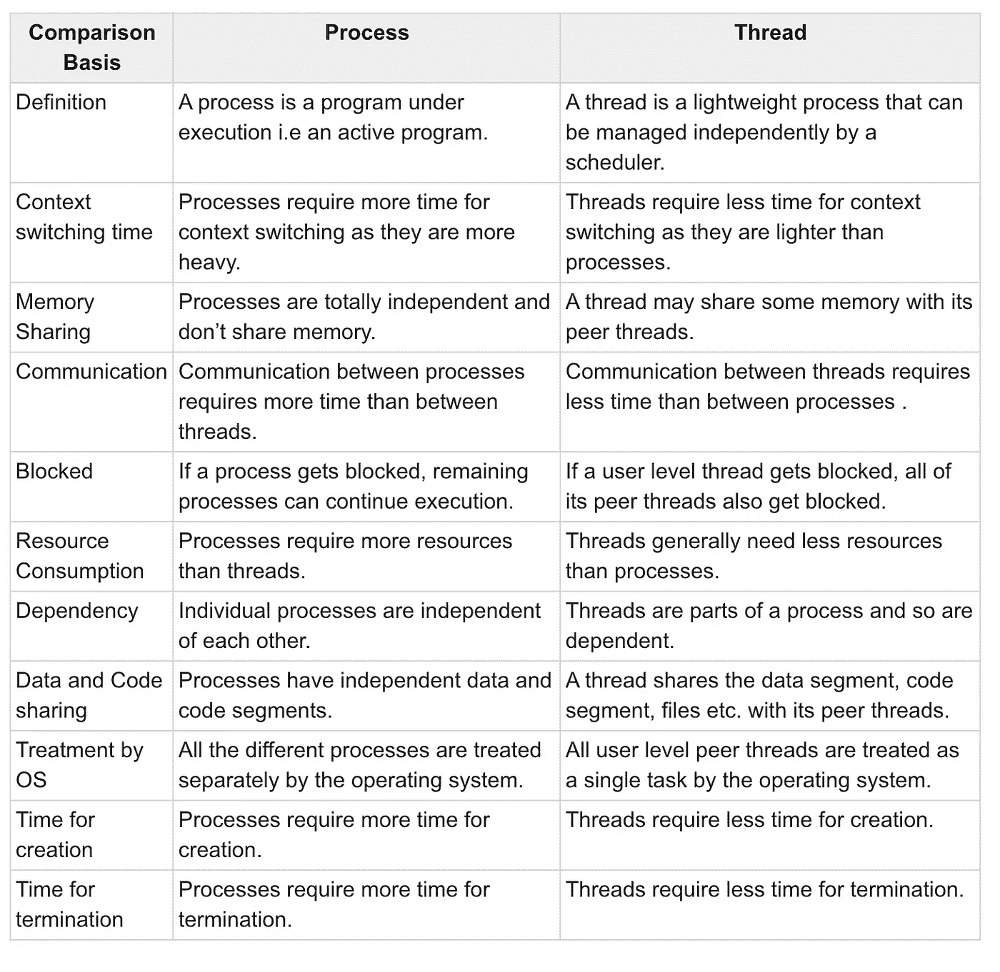
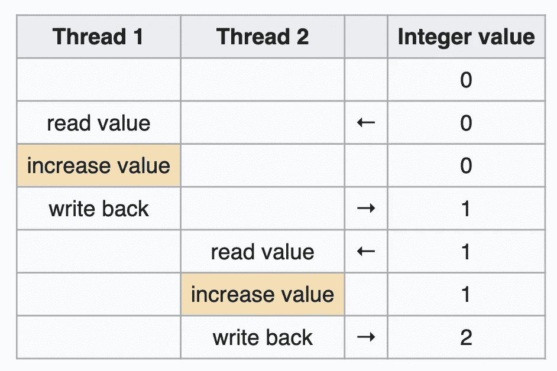
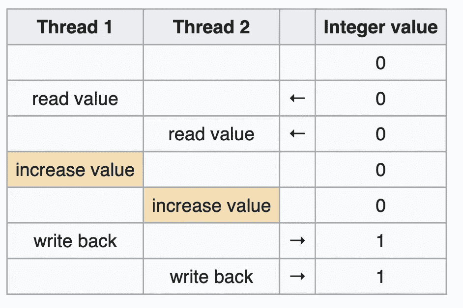

# 常见电话面试问题—第一部分

> 原文：<https://towardsdatascience.com/common-phone-interview-questions-part-1-bfe394346afb?source=collection_archive---------18----------------------->

一些公司会进行一轮电话面试，他们会从你的简历中问你一些问题以及一些简单的技术问题。我试着列出了这些问题。如果你是技术新手或者想复习一些概念，这也会对你有所帮助。

马库斯·斯皮斯克在 [Unsplash](https://unsplash.com?utm_source=medium&utm_medium=referral) 上的照片

## **1。线程与进程。**

**进程**是程序的实例，**线程**是进程的子集。进程和线程都是独立的执行序列。

*   (同一进程的)线程运行在共享内存空间，而进程运行在独立的内存空间。因此，线程有自己的堆栈(局部变量)，但共享同一个堆。进程有独立的堆栈和堆。
*   线程可以通过共享内存高效地进行通信。它们可以使用存储在堆中的对象进行通信，其中每个线程都可以访问相同内存位置的相同对象。进程使用进程间通信(IPC ),操作系统必须参与其中。
*   线程比进程花费更少的时间来创建和终止，因为它们消耗更少的资源。
*   在单处理器系统上，应用线程调度算法，并且调度处理器一次运行一个线程。因此，线程是并发的，而不是每个处理器并行的。

来源:[https://www.tutorialspoint.com/](https://www.tutorialspoint.com/)

## 2.数据竞争:

当多个线程运行同一个程序，并且两个或多个线程同时访问同一个共享变量时，就会发生数据竞争。它会导致不可预测的输出，有时当结果不理想时会引起问题。

一个例子是:

理想场景:我们希望将初始值为 0 的变量的值递增 1，递增两次，有两个线程为我们做这件事。最终的结果应该是变量的值变成了 2。

来源:[https://en.wikipedia.org/wiki/Race_condition](https://en.wikipedia.org/wiki/Race_condition)

如果两个线程都读取原始值，然后重写它，最终结果将是错误的，这可能是我们程序中的一个主要错误。

资料来源:https://en.wikipedia.org/wiki/Race_condition

可以通过引入锁来防止数据竞争。这样，当一个线程访问变量以更新其值时，变量的访问将被锁定，直到该线程完成其操作。因此，在第一个线程完成更新之前，另一个线程将不得不“等待”，并且不能访问、读取或更改变量值。

但是，如果不小心使用锁，它们会导致死锁。

## 3.死锁:

这是一种两个或多个线程因为相互等待而被永久阻塞的情况。它会导致线程挂起，并有可能导致整个进程挂起。

## 4.面向对象编程的四大支柱:

## **馅饼:抽象、多态、继承、封装**

## 抽象:抽象类和方法

*   你可以记住“抽象”这个词是什么意思，它是抽象这个词的一部分。
*   用于向用户隐藏复杂的细节，使用户能够使用程序或在上面实现更复杂的代码，而不用担心/知道当前程序所涉及的复杂性。
*   它是通过使用抽象类和方法来实现的。
*   抽象类是我们可以声明抽象方法的类。抽象方法是没有主体的方法，只有名字，没有实现。
*   一个经典的例子是具有抽象区域方法的抽象形状类。这个类的孩子(圆、三角形等)将有不同的方法来实现这个面积方法。

## 多态:重写和重载

*   你可以通过“poly”这个词来记住它，在希腊语中它的意思是很多。通过使用覆盖和重载，同一个方法在不同的子类中可以有“许多”形式。

## I:继承:扩展，父类和子类

*   你可以记住这一点，记住你继承了你父母的特征，如头发和眼睛的颜色等。类似地，继承是子类接收或继承其父类的属性的过程。
*   “extends”关键字用于由子类(子类)继承任何超类(父类)的属性。这有助于提高可重用性，减少代码长度，并防止用户重复编写相同的代码。

## e:封装:Getters 和 Setters

*   您可以通过将单词 encapsulation 与“封装”相关联或者将方法和变量包装在一起从而隐藏数据来记住这一点。
*   当您将变量声明为私有变量并使用 getters 和 setters 来提供对它们的访问时，就会出现这种情况。
*   这有助于控制在我们的类的字段中存储什么，有限制以及使某些元素只读或只写。

## 5.为什么我们需要 OOPS(面向对象编程系统)？

面向对象的编程语言是那些在编程中使用“对象”概念的语言。要回答这个问题，你可以先说“哎呀”,这有助于有效和容易解决问题。它们使复杂的代码更容易理解和维护。然后，您可以谈论以下概念:

*   对象:代表现实生活中的实体的任何东西
*   类:对象的蓝图
*   方法:几行代码聚集在一起执行一些任务，它们可能接受也可能不接受输入并提供期望的输出。

然后讨论上面提到的四个支柱及其好处。

这应该足以表明你对面向对象编程有透彻的理解。

这就是第 1 部分的内容！如果您觉得它有帮助，请告诉我，如果有问题或博客主题建议，请在我的社交网站上与我联系。感谢您的阅读！

编辑:你可以和我建立一对一的职业辅导，我可以通过分享我的精确策略、修改你的简历、求职信或 Linkedin 简介来帮助你获得实习机会。你可以去 anjaliviramgama.com 看评论和安排时间

安贾利·维拉加马

*脸书软件工程实习生，即将成为微软软件工程师*

[**领英**](http://www.linkedin.com/in/anjali-viramgama-085285166)**|**[**insta gram**](https://www.instagram.com/anjali.gama/)