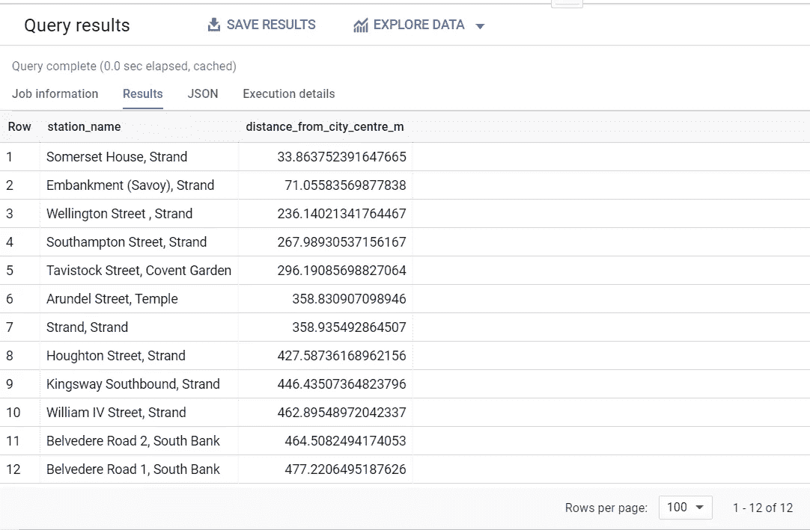
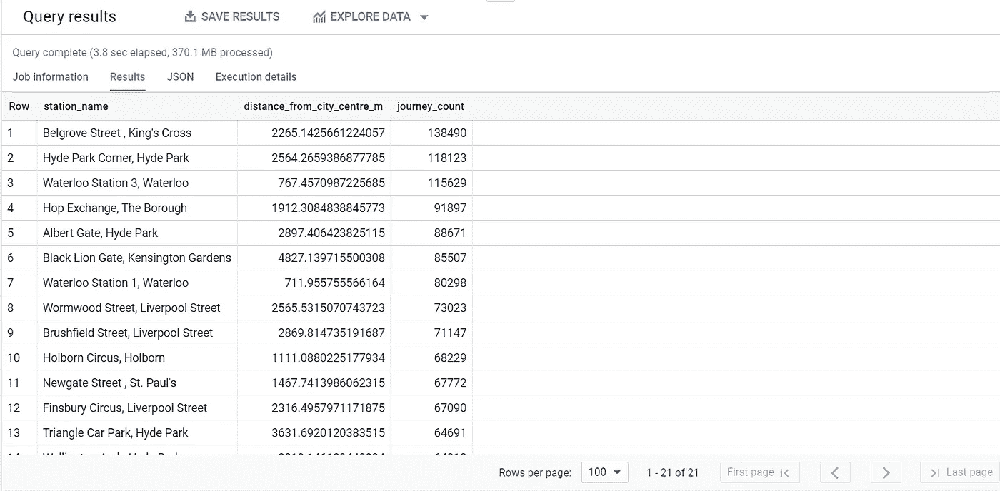

# SQL 中的 cte:数据科学家编写更好 SQL 的 5 个技巧

> 原文：<https://towardsdatascience.com/common-table-expressions-5-tips-for-data-scientists-to-write-better-sql-bf3547dcde3e?source=collection_archive---------19----------------------->

## 从 SQL Server 到 Google BigQuery:了解我为什么喜欢常用表表达式。


授权给作者的图像

这是我从事 SQL 工作的第 20 个年头(eek！).为了纪念这个里程碑，我最近写了一篇关于我所遵循的 10 个 SQL 命名标准的文章，我觉得这些标准可以产生易于阅读、调试和维护的 SQL。

[](/10-sql-standards-to-make-your-code-more-readable-in-2021-4410dc50b909) [## 10 项 SQL 标准，让您的代码在 2021 年更具可读性

### 制定一个 2021 年的纽约计划:易于阅读，维护 SQL

towardsdatascience.com](/10-sql-standards-to-make-your-code-more-readable-in-2021-4410dc50b909) 

按照这个主题，我想我应该探索一下 SQL 语言的其他元素，帮助区分出色的 SQL 和简单的函数式 SQL。

我列表中最重要的一个元素是**通用表表达式**，简称 CTE。cte 于 2000 年首次推出，现在广泛应用于大多数现代数据库平台，包括 MS SQL Server、Postgres、MySQL 和 Google BigQuery。

我在示例中使用了 Google BigQuery，但是 cte 的语法与您可能使用的其他数据库平台非常相似。我使用了桑坦德循环雇佣计划数据集，这是谷歌公开数据集的一部分。

给 BigQuery 用户一个快速提示——如果你想知道为什么我的 BigQuery UI 看起来和你的不一样，我使用的是 2021 年的更新 UI，刚刚在预览版中发布。如果你想知道我对新特性的看法，可以看看我几天前发表的文章。

[](/5-great-features-in-bigquerys-new-ui-for-2021-yes-it-has-tabs-c4bac66d66b) [## big query 2021 年新 UI 的 5 大特性(是的，它有标签！)

### 我探索了 BigQuery 的新 UI，它刚刚在预览版中发布

towardsdatascience.com](/5-great-features-in-bigquerys-new-ui-for-2021-yes-it-has-tabs-c4bac66d66b) 

# 有哪些常见的表格表达式？

对于那些不熟悉 CTE 的人，或者刚刚开始数据科学职业生涯的人，CTE 是 SQL 查询的临时结果集，您可以在更广泛的 SQL 查询的其他部分引用它，就好像它是数据库中的永久表一样。CTE 是临时的，只在更广泛的查询执行期间存在。您可以为 cte 起别名(命名),类似于为表或列起别名，并且每个查询可以有多个 cte。

下面是基本语法:

```
with **employee_cte** as (select first_name, last_name from employee)select e.first_name,
       e.last_name,
       h.hire_date
from **employee_cte** e
  inner join employee_hire h
  on h.employee_id = e.employee_id
```

遵循我的 5 个建议，希望到最后，你会有一些好的最佳实践来开始自己探索它们。

所以，不分先后，我们开始吧。

# #1 避免重复的列转换

在此查询中，我想查找伦敦市中心 500 米范围内的所有自行车站点，并返回站点名称和到中心的距离:

```
select name as station_name,

 **st_distance
       (
        st_geogpoint( longitude, latitude),
        st_geogpoint(-0.118092, 51.509865)
       )**    as distance_from_city_centre_mfrom `bigquery-public-data.london_bicycles.cycle_stations`
where **st_distance
(
 st_geogpoint( longitude, latitude),
 st_geogpoint(-0.118092, 51.509865)
)** <= 500
order by distance_from_city_centre_m
```

虽然这是完美的功能，并返回正确的结果(下面，如果你好奇！)，您会注意到以粗体显示的用于计算距离的逻辑是重复的。这是我们想要避免的；逻辑应该被定义一次**，如果需要的话，使它更容易阅读和修改。**

**这就是 CTE 来拯救我们的地方:**

```
**with stations**
as
(
  select name as station_name,
         st_distance
         (
           st_geogpoint( longitude, latitude),
           st_geogpoint(-0.118092, 51.509865)
         ) as distance_from_city_centre_m
  from `bigquery-public-data.london_bicycles.cycle_stations`
)select station_name,
       distance_from_city_centre_m
from **stations**
where distance_from_city_centre_m <= 500
order by distance_from_city_centre_m
```

**不再有重复的逻辑。而且，我认为这也比第一个查询更容易阅读——你认为呢？**

**因为我的 CTE 站是临时的，我不需要用任何物化的(永久的)表格或视图来填充我的数据库。**

****

**自行车租赁站，距离伦敦中心 500 米以内**

# **#2 简化复杂的 SQL (KISS)**

**就像在编程的其他领域以及生活中一样，如果你尽可能地保持简单，这真的会有所帮助。我们可以在 SQL 代码中使用 cte 来实现这一点的一种方法是使用 cte 作为一种将复杂的 SQL 查询分解成*个更小的小块*的方式。这会产生 SQL，它是:**

1.  **更容易阅读和理解**
2.  **更容易调试；您分阶段构建 SQL，在继续下一步之前测试每个 CTE 的输出。**
3.  **更容易维护；改变逻辑现在可以在一个地方以一种更加模块化的方式完成。**

**在本例中，我想进一步探索距离市中心 500 米以内的车站，并挑选出在过去 12 个月中旅程最多的车站。然后，我想提取所有比这多的其他车站，并分析它们与市中心的距离。**

**实现这一点的一种方法(没有 cte)如下:**

```
select  s.name    as station_name,
        st_distance
        **(
          st_geogpoint( s.longitude, s.latitude),
          st_geogpoint(-0.118092, 51.509865)
        )**         as distance_from_city_centre_m,
        count(j.rental_id) as journey_count
from `bigquery-public-data.london_bicycles.cycle_stations` s
  inner join  `bigquery-public-data.london_bicycles.cycle_hire` j
        on j.end_station_id = s.id
        and cast(j.end_date as date) >= date_sub('2017-1-1', interval 1 year)
group by station_name, s.longitude, s.latitude
having count(j.rental_id) > 
(
  select journey_count
  from
  (
    select  dense_rank() 
            over (order by count(j.rental_id) desc) as rank,
            s.id                                    as station_id,
            count(j.rental_id)                      as journey_count
    from `bigquery-public-data.london_bicycles.cycle_stations` s
        inner join  `bigquery-public-data.london_bicycles.cycle_hire` j
        on j.end_station_id = s.id
        and cast(j.end_date as date) >= date_sub('2017-1-1', interval 1 year)
    where j.end_station_id in
    (
      select  s.id     as station_id
      from `bigquery-public-data.london_bicycles.cycle_stations` s
      where **st_distance(
              st_geogpoint( s.longitude, s.latitude),
              st_geogpoint(-0.118092, 51.509865)
            )** <= 500
    )
    group by station_id
  )
  where rank = 1
) 
order by journey_count desc
```

**再说一遍，这是完美的功能代码。然而，有重复的逻辑(粗体)，我觉得这很难阅读。此外，如果我必须调试它，这将是很困难的——例如，验证最繁忙的工作站，因为一切都是交织在一起的。**

**应用 cte，我们可以大大改进这一点(cte 以粗体显示):**

```
**with station_proximity**
as
(
  select  id              as station_id,
          name            as station_name,
          st_distance(
            st_geogpoint( longitude, latitude),
            st_geogpoint(-0.118092, 51.509865)
          )               as distance_from_city_centre_m from `bigquery-public-data.london_bicycles.cycle_stations`
),**station_journeys** 
as
(
select  s.station_id,
        s.station_name,
        s.distance_from_city_centre_m,
        count(1)    as journey_count
from **station_proximity** s
  inner join  `bigquery-public-data.london_bicycles.cycle_hire` j
  on j.end_station_id = s.station_id
  and cast(j.end_date as date) >= date_sub('2017-1-1', interval 1 year)
group by s.station_id, s.station_name, s.distance_from_city_centre_m
),**stations_near_centre**
as
(
  select  sp.station_id,
          sj.journey_count,
          dense_rank() 
            over (order by sj.journey_count desc) journey_rank,
  from    **station_proximity** sp

  inner join **station_journeys** sj
  on sj.station_id = sp.station_id
  where   sp.distance_from_city_centre_m <= 500
)select station_name,
       distance_from_city_centre_m,
       journey_count
from   **station_journeys** 
where  journey_count >
(
  select journey_count
  from   **stations_near_centre** s
  where  s.journey_rank = 1
)
order by journey_count desc
```

**我觉得这个更好读。如果我想对此进行调试，我可以很容易地将最终选择改为从每个 CTE 中依次选择，在进入下一个之前进行验证。**

**(如果你感兴趣，下面是结果。正如你所料，这些车站大多数都靠近铁路干线)**

****

# **#3 命名很重要**

**我的第三个建议是在给你的 cte 命名时要小心。**

**在我前面的例子中，我注意用有意义的名称来命名我的 cte:**

```
**with station_proximity**
as
( --- ),**station_journeys,**
as
( -- ),**stations_near_centre**
as
( -- )
```

**我经常看到这种情况，如果可能的话，我会尽量避免:**

```
**with cte1**
as
( --- ),**cte2,**
as
( -- ),**cte3**
as
( -- )
```

# **#4 非常适合 SQL 联合**

**在处理数据时，我们经常需要将不同来源的数据整合到一个符合*的*表中。**

**cte 非常适合这个用例。**

**假设我们在两个系统 A 和 b 中进行循环旅程。我们可以在编写代码时有效地使用 cte 来填充单个*旅程*表，如下所示:**

```
**with system_a_journeys**
as
( some data wrangling of system a ),**system_b_journeys,**
as
( some data wrangling of system b),**all_journeys**
as
(
  select *
  from **system_a_journeys** union allselect *
  from **system_b_journeys** )
```

***注意我从不提倡使用 select *(显式列出列)。**

# **#5 使用 cte 显示依赖性**

**cte 的另一个可以提高 SQL 可维护性的新用途是，使用它们可以很容易地看到 SQL 引用了哪些表/视图。这对于复杂的查询特别有用，它跨越许多行，并引用许多表/视图。**

**为此，在 SQL 语句的开头，为您选择的所有表/视图创建 CTE“包装器”。您还可以将列限制为您实际使用的列，这不仅有助于识别您正在使用的列，还可以提高性能。**

**因此，在我的技巧 2 的例子中，我将从以下内容开始查询:**

```
with cycle_stations as 
(
  select id    as station_id,
         name  as station_name,
         longitude,
         latitude
  from `bigquery-public-data.london_bicycles.cycle_stations`
),cycle_journeys as
(
  select station_id,
         end_date
  from `bigquery-public-data.london_bicycles.cycle_hire`
)
```

# **结论**

**希望通过阅读本文，您现在已经了解了常见的表表达式，以及如何使用它们来真正提高您的 SQL 写作。**

**cte 是我个人日常使用的工具，也是 SQL 工具箱中帮助可读性和可维护性的最佳工具之一。它们还使得编写 SQL 更加实用，因此是一种愉快的体验。**

**希望你同意:)**

# **后续步骤**

**1.了解更多关于[安科瑞斯数据，分析&人工智能](https://www.ancoris.com/solutions/data_analytics_ai)**