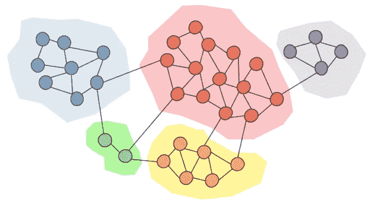
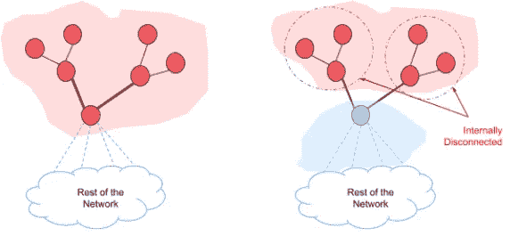

# 社区检测算法

> 原文：<https://towardsdatascience.com/community-detection-algorithms-9bd8951e7dae?source=collection_archive---------0----------------------->

## [入门](https://towardsdatascience.com/tagged/getting-started)

作者图片

你们很多人都熟悉网络，对吧？你可能会使用社交媒体网站，如脸书、Instagram、Twitter 等。他们是社交网络。你可能在和股票交易所打交道。你可能会买入新股票，卖出现有股票，等等。他们是网络。不仅在技术领域，而且在我们的日常社会生活中，我们处理许多网络。**社区是许多网络的属性，在这些网络中，一个特定的网络可以具有多个社区，使得一个社区内的节点密集连接。**多个社区中的节点可以重叠。想想你的脸书或 Instagram 账户，想想你每天和谁互动。你可能会和你的朋友、同事、家庭成员以及生活中其他一些重要的人频繁互动。他们在你的社交网络中形成了一个非常密集的社区。

米（meter 的缩写））格文和 M. E. J .纽曼是社区检测领域的两位著名研究者。在他们的一项研究中，他们利用社会网络和生物网络突出了**社区结构-属性**。根据他们的说法，**网络节点在社区内紧密地连接在一起，而在社区之间松散地连接**。

# 为什么要社区检测？

在分析不同的网络时，发现网络内部的社区可能很重要。社区检测技术有助于社交媒体算法发现具有共同兴趣的人，并使他们保持紧密联系。在机器学习中可以使用社区检测来检测具有相似属性的群体，并提取各种原因的群体。例如，这种技术可以用来发现社交网络或股票市场中的操纵集团。

# 社区检测与聚类

人们可以认为社区检测类似于聚类。聚类是一种机器学习技术，其中相似的数据点基于它们的属性被分组到相同的聚类中。尽管聚类可以应用于网络，但它是处理多种属性类型的无监督机器学习中的一个更广泛的领域。另一方面，社区检测**是专门为网络分析**定制的，网络分析依赖于被称为边的**单属性类型。此外，聚类算法倾向于将单个外围节点与其所属的社区分开。然而，聚类和社区检测技术都可以应用于许多网络分析问题，并且可能根据域的不同而产生不同的利弊。**

# 社区检测技术

社区检测方法可以大致分为两种类型；**聚合法**和**分法**。在凝聚法中，边被一条一条地添加到一个只包含节点的图中。边从较强的边添加到较弱的边。分裂方法与凝聚方法相反。在那里，边被从一个完整的图中一个接一个地移除。

在给定的网络中可以有任意数量的社区，并且它们可以具有不同的大小。这些特征使得社区的检测过程非常困难。然而，在社区检测领域提出了许多不同的技术。下面解释四种流行的社区检测算法。所有这些列出的算法都可以在 **python cdlib 库**中找到。

## 1.鲁汶社区检测

Louvain 社区检测算法最初于 2008 年提出，作为大型网络的快速社区展开方法。这种方法是基于模块化的**，它试图最大化社区中的实际边数和社区中的预期边数之间的差异。然而**优化网络中的模块化是 NP-hard，因此必须使用启发式**。Louvain 算法分为**迭代重复两个阶段**；**

1.  节点的局部移动
2.  网络的聚合

该算法从 N 个节点的加权网络开始。在第一阶段，该算法为网络的每个节点分配不同的社区。然后，对于每个节点，它考虑邻居，并通过从当前社区中删除特定节点并将其放入邻居的社区来评估模块化的收益。如果增益为正且最大化，节点将被放置在邻居的社区中。如果没有正增益，节点将保持在相同的社区中。对所有节点重复应用该过程，直到没有进一步的改进。当获得模块性的局部最大值时，Louvain 算法的第一阶段**停止**。在第二阶段，该算法建立一个新的网络，将第一阶段发现的社区视为节点。一旦第二阶段完成，该算法会将第一阶段重新应用于最终网络。重复这些步骤，直到网络没有变化，并获得最大的模块化。

Louvain 社区检测算法**在此过程中发现社区的社区**。这是非常受欢迎的，因为易于实施，也是算法的速度。然而，该算法的一个主要限制是主存储器中网络存储的使用。

下面给出了使用 python cdlib 库的 Louvain 社区检测算法的使用。

> 从 cdlib 导入算法
> 导入 networkx 为 nx
> G = nx .空手道 _ 俱乐部 _ 图形()
> coms = algorithms.louvain(G，weight='weight '，resolution=1。随机化=假)

## 2.惊喜社区检测

由于模块性的限制，**一种基于经典概率**的被称为惊奇的测量被引入来评估网络到社区的划分的质量。该算法几乎类似于 Louvain 社区检测算法，除了它**使用惊喜而不是模块化**。节点从一个社区移动到另一个社区，这样惊喜被贪婪地改善。这种方法考虑了链接位于社区内的概率。惊喜**的使用在许多小** **社区**的限制下效果很好，模块化的使用在少数大社区的限制下效果很好。

下面给出了使用 python cdlib 库的惊奇社区检测算法的使用。

> 从 cdlib 导入算法
> 导入 networkx 为 nx
> G = nx .空手道俱乐部图形()
> coms =算法.惊喜社区(G)

## 3.莱顿社区检测

在后来的研究(2019)中，V.A. Traag 等人表明 **Louvain 社区检测倾向于发现内部断开的社区**(连接不良的社区)。在 Louvain 算法中，将充当社区中两个组件之间的桥梁的节点移动到新社区可能会断开旧社区。如果旧社区被进一步分裂，这就不是问题了。但根据 Traag 等人的说法，情况不会是这样的。旧社区中的其他节点由于它们的强连接而允许它保持为单个社区。另外，根据他们的说法， **Louvain 倾向于发现每周都有联系的社区**。因此，他们提出了更快的莱顿算法，该算法保证了社区之间的良好连接。

图片改编自[4]

除了在 Louvain 算法中使用的阶段之外， **Leiden 还使用了一个阶段**，该阶段试图改进发现的分区。莱顿算法的三个阶段是，

1.  节点的局部移动
2.  分区的细化
3.  基于精细划分的网络聚合

在细化阶段，该算法试图从第一阶段提出的分区中识别出细化的分区。第一阶段提出的社区可能在第二阶段进一步分裂成多个分区。细化阶段不遵循贪婪方法，并且可以将节点与随机选择的社区合并，这增加了质量函数。这种**随机性允许更广泛地发现分区空间**。同样在第一阶段，莱顿对鲁汶采取了不同的方法。**在对所有节点的第一次访问完成后，Leiden 不再访问网络中的所有节点，而是只访问那些其邻居已经改变的节点**。

下面给出了使用 python cdlib 库的 Leiden 社区检测算法的使用。

> 从 cdlib 导入算法
> 导入 networkx 为 nx
> G = nx .空手道 _ 俱乐部 _ 图形()
> coms =算法.莱顿(G)

## 4.Walktrap 社区检测

Walktrap 是基于随机行走的另一种社区检测方法**，其中通过网络中的随机行走来测量顶点之间的距离。Walktrap 是一种有效的算法，在最坏的情况下，它的时间复杂度和空间复杂度都是 O(mn)。但在大多数现实场景中，walktrap 运行的时间复杂度为 O((n ) log n)，空间复杂度为 O(n)。该算法的基本直觉是，图/网络上的**随机行走倾向于陷入对应于社区的密集连接部分**。Walktrap 使用随机行走的结果，以自底向上的方式合并独立的社区。可以使用任何可用的质量标准来评估分区的质量。它既可以是模块性的，如在鲁汶社区检测中，也可以是任何其他措施。**

下面给出了使用 python cdlib 库的 Walktrap 社区检测算法的用法。

> 从 cdlib 导入算法
> 导入 networkx 为 nx
> G = nx .空手道俱乐部图形()
> coms =算法. walktrap(G)

# 结论

社区发现非常适用于理解和评估大型复杂网络的结构。这种方法使用图或网络中的边的属性，因此比聚类方法更适合于网络分析。聚类算法倾向于将单个外围节点与其所属的社区分开。许多不同的算法已经被提出并实现用于网络社区检测。根据网络的性质和应用的问题领域，每种方法都有不同的优缺点。

# 参考

[1]格文，米歇尔&纽曼，马克。(2001).《社会和生物网络中的社区结构》，美国国家科学院院刊。99.7821–7826.
[2]布隆德尔，v .，纪尧姆，j .，兰比奥特，r .和列斐伏尔，e .，2008 年。大型网络中社区的快速展开。IOPscience。
[3] Traag，v .，Aldecoa，r .和 Delvenne，j .，2015。使用渐近惊奇检测社区。物理复习。
[4] V. A. Traag，L. Waltman 和 N. J. van Eck，“从卢万到莱顿:保证良好连接的社区”，Sci。Rep .，vol. 9，no. 1，PP . 1–12，2019，doi:10.1038/s 41598–019–41695-z .
[5]Pons，p .和 Latapy，m .，n.d .使用随机行走的大型网络中的计算社区。